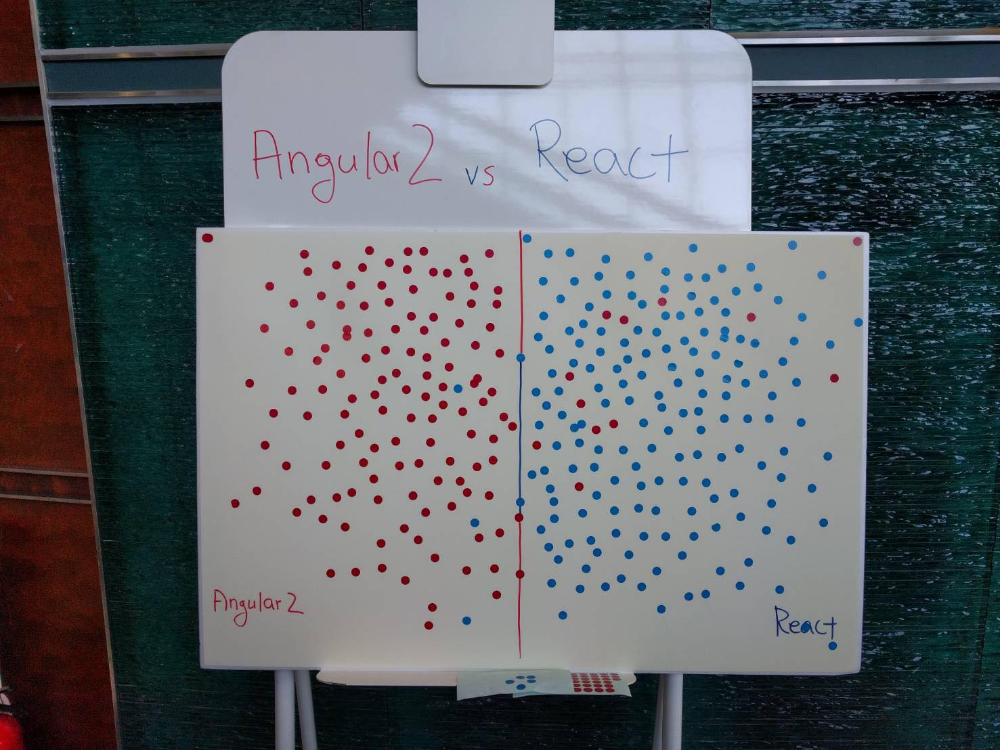

# Slideshare

  
  
 얼마전 열린 DEVIEW 2016 세션 중 가장 재미있었다고 칭찬이 가득한 "Angular2 vs React"  
 유심히 살펴보다가 더 재미있게 풀이해서 쓴 글이있어 링크를 남깁니다.

[DEVIEW 2016 Angular2 vs React](https://github.com/jung-inchul/jung-inchul.github.io/tree/7cd53f287788fa857cfa8c68092974e5c3c0dc8d/www.slideshare.net/deview/114angularvs-react/README.md)  
 [자세한 관람 후기 \(http://asfirstalways.tistory.com/308\)](http://asfirstalways.tistory.com/308)   
  

참고로 Angular2 vs React 참석 개발자 조사에서는 React가 아주 조금 더 인기가 좋았던 것 같습니다^^;;

## Total : 327

* Angular2 : 146
* React : 181 Win

  
   
 단순 plugin 부터 React, Angular까지 어떤 Library, Framework를 사용하든, 그것에 대한 러닝커브가 존재하고, 존재해야 한다고 생각 합니다.  
 \(두달이상 기간을 두고 도입 검토, 프로젝트 관련 구현작업 중 중단된 사례를 본적 있습니다\)  
 충분히 숙지하고 시작하지 못한다면 직접 구현하는 것보다 못한 결과물을 초래 할 수도있구요.  
 그런 점에서 React가 조금 더 적은 러닝커브를 가지고있기 때문에 더 많은 선호도를 가져갈 수 있지 않았나... 생각됩니다.  

구현해야할 것들의 정리가 잘 된 상태에서, 부족한 기능의 Customizing이 가능하고 불필요한 Resource가 많지 않은 라이브러리가 있다면 좋겠지만 그렇지 못한 상황에서는 언제나 그렇듯 "직접 구현 + 부분적인 수용"의 형태로 간다면 더더욱 좋을 것 같습니다.   
 다른 사람이 만든 소스는 언제나 어렵습니다 ^^;;;

감사합니다.

