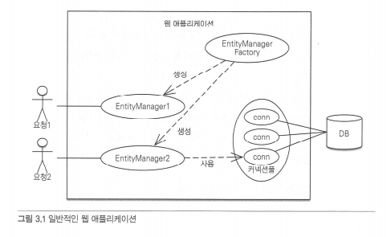
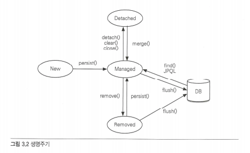
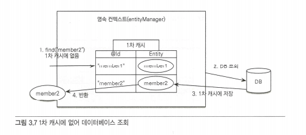
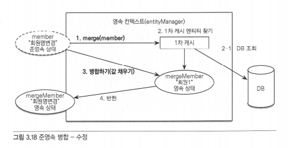

# 3장 영속성 관리

### 엔티티 매니저 팩토리와 엔티티 매니저

엔티티 매니저 팩토리는 엔티티 매니저를 만드는 공장으로 공장을 만드는 비용은 상당히 크므로 한 개만 만들어서 애플리케이션 전체에서 공유하도록 설계되어 있다.

엔티티 매니저 팩토리는 여러 스레드가 동시에 접근해도 안전하므로 서로 다른 스레드 간에 공유해도 되지만, 엔티티 매니저는 여러 스레드가 동시에 접근하면 동시성 문제가 발생하므로 스레드 간에 절대 공유하면 안 된다.



### 영속성 컨텍스트란?

영속성 컨텍스트란 엔티티를 영구 저장하는 환경이다.

엔티티 매니저로 엔티티를 저장하거나 조회하면 엔티티 매니저는 영속성 컨텍스트에 엔티티를 보관하고 관리한다.

```text
em.persist(member);
```

영속성 컨텍스트는 엔티티 매니저를 생성할 때 하나 만들어진다.

### 엔티티 생명주기

엔티티에는 4가지 상태가 존재한다.

* 비영속\(new/transient\): 영속성 컨텍스트와 전혀 관계가 없는 상태
* 영속\(managed\): 영속성 컨텍스트에 저장된 상태
* 준영속\(detacked\): 영속성 컨텍스트에 저장되었다가 분리된 상태
* 삭제\(removed\): 삭제된 상태



#### 비영속

엔티티 객체를 생성한 상태이며 아직 저장하지 않았다.

```text
Member member = new Member();
member.setId("member1);
member.setUserName("회원1");
```

#### 영속

엔티티 매니저를 통해서 엔티티를 영속성 컨텍스트에 저장했다. 이렇게 영속성 컨텍스트가 관리하는 엔티티를 영속 상태라 한다.

```text
em.persist(member);
```

#### 준영속

영속성 컨텍스트가 관리하던 영속 상태의 엔티티를 영속성 컨텍스트가 관리하지 않으면 준영속 상태가 된다.

준영속 상태로 만들기 위한 방법

* em.detach\(\) : 특정 엔티티만 준영속 상태로 만들 수 있다.
* em.close\(\) : 영속성 컨텍스트를 닫는다.
* em.clear\(\) : 영속성 컨텍스트의 데이터를 비운다.

#### 삭제

엔티티를 영속성 컨텍스트와 데이터베이스에서 삭제한다.

```text
em.remove(member);
```

### 영속성 컨텍스트의 특징

#### 영속성 컨텍스트와 식별자 값

영속성 컨텍스트는 엔티티를 식별자 값\(@Id로 테이블의 기본 키와 매핑한 값\)으로 구분한다. 따라서 영속 상태는 식별자 값이 반드시 있어야 한다.

#### 영속성 컨텍스트와 데이터베이스 저장

엔티티를 데이터베이스에 반영하는데 이것을 플러시\(flush\)라 한다.

#### 영속성 컨텍스트 관리 장점

* 1차 캐시
* 동일성 보장
* 트랜잭션을 지원하는 쓰기 지연
* 변경 감지
* 지연 로딩

### 엔티티 조회

영속성 컨텍스트는 내부에 캐시를 가지고 있는데 이것을 1차 캐시라 한다. 영속성 컨텍스트 내부에 Map이 하나 있는데 키는 @Id로 매핑한 식별자고 값은 엔티티 인스턴스다

식별자 값은 데이터베이스 기본 키와 매핑되어 있다.

1. em.find\(Member.class, "member2"\)를 실행한다.
2. member2가 1차 캐시에 없으므로 데이터베이스에서 조회한다.
3. 조회한 데이터로 member2 엔티티를 생성해서 1차 캐시에 저장한다.
4. 조회한 엔티티를 반환한다.



#### 영속 엔티티의 동일성 보장

```text
Member a = em.find(Member.class, "member1");
Member b = em.find(Member.class, "member1");

System.out.println(a == b) // 동일성 보장
```

"em.find\(Member.class, "member1"\)"를 반복해서 호출해도 영속성 컨텍스트는 1차 캐시에 있는 같은 엔티티 인스턴스를 반환한다. 따라서 영속성 컨텍스트는 성능상 이점과 엔티티의 동일성을 보장한다.

#### 엔티티 등록

엔티티 매니저는 트랜잭션을 커밋하기 직전까지 데이터베이스에 엔티티를 저장하지 않고 내부 쿼리 저장소에 INSERT SQL을 모아둔다. 이를 트랜잭션을 지원하는 쓰기 지연이라 한다.

트랜잭션을 커밋하면 엔티티 매니저는 우선 영속성 컨텍스트를 플러시한다. 플러시는 영속성 컨텍스트의 변경 내용을 데이터베이스에 동기화하는 작업인데 이때 등록, 수정, 삭제한 엔티티를 데이터베이스에 반영한다.

이 기능을 잘 활용하면 모아둔 등록 쿼리를 데이터베이스에 한 번에 전달해서 성능을 최적화할 수 있다.

#### 엔티티 수정

SQL을 사용하면 수정 쿼리를 직접 작성해야 한다. 그런데 프로젝트가 점점 커지고 요구사항이 늘어나면서 수정 쿼리도 점점 추가 된다.

결국 부담스러운 상황을 피하기 위해 수정 쿼리를 상황에 따라 계속해서 추가한다. 이런 개발 방식의 문제점은 수정 쿼리가 많아지는 것은 물론이고 비즈니스 로직을 분석하기 위해 SQL을 계속 확인해야 한다.

#### 변경 감지

JPA는 엔티티를 어떻게 수정할까?

```text
EntityManager em = emf.createEntityManager();
EntityTransaction transaction = em.getTransaction();
transaction.begin(); 

Member memberA = em.find(Member.class, "memberA");

memberA.setUsername("hi");
memberA.setAge(10);

transaction.commit();
```

위의 코드를 실행하면 데이터베이스까지 반영이 되어 데이터가 변경된 걸 확인할 수 있다. 이는 엔티티의 변경사항을 데이터베이스에 자동으로 반영하는 기능을 변경 감지라 한다.

1. 트랜잭션을 커밋하면 엔티티 매니저 내부에서 먼저 플러시가 호출된다.
2. 엔티티와 스냅샷을 비교해서 변경된 엔티티를 찾는다.
3. 변경된 엔티티가 있으면 수정 쿼리를 생성해서 쓰기 지연 SQL 저장소에 보낸다.
4. 쓰기 지연 저장소의 SQL을 데이터베이스에 보낸다.
5. 데이터베이스 트랜잭션을 커밋한다.

변경 감지는 영속성 컨텍스트가 관리하는 영속 상태의 엔티티에만 적용된다.

JPA는 변경감지가 일어나면 엔티티의 모든 필드를 업데이트한다. 이는 어떤 장점이 있을까?

* 모든 필드를 수정하면 수정 쿼리가 항상 같다. 따라서 애플리케이션 로딩 시점에 수정 쿼리를 미리 생성해두고 재사용할 수 있다.
* 데이터베이스에 동일한 쿼리를 보내면 데이터베이스는 이전에 한 번 파싱된 쿼리를 재사용할 수 있다.

필드가 많거나 저장되는 내용이 너무 크면 수정된 데이터만 사용해서 동적으로 UPDATE SQL을 생성하는 전략을 선택하면 된다. 이때는 하이버네이트 확장 기능을 사용해야 한다.

```text
@Entity
@org.hibernate.annotations.DynamicUpdate
@Table(name = "Member")
public class Member {...}
```

### 플러시

플러시는 영속성 컨텍스트의 변경 내용을 데이터베이스에 반영한다.

1. 변경 감지가 동작해서 영속성 컨텍스트에 있는 모든 엔티티를 스냅샷과 비교해서 수정된 엔티티를 찾는다. 수정된 엔티티는 수정 쿼리를 만들어 쓰기 지연 SQL 저장소에 등록한다.
2. 쓰기 지연 SQL 저장소의 쿼리를 데이터베이스에 전송한다.

영속성 컨텍스트를 플러시하는 방법은 3가지다.

* em.flush\(\)를 직접 호출한다.
* 트랜잭션 커밋 시 플러시가 자동 호출된다.
* JPQL 쿼리 실행 시 플러시가 자동 호출된다.

  em.persist\(memberA\); em.persist\(memberB\); em.persist\(memberC\);

  // 중간에 JPQL 실행 query = em.createQuery\("select m from Member m", member.class\); List&lt;Member&gt; members = query.getResultList\(\);

em.persist\(\)를 호출해서 엔티티들을 영속 상태로 만든 후에, JPQL을 실행하면 어떻게 될까? JPQL은 SQL로 변환되어 데이터베이스에서 엔티티를 조회하면 영속성 컨텍스트에 저장된 데이터가 조회된다.

이는 JPQL을 실행할 때도 플러시를 자동 호출하기 때문에 가능하다.

### 준영속

#### 준영속 상태의 특징

* 거의 비영속 상태에 가깝다.

  영속성 컨텍스트가 관리하지 않으므로 1차 캐시, 쓰기 지연, 변경 감지, 지연 로딩을 포함한 영속성 컨텍스트가 제공하는 어떤한 기능도 동작하지 않는다.

* 식별자 값을 가지고 있다.

  비영속 상태는 식별자 값이 없을 수도 있지만 준영속 상태는 이미 한 번 영속상태였으므로 반드시 식별자 값을 가지고 있다.

* 지연 로딩을 할 수 없다.

#### 병합: merge\(\)

merge\(\) 메소드는 준영속 상태의 엔티티를 받아서 그 정보로 새로운 영속 상태의 엔티티를 반환한다.



1. merge\(\)를 실행한다.
2. 파라미터로 넘어온 준영속 엔티티의 식별자 값으로 1차 캐시에서 엔티티를 조회한다.

   2-1. 만약 1치 캐시에 엔티티가 없으면 데이터베이스에서 엔티티를 조회하고 1차 캐시에 지정한다.

3. 조회한 영속 엔티티에 준영속 상태의 엔티티의 값을 태워 넣는다.
4. 영속 엔티티를 반환한다.

#### 비영속 병합

병합은 준영속, 비영속을 신경 쓰지 않는다. 식별자 값으로 엔티티를 조회할 수 있으면 불러서 병합하고 조회할 수 없으면 새로 생성해서 병합한다. 따라서 병합은 save or update 기능을 수행한다.

### 정리

* 엔티티 매니저는 엔티티 매니저 팩토리에서 생성한다. 이 영속성 컨텍스트는 엔티티 매니저를 통해서 접근할 수 있다.
* 영속성 컨텍스트는 애플리케이션과 데이터베이스 사이에서 객체를 보관하는 가상의 데이터베이스 같은 역할을 한다. 영속성 컨텍스트 덕분에 1차 캐시, 동일성 보장, 트랜잭션을 지원하는 쓰기 지연, 변경 감지, 지연 로딩 기능을 사용할 수 있다.
* 영속성 컨텍스트에 저장한 엔티티는 플러시 시점에 데이터베이스에 반영되는데 일반적으로 트랜잭션을 커밋할 때 영속성 컨텍스트가 플러시된다.
* 준영속 상태의 엔티티는 더는 영속성 컨텍스트의 관리를 받지 못하므로 영속성 컨텍스트가 제공하는 1차 캐시, 동일성 보장, 트랜잭션을 지원하는 쓰기 지연, 변경 감지, 지연 로딩 같은 기능들을 사용할 수 없다.

