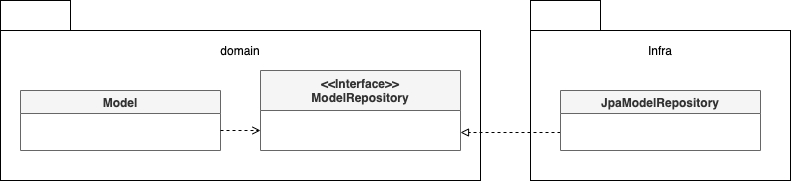
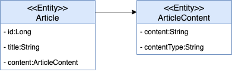

# 4장 리포지터리와 모델구현\(JPA 중심\)

## JPA를 이용한 리포지터리 구현

도메인 모델과 리포지터리를 구현할 때 선호하는 기술은 JPA를 들 수 있다. 데이터 보관소로 RDMS를 사용할 때 객체 기반의 도메인 모델과 관계형 데이터 모델 간의 매핑을 처리하는 기술로 ORM 만한 것이 없다.

### 모듈 위치

리포지터리 인터페이스는 애그리거트와 같이 도메인 영역에 속하고, 리포지터리를 구현한 클래스는 인프라스트럭터 영역에 속한다. 이는 리포지터리 구현 클래스를 인프라스트럭처 영역에 위치시켜서 인프라스트럭처에 대한 의존을 낮춰야 한다.



그림 4.1 DIP에 따라 리포지터리 구현 클래스는 인프라스트럭처 영역에 위치한다.

### 엔티티와 밸류 기본 매핑 구현

애그리거트와 JPA 매핑을 위한 기본 규칙은 다음과 같다.

* 애그리거트 루트는 엔티티이므로 @Entity로 매핑 설정한다.
* 한 테이블에 엔티티와 밸류 데이터가 같이 있다면,
  * 밸류는 @Embeddable로 매핑 설정한다.
  * 밸류 타입 프로퍼티는 @Embedded로 매핑 설정한다.

```java
@Entity
@Tagble(name = "purchase_order")
public class Order {
	...

	@Embedded
	Orderer orderer;
}
```

Order에 속하는 Orderer는 밸류이므로 @Embeddable로 매핑한다.

```java
@Embeddable
public class Orderer {
	// MemberId에 정의된 칼럼 이름을 변경하기 위해
	// @AttributeOverride 애노테이션 사용
	@Embedded
	@AttributeOverrides(
		@AttributeOverride(name = "id", column = @Column(name = "orderer_id"))
	)
	private MemberId memberId;

	@Column(name = "orderer_name")
	private String name;

	...
}
```

Orderer의 memberId 프로퍼티와 매핑되는 칼럼 이름은 'orderer\_id'이므로 MemberId에 설정된 'member\_id'와 이름이 다르다.

```java
@Embaddable
public class MemberId implements Serializable {
	@Column(name="member_id")
	private String id;

	...
}
```

### 기본 생성자

밸류 타입의 경우 불변이므로 생성 시점에 필요한 값을 모두 전달받으므로 값을 변경하는 set 메서드는 제공하지 않는다. 하지만 JPA의 @Entity와 @Embeddable로 클래스를 매핑하려면 기본 생성자를 제공해야 한다. 하이버네이트와 같은 JPA 프로바이더는 DB에서 데이터를 읽어와 매핑된 객체를 생성할 때 기본 생성자를 사용해서 객체를 생성한다. 이런 이유로 다른 코드에서 기본 생성자를 사용하지 못하도록 protected로 선언한다.

```java
@Embeddable
public class Receiver {
	@Column(name = "receiver_name")
	private String name;

	...

	protected Receiver() {} // JPA를 적용하기 위해 기본 생성자 추가

	public Receiver(String name, String phone) {
		this.name = name;
		this.phone = phone;
	}
}
```

> protected로 선언한 이유는 하이버네이트는 클래스를 상속한 프록시 객체를 이용해서 지연 로딩을 구현하기 때문이다.

### 필드 접근 방식 사용

set 메서드는 내부 데이터를 외부에서 변경할 수 있는 수단이 되기 때문에 캡슐화를 깨는 원인이 될 수 있다. 엔티티가 객체로서 제 역활을 하려면 외부에 set 메서드 대신 의도가 잘 드러나는 기능을 제공해야 한다.

엔티티를 객체가 제공할 기능 중심으로 구현하도록 유도하려면 JPA 매핑 처리를 프로퍼티 방식이 아닌 필드 방식으로 선택해서 불필요한 get/set 메서드를 구현하지 말아야 한다.

```java
@Entity
@Access(AccessType.FIELD)
public class Order {
	...
}
```

> JPA 구현체인 하이버네이트는 @Access를 이용해서 명시적으로 접근 방식을 지정하지 않으면 @Id나 @EmbeddedId가 어디에 위치했느냐에 따라 접근 방식을 결정한다.

### AttributeConverter를 이용한 밸류 매핑 처리

구현방식에 따라 밸류 타입의 프로퍼티를 한 개 칼럼에 매핑해야 할 때도 있다. 예를 들어 Length가 길이 값과 단위의 두 프로퍼티를 갖고 있는데 DB 테이블에는 한 개 칼럼에 '1000mm'와 같은 형식으로 저장할 수 있다.


그림 4.3 두 개 프로퍼티를 한 개 칼럼에 매핑해야 할 때

JPA 2.0 버전에서는 이를 처리하기 위해 다음과 같이 칼럼과 매핑하기 위한 프로퍼티를 따로 추가하고 get/set 메서드에서 실제 밸류 타입과 변환 처리를 해야 했다.

```java
public class Product {
	@Column(name = "WIDTH")
	private String width;

	public Length getWidth() {
		return new Width(width); // DB 컬럼 값을 실제 프로퍼티 타입으로 변환
	}

	void setWidth(Length width) {
		this.width = width.toString(); // 실제 프로퍼티 타입을 DB 칼럼값으로 변환
	}
}
```

JPA 2.1에서는 다음과 같이 밸류 타입과 칼럼 데이터 간의 변환 처리를 위한 기능을 정의하고 있다.

```java
package javax.persistence;

public interface AttributeConverter<X,Y> {
	public Y convertToDatacaseColumn(X attribute);
	public X convertToEntityAttribute(Y dbData);
}
```

타입 파라미터 X는 밸류 타입이고, Y는 DB 타입이다.

```java
@Converter(autoApply = true)
public class MoneyConverter implements AttributeConverter<Money, Integer> {

	@Override
	public Integer convertToDatabaseColumn(Money money) {
		if(money == null) return null;
		else return money.getValue();
	}

	@Override
	public Money convertToEntityAttribute(Integer value) {
		if(value == null) return null;
		else return new Money(value);
	}
}
```

@Converter 애노테이션의 autoApply 속성값을 true로 지정했는데 이 경우 모델에 출현하는 모든 Money 타입의 프로퍼티에 대해 MoneyConverter를 자동으로 적용한다. @Converter의 autoApply 속성이 false인 경우 프로퍼티값을 변환할 때 사용할 컨버터를 직접 지정할 수 있다.

```java
public class Order {

	@Column(name = "total_amounts")
	@Convert(converter = MoneyConverter.class)
	private Money totalAmounts;
	...
}
```

### 밸류 컬렉션: 별도 테이블 매핑

밸류 컬렉션을 별도 테이블로 매핑할 때는 @ElementCollection과 @CollectionTable을 함께 사용한다.

```java
@Entity
@Table(name = "purchase_order")
public class Order {
	...
	@ElementCollection
	@CollectionTable(name = "order_line",
										joinColumns = @JoinColumn(name = "order_number"))
	@orderColumn(name = "line_idx")
	private list<OrderLine> orderLines;
}

@Embeddable
public class OrderLine {
	@Embedded
	private ProductId productId;
	...
}
```

@CollectionTable은 밸류를 저장할 테이블을 지정할 때 사용한다. name 속성으로 테이블 이름을 지정하고 joinColumns 속성은 외부키로 사용하는 컬럼을 지정한다.

### 밸류 컬렉션: 한 개 칼럼 매핑

밸류 컬렉션을 별도 테이블이 아닌 한 개 칼럼에 저장해야 할 때가 있다. 예를 들어, 도메인 모델에는 이메일 주소 목록을 Set으로 보관하고 DB에는 한 개 컬럼에 콤마로 구분해서 저장해야 할 때가 있다. 이때 AttributeConverter를 사용하면 밸류 컬렉션을 한 개 칼럼에 쉽게 매핑할 수 있다. 단, AttributeConverter를 사용하려면 밸류 컬렉션을 표현하는 새로운 밸류 타입을 추가해야 한다.

```java
public class EmailSet {
	private Set<Email> emails = new HashSet<>();

	private EmailSet() {}
	private EmailSet(Set<Email> emails) {
		this.emails.addAll(emails);
	}

	public Set<Email> getEmails() {
		return Collections.unmodifiableSet(emails);
	}
}
```

밸류 컬렉션을 위한 타입을 추가했다면 AttributeConverter를 구현한다.

```java
@Converter
public class EmailSetConveter implements AttributeConveter<EmailSet, String> {
	@Override
	public String convertToDatabaseColumn(EmailSet attribute) {
		if(attribute == null) return null;
		return attribute.getEmails().stream()
						.map(Email::toString)
						.collect(Collectors.joining(","));
	}
	@Override
	public EmailSet convertToEntityAttribute(String dbData) {
		if(dbData == null) return null;
		String[] emails = dbData.split(",");
		Set<Email> emailSet = Arrays.stream(emails)
						.map(value ->  new Email(value))
						.collect(toSet());
		return new EmailSet(emailSet);
	}
}
```

이제 남은 것은 EmailSet 타입의 프로퍼티가 Converter로 EmailSetConverter를 사용하도록 지정하는 것이다.

```java
@Column(name = "emails")
@Convert(converter = EmailSetConverter.class)
private EmailSet emailSet;
```

### 밸류를 이용한 아이디 매핑

식별자는 보통 문자열이나 숫자와 같은 기본 타입을 사용한다. 이 방법도 나쁘지 않지만 식별자라는 의미를 부각시키기 위해 식별자 자체를 별도 밸류 타입으로 만들 수도 있다. 이때 @Id 대신 @EmbeddedId 애노테이션을 사용한다. \(JPA 에서 식별자 타입은 Serializable 타입이어ㅑ 하므로 식별자로 사용될 밸류 타입은 Serializable 인터페이스를 상속받아야 한다\)

밸류 타입으로 식별자를 구현할 때 얻을 수 있는 장점은 식별자에 기능을 추가할 수 있다는 점이다. 예를 들어, 1세대 시스템의 주문번호와 2세대 시스템의 주문번호를 구분할 때 주문번호의 첫 글자를 이용한다고 해보자.

```java
@Embeddable
public class OrderNo implements Serializable {
	@Column(name = "order_number")
	private String number;

	public boolean is2ndGeneration() {
		return number.startsWith("N");
	}
	...
}
```

### 별도 테이블에 저장하는 밸류 매핑

애그리거트에서 루트 엔티티를 뺀 나머지 구성요소는 대부분 밸류이다. 만약 밸류가 아니라 엔티티가 확실하다면 다른 애그리거트는 아닌지 확인해야 한다. 특히, 자신만의 독자적인 라이프사이클을 갖는다면 다른 애그리거트일 가능성이 높다.



그림 4.6 별도 테이블로 밸류를 매핑한 모델

ArticleContent는 밸류이므로 @Embeddable로 매핑한다. ArticleContent와 매핑되는 테이블은 Artible과 매핑되는 테이블과 다른데, 이때 밸류를 매핑한 테이블을 지정하기 위해 @SecondaryTable과 @AttributeOverride를 사용한다.

```java
@Entity
@Table(name = "article")
@SecondaryTable(
	name = "article_content",
	pkJoinColumns = @PrimaryKeyJoinColumn(name = "id")
)
public class Article {
	@Id
	private Long id;
	...
	@AttributeOverrides({
		@AttributeOverride(name = "content",
			column = @Column(table = "article_content")),
		@AttributeOverride(name = "contentType",
			column = @Column(table = "artible_content"))
	})
	private ArticleContent content;
	...
}
```

@SecondaryTable을 이용하면 아래 코드를 실행할 때 두 테이블을 조인해서 데이터를 조회한다.

```java
// @SecondaryTable로 매핑된 artible_content 테이블을 조인
Article article = entityManager.find(Article.class, 1L);
```

한 가지 단점은 @SecondaryTable을 사용하면 목록 화면에 보여줄 Article을 조회할 때 artivle\_content 테이블까지 조인해서 데이터를 읽어오는데 이는 원하는 결과가 아니다. 이는 5장에서 조회 전용 쿼리를 실행하여 해결할 수 있다.

### 밸류 컬렉션을 @Entity로 매핑하기

개념적으로 밸류인데 구현 기술의 한계나 팀 표준 때문에 @Entity를 사용해야 할 때도 있다. JPA는 @Embeddable 타입의 클래스 상속 매핑을 지원하지 않는다. 대신 @Entity를 이용한 상속 매핑으로 처리해야 한다. 엔티티로 관리되므로 식별자 필드가 필요하고 타입 식별 칼럼을 추가해야 한다.

### ID 참조와 조인 테이블을 이용한 단방향 M:N 매핑

애그리거트 간 집합 연관은 성능상의 이유로 피해야 한다고 했다. 그럼에도 불구하고 요구사항을 구현하는 데 집합 연관을 사용하는 것이 유리하다면 ID 참조를 이용한 단방향 집합 연관을 적용해 볼 수 있다.

```java
@Entity
@Table(name = "product")
public class Product {
	@EmbeddedId
	private ProductId id;

	@ElementCollection
	@CollectionTable(name ="product_category",
		joinColumns = @JoinColumn(name = "product_id"))
	private Set<CategoryId> categoryIds;
	...
}
```

위 코드는 ID 참조를 이용한 애그리거트 간 단방향 M:N 연관은 밸류 컬렉션 매핑과 동일한 방식으로 설정한 것을 알 수 있다. 차이점이 있다면, 집합의 값에 밸류 대신 연관을 맺는 식별자가 온다

@ElementCollection을 이용하기 때문에 Product를 삭제할 때 매핑에 사용한 조인 테이블의 데이터도 함께 삭제된다.

### 애그리거트 로딩 전략

애그리거트는 개념적으로 하나여야 한다. 하지만, 루트 엔티티를 로딩하는 시점에 애그리거트에 속한 객체를 모두 로딩해야 하는 것은 아니다. 그 이유는 다음의 두 가지이다.

* 상태를 변경하는 기능을 실행할 ㄸ깨 애그리거트 상태가 완전해야 한다
* 표현 영역에서 애그리거트의 상태 정보를 보여줄 때 필요하다

JPA는 트랜잭션 범위 내에서 지연 로딩을 허용하기 때문에 다음 코드처럼 실제로 상태를 변경하는 시점에 필요한 구성요소만 로딩해도 문제가 되지 않는다.

```java
@Transactional
public void revmoeoptions(ProductId id, int optIdxToBeDeleted) {
		//Product를 로딩/ 컬렉션은 지연 로딩으로 설정했다면 Option은 로딩되지 않음
		Product product = productRepository.findByid(id);
		
		// 트랜잭션 범위이므로 지연 로딩으로 설정한 연관 로딩 가능
		product.removeOption(optIdxToBeDeleted);
}	
```

```java
@Entity
public class Product {
	@ElementCollection(fetch = FetchType.LAZY)
	@CollectionTable(name = "product_option",
		joinColumns = @JoinColumn(name = "product_id"))
	@OrderColumn(name = "list_idx")
	private List<Option> options = new ArrayList<>();

	public void removeOption(int optIdx) {
			//실제 컬렉션에 접근할 때 로딩
			this.options.remove(optIdx);
	}
}
```

일반적으로 상태를 변경하기 보다는 조회하는 빈도 수가 높다. 이런 이유로 애그리거트 내의 모든 연관을 즉시 로딩으로 설정할 필요는 없다. 물론, 지연 로딩은 즉시 로딩보다 쿼리 실행 횟수가 많아질 가능성이 더 높다. 따라서, 무조건 즉시 로딩이나 지연 로딩으로만 설정하기보다는 애그리거트에 맞게 즉시 로딩과 지연 로딩을 선택해야 한다.

### 애그리거트의 영속성 전파

애그리거트는 완전한 상태여야 한다는 것은 조회할 때뿐만 아니라 저장하고 삭제할 때도 필요하다

* 저장 메서드는 애그리거트 루트만 저장하면 안 되고 애그리거트에 속한 모든 객체를 저장해야 한다
* 삭제 메서드는 애그리거트 루트뿐만 아니라 애그리거트에 속한 모든 객체를 삭제 해야 한다.

@Embeddable 매핑 타입의 경우 함께 저장되고 삭제되므로 cascade 속성을 추가로 설정하지 않아도 된다. 반면에 애그리거트에 속한 @Entity 타입에 대한 매핑은 cascade 속성을 사용해서 저장과 삭제 시에 함께 처리되도록 설정해야 한다.

> @OneToOne, @OneToMany는 cascade 속성의 기본값이 없으므로 cascade 속성값으로 CascadeType.PERSIST, CascadeType.REMOVE를 설정한다.

