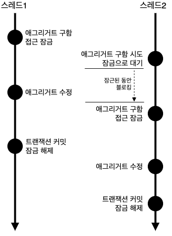
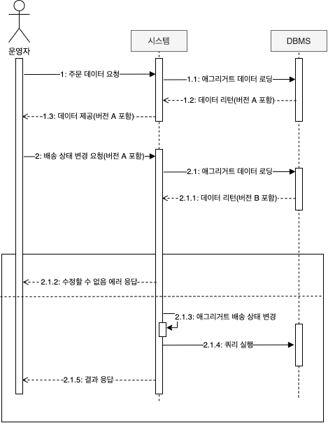
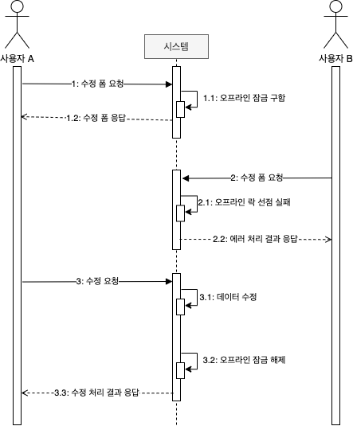

# 8장 애그리거트 트랜잭션 관리

## 애그리거트와 트랜잭션

한 주문 애그리거트에 대해 운영자는 배송 준비 상태로 변경할 때 사용자는 배송지 주소를 변경하면 어떻게 될까?


그림 8.1 한 애그리거트를 두 사용자가 거의 동시에 변경할 때 트랜잭션이 필요하다.

두 스레드는 각각 트랜잭션을 커밋할 때 수정한 내용을 DBMS에 반영한다. 즉, 배송 상태로 바뀌고 배송지 정보도 바뀌게 된다. 이 순서의 문제점은 운영자는 기존 배송지 정보를 이용해서 배송 상태로 변경했는데 그 사이 고객은 배송지 정보를 변경했다는 점이다. 즉, 애그리거트의 일관성이 깨지는 것이다.

이런 문제가 발생하지 않도록 하려면 두 가지 중 하나를 해야 한다.

* 운영자가 배송지 정보를 조회하고 상태를 변경하는 동안 고객이 애그리거트를 수정하지 못하게 막는다.
* 운영자가 배송지 정보를 조회한 이후에 고객이 정보를 변경하면 운영자가 에그리거트를 다시 조회한 뒤 수정하도록 한다.

애그리거트에 대해 사용할 수 있는 대표적인 트랜잭션 처리 방식에는 선점\(Pressimistic\) 잠금과 비선점\(Optimistic\) 잠금의 두 가지 방식이 있다.

### 선점 잠금

선점 잠금은 먼저 애그리거트를 구한 스레드가 애그리거트 사용이 끝날 때까지 다른 스레드가 해당 애그리거트를 수정하는 것을 막는 방식이다.



그림 8.2 선점 잠금의 동작 방식

한 스레드가 애그리거트를 구하고 수정하는 동안 다른 스레드가 수정할 수 없으므로 동시에 애그리거트를 수정할 때 발생하는 데이터 충돌 문제를 해소할 수 있다.

선점 잠금은 보통 DBMS가 제공하는 행 단위 잠금을 사용해서 구현한다. 오라클을 비롯한 다수 DBMS가 for update와 같은 쿼리르 사용해서 특정 레코드에 한 사용자만 접근할 수 있는 잠금 장치를 제공한다.

JPA의 EntityManager는 LockModeType을 인자로 받는 find\(\) 메서드를 제공하는데, LockModeType.PESSIMISTIC\_WRITE를 값으로 전달하면 해당 엔티티와 매핑된 테이블을 이용해서 선점 잠금 방식을 적용할 수 있다. 하이버네이트의 경우 잠금 모드로 사용하면 'for update'쿼리를 사용해서 선점 잠금을 구현한다.

### 선점 잠금과 교착 상태

선점 잠금 기능을 사용할 떄는 잠금 순서에 따른 교착 상태\(dealock\)가 발생하지 않도록 주의해야 한다. 예를 들어, 다음과 같은 순서로 두 스레드가 잠금 시도를 한다고 해보자.

1. 스레드1: A 애그리거트에 대한 선점 잠금 구함
2. 스레드2: B 애그리거트에 대한 선점 잠금 구함
3. 스레드1: B 애그리거트에 대한 선점 잠금 시도
4. 스레드2: A 애그리거트에 대한 선점 잠금 시도

이 순서에 따르면 스레드1은 영원히 B 애그리거트에 대한 선점 잠금을 구할 수 없다. 왜냐면 스레드2가 B 애그리거트에 대한 잠금을 이미 선점하고 있기 때문이다. 동일한 이유로 스레드2는 A 애그리거트에 대한 잠금을 구할 수 없다. 두 스레드는 상대방 스레드가 먼저 선점한 잠금을 구할 수 없어 더 이상 다음 단계를 진행하지 못하게 된다. 즉, 스레드1과 스레드2는 교착 상태에 빠지게 되는 것이다.

이런 문제가 발생하지 않도록 하려면 잠금을 구할 때 최대 대시 시간을 지정해야 한다. JPA에서 선점 잠금을 시도할 때 최대 대기 시간을 지정하려면 다음과 같이 힌트를 사용하면 된다.

```java
Map<String, Object> hints = new HashMap<>();
hints.put("javax.persistence.lock.timeout", 2000);
Order order = entityManager.find( Order.class, orderNo, 
		LockModeType.PRESSIMISTIC_WRITE, hints);
```

지정한 시간 이내에 잠금을 구하지 못하면 익셉션을 발생시킨다.

> DBMS에 따라 교착 상태에 따라 커넥션을 처리하는 방식이 다르다. 쿼리별로 대기 시간을 지정할 수 있는 DBMS가 있고 커넥션 단위로만 대기 시간을 지정할 수 있는 DBMS도 있다. 따라서 선점 잠금을 사용하려면 사용하는 DBMS에 대해 JPA가 어떤 식으로 대기 시간을 처리하는지 반드시 확인해야 한다.

### 비선점 잠금

선점 잠금이 강력해 보이긴 하지만 선점 잠금으로 모든 트랜잭션 충돌 문제가 해결되는 것은 아니다.


그림 8.4 선점 잠금으로 해결할 수 없는 상황

실행 순서는 다음과 같다.

1. 운영자는 배송을 위해 주문 정보를 조회한다. 시스템은 정보를 제공한다.
2. 고객이 배송지 변경을 위해 변경 폼을 요청한다. 시스템은 변경 폼을 제공한다.
3. 고객이 새로운 배송지를 입력하고 폼을 전송해서 배송지를 변경한다.
4. 운영자가 1번에서 조회한 주문 정보를 기준으로 배송지를 정하고 배송 상태 변경을 요청한다.

여기서 문제는 운영자는 고객이 변경하기 전의 배송지 정보를 이용해서 배송 준비를 한 뒤에 배송 상태로 변경하게 된다. 즉, 배송 상태 변경 전에 배송지를 한 번 더 확인하지 않으면 운영자는 다른 배송지로 물건을 발송하게 된다.

이는 비선점방식으로 해결할 수 있는데, 변경한 데이터를 실제 DBMS에 반영하는 시점에 변경 가능 여부를 확인하는 방식이다.

비선점 잠금을 구현하려면 애그리거트에 버전으로 사용할 숫자 타입의 프로퍼티를 추가해야 한다. 애그리거트를 수정할 때마다 버전으로 사용할 프로퍼티의 값이 1씩 증가하는데, 이때 다음과 같은 쿼리를 사용한다.

```java
UPDATE aggtable SET version = version + 1, colx = ?, coly = ?
WHERE aggid = ? and version = 현재 버젼
```

이 쿼리는 수정할 애그리거트와 매핑되는 테이블의 버전 값이 현재 애그리거트의 버전과 동일한 경우에만 데이터를 수정한다. 그리고 수정에 성공하면 버전 값을 1 증가시킨다. 따라서 다른 트랜잭션이 먼저 데이터를 수정해서 버전 값이 바뀌면 데이터 수정에 실패하게 된다.


그림 8.5 비선점 잠금을 이용한 트랜잭션 충돌 방지

스레드1과 스레드2는 같은 버전을 갖는 애그리거트를 읽어와 수정하고 있다. 두 스레드 중 스레1이 먼저 커밋을 시도한다. 이 시점에 애그리거트의 버전은 여전히 5이므로 애그리거트 수정에 성공하고 버전은 6이 된다. 스레드1이 트랜잭션을 커밋한 후에 스레드2가 커밋을 시도하는데, 이미 애그리거트 버전이 6이므로 ㅅ그레드2는 데이터 수정에 실패하게 된다.

JPA는 버전을 이용한 비선점 잠금 기능을 지원한다.

```java
@Entity
@Table(name = "purchage_order")
@Access(AccessType.FIELD)
public class Order {
	@EmbeddedId
	private OrderNo number;

	@Version
	private long version;
	
	...
}
```

JPA는 엔티티가 변경되어 UPDATE 쿼리를 실행할 때 @Version에 명시한 필드를 이용해서 비선점 잠금 쿼리를 실행한다.

```java
UPDATE purchage_order SET ..., version = version + 1
	WHERE number = ? and version = 10
```

응용 서비스는 버전에 대해 알 필요가 없다. 리포지터리에서 필요한 애그리거트를 구하고 알맞은 기능만 실행하면 된다. 비선점 잠금을 위한 쿼리를 실행할 때 쿼리 실행 결과로 수정된 행의 개수가 0이면 이미 누군가 앞서 데이터를 수정한 것이다. 이는 트랜잭션이 충돌한 것이므로 트랜잭션 종료 시점에 익셉션이 발생한다. \(OptimisticLockingFailureException\)

표현 영역의 코드는 이 익셉션의 발생 여부에 따라 트랜잭션 충돌이 일어났는지 확인할 수 있다.

```java
@Controller
public class OrderController {
	...
	@RequestMapping(value = "/changeShipping", method = RequestMethod.POST)
	public String changeShipping(ChangeShippingRequest changeReq) {
		try {
			changeShippingService.changeShipping(changeReq);
			return "changeShippingSuccess";
		} catch(optimisticLockingFailureException ex) {
				// 누군가 먼저 같은 주문 애그리거트를 수정했으므로, 
				// 트랜잭션 충돌이 일어났다는 메시지를 보여준다. 
				return "changeShippingExConflic";
		}
}
```



그림 8.6 비선점 잠금을 이용한 트랜잭션 충돌 방지를 여러 트랜잭션으로 확장

비선점 잠금 방식을 여러 트랜잭션으로 확장하려면 애그리거트 정보를 뷰로 보여줄 때 버전 정보도 함께 사용자 화면에 전달해야 한다. 사용자 요청을 처리하는 응용 서비스를 위한 요청 데이터는 사용자가 전송한 버전값을 포함한다. 예를 들어, 배송 상태 변경을 처리하는 응용 서비스가 전달받는 데이터는 다음과 같이 주문 번호와 함께 해당 주문을 조회한 시점의 버전 값을 포함해야 한다.

응용 서비스는 전달받은 버전 값을 이용해서 애그리거트의 버전과 일치하는지 확인하고 일치하는 경우에만 요청한 기능을 수행한다. 표현 계층은 버전 충돌 익셉션이 발생하면 버전 충돌을 사용자에게 알려주고 사용자가 알맞은 후속 처리를 할 수 있도록 한다.

```java
@Controller
public class OrderAdminController {
	private StartShippingService startShippingService;

	@RequestMapping(value = "/startShipping", method = RequestMethod.POST)
	public String startShipping(StartShippingRequest startReq) {
		try {
			startShippingService.startShipping(startReq);
			return "shippingStarted";
		} catch(OptimisticLockingFailureException | VersionConflicException ex) {
			// 트랜잭션 충돌
			return "startShippingTxConflict";
		}
	}
	... 
```

이 코드는 비선점 잠금과 관련해서 발생하는 두 개의 익셉션을 처리하고 있다. 하나는 스프링 프레임워크가 발생시키는 optimisticLockingFailureException이고, 다른 하나는 응용 서비스 코드에서 발생시키는 VersionConflictException이다. VersionConflicException은 이미 누군가가 애그리거트를 수정했다는 것을 의미하고 OptimisticLockingFailureException은 누군가가 거의 동시에 애그리거트를 수정했다는 것을 의미한다.

### 강제 버전 증가

애그리거트에 애그리거트 루트 외에 다른 엔티티가 존재하는데 기능 실행 도중 루트가 아닌 다른 엔티티의 값만 변경된다고 하자 그런데 연관된 엔티티의 값이 변경된다고 해도 루트 엔티티 자체의 값은 바뀌는 것이 없으므로 버전 값을 갱신하지 않는다. 따라서 애그리거트 내에 어떤 구성요소의 상태가 바뀌면 루트 애그리거트의 버전 값을 증가해야 비선점 잠금이 올바르게 동작한다.

JPA는 이런 문제를 처리할 수 있도로 EntityManager.find\(\) 메서드로 엔티티를 구할때 강제로 버전 값을 증가시키는 잠금 모드를 지원하고 있다.

```java
@Repository
public class JpaOrderRepository implements OrderRepository {
	@PersistenceContext
	private EntityMangager entityManager;

	@Override
	public Order findbyIdOptimisticLockMode(OrderNo id) {
		return entityManager.find(Order.class, id
				LockModeType.OPTIMISTTIC_FORCE_INCREMENT);
	}
...
```

### 오프라인 선점 잠금

더 엄격하게 데이터 충돌을 막고 싶다면 누군가 수정화면을 보고 있을 경우 수정 화면 자체를 실행하지 못하도록 해야 한다. 한 트랜잭션 범위에서만 적용되는 선점 잠금 방식이나 나중에 버전 충돌을 확인하는 비선점 잠금 방식으로는 이를 구현할 수 없다. 이때 필요한 것이 오프라인 선점 잠금 방식이다.

오프라인 선점 잠금은 여러 트랜잭션에 걸쳐 동시 변경을 막는다. 잠금을 해제하기 전까지 다른 사용자는 잠금을 구할 수 없다.



그림 8.8 오프라인 선점 잠금 방식

