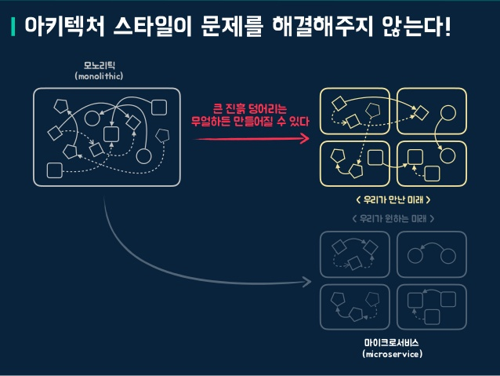
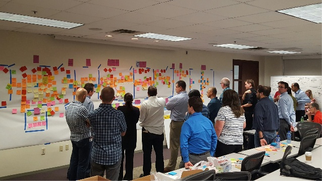
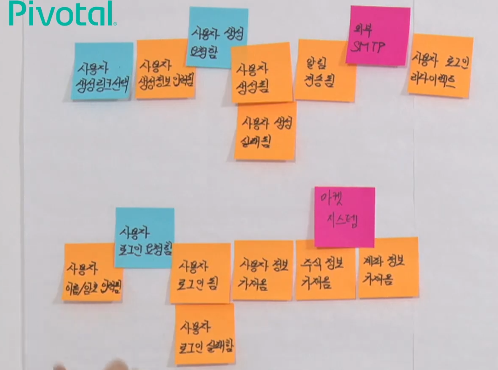
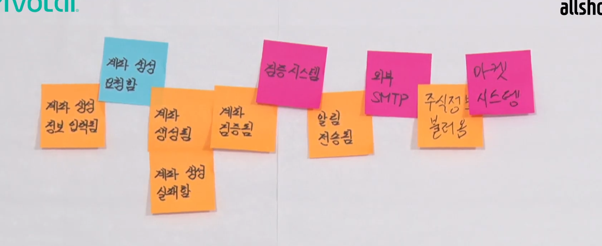
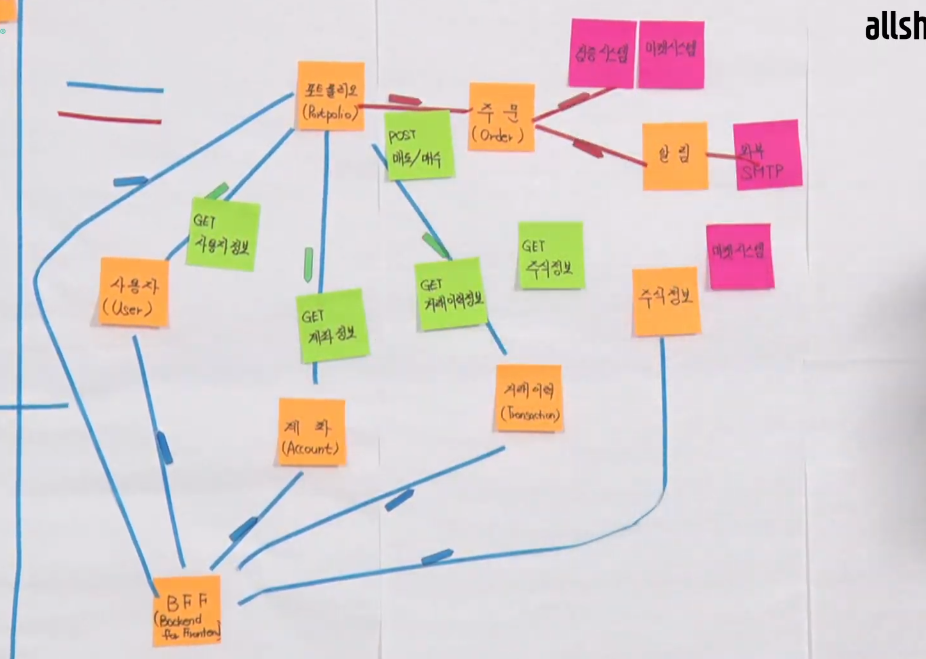
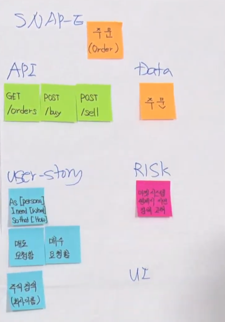
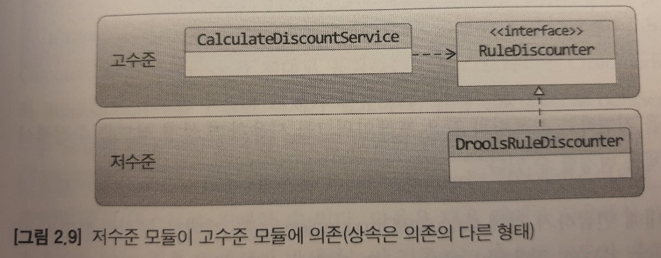

# DDD


## DDD란 무엇일까?

### 정의

DDD\(Domain-Driven Design\) 또는 도메인 주도 설계라고 부른다. **도메인 패턴**을 중심에 놓고 설계하는 방식을 일컫는다.

### 특징

* 도메인 그 자체와 도메인 로직에 초점을 맞춘다. 일반적으로 많이 사용하는 **데이터 중심의 접근법**을 탈피해서 순수한 도메인의 모델과 로직에 집중하는 것을 말한다.
* **보편적인\(ubiquitous\) 언어**의 사용이다. 도메인 전문가와 소프트웨어 개발자 간의 커뮤니케이션 문제를 없애고 상호가 이해할 수 있고 모든 문서와 코드에 이르기까지 동일한 표현과 단어로 구성된 단일화된 언어체계를 구축해나가는 과정을 말한다. 이로서 분석 작업과 설계 그리고 구현에 이르기까지 통일된 방식으로 커뮤니케이션이 가능해진다.
* **소프트웨어 엔티티와 도메인 컨셉트를 가능한 가장 가까이 일치시키는 것이다.** 분석 모델과 설계가 다르고 그것과 코드가 다른 구조가 아니라 도메인 모델부터 코드까지 항상 함께 움직이는 구조의 모델을 지향하는 것이 DDD의 핵심원리이다.

### 데이터 주도 설계는 또 뭐지?

데이터 주도 설계란 객체가 가져야 할 **데이터에 초점**을 두고 설계를 하는 방식을 일컫는다.  
 데이터 주도 설계 에서는 **객체 자신이 포함하고 있는 데이터를 조작**하는 데 필요한 행동을 정의한다.

```java
public class Movie {
    private String title;
    private Duration runningTime;
    private Money fee;
    private List<DiscountCondition> discountConditions;

    private MovieType movieType;
    private Money discountAmount;
    private double discountPercent;

    // getter, setter..
}
```

설계 시 협력에 고민을 하지 않았기 때문에 **과도한 접근자와 수정자**가 탄생하게 된다. 이는 후에 객체가 어떤 곳에 사용될지 알 수가 없기 때문에 최대한 많은 접근자와 수정자를 만들게 된 것이다.

결과적으로 데이터 중심 설계는 외부에 대부분의 구현이 노출되기 때문에 **캡슐화의 원칙을 위반**하게 된다.

내부 구현이 **퍼블릭 인터페이스**에 노출 되며 이 때문에 다른 객체들과 **강하게 결합**되게 된다. 이로 인해 객체의 내부 구현이 변경될 때 이 인터페이스에 의존하는 모든 객체들이 함께 변경되므로 **높은 결합도**를 유지하게 된다.

## 왜 도메인 주도 설계를 사용해야 하는가?

### 이론적으로 접근 해보자


* 도메인 모델의 적용 범위를 구현까지 확장하여 도메인 지식을 구현 코드에 반영
* 공통의 언어\(유비쿼터스 언어\)를 사용하여 도메인과 구현을 충분히 만족하는 모델을 만든다.
* 실제 코드로 구현 가능한 현실성 있는 도메인 모델 분석과 그것을 추상화하는 설계
* "설계를 하라, 그 다음에 구축하라"가 아니다.

### MSA에서 유독 도메인 주도 설계를 많이 찾는 이유는?



* **분산된 모놀리스 시스템**
* 무조건 트렌디한 기술을 적용 하는건 오히려 **독**이 될 수 있다.
* **소프트웨어의 목적**에 대해서 생각해볼 필요가 있다.

## 용어정리

#### ubiquitous Language \(유비쿼터스 랭귀지\)


도메인에서 사용하는 용어를 코드에 반영하지 않으면 그 코드는 개발자에게 코드의 의미를 해석해야 하는 부담을 준다. **코드의 가독성**을 높여서 코드를 분석하고 이해하는 **시간을 절약**, 용어가 정의 될 때마다 용어 사전에 이를 기록하고 명확하게 정의 함으로써 추후 또는 다른 사람들도 공통된 언어를 사용할 수 있도록 한다.

#### 도메인

일반적인 요구사항, 소프트웨어로 해결하고자 하는 문제 영역

#### 도메인 모델

특정 도메인을 개념적으로 표현한 것, 도메인 모델을 사용하면 여러 관계자들이 동일한 모습으로 도메인을 이해하고 도메인 지식을 공유하는 데 도움이 된다.

#### Entity \(엔티티\)

테이블 모델, 고유 식별자를 가짐

#### Value Object \(벨류 오브젝트\)

데이터 표현 모델 식별자를 가지고 있지 않고 불변 타입이다.

```java
// 가변 객체 
class Cash {
    private int dollars;

    public void mul(int factor) {
        this.dollars *= factor;
    }
}
```

```java
// 불변 객체
class Cash {
    private final int dollars;

    public Cash mul(int factor) {
        return new Cash(this.dollars * factor);
    }
}
```

#### Aggregate \(에그리게이트\)

연관된 엔티티와 벨류 오브젝트의 묶음, 일관성과 트랜잭션, 분산의 단위

루트 레그리게이트 : 에그리게이트가 제공해야 할 핵심 도메인 기능을 보유 하고 있는 모델


#### Bounded Context \(바운디드 컨텍스트\)

특정한 도메인 모델이 적용되는 제한된 영역 경계 내에선 동일한 모델을 일관되게 적용


#### Context Map \(컨텍스트 맵\)

바운디드 컨텍스트 간의 관계


## 이벤트 스토밍

### 정의

도메인 전문가와 개발자가 같이 참여 하여 어떻게 전략적으로 설계를 효율적으로 할것인가에 대한 방법이다. 이벤트 스토밍은 서비스에 필요한 모든 사람들이 다같이 모여서 진행을 한다. 개발요소가 아닌 이벤트와 비즈니스 프로세스에 집중한다. 팀 구성원 전체가 서비스 이해도를 증가할 수 있고, 도메인 전문가도 이해의 폭을 다시 넓히고 새로운 통찰력을 얻을수 있다.



### 이벤트 스토밍 과정을 살펴보자\(18분 참고\)






#### 보리스 다이어그램 \(42분 참\)

* Selected Aggregate
* 데이터 그룹핑 연관도 파악
* 동기/비동기/기타 유형 분리



#### snap-E \(48분 참\)

* Selected User Story
* UI
* API
* DATA
* RISKS
* STORIES



## 도메인 주도 설계 아키텍처


### 프레젠테이션 레이어

UI 영역이라고 사용하는 데도 있으며 사용자의 요청을 받아 애플리케이션 영역의 처리 결과를 다시 사용자에게 보여주는 역할을 한다.

### 애플리케이션 레이어

사용자에게 제공해야 할 기능을 구현한다.

### 도메인 레이어

도메인 모델을 구현한다. 한 애그리게이트에 넣기 애매한 도메인 개념을 구현하려면 애그리게이트에 억지로 넣기보다는 도메인 서비스를 이용해서 도메인 개념을 명시적으로 드러내면 된다. 도메인 서비스를 사용하는 주체는 애그리게이트가 될 수 있고 응용 서비스가 될 수도 있다.

### 인프라스트럭처 레이어

영속성을 구현하거나 외부와 통신하는 기능을 제공하는 레이어이다.

### DIP \(Dependency Inversion Principle, 의존 역전 원칙\)

DIP는 의존성 역전 원칙으로 저수준의 모듈이 고수준의 모듈에 의존하면 OCP 원칙을 적용할 수 있다.

도메인 레이어의 서비스에서 사용하는 모듈은 인터페이스로 정의되어 인프라스트럭처 레이어에서 구현되고 있다. 따라서 구현 기술이 변경되더라도 도메인 레이어에서는 동일한 비즈니스 로직을 제공할 수 있고 애플리케이션 성격에 따라 다양한 구현 기술을 적용할 수 있다.



### Domain Layer

```java
interface CustomPropJpaRepository : JpaRepository<CustomProp, Long>,
  CustomPropJpaRepositoryCustom {
}
```

```java
interface CustomPropJpaRepositoryCustom {
  fun findCustomProp(propNo: Long, propName: String, serviceNo: Int): CustomProp?
  fun findCustomProp(propNo: Long, propValueNo: Long): CustomProp?
}
```

### InfraStructure Layer

```java
class CustomPropJpaRepositoryImpl : QuerydslRepositorySupport(CustomProp::class.java),
  CustomPropJpaRepositoryCustom {

  val customProp = QCustomProp.customProp
  val customPropValue = QCustomPropValue.customPropValue
  override fun findCustomProp(propNo: Long, propName: String, serviceNo: Int): CustomProp? {

    return from(customProp).innerJoin(customProp.customPropValues).fetchJoin().where(
      customProp.propNo.eq(propNo).or(customProp.propName.eq(propName)).and(customProp.serviceNo.eq(serviceNo))
    )
      .fetchOne()
  }

  override fun findCustomProp(propNo: Long, propValueNo: Long): CustomProp? {
    return from(customProp).innerJoin(customProp.customPropValues, customPropValue)
      .on(customPropValue.propValueNo.eq(propValueNo))
      .where(customProp.propNo.eq(propNo))
      .fetchOne()
  }
}
```


## Event Driven Design

### **이벤트 관련 구성요소**

* 도메인 모델에서 이벤트 주체는 엔티티, 밸류, 도메인 서비스와 같은 도메인 객체이다.
* 도메인 객체는 도메인 로직을 실행해서 상태가 바뀌면 관련 이벤트를 발생한다.
* 이벤트 핸들러\(handler\)는 이벤트 생성 주체가 발생한 이벤트에 반응한다.
* 이벤트 핸들러는 생성 주체가 발생한 이벤트를 전달받아 이벤트에 담긴 데이터를 이용해서 원하는 기능을 실행한다.
* 이벤트 생성 주체와 이벤트 핸들러를 연결해 주는 것이 이벤트 디스패처\(dispatcher\)이다.
* 이벤트를 전달받은 디스패처는 해당 이벤트를 처리할 수 있는 핸들러에 이벤트를 전파한다.

### **이벤트의 구성**

* 이벤트는 현재 기준으로 \(바로 직전이라도\) 과거에 벌어진 것을 표현하기 때문에 이벤트 이름에는 과거 시제를 사용한다.
* 이벤트는 이벤트 핸들러가 작업을 수행하는 데 필요한 최소한의 데이터를 담아야 한다.

### **이벤트 용도**

* 도메인의 상태가 바뀔 때 다른 후처리를 해야 할 경우 후처리를 실행하기 위한 트리거로 이벤트를 사용할 수 있다.
* 이벤트의 두 번째 용도는 서로 다른 시스템 간의 데이터 동기화이다.

### **이벤트 장점**

* 서로 다른 도메인 로직이 섞이는 것을 방지할 수 있다.
* 이벤트 핸들러를 사용하면 기능 확장도 용이하다.

### **비동기 이벤트 처리**

* 로컬 핸들러를 비동기로 실행하기
* 메시지 큐를 사용하기
* 이벤트 저장소와 이벤트 포워더 사용하기
* 이벤트 저장소와 이벤트 제공 API 사용하기

## CQRS \(명령 및 쿼리 책임 분리\)

### **단일 모델의 단점**

* 객체 지향으로 도메인 모델을 구현할 때 주로 사용하는 ORM 기법은 도메인의 상태 변경을 구현하는 데는 적합하지만, 여러 애그리거트에서 데이터를 가져와 출력하는 기능을 구현하기에는 고려할 것들이 많아서 구현을 복잡하게 만드는 원인이 된다.
* 이런 구현 복잡도를 낮추는 간단한 방법이 있는데 그것은 바로 상태 변경을 위한 모델과 조회를 위한 모델을 분리하는 것이다.

### **CQRS 소개**

* 상태를 변경하는 명령\(Command\)을 위한 모델과 상태를 제공하는 조회\(Query\)를 위한 모델을 분리하는 패턴이다.
* CQRS는 복잡한 도메인에 적합하다.

### **웹과 CQRS**

* 메모리에 캐시하는 데이터는 DB에 보관된 데이터를 그대로 저장하기보다는 화면에 맞는 모양으로 변환한 데이터를 캐시할 때 성능에 더 유리하다.
* 조회 속도를 높이기 위해 별도 처리를 하고 있다면 명시적으로 명령 모델과 조회 모델을 구분하자.
* 조회 기능 때문에 명령 모델이 복잡해지는 것을 방지할 수 있고 명령 모델에 관계없이 조회 기능에 특화된 구현 기법을 보다 쉽게 적용할 수 있다.

### **CQRS 장단점**

* 명령 모델을 구현할 때 도메인 자체에 집중할 수 있다.
* 조회 성능을 향상시키는 데 유리하다.
* 구현해야 할 코드가 더 많다.
* 더 많은 구현 기술이 필요하다.

이벤트 소싱과 항상 함께 알아두어야 할 개념으로 CQRS가 있으며 간단히 설명하면 커맨드와 쿼리의 책임을 분리하자는 것이다. 커맨드는 일반적인 디비 기준으로 상태를 변경하는 C,U,D와 같은 메소드로 생각할 수 있으며 쿼리는 단순 데이터를 조회하기 위한 리드 메소드로 생각할 수 있다. 이렇게 기능을 분리하면 이벤트 소싱 패턴을 좀 더 손쉽게 적용할 수 있다.


사실 이렇한 기술을 모든곳에 적용하기는 쉽지 않습니다.

왜냐하면 이러한 이벤트 소싱을 위해서 우리는 이벤트 스토어라는 중간 레이어가 필요하다.

또한 CQRS 로 분리하기 위해서 쓰기/읽기 레이어도 분리해야한다.

이러한 레이어 분리는 전체시스템에 관리포인트를 늘이고 시스템의 구조를 복잡하게 만드는 결과를 가져오게 됩니다.

이러한 이유로 MSA 에 적용하는 것은 많은 이점을 줍니다.

그러나 작은 시스템이나 모놀리틱 방법에는 적용하는데 무리가 있습니다.

## 참고

* [도메인 주도 설계 \(Domain-Driven Design\) 개요](https://cyberx.tistory.com/57)
* [카카오헤어샵의 DDD](https://brunch.co.kr/@cg4jins/7)
* [필요한 내용만 추려서 DDD 당장 써먹기 \| Popit](https://www.popit.kr/%ED%95%84%EC%9A%94%ED%95%9C-%EB%82%B4%EC%9A%A9%EB%A7%8C-%EC%B6%94%EB%A0%A4%EC%84%9C-ddd-%EB%8B%B9%EC%9E%A5-%EC%8D%A8%EB%A8%B9%EA%B8%B0/)
* [DDD\(Domain Driven Design\)](https://swiftymind.tistory.com/87)
* [도메인 주도 설계 \(Domain Driven Design\)](https://www.slideshare.net/ahastudio/2017-06-19-domain-driven-design)
* [Database Driven Development에서 진짜 DDD로의 선회 -1-](https://helloworld.kurly.com/blog/road-to-ddd/)
* [나 홀로 DDD](https://raindrop.dooray.com/share/posts/-Fny78YURpKKPjMUgpaD6w)
* [도메인 주도 설계의 본질](https://www.slideshare.net/baejjae93/ss-27536729)
* [애그리게잇 하나에 리파지토리 하나](https://medium.com/@SlackBeck/%EC%95%A0%EA%B7%B8%EB%A6%AC%EA%B2%8C%EC%9E%87-%ED%95%98%EB%82%98%EC%97%90-%EB%A6%AC%ED%8C%8C%EC%A7%80%ED%86%A0%EB%A6%AC-%ED%95%98%EB%82%98-f97a69662f63)
* [OOAD - 데이터 주도 설계의 문제점\(결합도와 응집도\)](https://galid1.tistory.com/682)
* [TheOpenCloudEngine/uEngine-cloud](https://github.com/TheOpenCloudEngine/uEngine-cloud/wiki/%EC%BB%A4%EB%A8%B8%EC%8A%A4-%EC%95%A0%ED%94%8C%EB%A6%AC%EC%BC%80%EC%9D%B4%EC%85%98-%EC%9D%B4%EB%B2%A4%ED%8A%B8-%EC%8A%A4%ED%86%A0%EB%B0%8D)
* [마이크로서비스 어디까지 해봤니?](https://syundev.tistory.com/125)
* [Event 기반 Microservices - Event Sourcing 및 CQRS](https://cyberx.tistory.com/98)
* [나만 모르고 있던 CQRS & EventSourcing \| Popit](https://www.popit.kr/cqrs-eventsourcing/)
* [\[번역\] 최신 기술 - CQRS 처음 도입하기](https://youngjaekim.wordpress.com/2016/09/12/%EC%B5%9C%EC%8B%A0-%EA%B8%B0%EC%88%A0-cqrs-%EC%B2%98%EC%9D%8C-%EB%8F%84%EC%9E%85%ED%95%98%EA%B8%B0/)
* [Microservice Architecture \(MSA\) Event Sourcing\(이벤트소싱\) & CQRS](https://blog.naver.com/PostView.nhn?blogId=rogman0&logNo=221488686499&parentCategoryNo=&categoryNo=29&viewDate=&isShowPopularPosts=true&from=search)
* [MSA 전략 1: 마이크로서비스, 어떻게 디자인 할 것인가?](https://www.slideshare.net/PivotalKorea/msa-1-154454835)
* [마이크로서비스 개발을 위한 Domain Driven Design](https://www.youtube.com/watch?v=QUMERCN3rZs)
* [OOAD - 데이터 주도 설계의 문제점\(결합도와 응집도\)](https://galid1.tistory.com/682)
* [biggwang의 개발 블로그](https://biggwang.github.io/2019/07/29/OOP/%EA%B0%9D%EC%B2%B4%20%EC%84%A4%EA%B3%84%20%ED%95%A0%20%EB%95%8C%20%EB%8D%B0%EC%9D%B4%ED%84%B0%20%EC%A4%91%EC%8B%AC%EC%9D%B4%20%EC%95%84%EB%8B%8C%20%EC%B1%85%EC%9E%84%20%EC%A4%91%EC%8B%AC%EC%9C%BC%EB%A1%9C%20%ED%95%B4%EC%95%BC%20%ED%95%98%EB%8A%94%20%EC%9D%B4%EC%9C%A0/)
* [bymin](https://youngclown.github.io/2019/07/msa-api)
* [\[마이크로서비스 꿀밋업\]2탄 Review](https://devopsflux.github.io/review/2019/07/25/msa-ddd/)
* [DDD - \#2 아키텍처](https://stylishc.tistory.com/144)

