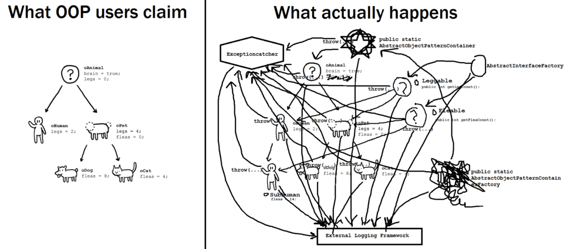

# 객체지향과 절차지향

## 절차지향

* 절차지향이란 프로시져\(procedure\)로 프로그램을 구성하는 기법이다.
* 프로시져는 대체로 데이터를 중심으로 구현한다.
* 단점은 데이터 타입이나 의미를 변경해야 할 때, 함께 수정해야 하는 프로시저가 증가하는 것이다.

## 객체지향

* 객체는 자신만의 데이터와 프로시져를 갖는다.
* 객체는 자신만이 기능을 제공한다.
* 객체들은 서로 연결되어 다른 객체가 제공하는 기능을 사용할 수 있다.

## 절차지향 vs 객체지향

### 설계 방식

* 절차지향 프로그래밍은 프로그램의 순서와 흐름을 먼저 세우고 필요한 자료구조와 함수들을 설계하는 방식
* 객체지향 프로그래밍은 반대로 자료 구조와 이를 중심으로 한 모듈 들을 먼저 설계한 다음에 이들의 실행 순서와 흐름을 조합하는 방식

### 목적

* 절차지향 언어를 사용한다면, 말 그대로 실행 순서, 즉 절차가 더 중점이 된다.
* 객체지향 언어를 사용한다면, 필요한 객체들의 종류와 속성 등이 더 중점이 된다.

### 결론적으로 더 나은 설계는?

> 더 나은 설계란 없다. 비즈니스 모델의 성격에 따라 다를 뿐이다.

객체는 변수와 함수를 추상화 과정을 통해 좀 더 모듈화한 도구에 불과하다. 모듈화 함으로써 객체지향이 지닐 수 있는 강점인 정보은닉화, 상속 및 다형성을 통한 확장성과 재사용, 이를 기반한 생산성과 유지보수의 용이성이 OOP의 진정한 특징이자 정체성일지도 모른다.

#### 객체지향 설계도 마이너스가 되는 경우도 있다.

객체지향도 프로젝트가 커지면 다른면에서 복잡해지며, 컴퓨터의 관점이 아니기에 상대적으로 느린 경우가 있다. 객체지향적 기능들은 마법이 아니라 컴퓨터 상에 미리 구현되어있는 코드 뭉치에 불과하기 때문이다. 다만 라이브러리화되어 기능으로써 제공되기에 그걸 사용하는 프로그래머 입장에서 편할 뿐이다.

## 참고

* [http://blog.naver.com/PostView.nhn?blogId=hirit808&logNo=221457311265&categoryNo=35&parentCategoryNo=0&viewDate=&currentPage=1&postListTopCurrentPage=1&from=search](http://blog.naver.com/PostView.nhn?blogId=hirit808&logNo=221457311265&categoryNo=35&parentCategoryNo=0&viewDate=&currentPage=1&postListTopCurrentPage=1&from=search)
* [https://gbsb.tistory.com/?page=109](https://gbsb.tistory.com/?page=109)
* [https://m.blog.naver.com/PostView.nhn?blogId=atalanta16&logNo=220249264429&proxyReferer=https:%2F%2Fwww.google.com%2F](https://m.blog.naver.com/PostView.nhn?blogId=atalanta16&logNo=220249264429&proxyReferer=https:%2F%2Fwww.google.com%2F)

