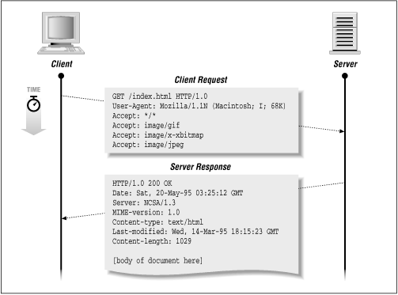

# HTTP HEADER

## HTTP란?

* 텍스트 기반의 통신 규약으로 인터넷에서 데이터를 주고받을 수 있는 프로토콜이다.
* HTML 문서만이 HTTP 통신을 위한 유일한 정보 문서는 아니다.
* Plain text로 부터 JSON 데이터 및 XML과 같은 형태의 정보도 주고 받을 수 있다.
* HTTP는 연결을 유지하지 않는 프로토콜이기 때문에 요청/응답 방식으로 동작한다.

## HTTP 공통 헤더

REQUEST와 RESPONSE 헤더에 공통으로 사용하는 속성이다.

* Date : HTTP 메시지가 만들어진 시각
* Connection : 클라이언트와 서버 간 연결에 대한 옵션 설정
  * 기본적으로 keep-alive로 되어있는데, HTTP/2에서는 사용하지 않는다.
* Cache-Control : 캐시 설정
  * no-store : 캐싱하지 않는다.
  * no-cache : 모든 캐시를 쓰기 전에 서버에 해당 캐시를 사용해도 되는지 확인한다.
  * must-revalidate : 만료된 캐시만 서버에 확인 받도록 한다.
  * public : 공유 캐시\(또는 중개 서버\)에 저장한다.
  * private : 브라우저같은 특정 사용자 환경에만 저장한다.
  * max-age : 캐시 유효시간을 명시한다.
* Content-Length : 요청과 응답 메시지의 본문 크기를 바이트 단위로 표시한다.
* Content-Type : 컨텐츠 타입\(MIME\)과 문자열 인코딩\(utf-8\)을 명시할 수 있다.
* Content-Language : 해당 개체와 적합한 언어 정보 표시
* Content-Encoding : 메시지 압축 방식 표시
* Content-Disposition : 응답 Body를 브라우저가 어떻게 표시해야할지 알려준다.
  * inline인 경우 웹페이지 화면에 표시되고, attachment인 경우 다운로드한다.
* Location : 리소스가 리다이렉트될 경우에 이동된 주소, 또는 새로 생성된 리소스 주소를 명시
  * 새로 생성된 리소스의 경우
    * HTTP 상태 코드 201 Created가 반환된다.
  * 300번대 응답의 경우
    * `HTTP/1.1 302 Found Location: /`
    * 이런 응답이 왔다면 브라우저는 / 주소로 redirect한다
* Last-Modified : 리소스를 마지막으로 갱신한 일시

## HTTP REQUEST

HTTP 헤더 내 요청 헤더 \(Request Header\) 항목

* Host : 요청하는 호스트에 대한 호스트명 및 포트번호
* User-Agent : 클라이언트 소프트웨어 OS 또는 브라우저
  * User-Agent: Mozilla/5.0 \(Macintosh; Intel Mac OS X 10\_13\_5\) AppleWebKit/537.36 \(KHTML, like Gecko\) Chrome/67.0.3396.99 Safari/537.36
* Accept : 클라이언트가 허용할 수 있는 파일 형식
* Authorization : 인증 토큰 정보
* Origin : 요청을 보낸 주소를 제공한다. 요청지와 수신지 주소가 다를 경우 CORS 문제가 발생
* Referer : 이전 페이지 주소 정보, 주로 페이지 접근 통계에서 많이 사용한다.

## HTTP RESPONSE

HTTP 헤더 내 응답 헤더 \(Response Header\) 항목

* Server : 서버 소프트웨어 정보
* Set-Cookie : 나열된 쿠키 정보를 브라우저에 저장
* Expires : 캐시 만료일을 알려준다.
* Allow : 해당 엔티티에 대해 서버 측에서 지원 가능한 HTTP 메소드 리스트를 표시
* Access-Control-Allow-Origin : 요청 Host와 응답 Host가 다르면 CORS 에러가 발생하는데 서버에서 응답 메시지 Access-Control-Allow-Origin 헤더에 프론트 주소를 적어주면 에러가 발생하지 않는다.

## 참고

* [https://xmfpes.github.io/web-network/network-http/](https://xmfpes.github.io/web-network/network-http/)
* [https://gmlwjd9405.github.io/2019/01/28/http-header-types.html](https://gmlwjd9405.github.io/2019/01/28/http-header-types.html)
* [https://code-machina.github.io/2019/07/29/HTTP-Header-Summary-Part-1.html](https://code-machina.github.io/2019/07/29/HTTP-Header-Summary-Part-1.html)
* [https://webdir.tistory.com/263](https://webdir.tistory.com/263)
* [https://velog.io/@surim014/HTTP란-무엇인가](https://velog.io/@surim014/HTTP%EB%9E%80-%EB%AC%B4%EC%97%87%EC%9D%B8%EA%B0%80)

