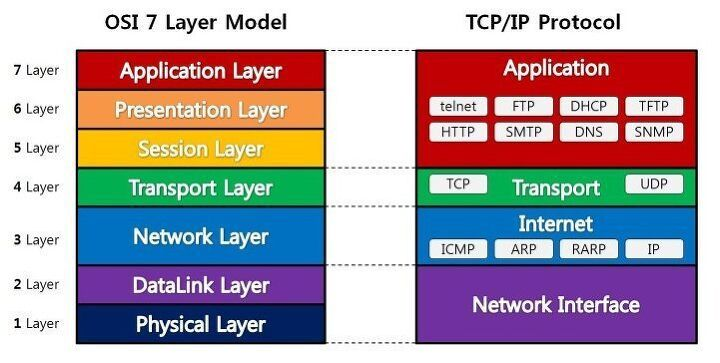
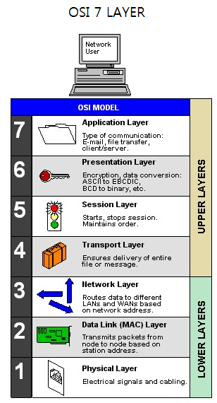

# OSI 7 Layer

## OSI 모델이란?

* Open Systems Interconnection\(개방 시스템 연결\)로 일컫는 새로운 네트워크 모델이다.
* 컴퓨터 네트워크 프로토콜의 국제적인 표준안이다.
* 각종 네트워크 장비 및 컴퓨터 등의 모든 통신 관련 시스템에 적용되는 개념이다.
* OSI 모델은 하나의 컴퓨터에서 다른 컴퓨터로 데이터가 전송될 때, 데이터의 생성 및 전송 과정을 표준화한 모델로 사용된다.
* 데이터 통신 기능을 수직적으로 계층화시켜서 각 계층별로 기능들을 수행하여 전달하는 통신 개념이다.

### 목적 및 특징

#### 목적

* 초기의 OSI 모델은 통신 장비들이 범용적으로 호환되지 않고 자신의 업체 장비만 호환되도록 모델링 되었다.
* 이에 따라 여러 통신 업체 장비들간의 호환성이 필요하게 되어 OSI 모델이 탄생하게 되었다.

#### 특징

* 7 계층으로 구분함으로써 관리 및 사용상의 효율성을 높였다.
* 계층 구분을 통해 계층간의 독립성을 확보하고 다른 계층에 영향을 최소화하였다.

## OSI 모델 구조

### 구조 및 동작

* OSI 참조모델은 총 7계층의 구조로 구성되어 있다.
* 상위 계층\(응용층, 표현층, 논리 접속층\) : 호스트 내부에서 처리되는 기능 수행
* 전송 계층 : 두 장비의 연결을 확인하고 유지하는 기능 수행
* 하위 계층\(네트워크 계층, 데이터 연결 계층, 물리 계층\) : 패킷의 전달 기능 수행

### Application Layer

* 역할 : 응용 프로세스간 인터페이스와 통신을 위한 기능을 수행하며, 파일 전송이나 이메일과 같은 엔드 유저\(end-user\) 서비스를 제공한다.
* 프로토콜 : TELNET, FTP, SMTP, WWW, HTTP

### Presentation Layer

* 역할 : 응용계층에서 전달된 데이터를 공통된 형식으로 변환, 압축, 암호화하는 기능 수행
* 프로토콜 : JPEG. MPEG

### Session Layer

* 역할 : 응용 프로그램간에 사용할 데이터 교환을 위한 세션과 대화 방식을 결정
* 데이터 전송 단위 : 데이터\(Data\)
* 프로토콜 : SSH, TLS

### Transport Layer

* 역할 : 신뢰성 있는 전송을 보장하기 위해 오류 검출 및 복구와 흐름 제어 수행
* 데이터 전송 단위 : 세그먼트\(Segment\)
* 프로토콜 : TCP, UDP
* 장비 : 게이트웨이, L4스위치

### Network Layer

* 역할 : 네트워크의 혼잡 제어 및 데이터 전송 경로를 설정하는 기능 수행
* 데이터 전송 단위 : 패킷\(Packet\)
* 프로토콜 : IP, ICMP, ARP
* 장비 : 라우터

### DataLink Layer

* 역할 : 물리 계층 간에 정확한 데이터 전송이 보장되도록 하는 기능 수행
* 데이터 전송 단위 : 프레임\(Frame\)
* 프로토콜 : 이더넷
* 장비 : 브릿지, 스위치

### Physical Layer

* 역할 : 전송할 데이터를 통신 케이블에 맞게 변환하여 비트 정보가 케이블을 통해 효율적으로 전송되도록 지원해주는 기능 수행
* 데이터 전송 단위 : 비트\(Bit\)
* 장비 : 허브

## 참조

* [https://quro07.tistory.com/4](https://quro07.tistory.com/4)
* [https://hahahoho5915.tistory.com/12](https://hahahoho5915.tistory.com/12)
* [https://4880.net/index.php?mid=network&document\_srl=15786&listStyle=viewer](https://4880.net/index.php?mid=network&document_srl=15786&listStyle=viewer)
* [http://www.tipssoft.com/bulletin/board.php?bo\_table=FAQ&wr\_id=529](http://www.tipssoft.com/bulletin/board.php?bo_table=FAQ&wr_id=529)
* [https://velog.io/@xldksps4/OSI-7%EA%B3%84%EC%B8%B5](https://velog.io/@xldksps4/OSI-7%EA%B3%84%EC%B8%B5)

