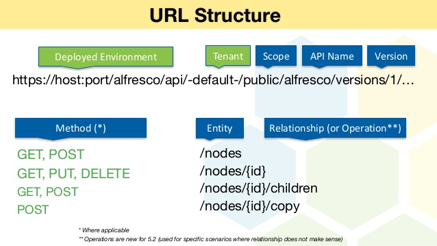

# REST API

## REST API

### 정의

HTTP URI를 통해 Resource를 명시하고 HTTP Method\(POST, GET, PUT, DELETE\)를 통해 해당 자원에 대한 CRUD Operation을 적용하는 것을 의미한다.

### 구성

* 자원\(RESOURCE\) - URI
* 행위\(VERB\) - HTTP METHOD
* 표현\(Representations\) - 자원과 행위의 조합

### 장점

* REST API 메시지가 의도하는 바를 명확하게 나타내므로 부가적인 설명에 따른 커뮤니케이션 비용이 들지 않는다.
* 여러가지 서비스 디자인에서 범용적으로 사용할 수 있다.
* 작업을 위한 상태 정보를 따로 저장하지 않으므로 무상태성을 유지할 수 있다.
* 캐시 기능이 적용 가능하다

### 단점

* 표준이 존재하지 않는다.
* 구형 브라우저가 아직 제대로 지원해주지 못하는 부분이 존재한다. \(PUT, DELETE\)
* PUT, DELETE를 From에서는 사용할 수 없다.
  * PUT으로 전송해야 할 것은 대상 리소스를 대체할 Representation 그 자체인데, 조각난 Form 데이터를 처리하라고 보낼 수는 없다.
  * DELETE에서 URI는 리소스를 정확하게 식별하고 요청을 보내기 때문에 Form을 통해 값을 전달할 게 없으며, 권한을 획득하기 위해선 header를 이용해야 한다.

### RestFul API

RestFul은 REST라는 아키텍처를 구현하는 웹 서비스를 나타내기 위한 용어이다. RESTful한 API를 구현하는 근본적인 목적이 성능 향상에 있는 것이 아니라 일관적인 컨벤션을 통한 API의 이해도 및 호환성을 높이는 것이 주 동기이니, 성능이 중요한 상황에서는 굳이 RESTful한 API를 구현할 필요는 없다.

## 참고

* [https://meetup.toast.com/posts/92](https://meetup.toast.com/posts/92)

