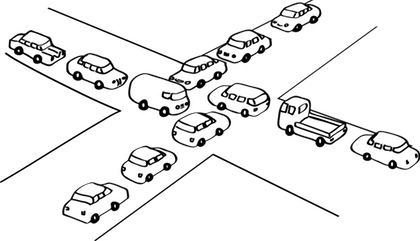
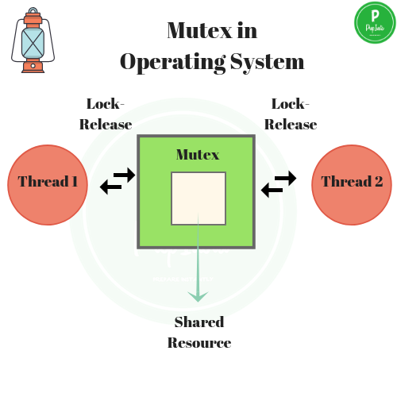
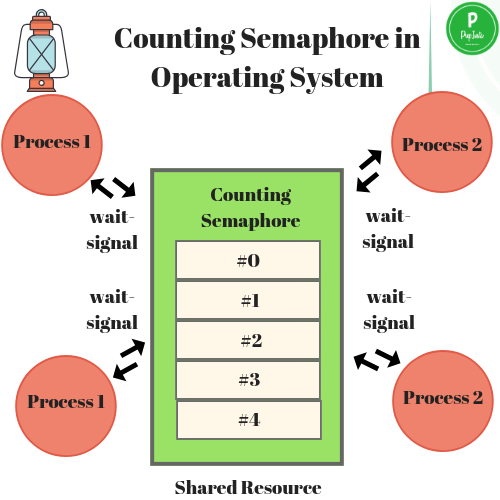

# 뮤텍스와 세마포어

## 교착상태란?

교착상태\(Dead Lock\)은 둘 이상의 프로세스들이 자원을 점유한 상태에서 서로 다른 프로세스가 점유하고 있는 자원을 요구하며 무한정 기다리는 현상을 의미한다.

## 교착상태 발생 조건

주로 멀티 프로그래밍 환경에서 한정된 자원을 얻기 위해 서로 경쟁하는 상황에서 발생한다.

교착상태가 발생하기 위해서는 다음의 네가지 조건이 충족되어야 하는데, 이 네가지 조건중 하나라도 충족되지 않으면 교착상태가 발생하지 않는다.

### 상호배제\(Mutual Exclusion\)

자원은 한 번에 한 프로세스만이 사용할 수 있어야 한다. 상호 배제 기법에는 뮤텍스, 세마포어 등이 있다.

### 점유와 대기\(Hold and Wait\)

최소한 하나의 자원을 점유하고 있으면서 다른 프로세스에 할당되어 사용하고 있는 자원을 추가로 점유하기 위해 대기하는 프로세스가 있어야 한다.

### 비선점\(Non-preemption\)

다른 프로세스에 할당된 자원은 사용이 끝날 때까지 강제로 빼앗을 수 없어야 한다.

### 환경 대기\(Circular Wait\)

서로 다른 공유자원을 사용하기 위해 대기하는 프로세스들이 원형으로 구성되어 있어 자신에게 할당된 자원을 점유하면서 앞이나 뒤에 있는 프로세스의 자원을 요구한다.

## 교착상태 해결 방안

### 예방\(Prevention\)

교착상태가 발생하지 않도록 사전에 시스템을 제어하는 방법으로 교착상태 발생의 네가지 조건 중에서 어느 하나를 제거한다. 단, 자원 낭비가 가장 심한 해결 방법이다.

* **상호 배제\(Mutual Exclusion\)부정 :** 한번에 여러 개의 프로세스가 공유 자원을 사용할 수 있도록 한다.
* **점유 및 대기\(Hold and Wait\) 부정 :** 프로세스가 실행되기 전 필요한 모든 자원을 할당하여 프로세스 대기를 없애거나 자원이 점유되지 않은 상태에서만 자원을 요구한다.
* **비선점\(Non-preemption\)부정 :** 자원을 점유하고 있는 프로세스가 다른 자원을 요구할 때 점유하고 있는 자원을 반납하고, 요구한 자원을 사용하기 위해 기다린다.
* **환형 대기\(Circular Wait\)부정 :** 자원을 선형 순서로 분류하여 고유 번호를 할당하고, 각 프로세스는 현재 점유한 자원의 고유 번호보다 앞이나 뒤 어느 한쪽 방향으로만 자원을 요구하도록 한다.

### 회피\(Avoidance\)

교착상태가 발생할 가능성을 배제하지 않고 교착상태가 발생하면 적절히 피해나가는 방법으로, 주로 은행원 알고리즘\(Banker's Algorithm\)이 사용된다.

#### **은행원 알고리즘**

1. 은행원 알고리즘은 다익스트라가 제안한 기법으로, 은행에서 모든 고객의 요구가 충족되도록 현금을 할당하는데서 유래한 기법이다.
2. 각 프로세스에게 자원을 할당하여 교착상태가 발생하지 않으며 모든 프로세스가 완료될 수 있는 상태를 안전상태, 교착상태가 발생할 수 있는 상태를 불안전 상태라고 한다.
3. 은행은 자원을 할당한 후에도 안정 상태로 남아있는지 검사하여 안정 상태에 있으면 자원을 할당하고 그렇지 않으면 다른 프로세스들이 자원을 해제할 때까지 대기한다.
4. 은행원 알고리즘을 적용하기 위해서는 자원의 양과 사용자\(프로세스\) 수가 일정해야 한다.
5. 은행원 알고리즘은 프로세스의 모든 요구를 유한한 시간안에 할당하는 것을 보장한다.

### 탐지\(Detection\)

시스템에 교착상태가 발생했는지 점검하여 교착상태에 있는 프로세스와 자원을 발견한다.

* 교착상태 발견 알고리즘과 자원 할당 그래프 등을 사용 할 수 있다.

### 복구\(Recovery\)

교착상태를 일으킨 프로세스를 종료하거나 교착상태의 프로세스에 할당된 자원을 선점하여 프로세스나 자원을 회복한다.

#### 프로세스 종료

* 교착상태에 있는 프로세스를 종료
* 교착상태에 있는 프로세스들을 하나씩 종료

#### 자원선점

* 교착상태의 프로세스가 점유하고 있는 자원을 선점하여 다른 프로세스에게 할당하며, 해당 프로세스를 일시 정지시키는 방법입니다. 우선순위가 낮은 프로세스, 수행된 정도가 적은 프로세스, 사용되는 자원이 적은 프로세스 등을 위주로 해당 프로세스의 자원을 선점한다.

## 뮤텍스\(mutex\)

뮤텍스는 Key 에 해당하는 어떤 오브젝트가 있으며 이 오브젝트를 소유한 \(쓰레드,프로세스\) 만이 공유자원에 접근할 수 있다.

### 과정

* 1번 프로세스가 자원을 접근하기 위해 Key를 점유한다.
* 1번 프로세스는 키를 점유했기 때문에 공유 자원을 사용한다.
* 2번 프로세스가 공유 자원을 사용하기를 원한다.
* 2번 프로세스는 키를 점유하기 위해 대기한다.
* 3번 프로세스 또한 공유 자원을 사용하기 위해 2번 프로세스 다음 순번으로 대기한다.
* 1번 프로세스가 공유 자원을 다 사용하고 Key를 반환한다.
* 2번 프로세스는 대기하고 있다가 반환된 Key를 점유하고 공유 자원을 사용한다.

## 세마포어\(Semaphore\)

공유 리소스에 접근할 수 있는 최대 허용치 만큼 동시 사용자\(쓰레드, 프로세스\) 접근을 허용하게 한다.

### 과정

* 공유 자원에 대한 최대 허용치를 정의한다. 우선, 3으로 해보겠다.
* 1번 프로세스가 공유 자원에 접근한다. 허용치는 2로 감소하였다.
* 2번 프로세스가 공유 자원에 접근한다. 허용치는 1로 감소하였다.
* 3번 프로세스가 공유 자원에 접근한다. 허용치는 0로 감소하였다.
* 4번 프로세스가 공유 자원에 접근한다. 허용치가 0이므로 대기한다.
* 2번 프로세스가 공유 자원을 다 사용하였다. 허용치는 1로 증가하였다.
* 4번 프로세스는 대기 하다 허용치가 1로 증가되어 공유 자원에 접근한다. 허용치는 다시 0으로 감소하였다.

## 뮤텍스와 세마포어의 차이

* 세마포어는 뮤텍스가 될 수 있지만, 뮤텍스는 세마포어가 될 수 없다.
* 세마포어는 소유할 수 없으며, 뮤텍스는 소유할 수 있고 소유주가 그에 대한 책임을 가진다.
* 세마포어는 동기화 대상이 여러개 일 때 사용하고, 뮤텍스는 동기화 대상이 오로지 하나 일 때 사용된다.

## 참고

* [https://medium.com/@abhishekdesilva/avoiding-deadlocks-and-performance-tuning-for-mssql-with-wso2-servers-c0014affd1e](https://medium.com/@abhishekdesilva/avoiding-deadlocks-and-performance-tuning-for-mssql-with-wso2-servers-c0014affd1e)
* [https://prepinsta.com/operating-systems/mutex/](https://prepinsta.com/operating-systems/mutex/)
* [https://prepinsta.com/operating-systems/semaphore/](https://prepinsta.com/operating-systems/semaphore/)
* [https://kim6394.tistory.com/193](https://kim6394.tistory.com/193)
* [https://jhnyang.tistory.com/4?category=815411](https://jhnyang.tistory.com/4?category=815411)
* [https://includestdio.tistory.com/12](https://includestdio.tistory.com/12)
* [https://coding-factory.tistory.com/311](https://coding-factory.tistory.com/311)
* [https://worthpreading.tistory.com/90](https://worthpreading.tistory.com/90)

