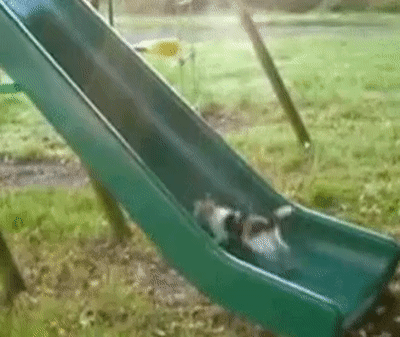

# 우리는 성장 할수 있을까? (w. 함께 자라기)

* 이전에 ‘개발바닥’ 유튜브에서 추천해준 책이 한권 있었다
* ‘함께 자라기’라는 책이었는데 읽어보니 좋은 내용들이 많아서 팀원들에게 공유하고자 정리해보았다

<figure><figcaption>
<a href="https://www.yes24.com/Product/Goods/109056601">https://www.yes24.com/Product/Goods/109056601</a>
</figcaption></figure>

## 🤔 회사에서는 성장 할 수 없을까?

### 이런 질문을 해볼 수 있을것이다

* 내가 정말 자랄 수 있을까?
* 우리가 정말 함께 자랄 수 있을까?
* 우리가 정말 매일매일 함께 자랄 수 있을까?

<figure><figcaption>
https://blog.naver.com/cutsong/221932735592
</figcaption></figure>

##

## 🤔 경력이랑 실력은 비례하는가?

<figure><figcaption>
https://www.ohmynews.com/NWS_Web/View/at_pg.aspx?CNTN_CD=A0002835986
</figcaption></figure>

### 직원을 뽑을 때 무엇이 그 사람의 실력을 가장 잘 예측할까?

* 1984년부터 86년까지 92개 회사에서 600명 이상의 개발자를 대상으로 프로그래밍 생산성을 비교하였다
* 최고는 최악보다 10배 정도 차이가 나고, 중간 이상의 업무 능력을 가진 사람들은 2배쯤 차이가 났다
* 그러나 평균적으로 경력이 10년인 개발자가 2년인 개발자보다 더 우수하지는 않았다.(단, 언어를 접한 경험이 6개월 미만인 개발자들은 전반적으로 나머지 개발자들보다 성적이 저조했다)

### 시간은 실력을 대변해주지 않는다

<figure><figcaption>
http://www.yes24.com/Product/Goods/3719907
</figcaption></figure>

* 우리는 하루 세 번 3분씩 이를 닦는다.
* 대략 다섯 살부터 닦을것이고 죽기 전까지 닦는다.
* 그런데도 나이 들었다고 이를 잘 닦는 사람이 되었다는 이야기를 들어본 적은 없었을 것이다
* 그 책에서 이야기하는 1만 시간 법칙에는 1만 시간을‘자신의 기량을 향상시킬 목적으로 반복적으로 하는 수련’을 위한 시간을 일컫는다

## 💰 자기계발은 복리로 돌아온다

<figure><figcaption>
http://www.enuri.com/knowcom/detail.jsp?kbno=1837133
</figcaption></figure>

### 반복적인 회고는 나를 돌이켜 볼 수 있는 기회가 된다

* 매년 회고를 할 때 항상 되짚어 보는 것 중 하나가 나 자신에게 얼마나 투자를 했나 하는 것이다
* 자기계발이 중요한 이유는 현재 나에게 얼마나 투자 했는지가 1년, 혹은 2년 후의 나를 결정하기 때문이다
* 반대로 올해 읽은 책도 몇 권 없고 새로 얻은 통찰도 없다면 지금 당장은 별 문제없는 것 같지만 내년이나 내후년에는 분명 추락(?)을 경험할 것이다

### 자기계발 시간에 얼마나 투자하는가?

<figure><figcaption>
https://www.lifentalk.com/287
</figcaption></figure>

* 잡코리아와 비즈몬 2006년 직장인 966명을 대상으로 조사한 직장인들의 자기계발 시간 통계이다
* 자기계발에 투자하는 하루 평균 시간으로는 1\~3시간 정도가 48.4%로 가장 많았으며,다음으로 1시간 정도가 15.1%, 4\~6시간 16.7%, 6시간 이상이 19.8%로 분포되었다.
  * 이 자료를 보고 “우와 사람들이 이외로 자기계발을 많이 하네”라는 느낌이 든다면 반성해야 한다.
  * 하루 평균 1시간도 투자하지 않는 사람은 자기계발이란 면에서 직장인의 하위 16.7%에 속하는 셈이다
* 자기가 습득한 지식이나 능력은 복리로 이자가 붙기 때문이다

## 😎 어떻게 해야 더 효과를 얻을 수 있을까?

<figure><figcaption>
<a href="https://post.naver.com/viewer/postView.nhn?volumeNo=30992666&#x26;memberNo=22723288">https://post.naver.com/viewer/postView.nhn?volumeNo=30992666&#x26;memberNo=22723288</a>
</figcaption></figure>

### 🧳 자신이 이미 갖고 있는 것들을 잘 활용하라

* 올해 몇 권을 읽었다고 자랑하지 말고 내가 그 지식을 얼마나 어떻게 활용했는지를 상기해라
* 새로운 것이 들어오면 이미 갖고 있는 것들과 충돌 시켜라
* 현재 내가 하는 일이 차후에 밑거름이 될 수 있도록 하라

### 🍺 외부 물질을 체화하라

* 주기적인 외부 자극을 받으면 좋다. 단, 외부 자극을 받으면 그걸 재빨리 자기화해야 한다

### 🔥 자신을 개선하는 프로세스에 대해 생각해 보라

* 주기적으로 회고하라
* 회고한 내용을 반성하고 개선하려고 노력해보자

### 🗣 피드백을 자주 받아라

* 피드백 사이클 타임을 줄여라
* 1년 후에 크고 완벽한 실험을 하려고 준비하기보다는 1달 혹은 1주 후에 작게라도 실험해 보는 것이 좋다

### ⚒️ 자신의 능력을 높여주는 도구와 환경을 점진적으로 만들어라

* 완벽한 도구와 환경을 갖추는 데에 집착해서는 안되지만 점진적으로 개선하려는 시도는 변화에 자극을 줄 수 있다

## 🥺 당신이 제자리 걸음인 이유

### 미하이 칙센트미하이의 몰입 이론을 보면 좀더 이해가 쉽다

<figure><figcaption></figcaption></figure>

* A영역의 일을 하고 있으면 처음엔 만족도가 높을지 몰라도 점차 지루함을 느끼게 된다
* B영역의 일을 하고 있으면 불안함이나 두려움을 느끼게 된다
* C영역에서는 최고 수준의 집중력을 보이고 그 덕분에 퍼포먼스나 학습 능력이 최대치가 될 수 있다
* 만약 자신이 업무 시간 중에 불안함이나 지루함을 느끼는 때가 대부분이라면,실력이 도무지 늘지 않는 환경에 있는것이다

### 제자리걸음에서 벗어나기

<figure><figcaption></figcaption></figure>

### 🔆 a1 실력 낮추기

* 작업의 난이도는 그대로 두고 실력을 낮추는 전략이다
* 보조 도구 사용하지 않기
* 마우스 → 키보드만 사용
* 디버거 사용하지 않기

### 🎈 a2 난이도 높이기

* 실력은 그대로 두고 난이도를 높인다
* 하루 만에 할 업무 → 한 시간만에 업무하기
* 100rps → 1000rps 시스템 만들기
* 새로운 언어로 진행(JAVA → KOTLIN)
* 리팩토링, 자동화 테스트

### 💪 b2 실력 높이기

* 불안함을 실력을 높여 몰입 영역으로 들어가는 전략
* 책을 보거나 스터디에 참가하거나 교육을 듣는다
* 세가지 접근
  * 사회적 접근 : 나보다 뛰어난 전문가의 도움을 얻는다
  * 도구적 접근 : 다른 도구의 도움을 받는다(IDE, 오픈소스, 라이브러리)
  * 내관적 접근 : 비슷한 일을 했던 경험을 머릿속에서 되살려 본다

### 🐌 b1 난이도 낮추기

* 불안함을 난이도를 낮춰 몰입 영역으로 들어간다
* 자신이 맡은 일의 가장 간단하면서 핵심적인 결과물, 즉 초기 버전을 첫 번째 목표로 삼는다

## 😎 고독한 전문가라는 미신

<figure><figcaption>
http://34.64.107.232/tags/고독
</figcaption></figure>

### 벨 연구소는 수십 년에 걸쳐 ‘뛰어난 연구자’의 특성에 대해 연구를 진행하였다

* 뛰어난 연구자는 같은 부탁을 해도 훨씬 더 짧은 시간 안에 타인의 도움을 구하였다
* 뛰어난 소프트웨어 개발자일수록 타인과 인터랙션에 더 많은 시간을 쓰며,초보 개발자들에게 조언을 할 때 사회적인 측면을 많이 포함되었다
*   사회적 자본과 기술이 그렇게 중요하다면 왜 개발자를 포함한 다른 이들은 학교에서 그걸 배우지 못했을까?

    → 그것은 전문가에 대한 잘못된 모형 때문이다
* 전문가를 혼자서 일하는 고독한 천재 같은 걸로 오해하게 된다

### 🥶 사회적 기술을 훈련한다는 게 막막하게 느껴지기도 한다

* 간단한 방법은 주변 사람들과 매일 주고받는 마이크로 인터랙션이다(인사, 지나가는 대화, 물어보기 등 소소한 상호작용)
* 어떤 기술적 지식을 전달한다고 해도 그것을 사회적 맥락 속에서 가르치고 경험하게 하려고 노력해야 한다
* 참고로 지은이가 중요하게 다루는 사회적 기술은 아래와 같다
  * 도움받기
  * 피드백 주고받기
  * 영향력 미치기
  * 가르치고 배우기
  * 위임하기

## 신뢰를 깎는 공유인가 신뢰를 쌓는 공유인가

### 공유 조건별 신뢰도 변화 실험

<figure><figcaption>
https://melody-gif.tistory.com/31
</figcaption></figure>

* 광고 디자인을 시작하기 전에 상호 간의 신뢰 정도를 측정했다.
* 그리고 한 방에서 공유를 마치고 나서 다시 상호 간 신뢰를 측정했다
* SVI(Subjective Value Inventory)라고 하는 측정 도구의 관계 항목들을 사용했다

### 그럼 이제 세가지 방법으로 공유해보자

* 하나만 공유 → 디자이너들이 하나의 디자인을 만들고 하나를 공유
* 최고만 공유 → 여러개의 디자인을 만들고 그중 가장 잘한걸 공유
* 복수개 공유 → 여러 개의 디자인을 만들고 그걸 모두 공유


💡 SVI(Subjective Value Inventory) 측정 항목\
\

* 당신의 동료는 당신에게 전체적으로 어떤 인상을 주었는가?
* 이 인터랙션을 한 결과로 동료와의 관계에 대해 얼마나 만족하게 되었나?
* 이 인터랙션에서 당신은 동료를 신뢰하게 되었는가?
* 이 인터랙션이 향후 이 동료와 함께 할 인터랙션에 대해 토대를 마련해 주었는가?


### 공유 조건별 신뢰도 변화 실험 결과

* 하나 공유와 최고 공유는 신뢰도가 하락하였다
* 하지만 복수 공유는 신뢰도가 증가하였다

### 공유의 부정적인 효과

* 내가 한 말을 듣고 나를 싫어하면 어쩌지??
* 저 사람 솔직하지 않은 것 같아….
* 하나를 뽑기엔 부담스러운데….

### 복수 공유의 장점

* 불안감이 상대적으로 덜한다
* 또 여러 개이니 상대적으로 이야기를 할 수 있어 말하는 사람도 편하고,듣는 사람도 좋다는 이야기랑 안 좋다는 이야기를 같이 들으니 마음이 좀 더 편하다
* 대화 시간 중 분당 약 12회 말을 주고받는 반면, 하나/최선 공유는 약 9회 주고받았다.
* 같은 시간 말을 해도 대화가 좀 더 상호적이었다
* 복수 공유를 통해 나온 디자인은 다른 두 가지 조건에 비해 전문가 평가나 참여수가 더 높았다
* 복수 공유는 신뢰도 높아지고 성과도 더 좋았다
* 경영자나 관리자들은 그냥 공유만 하게 한다고 신뢰가 저절로 쌓이는 게 아니라는 것을 이해하고, 또 그렇다면 어떻게 공유하게 할 것인가 하는 고민을 해볼 필요가 있다

## 🗣 커뮤니케이션의 중요성

### 잘못된 대화 방식

<figure><figcaption></figcaption></figure>

* 가슴 아픈 대화이다.. 신입이는 스트레스로 그나마 잘하던 일까지도 못 하게 될 것이 뻔하다
* 그리고 데드라인 다 되어서 ‘못 했습니다’라고 이야기를 할 확률이 높다..
* 신입이는 이 일 이후로 선배에게 질문을 더 할것인가? 덜 할것인가?
* 십중팔구는 문제가 점점 커지고 있는 상황에서 혼자 문제를 끌어안고 있을 테고 결국에는 팀 전체에 타격을 주는 상황이 올지도 모른다…

### 공감하고 이해하려는 대화 방식

<figure><figcaption></figcaption></figure>

* 앞의 대화와 차이를 보면.. 공감하면서 들어주려고 했고 또 중요한 것은 상대가 어떤 멘탈 모델을 갖고 있는지 파악하려고 했다는 점이다
* 이런 과정을 거치면 선배는 신입이가 이 상황에서 왜 이런 접근을 할 수밖에 없었는지 알기 때문에 좀 더 정확하고 효과적인 제안을 해줄 수 있다
* 이 방법은 누가 물어볼 때뿐만 아니라 누가 실수나 잘못을 했을 때에도 매우 효과적으로 도움을 줄 수 있다. 능력이 없는 팀장일수록 ‘비난’만 한다
* 그러면 나중에 비슷한 일이 또 생기게 된다.
* 훌륭한 팀장이라면 먼저 그 사람의 사고 과정과 전략을 이해하려고 한다

## 당신의 조직에 새 방법론이 먹히지 않는 이유

<figure><figcaption>
https://m.ppomppu.co.kr/new/bbs_view.php?id=freeboard&#x26;no=7800155
</figcaption></figure>

### 뛰어난 치료 효과를 보는 방법

* 심리치료를 받은 환자들을 조사했는데 회복한 사람도 있고 그렇지 못한 사람도 있었다
* 그 차이는 심리치료를 한 사람이 누구였느냐가 중요했다
* 설탕물을 받아먹더라도 뛰어난 의사한테 가는 경우에 치료 효과가 더 높다
* 새 프로젝트를 진행할 때에 우리가 어떤 방법론을 쓰느냐는 문제보다도누가 참여하는가가 훨씬 더 압도적으로 중요한 문제일 것이다
* 애자일 방법론 도입을 원한는 팀장이라면 ‘나는 어떤 팀장인가’를 먼저 자문해봐야 한다
* 내가 어떤 팀장인지가 전혀 바뀌지 않으면서 새 방법론만 도입한다고 무슨 효과가 있을까??
* 항우울제보다도 강력한 설탕물을 쓸수 있는 의사처럼 별 볼일 없어 보이는 방법론일지라도그걸 처방하는 팀장에 따라 전혀 다른 효과가 있을 것이다

## 아무것도 하지 않으면 아무일도 일어나지 않는다

