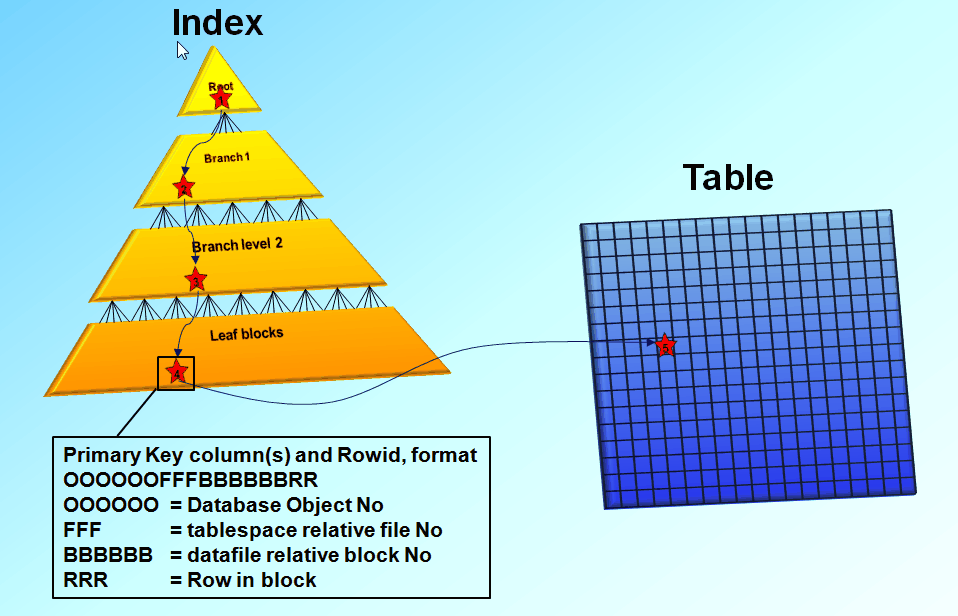

# Database Index

## DB Index란?

인덱스는 조회를 성능을 향상 시키기 위해 사용한다. 그러므로 update, insert에 대한 성능을 개선하기 위해 인덱스를 사용한다고 하면 잘못된 개선 방향이다.

### 어떻게 조회 성능을 향상 시키는가?

특정 테이블에 수십만개의 데이터가 저장되어 있을 경우를 가정해보자. 저장된 데이터에서 검색 조건으로 특정 ROW를 추출하는 기능이 있다. 인덱스를 지정해 놓지 않았다면 데이터베이스는 해당 테이블을 처음부터 끝까지 조회하면서 값을 반환하기 때문에 트래픽에 따라 성능이 저하될 수 밖에 없다. 이러한 이슈를 해결하고자 인덱스를 활용하여 자주 조회되는 Column에 대한 인덱스 테이블을 따로 만들어 해당 테이블로 조회할 수 있도록 최적화 하였다.

## INDEX 원리

### 인덱스는 구체적으로 어떻게 조회 조건을 개선 하였는가?

* 인덱스를 해당 컬럼에 추가한다.
* 초기 테이블 생성시 MYI 파일이 생성된다. \(인덱스를 주지 않아도 빈 파일을 생성함\)
  * 실제로는 3개의 파일이 생성된다.
    * .frm : 테이블 구조 저장
    * .myd : 실제 데이터 저장
    * .myi : index 정보 저장
* 생성된 파일에 해당 컬럼을 색인화 하여 저장하게 된다.
* 사용자가 인덱스를 조회 조건으로 사용할 경우, TREE로 정리된 MYI 파일의 내용을 검색한다. \(이진 검색 트리 사용\)
* 검색된 인덱스 값으로 원본 테이블에서 값을 조회한다.

## INDEX의 장/단점

### 인덱스를 사용하면 얻을 수 있는 장점은 무엇일까?

* 인덱스 필드를 사용하면 검색과 정렬 속도를 향상 시킬 수 있다.
* 테이블의 기본 키는 자동으로 인덱스로 적용된다.
* 테이블 조인에서도 인덱스된 필드를 사용하면 성능을 향상 시킬 수 있다.
* 그룹화 작업의 속도를 향상 시켜준다.

### 인덱스 사용시 단점은 없을까?

* 인덱스 테이블은 이진트리 검색을 사용하기 때문에 기본적으로 정렬되어 있기 때문에 인덱스 필드에 대한 삽입, 삭제, 수정이 빈번히 발생할 경우, 인덱스 테이블 또한 재 정렬이 필요하기 때문에 전체적인 성능 저하가 발생할 수 있다.
* 필드에 인덱스를 추가할 수록 인덱스 생성 파일의 크기가 커지기 때문에 데이터베이스에 추가적인 공간이 필요하다.
* 고유한 값이 아닌 필드를 인덱스 하게 되면 성능이 향상되지 않는다.
* 인덱스를 생성하는 데 상당한 시간이 소요된다.

### 그렇다면 복합 인덱스는 어느 경우에 사용하는게 좋을까?

* 복합 인덱스는 카디널리티\(집합이 가지는 원소의 갯수\)가 높은 순으로 지정해야 한다.
* **AND 연산자에 의해 자주 같이 질의 되는 컬럼들에서는 고려해볼만 하다**
* 첫번째 인덱스를 포함하지 않고 조건문에 다른 인덱스를 사용할 경우 인덱스 효과를 보지 못한다.
* 첫번째 인덱스가 조건문에 들어간다고 하더라도 중간 인덱스가 빠질 경우 100% 효율을 보진 못한다.

## INDEX 주의사항

* delete 할 경우, 데이터는 제거되었지만 인덱스는 지워지지 않고 표시만 되어 삭제되는 데이터가 증가할 수록 인덱스의 성능 향상이 저하된다.
* 갑자기 인덱스를 추가할 경우, 기존 쿼리에 옵티마지어가 실행계획을 바꾸는 경우가 생겨 갑자기 느려질 수 있다.
* `between`, `like`, `<`, `>` 등 범위 조건은 **해당 컬럼은 인덱스를 타지만, 그 뒤 인덱스 컬럼들은 인덱스가 사용되지 않습니다**.
  * 즉, `group_no, from_date, is_bonus`으로 인덱스가 잡혀있는데 조회 쿼리를 `where group_no=XX and is_bonus=YY and from_date > ZZ`등으로 잡으면 **is\_bonus는 인덱스가 사용되지 않습니다**.
  * 범위조건으로 사용하면 안된다고 기억하시면 좀 더 쉽습니다.
* 반대로 `=`, `in` 은 다음 컬럼도 인덱스를 사용합니다.
  * `in`은 결국 **`=`를 여러번 실행**시킨 것이기 때문입니다.
  * 단, `in`은 인자값으로 상수가 포함되면 문제 없지만, **서브쿼리를 넣게되면 성능상 이슈가 발생**합니다.
  * `in`의 인자로 **서브쿼리가 들어가면 서브쿼리의 외부가 먼저 실행**되고, `in` 은 체크조건으로 실행되기 때문입니다.
* `AND`연산자는 각 조건들이 읽어와야할 ROW수를 줄이는 역할을 하지만, **`or` 연산자는 비교해야할 ROW가 더 늘어나기 때문에 풀 테이블 스캔이 발생할 확률**이 높습니다.
  * `WHERE` 에서 `OR`을 사용할때는 주의가 필요합니다.
* 인덱스로 사용된 **컬럼값 그대로 사용해야만 인덱스가 사용**됩니다.
  * 인덱스는 가공된 데이터를 저장하고 있지 않습니다.
  * `where salary * 10 > 150000;`는 인덱스를 못타지만, `where salary > 150000 / 10;` 은 인덱스를 사용합니다.
  * 컬럼이 문자열인데 숫자로 조회하면 **타입이 달라 인덱스가 사용되지 않습니다**. 정확한 타입을 사용해야만 합니다.

## 참고

* [https://lalwr.blogspot.com/2016/02/db-index.html](https://lalwr.blogspot.com/2016/02/db-index.html)
* [https://itrainbowm.tistory.com/20](https://itrainbowm.tistory.com/20)
* [https://jeong-pro.tistory.com/114](https://jeong-pro.tistory.com/114)
* [https://real-dongsoo7.tistory.com/51](https://real-dongsoo7.tistory.com/51)
* [http://jinuine.blogspot.com/2014/02/db\_14.html](http://jinuine.blogspot.com/2014/02/db_14.html)

