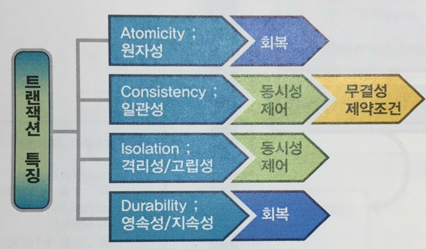

# Isolation level

 (1).png>)

## 트랜잭션이 보장해야 하는 ACID

### 원자성(Atomicity)

트랜잭션은 모두 실행되거나 아예 실행되어서는 안된다. 성공적인 트랜잭션은 commit 하고 실패한 트랜잭션은 rollback 한다.

### 일관성(Consistency)

트랜잭션이 실행을 성공적으로 완료하면 언제나 일관성 있는 데이터베이스 상태로 유지되어야 한다. 각 트랜잭션은 일관성을 보장하도록 프로그램을 작성해야 한다.

### 격리성/독립성(Isolation)

하나의 트랜잭션이 데이터를 갱신하는 동안 이 트랜잭션이 완료되기 전에 갱신중인 데이터에 다른 트랜잭션에 영향을 주지 않아야 한다.

### 지속성(Durability)

트랜잭션이 완료된 이후의 상태는 데이터베이스에 영구적으로 반영되어야 하며, 비록 시스템이 실패하여도 그 상태가 일관되게 유지되어야 한다.

## 격리성 관련 문제점

### Dirty Read

.png>)

한 트랜잭션(Transaction A)이 데이터에 접근하여 값을 'A'에서 'B'로 변경했고 아직 커밋을 하지 않았을때, 다른 트랜잭션(Transaction B)이 해당 데이타를 Read 하면?

Transaction B가 읽은 데이터는 B가 될 것이다. 하지만 Transaction A이 최종 커밋을 하지 않고 롤백하였다면 Transaction B는 무결성이 깨진 데이터를 사용할 것이다.

### Non-Repeatable Read

.png>)

한 트랜잭션(Transaction A)이 데이타를 **Read** 하고 있다. 이때 다른 트랜잭션(Transaction B)가 데이터에 접근하여 값을 변경 또는, 데이터를 삭제하고 커밋을 실행한다면?

그 후 Transaction A는 다시 해당 데이터를 Read하고자 하면 변경된 데이터 혹은 사라진 데이터를 찾게 된다.

### Phantom Read

트랜잭션(Transaction A) 중에 특정 조건으로 데이터를 검색하여 결과를 얻었다. 이때 다른 트랜잭션(Transaction B)가 접근해 해당 조건의 데이터 일부를 삭제 또는 추가했을때, 아직 끝나지 않은 Transaction A이 다시 한번 해당 조건으로 데이터를 조회 하면 Transaction B에서 추가/삭제된 데이터가 함께 조회/누락 된다.

## 트랜잭션 격리수준

#### (0) Read Uncommitted

#### 한 트랜잭션에서 커밋하지 않은 데이터에 다른 트랜잭션이 접근 가능하다. 즉, 커밋하지 않은 데이터를 읽을 수 있다.

> 이 수준은 당연히 위에서 언급한 모든 문제에 대해 발생가능성이 존재한다. 대신, 동시 처리 성능은 가장 높다.

* **발생 문제점 : Dirty Read, Non-Repeatable Read, Phantom Read**

#### (1) Read Committed

#### 커밋이 완료된 데이터만 읽을 수 있다.

> Dirty Read가 발생할 여지는 없으나, Read Uncommitted 수준보다 동시 처리 성능은 떨어진다.  대신 Non-Repeatable Read 및 Phantom Read는 발생 가능하다.데이타베이스들은 보통 Read Committed를 디폴트 수준으로 지정한다.

* **발생 문제점 : Non-Repeatable Read, Phantom Read**

#### (2) Repeatable Read

#### 트랜잭션 내에서 한번 조회한 데이터를 반복해서 조회해도 같은 데이터가 조회 된다

> 이는 개별 데이타 이슈인 Dirty Read나 Non-Repeatable Read는 발생하지 않지만, 결과 집합 자체가 달라지는 Phantom Read는 발생가능하다.

* **발생 문제점 : Phantom Read**

#### (4) Serializable

#### 가장 엄격한 격리 수준

**위 3가지 문제점을 모두 커버 가능**하다. 하지만 동시 처리 성능은 급격히 떨어질 수 있다.

## 참고

* [https://johngrib.github.io/wiki/ACID/](https://johngrib.github.io/wiki/ACID/)
* [https://dev-ahn.tistory.com/70](https://dev-ahn.tistory.com/70)
* [https://www.byteslounge.com/tutorials/spring-transaction-isolation-tutorial](https://www.byteslounge.com/tutorials/spring-transaction-isolation-tutorial)
* [https://feco.tistory.com/45](https://feco.tistory.com/45)
