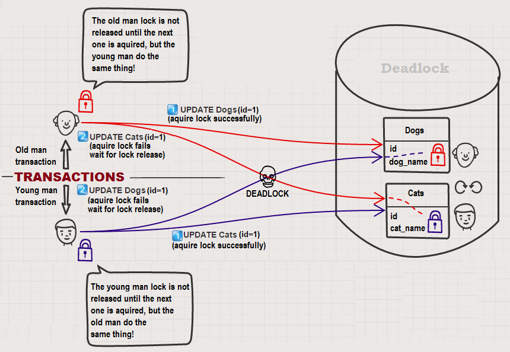

# DB 교착상태



## Lock 이란?

데이터베이스를 사용하면 멀티 트랜잭션 환경에서 일관성과 무결성을 유지하기 위한 고민을 한번 쯤을 해볼 때가 있다. 고민해보기 전에 일관성과 무결성의 개념을 살펴볼 필요가 있다.

### 일관성이란?

고립된 트랜잭션의 수행이 데이터베이스의 일관성을 보존해야 한다. 즉, 성공적으로 수행된 트랜잭션은 정당한 데이터들만을 데이터베이스에 반영해야 한다. 트랜잭션 수행이 보존해야 할 일관성은 기본 키, 외래 키 제약과 같은 명시적인 무결성 제약 조건들뿐만 아니라, 예를 들어 재고 관련 테이블의 재고는 0 이하는 저장되면 안된다. 라는 전제 조건도 만족 시키는 정당한 데이터들만 데이터에 반영해야 하는 비 명시적인 일관성 조건들도 있다.

### 무결성이란?

데이터의 정확성, 일관성, 유효성이 유지되는 것을 뜻한다. 즉 데이터를 정확하고 유효하게 유지하기 위해 데이터 변경 혹은 수정 시 여러 가지 제한을 두어 데이터의 정확성을 보증하게 한다. 제약 조건으로 인해 데이터를 보호하고 정상인 데이터를 유지할 수 있게 된다.

#### 그렇다면 정합성은?

데이터 정합성은 서로 모순이 없이 일관되게 일치하는 데이터를 말한다.

#### 무결성 제약 조건이란?

데이터베이스에 들어있는 데이터의 정확성(일관성)을 보장하기 위해 부정확한 자료가 데이터베이스 내에 저장되는 것을 방지하기 위한 제약 조건을 의미한다.

### 무결성 종류

#### 개체 무결성(entity)

* 기본키는 null 값이 될 수 없다.

#### 참조 무결성

* 외래키는 참조할 수 없는 값을 가질 수 없다.

#### 도메인 무결성

* 특정 속성의 값은 그 속성이 정의된 도메인에 속한 값 이어야 한다.
* 학년을 나타내는 필드가 있을 경우 그 학교는 1학년에서 3학년 까지만 있다고 하면 해당 필드의 값은 1\~3까지만 유효해야 한다는 조건이다.

#### 키 무결성

* 릴레이션에는 최소한 하나의 키가 존재해야 한다.

#### null 무결성

* 특정 속성값에 NULL 이 올 수 없다는 조건이 주어진 경우, 그 속성값은 NULL 값이 올 수 없다.

#### 고유 무결성

* 특정 속성에 대해 고유한 값을 가지도록 조건이 주어진 경우, 그 속성값은 모두 달라야 한다.

## Lock 종류

### Shared Lock(S)

여러 트랜잭션에서 데이터를 읽을 경우에만 가능하며 여러 트랜잭션에서 동시에 하나의 데이터를 읽을 수 있다. 트랜잭션간의 공유 락을 생성할 수 있다. 그러나 공유 락이 설정되어 있는 동안에는 다른 트랜잭션이 데이터를 변경할 수 없다. 즉, 공유 락은 다른 베타적 잠금을 허용하지 않으며 호환되지 않는다.

```
SELECT * FROM USER WHERE USERID = 1 LOCK IN SHARE MODE
```

### Exclusive Lock(X)

베타적 락은 동시에 여러 트랜잭션이 한 리소스에 엑세스할 수 없게 된다. 오직 하나의 트랜잭션만 해당 리소스를 점유할 수 있으며 수정이 가능하다.

수정 시에 베타적 락을 걸기 전 리소스를 읽기 위해 거는 락이다. 공유 락과 호환된다

그러나 exclusive Lock을 걸었다고 해서 Shared Lock이 아닌 Select 쿼리에서는 일반적으로 잠금하지 않는다

```
SELECT * FROM USER WHERE USERID = 1 FOR UPDATE
```

### Intent Lock

데이터베이스나 테이블 내의 일부 데이터 영역에 이미 공유잠금이나 배제잠금이

걸려 있다는 것을 다른 커넥션에게 알리기 위해서 사용한다.

### Schema Lock

테이블 스키마를 변경하는 작업 즉, DDL 문 실행 시에 스키마 자체에 대해서 락을 건다.

## 주의해야 할 점

### Lock은 잠금 비용과 동시성 비용을 고려해야한다.

* Lock을 걸어야 할 페이지가 많다. → 테이블 Lock이 잠금 비용이 낮아져 효율적이다.
* Lock의 범위가 크다 → 접근할 수 없는 자원이 많아지므로 동시성 비용이 높아져 효율이 떨어진다.

## 참고

* [https://d2.naver.com/helloworld/407507](https://d2.naver.com/helloworld/407507)
* [https://untitledtblog.tistory.com/123](https://untitledtblog.tistory.com/123)
* [https://joont92.github.io/db/데이터베이스-무결성-정합성/](https://joont92.github.io/db/%EB%8D%B0%EC%9D%B4%ED%84%B0%EB%B2%A0%EC%9D%B4%EC%8A%A4-%EB%AC%B4%EA%B2%B0%EC%84%B1-%EC%A0%95%ED%95%A9%EC%84%B1/)
* [https://omnic.tistory.com/9](https://omnic.tistory.com/9)
* [https://kosaf04pyh.tistory.com/202](https://kosaf04pyh.tistory.com/202)
* [https://dbaguru.tistory.com/432](https://dbaguru.tistory.com/432)
* [https://limkydev.tistory.com/161](https://limkydev.tistory.com/161)
* [https://battleracoon.tistory.com/2](https://battleracoon.tistory.com/2)
* [https://jeong-pro.tistory.com/94](https://jeong-pro.tistory.com/94)
* [https://joont92.github.io/db/락-lock/](https://joont92.github.io/db/%EB%9D%BD-lock/)
* [https://blog.appkr.dev/cheatsheet/understanding-mysql-db-lock/](https://blog.appkr.dev/cheatsheet/understanding-mysql-db-lock/)
* [https://suhwan.dev/2019/06/09/transaction-isolation-level-and-lock/](https://suhwan.dev/2019/06/09/transaction-isolation-level-and-lock/)
* [https://kuaaan.tistory.com/97](https://kuaaan.tistory.com/97)
* [https://allaboutmoon.tistory.com/221](https://allaboutmoon.tistory.com/221)
