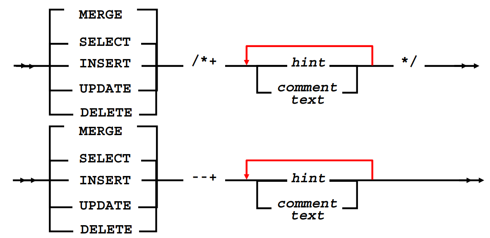

# SQL Hint

### SQL 힌트란?

힌트는 SQL 튜닝의 핵심 부분으로 일종의 지시 구문이며 SQL에 포함되어 쓰여져 Optimizer의 실행계획을 원하는 대로 바꿀수 있게 해준다. 디비의 Optimizer 라고 해서 항상 최선의 실행계획을 수립할 수는 없으므로 테이블이나 인덱스의 잘못된 실행 계획을 개발자가 직접 바꿀 수 있도록 도와주는 것이 HINT 이다.

### 힌트의 특징 네가지

* 실행 계획을 제어한다.
* 에러가 발생하지 않는다. \(힌트의 시작 `/*` 와 `*/` 은 문법에 맞게 작성되어야 한다.\)
* 선택 또는 취소 될 수 있다. \(힌트의 문법이 올바르더라도 힌트는 옵티마이저에 의해 버려질 수도 있고 선택되어질 수도 있다.\)
* 다양한 종류의 힌트가 있으며 버전업이 될때마다 계속 추가된다.

### 힌트의 종류 \(MYSQL 기준\)

* STRAIGHT\_JOIN : 여러 테이블 조인시 조인순서를 from의 순서대로 Access
* USE INDEX / FORCE INDEX / IGNORE INDEX : 인덱스 사용/강제/무시
* SQL\_CACHE / SQL\_NO\_CACHE : 조회된 결과를 재사용하기 위해 쿼리 캐시에 선택적으로 저장할 수 있다.
* SQL\_CALC\_FOUND\_ROWS : SQL\_CALC\_FOUND\_ROWS 힌트를 사용하는 경우 limit 절과는 상관없이 조건에 일치하는 모든 레코드를 검색해 결과 레코드가 몇 건이나 되는지 계산한다. 그렇지만 사용자 에게는 Limit 절에 제한된 건수 만큼만 레코드를 반환한다.
* FOUND\_ROWS : FOUND\_ROWS는 직전 쿼리에서 검색된 결과 row 수를 반환한다.

## 참고

* [https://ittutorial.org/optimizer-hints-and-how-to-use-hints-in-oracle-database-performance-tuning-tutorial-16/](https://ittutorial.org/optimizer-hints-and-how-to-use-hints-in-oracle-database-performance-tuning-tutorial-16/)
* [\[DB\] 힌트절\(HINT\)](https://nekomimi.tistory.com/621)
* [\[Oracle\] hint](https://bonoken.tistory.com/458)
* [mysql 쿼리의 hint 옵션](http://jinolog.com/programming/mysql/2011/07/04/mysql-hint-option.html)
* [SQL HINT 를 이용하여 SQL Tunning 을 하는 방법](https://otsteam.tistory.com/138)
* [\[SQL 튜닝\] 오라클 힌트\(hint\)의 개념/ 사용법/자주쓰이는힌트 정리](https://devuna.tistory.com/35)
* [오라클 힌트 꼭 써야 하나?\(why using hint?\)](http://ojc.asia/bbs/board.php?bo_table=LecHINT&wr_id=219)
* [\[MySQL\] 힌트설정 / 쿼리캐시](http://blog.naver.com/PostView.nhn?blogId=k65fac&logNo=220834114756&parentCategoryNo=&categoryNo=1&viewDate=&isShowPopularPosts=true&from=search)

