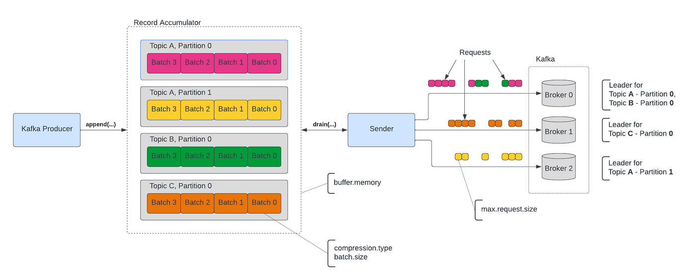

# 카프카 찍먹하기 2부 (feat. 프로듀서)

<figure><figcaption><p>https://miro.medium.com/v2/resize:fit:1400/1*XyMh397k09YvNTB_RZJfaQ.png</p></figcaption></figure>


## 프로듀서에서 하는 역할은 무엇인가?

1. 메시지를 Serialize 한다
2. 전송할 메시지의 파티션 위치를 결정한다
3. 메시지를 배치 단위로 수집한다
4. 배치 단위의 메시지를 브로커에 전송한다


### Sender의 역할

* 메시지를 배치로 모으거나 브로커에 전송하는 로직은 별도 쓰레드로 동작하기 때문에 동시에 수행한다
* 메시지를 배치 단위로 모으는 기준은 크게 두가지로 구분할 수 있다
  * batch.size : 배치크기, 설정한 배치크기를 충족하면 바로 전송(기본값 : 16384KB)
  * [linger.ms](http://linger.ms) : 전송대기 시간
    * 기본값은 0으로 send() 수행 즉시, 바로 호출된다
    * 대기시간이 없으면 배치를 바로 전송한다
    * 대기 시간을 주면 그만큼 기다렸다가 배치 사이즈만큼 쌓였을 경우에 전송한다
* send() 메서드는 기본적으로 비동기 방식이다. 그래서 만약 동기 방식으로 호출하려면 Future 객체의 get() 메서드를 호출해야 하며, get() 메서드는 즉시 전송되는 방식이라 배치 단위로 메시지를 전송할 수 없다


## 메시지 발송시 고려해야할 사항

### 예외 처리

* 프로듀서에서 메시지 발송시, 예외처리 할 수 있는 방법은 두 가지이다

#### get() 호출

*   get() 메서드를 이용해서 결과를 확인하고 실패시 예외처리를 할수 있다. 단, 이는 블로킹 방식으로 건별로 발송하므로 높은 처리량이 필요한 로직에서는 사용하기 힘들다

    ```java
    try {
        SendResult<String, Object> response = send.get();
    } catch (ExecutionException e) {
        log.error("실패 시 예외 처리 필요!!!", e);
        throw new RuntimeException(e);
    }
    ```

#### callback 메서드 정의

*   callback 객체를 통해서 결과를 확인할 수 있다

    ```java
    ListenableFuture<SendResult<String, Object>> result = multiTypeKafkaTemplate.send(record);

    result.addCallback(new ListenableFutureCallback<>() {
        @Override
        public void onSuccess(SendResult<String, Object> result) {
            log.info("성공!! {} ", result.getRecordMetadata().offset());
        }
        @Override
        public void onFailure(Throwable ex) {
            log.error("실패 시 예외 처리 필요!!!", ex);
        }
    });
    ```


## 프로듀서의 전달 완료 기준은 어떻게 되지?

* 프로듀서는 설정에 따라 전송이 완료되었다는 기준의 범위가 다양하다
* 설정은 ack 값에 따라서 달라질 수 있다
* `ack = 0` : 서버 전송을 보장하지 않는다(기본값)
* `ack = 1` : 리더에 저장되면 응답 받는다고 간주한다(리더가 장애나면 팔로워에 저장되지 않았으니 유실 가능성 있음)
* `ack = -1/all` : 리더 + 팔로워 모두 받았을때 확인
  * `min.insync.replies` : ack가 all 일때 성공했다고 응답할 수 있는 동기화된 리플리카 최소 갯수를 지정할 수 있다. (리더 포함 갯수이다)
  * min.insync.replies 설정시 주의해야 할 점은 리더 + 팔로워 갯수 합계를 설정하게 되면 팔로워중 하나만 장애가 발생해도 응답을 받지 못했다고 간주하게 되어 장애가 발생할 수 있다. (그러므로 전체 갯수에서 -2,-3 정도로 여유롭게 설정하는게 카프카를 안전하게 운영할 수 있다)


**카프카 3.0이후부터는 ack = all이 기본값이다**


이론상으론 ack = all일 경우에는 팔로워 브로커들이 메시지를 저장했는지 확인하기 때문에 지양하였지만, `max.in.flight.requests.per.connection` 값을 3이상으로 설정하면 하나의 커넥션에 더 많은 메시지를 전송할 수 있으므로 여러 메시지에 대해서 브로커의 응답을 받을 수 있으니 성능상 크게 차이가 없다는 결과를 도출하였다고 한다. 그런데 `max.in.flight.requests.per.connection` 값을 1보다 큰 값으로 할 경우, 메시지 전송 실패시 순서가 변경될수도 있으니 주의해야 할 필요가 있다.

참고 : [https://blog.voidmainvoid.net/507](https://blog.voidmainvoid.net/507)



## 프로듀서 에러유형

* 프로듀서에서 발생할 수 있는 에러유형은 시점에 따라 크게 두가지로 구분할 수 있다

### 전송 과정 실패

* 브로커에 전송 타임 아웃시간이 만료되었을 때 → 재시도 호출하게 됨
  * enable.idempotence를 중복 전송될 가능성을 줄일 수 있다
  * max.in.flight.requests.per.connection
    * 한 커넥션에서 전송할 수 있는 최대 전송중인 요청 개수이다
    * 1로 설정하면 실패시 재시도해도 순서가 보장된다


**enable.idempotence은 무슨 속성일까?**


브로커로 전달할 때 PID와 시퀀스 넘버를 함께 전달해서 재전송시에도 브로커는 PID와 시퀀스 넘버를 확인하여 동일한 메시지로 인지하여 중복으로 메시지를 소비하지 않도록 예방할 수 있다


* 리더 브로커가 다운되었을 때 → 팔로워가 승격되는 과정을 거침(순단 발생)
  * 내부적으로 재시도를 시도한다

#### 프로듀서 설정

* retries : 메시지를 재시도하는 횟수(기본값 MAX\_INT)
* [retry.backoff.ms](http://retry.backoff.ms) : 재시도 사이에 대기하는 시간(기본값 : 100)
* [request.timeout.ms](http://request.timeout.ms) : 브로커의 응답을 기다리는 최대 시간(기본값 : 30초)
* [delivery.timeout.ms](http://delivery.timeout.ms) : send 이후에 성공 또는 실패를 보고하는 시간(기본값 : 2분)


#### 브로커 설정 메시지 크기 한도 초과

* 프로듀서 및 브로커 설정을 수정해서 해결할 수 있다

#### 프로듀서 설정

* max.request.size : 프로듀서가 브로커에 요청할 때 보낼 수 있는 최대 크기(기본값 1MB)
* buffer.memory : 프로듀서가 버퍼에 사용할 총메모리의 양(기본값 32MB)
* [request.timeout.ms](http://request.timeout.ms) : 프로듀서가 요청 후 브로커의 응답을 대기하는 최대 시간(기본값 30초)

#### 브로커 설정

* message.max.bytes : 레코드 배치 최대 사이즈(기본값 1MB)
* fetch.max.bytes : fetch 요청에 따라 반환할 최대 바이트 수(기본값 55MB)
* log.segment.bytes : 각 세그먼트 파일의 크기(기본값 1GB)
* [request.timeout.ms](http://request.timeout.ms) : 요청하고 응답까지 대기하는 최대 시간(기본값 30초)
* replica.fetch.max.bytes : 복제 과정에서 fetch 시도할 수 있는 최대 바이트 수(기본값 1MB)
* replica.fetch.response.max.bytes : 전체 fetch 응답의 최대 바이트 수(기본값 10MB)


### 전송 전 실패

* 직렬화 과정에서 실패하였을 때
  * try/catch로 예외처리 한다
* 프로듀서 버퍼가 차서 기다린 시간이 최대 대기 시간 초과되었을 때
  * [delivery.timeout.ms](http://delivery.timeout.ms) : send() 메서드를 호출하고 응답을 대기하는 시간으로 request.timeout.ms와 linger.ms의 합보다 같거나 커야 한다


## 참고

* [https://youtu.be/geMtm17ofPY?si=XMxf6gZEFTS3Phrr](https://youtu.be/geMtm17ofPY?si=XMxf6gZEFTS3Phrr)
* [https://always-kimkim.tistory.com/entry/kafka-operations-settings-concerned-when-the-message-has-more-than-1-mb](https://always-kimkim.tistory.com/entry/kafka-operations-settings-concerned-when-the-message-has-more-than-1-mb)
* [https://soft.plusblog.co.kr/14](https://soft.plusblog.co.kr/14)
* [https://blog.voidmainvoid.net/507](https://blog.voidmainvoid.net/507)
* [https://magpienote.tistory.com/251](https://magpienote.tistory.com/251)
