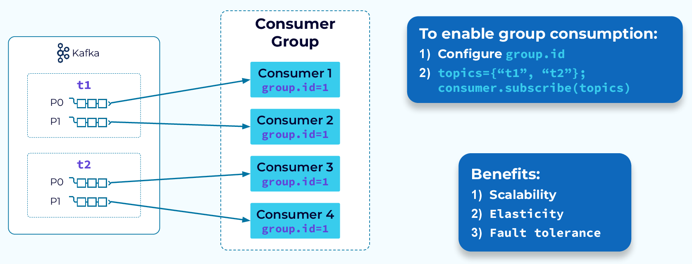

# 카프카 찍먹하기 3부 (feat. 컨슈머)

<figure><figcaption>
https://images.ctfassets.net/gt6dp23g0g38/4YKWvDvHoX9Y4NzdPQZvo5/f1f3811e4e6098a45ba702fed62b6735/Kafka_Internals_064.png
</figcaption></figure>

## 컨슈머의 역할

* 컨슈머는 파티션 리더에서 메시지를 가져와 소비한다
* 컨슈머에서 메시지를 가져오는 기준은 다양하다
* 특정 파티션을 지정할수도 있고 오프셋을 지정해서 가져올 수도 있다

## 토픽과 파티션

* 토픽의 파티션은 컨슈머 그룹 단위로 할당된다
* 컨슈머 그룹이 다를 경우 동일한 토픽의 파티션의 메시지를 소비할 수 있다

### 파티션 vs 컨슈머

#### 컨슈머가 파티션보다 많을 경우

* 하나의 파티션은 각기 다른 하나의 컨슈머에 연결된다
* 그러므로 4개의 파티션과 5개의 컨슈머가 있을 경우, 1개의 컨슈머는 사용하지 않는다

#### 컨슈머가 파티션보다 적을 경우

* 파티션에 할당된 메시지를 소비해야 하기 때문에 하나의 컨슈머가 2개 이상의 파티션을 소비하게 된다
* 생상되는 속도가 소비되는 속도에 비해 빠를경우에는 랙(Lag)이 커지게 되며, 이는 성능저하로 이어지게 된다

## 컨슈머가 메시지를 가져오는 기준은?

* 만약 해당 토픽에 컨슈머가 소비한 오프셋이 존재하지 않을 경우에는 메시지를 읽어들일 기준을 정해야 한다
* 이는 `auto.offset.reset` 옵션으로 설정할 수 있다
  * earliest : 가장 처음 오프셋 부터 읽는다
  * latest : 커밋되지 않은 가장 마지막 오프셋 이후 부터 읽음 (기본값)

## 컨슈머 커밋 기준은 어떻게 될까?

* 커밋 유형은 크게 두 가지로 분류할 수 있다
* enable.auto.commit
  * 커밋을 어떻게 할지 설정한다(기본값은 true)
  * true일 경우 일정 주기로 컨슈머가 읽은 오프셋을 커밋한다

### 자동 커밋

* 만약 enable.auto.commit이 true라고 한다면 자동 커밋 주기를 설정해야 한다
* [auto.commit.interval.ms](http://auto.commit.interval.ms) : 자동 커밋 주기
  * 기본값은 5초이다

### 수동 커밋

* 컨슈머의 ackMode에 따라서 수동 커밋하는 방법은 다르다 (기본값 : BATCH)
* ackMode가 `MANUAL`이거나 `MANUAL_IMMEDIATE`일 경우엔, `AcknowledgingMessageListener` 또는 `BatchAcknowledgingMessageListener` 인터페이스를 구현해서 수동으로 커밋을 해주어야 한다
* 그외 모드에서는 메시지를 소비하고 특정 기준에 따라 커밋이 이루어지게 된다

#### AckMode 종류

* RECORD : 레코드 단위로 프로세싱 이후 커밋
* BATCH : poll() 메서드로 호출된 레코드가 모두 처리된 이후 커밋
* TIME : 설정된 AckTime 이후에 커밋
* COUNT : 특정 개수만큼 레코드가 처리된 이후 커밋
* COUNT\_TIME : TIME, COUNT 옵션 중 맞는 조건이 하나라도 나올 경우 커밋
* MANUAL : AcknowledgingMessageListener 또는 BatchAcknowledgingMessageListener를 리스너를 사용해서 커밋 메서드를 수행할 경우, 다음 메시지를 poll할 경우에 이전에 poll 한 메시지의 오프셋까지 커밋된다
* MANUAL\_IMMEDIATE : AcknowledgingMessageListener 또는 BatchAcknowledgingMessageListener를 리스너를 사용해서 커밋 메서드를 수행할 경우, 즉시 읽은 오프셋까지 커밋된다

## 컨슈머 조회에 영향을 주는 주요 설정

* `fetch.min.bytes` : 조회시 브로커가 전송할 최소 데이터 크기를 지정한다 (기본값 : 1)
  * 최소 데이터 크기가 클수록 대기 시간은 늘지만 처리량은 증가한다
* [`fetch.max.wait.ms`](http://fetch.max.wait.ms) : 데이터가 최소 크기를 충족할 때까지 대기하는 시간 (기본값 : 500)
* `max.partition.fetch.bytes` : 파티션 당 서버가 리턴할 수 있는 최대 크기 (기본값 : 1MB)

## 중복 메시지를 소비하는 경우

### 어떤 경우에 중복 메시지가 소비하게 될까?

*   컨슈머가 메시지를 소비해야 하는 최대 시간(`max.poll.interval.ms`)을 초과할 경우에 발생

    → 이는 여러가지 해결 방법이 있을 수 있다

    1. 우선은 소비해야 하는 최대 시간을 증가시킬 수 있다
    2. 소비해야하는 레코드 사이즈를 줄일수 있다 → `max.poll.records`
    3. 파티션과 컨슈머를 증가시켜 가용성을 증가시킬 수 있다
*   수동커밋의 경우에 구현 로직에도 커밋이 누락될 경우에도 발생

    → 구현상 오류로 로직 수정이 필요하다
*   자동커밋의 경우에도 파티션이나 컨슈머가 증가하면서 리밸런싱되는 경우에도 발생

    → 이는 수동커밋으로 전환해야 하며, 운영 환경에서는 수동커밋을 권장한다

## 컨슈머의 상태는 어떻게 확인하지?

* 컨슈머는 일정시간 동안 heartbeat를 전송해서 유지한다
* 일정 시간 heartbeat가 없으면 컨슈머를 그룹에서 제외하고 리밸런스 진행하게 된다

### 그럼 heartbeat를 주기는 어떻게 정하는건가?

* heartbeat 주기를 정할 수도 있고, 실제로 컨슈머가 다운되었다고 간주되는 기준도 정할 수 있다
* [session.timeout.ms](http://session.timeout.ms) : 세션 타임 아웃 시간으로 해당 시간까지 heartbeat가 없으면 컨슈머가 다운되었다고 간주한다 (기본값 10초)
* [heartbeat.interval.ms](http://heartbeat.interval.ms) : heartbeat 전송 주기(기본값 3초)
  * session.timeout.ms의 1/3 이하를 추천한다

### 컨슈머의 메시지 소비 기준은 어떻게 되나?

* 몇 가지 설정을 통해서 소비되는 성능을 설정할 수 있다
* `max.poll.interval.ms` : poll() 메서드의 최대 호출 간격
  * 해당 시간이 지나도록 다음 poll()하지 않으면 컨슈머를 그룹에서 제외하고 리밸런스 진행
  * 실제로 컨슈머가 정상적인 상태가 아닐지도 모르니, HeartBeat 쓰레드가 현재 시간과 마지막으로 poll 메서드가 호출된 시간의 차이를 계산하여 해당 시간의 차가 [max.poll.interval.ms](http://max.poll.interval.ms) 보다 큰 경우 컨슈머 그룹에서 탈퇴 시킨다
* `max.poll.records` : poll() 메서드의 최대 사이즈
  * 만약 소비할 메시지 사이즈가 커져 max.poll.interval.ms를 초과할 경우, max.poll.records 사이즈를 축소하여 리밸런싱 되지 않도록 해야 한다
  * max.poll.records 사이즈를 줄일수록 처리할 수 있는 데이터는 적겠지만, 수행시간은 빠르다

\<aside> 💡 MANUAL\_IMMEDIATE, MANUAL 차이는 무엇인가??

* 우선 둘다 수동으로 커밋하는 방식이다
* 차이는 MANUAL의 경우에는 우선 메시지를 폴링하고 커밋을 한 이후에 다음 폴링을 하게되면 이전에 폴링한 오프셋까지 커밋이 된다. 그러므로 BATCH와 로직은 동일하다
* MANUAL\_IMMEDIATE 은 다음 폴링까지 확인하지 않고 현재까지 폴링한 오프셋까지 바로 커밋된다 \</aside>

## 그럼 정리를 해보자

### 메시지 랙(Lack)이 증가한다면?

* 생성되는 비율보다 소비되는 비율이 낮기 때문에, 소비되는 가용성을 증가시켜 주어야 한다
* 파티션을 증가시키고 컨슈머를 추가해주어야 한다

### 메시지 토픽에 새로운 기능을 추가하고 싶다면?

* 컨슈머 그룹을 새로 추가하면 된다
* 서로 다른 컨슈머는 같은 토픽의 메시지를 동시에 소비할 수 있다

### 커밋은 어떻게 하면 좋을까?

* 운영환경에서는 수동 커밋을 권장한다
* AckMode에 따라서 직접 커밋을 해주어야 할 경우도 있고, 메시지를 소비되면서 커밋이 될수 있다
* 그래도 장애를 최대한 줄일수 있는 방법은 AckMode를 MANUAL러 설정하는 것을 권장한다

### 정상적으로 운영중에 컨슈머가 정상적으로 소비하지 못할 경우

* 컨슈머가 소비할 수 있는 메시지량(`max.poll.records`)보다 소비할 수 있는 최대 시간(`max.poll.interval.ms`)이 적게 설정되어 있을 경우에 컨슈머가 장애가 있다고 판단하고 리밸런싱 되는 경우가 발생할 수 있다
* 이때는 소비되는 최대 시간을 증가시켜 임시로 해소할 수 있고, 메시지량을 줄여서 소비량을 개선할 수 있다
* 그러나 이 해결방법은 임시적인 해결방법이며, 파티션을 증가시키고 컨슈머를 추가하여 소비되는 가용성을 확장해볼 필요가 있다

## 참고

* [https://docs.spring.io/spring-kafka/reference/html/#committing-offsets](https://docs.spring.io/spring-kafka/reference/html/#committing-offsets)
* [https://d2.naver.com/helloworld/0974525](https://d2.naver.com/helloworld/0974525)
* [https://hanseom.tistory.com/174](https://hanseom.tistory.com/174)
