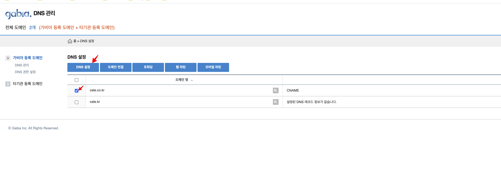

# AWS EC2 도메인 설정 (with ALB)

#### 이번엔 웹 서버 없이 서비스 운영하는 방법에 대해서 알아보려고 한다

## 🤔 왜 웹 서버를 구축하지 않았나??

* 처음엔 웹 서버를 구축하려고 했었다
* 그러나 스타트업 특성상 빠르게 결과물을 확인해야 하는 상황에서 웹 서버를 구축하고 설정하는 부분에 소비할 인력이나 시간이 주어지지 않았다..(다른 우선 순위 높은 백로그를 처리하다보니 자연스럽게 밀리게 되었다..ㅜㅜ)
* 애플리케이션 자체는 무조건 구현이 필요한 부분이고… 최대한 실무자들이 애플레이션 구현에 집중할 수 있는 환경을 만들어 주는게 우선이었다…(나 또한 백엔드쪽 구현이 시급한 상황이었다… 🥹)
* 그래서 초기엔 웹 서버를 별도로 구축하지 않고 애플리케이션을 EC2에 배포하면 도메인 서버와 직접적으로 연결하는 방법을 찾아보게 되었다
* 그래서 선택한게 `ALB`였다
* `NLB`를 선택할 수도 있었지만 추후에 HTTPS 셋팅을 하기 위해서는 ALB가 좀더 간단하게 셋팅할 수 있을것이라 판단하여 ALB를 선택하게 되었다
* 아키텍처는 간단했다
  1. 도메인 서버에서 구매한 도메인을 통해서 ALB로 연결한다
  2. ALB는 연결된 타겟으로 요청을 전송하고 결과를 리턴한다

<figure><figcaption></figcaption></figure>

## 🛣 로드 밸런서


로드 밸런서 생성은 사전 작업이 수행되었다는 전제하에 가이드 한 내용입니다. 사전작업 - EC2 인스턴스 생성 - 생성된 인스턴스 내에서 특정 PORT로 애플리케이션 운영된 상태


### 로드 밸런서 대상 그룹 생성

1. ‘대상 그룹 생성’ 버튼을 클릭합니다

<figure><figcaption></figcaption></figure>

2. ‘기본 구성 정보’를 입력합니다
   1. 대상 유형 : 인스턴스
   2. 대상 그룹 이름 : 임의로 설정(단, 규칙이 있으면 찾기가 쉬움) TARGET-{ENV}-{NAME} (ex. TARGET-DEV-EXTERNAL-API, TARGET-[I](https://ap-northeast-2.console.aws.amazon.com/ec2/v2/home?region=ap-northeast-2#TargetGroup:targetGroupArn=arn:aws:elasticloadbalancing:ap-northeast-2:705835654601:targetgroup/TARGET-INFRA-JENKINS/ac4da690f08364df)NFRA-JENKINS)
   3. 프로토콜 : 8080 (인스턴스 내에서 운영중인 실행 PORT 입력)
   4. VPC : 인스턴스가 존재하는 VPC

<figure><figcaption></figcaption></figure>

3. 대상 등록
   1. 인스턴스 선택
   2. ‘아래에 보류 중인 것으로 포함’ 선택
   3. ‘대상 보기’ 목록에 선택 확인
   4. ‘대상 그룹 생성’ 선택

<figure><figcaption></figcaption></figure>


💡 대상 설정시 PORT의 HEALTH 체크가 통과해야 타겟으로 통과된다. 만약 로그인 처리나 redirect되는 경우가 있다면 해당 PORT를 호출했을때 200 status code가 리턴되도록 별도 조치할 필요가 있다


### 로드 밸런서 생성

1. ‘로드 밸런서 생성’ 선택

<figure><figcaption></figcaption></figure>

2. ‘로드 밸런서 유형 선택’

<figure><figcaption></figcaption></figure>

3. 로드 밸런서 정보 입력
   1. 로드 밸런서 이름 작성
   2. 네트워크 매핑
      1. 해당하는 VPC의 서브넷으로 최소 2개이상 설정
   3. 리스너 PORT 설정
      1.  도메인 기반으로 접근하기 때문에 HTTP 기본 포트인 80으로 사용한다


          <figure><figcaption></figcaption></figure>

          <figure><figcaption></figcaption></figure>


보안그룹에 디폴트값을 그대로 사용하였는데 현재는 80으로 INBOUND 규칙을 허용해서 이슈가 없지만 새로운 VPC나 새로운 보안그룹을 지정한다면 80 인바운드 보안 규칙을 추가하도록 해야 한다


## 🧙도메인

### 서브 도메인 설정

1. ALB 퍼블릭 도메인 확인

<figure><figcaption></figcaption></figure>

2.  가비아 도메인 설정(

    1. \[My 가비아] → DNS 관리 → DNS 관리툴 선택)
    2. DNS 선택 → DNS 설정 선택

    <figure><figcaption></figcaption></figure>
3.  DNS 설정 페이지 접근( DNS 선택 → DNS 설정 선택 )

    1. 레코드 추가
       1. 타입 선택 : CNAME
          1. 호스트 : 서브 도메인 이름 작성
          2. 값/위치 : ALB 도메인 붙여넣기
    2. ‘확인’ 버튼 선택하여 임시 저장
    3. ‘저장’ 버튼 선택하여 영구 저장

    <figure><figcaption></figcaption></figure>

## 🙂 설정 확인

<figure><figcaption></figcaption></figure>

## ⚠️ 주의사항

```jsx
- EC2에만 보안그룹설정하여 로드밸런서의 보안그룹 설정이 되어 있지 않아서 간혹 통신이 막혀있는 경우가 많다.
- 로드밸런서의 ACL 보안그룹도 꼭 같이 확인하자
```

## 참고

* [https://no-easy-dev.tistory.com/entry/AWS-ALB와-NLB-차이점](https://no-easy-dev.tistory.com/entry/AWS-ALB%EC%99%80-NLB-%EC%B0%A8%EC%9D%B4%EC%A0%90)
