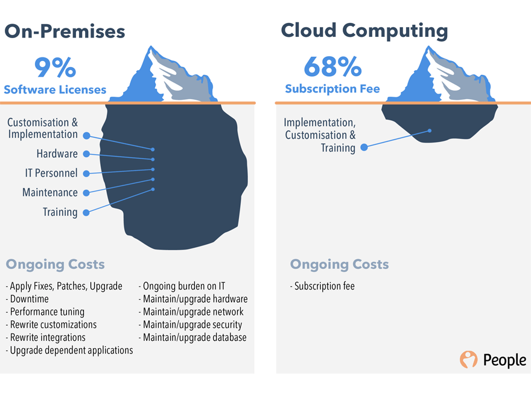

# CLOUD COMPUTING

## 클라우드 컴퓨팅이란?

클라우드 컴퓨팅 또는 클라우드 서비스란, 인터넷에 연결된 가상화 된 공간에서 네트워크 또는 컴퓨팅 자원을 즉시 필요한 만큼 사용할 수 있는 서비스 형태의 IT 인프라스트럭처를 의미한다.

### 온 프레미스 환경이란?

데이터센터나 서버 룸과 같은 특정 공간에 IT 인프라를 구축하여 소프트웨어를 사용하는 방식으로, 인프라를 구축하기 위한 시간도 수개월 이상 걸리며 초기도입 비용, 운영 및 관리를 위한 유지보수 등 비용이 많이 드는 단점이 있다.

### 왜 클라우드 컴퓨팅이 필요하게 되었을까?

* IT 인프라가 점차 복잡해지면서 기업이 관리해야 하는 네트워크 트래픽은 크게 급증하게 되었다.
* 환경이 복잡하고 지능화되면서 IT인프라 관리는 점차 어려워지고, 비용은 지속적으로 늘어나는 비효율적인 환경이 반복 되었다.
* 증가된 네트워크 트래픽을 감당하면서 그에 대한 모니터링과 이를 분석할 관리 솔루션에 대한 지속적인 투자가 필요해지는 상황이다.
* 기존의 온프레미스(On-premise) 기업들로서는 이러한 복잡성과 비용의 증가는 부담이 되었다.

### 그럼에도 클라우드 컴퓨팅을 사용하지 않는 이유는 무엇일까?

> 다음의 의견은 블로그를 참조한 개인적인 견해이다.

* 기업의 모든 리소스를 외부 클라우드에서 관리되면서 내부 기밀이 외부로 노출된다는 불편한 시선이 있을 수 있다. (이는 프라이빗 클라우드로 해결할 수 있다.)
* 클라우드 서비스 자체에 대한 불신이 있을 수 있다.
* 클라우드 환경 또한 운영에 필요한 다양한 설정이 필요한데, 이 또한 새로운 기술 습득에 대한 부담이 될 수 있다.
* 기존의 온프레미스 환경을 클라우드 환경으로 이전하는 기술적인 부담감이 있다.


**프라이빗 클라우드란?**\
\
프라이빗 클라우드는 단일 비즈니스 또는 조직에서 독점적으로 사용되는 클라우드 컴퓨팅 리소스를 의미한다. 프라이빗 클라우드는 회사의 실제 온사이트 데이터 센터 내에 배치할 수 있게 된다. 일부 회사에서는 해당 프라이빗 클라우드를 호스트하기 위해 타사 서비스 공급자에 비용을 지급하기도 한다. 프라이빗 클라우드는 서비스와 인프라가 개인 네트워크에서 유지 관리되는 클라우드라고 생각하면 된다. 프라이빗 클라우드는 최고 수준의 보안이 적용된 클라우드 솔루션이지만 일부 기업에서는 비용이 부담스러울 수도 있다.


### 클라우드 컴퓨팅 장점

* 시스템 엔지니어의 업무가 온프레미스 환경에 비해 감소되었다.
* 시스템 설계시 초기에 오버 스펙으로 구성할 필요가 없고 트래픽에 따라 스케일 인/아웃이 가능하다.
* 서버 구축에 필요한 물리적인 시간 소비를 기다리지 않아도 된다.
* 다양한 요구사항에 따른 인프라 구축 비용을 감소할 수 있고, 비즈니스에 집중할 수 있다.
* 클라우드 환경은 대부분 국가에 종속적이지 않고 각 국에 분포되어 있기 때문에 글로벌 서비스 운영시 전 세계에 배포할 수 있다.

### 클라우드 컴퓨팅 단점

* 트래픽에 따라 사용한 만큼 비용을 지불하다 보니 초기엔 효율적일 수 있지만 사용량이 많아지고 사용하는 서비스들이 다양해지면 온프레미스 환경보다 비용이 저렴하지 않을 수 있다.
* 클라우드 환경 운영에 대한 기술적인 숙련도가 부족한 인력은 부담이 될 수 있다.
* 보안적인 이슈로 민감 데이터는 클라우드 환경에 저장하려 하지 않는다. (이 부분은 개선될 것으로 보인다)
* 서비스에 맞지 않는 클라우드 환경에 종속적인 인프라 설계가 필요할 수 있다.

## 클라우드 서비스 종류

### Iaas

일반적으로 네트워킹 기능, 컴퓨터(가상 또는 전용 하드웨어) 및 데이터 스토리지 공간에 대한 액세스를 제공한다. IaaS는 IT 리소스에 대한 최고 수준의 유연성과 관리 제어 기능을 제공해야 한다. IaaS를 통해 소프트웨어 라이선스와 서버 등 IT자산을 직접 소유하는 대신 필요에 따라 이들 리소스를 유연하게 대여할 수 있다.&#x20;

#### IaaS 대표적인 서비스

* AWS EC2
* Azure
* IBM Cloud


**NAVER CLOUD PLATFORM에선 제공하는 기능은?**

* VM Server
* GPU Server
* Block Storage
* Object Storage
* Load Balancer


### Paas

PaaS를 사용하면 기본 인프라(일반적으로 하드웨어와 운영 체제)를 관리할 필요가 없어 애플리케이션 개발과 관리에 집중할 수 있게 된다. 즉, 애플리케이션 실행과 관련된 리소스 구매, 용량 계획, 소프트웨어 유지 관리, 패치 작업 또는 다른 모든 획일적인 작업에 대한 부담 없이 더욱 효율적으로 운영할 수 있다.

#### Paas 대표적인 서비스

* GitLab
* GitHub


**NAVER CLOUD PLATFORM에선 제공하는 기능은?**

* MySQL
* Redis
* Cloud Log Analytics
* ELSA
* Image Optimizer


### Saas

SaaS는 서비스 공급자에 의해 실행되고 관리되는 완전한 제품을 일컫는다. 가장 포괄적인 형식의 클라우드 컴퓨팅 서비스로, 모든 애플리케이션은 제공업체가 관리하며 웹 브라우저를 통해 제공된다. 사용자 혹은 시트를 기준으로 구독 방식으로 과금되는 것이 보통이다. SaaS는 머신 혹은 서버를 기준으로 소프트웨어 라이센스를 구매해 직접 설치해 사용하던 기존 구매 방식과 차별화된다. &#x20;

#### Saas 대표적인 서비스

* Dropbox
* Google Apps
* Office 365


**NAVER CLOUD PLATFORM에선 제공하는 기능은?**

* Chatbot
* Papago NMT
* Jenkins
* MAPS
* SENS



**Faas와 Caas는 무엇인가?**\
\
CaaS(Container as a Service) 컨테이너 플랫폼은 IaaS의 최신 구현 방식이다. CaaS 업체는 완전한 서버 호스트를 제공하는 대신 기업이컨테이너 내에서 서비스나 애플리케이션을 호스팅할 수 있도록 해주고, 컨테이너를 대신 관리한다. 컨테이너는 가상머신보다 기반 호스트 자원을 더 효율적으로 활용할 수 있다. 대표적인 서비스로 Docker 기반 서비스가 있다.

FaaS(Function as a Service) FaaS를 사용하면 확장, 서버 또는 컨테이너에 대한 생각 없이 코드를 업로드하고 실행할 수 있다. 그런 점에서 FaaS는 기존 계층화 아키텍처의 사용 편의성 기준을 능가한다. 대표적인 예로 aws Lambda가 있을 수 있다.


### 클라우드 컴퓨팅 동향

* 클라우드 시장 규모는 가파른 상승세를 이어가고 있다.
* 클라우드 시장에서 가장 큰 비중을 차지하는 것은 SaaS이다.
* 하지만 상승세 기준으로 보면 IaaS가 가장 큰 비율을 차지하고 있다.
* 글로벌 IT 자문기관 가트너에서 글로벌 기업의 30% 이상이 클라우드에 대한 투자를 3대 투자 우선순위로 간주하고 있어 시장 상품에 영향을 미칠것으로 예상했다.

## 참고

* [https://ryufree.tistory.com/175](https://ryufree.tistory.com/175)
* [https://blog.naver.com/gunghab01/220961865562](https://blog.naver.com/gunghab01/220961865562)
* [https://www.stevenjlee.net/2020/06/10/이해하기-클라우드-컴퓨팅-cloud-computing-클라우드-서비스-cloud-servi/](https://www.stevenjlee.net/2020/06/10/%EC%9D%B4%ED%95%B4%ED%95%98%EA%B8%B0-%ED%81%B4%EB%9D%BC%EC%9A%B0%EB%93%9C-%EC%BB%B4%ED%93%A8%ED%8C%85-cloud-computing-%ED%81%B4%EB%9D%BC%EC%9A%B0%EB%93%9C-%EC%84%9C%EB%B9%84%EC%8A%A4-cloud-servi/)
* [http://wiki.hash.kr/index.php/온프레미스](http://wiki.hash.kr/index.php/%EC%98%A8%ED%94%84%EB%A0%88%EB%AF%B8%EC%8A%A4)
* [https://biz.chosun.com/site/data/html\_dir/2019/04/03/2019040302058.html](https://biz.chosun.com/site/data/html\_dir/2019/04/03/2019040302058.html)
* [https://aws.amazon.com/ko/what-is-cloud-computing/](https://aws.amazon.com/ko/what-is-cloud-computing/)
* [https://azure.microsoft.com/ko-kr/overview/what-is-cloud-computing/#benefits](https://azure.microsoft.com/ko-kr/overview/what-is-cloud-computing/#benefits)
* [https://www.redhat.com/ko/topics/cloud-computing/iaas-vs-paas-vs-saas](https://www.redhat.com/ko/topics/cloud-computing/iaas-vs-paas-vs-saas)
* [https://www.alibabacloud.com/ko/knowledge/what-is-private-cloud](https://www.alibabacloud.com/ko/knowledge/what-is-private-cloud)
* [http://www.itworld.co.kr/news/144224](http://www.itworld.co.kr/news/144224)
