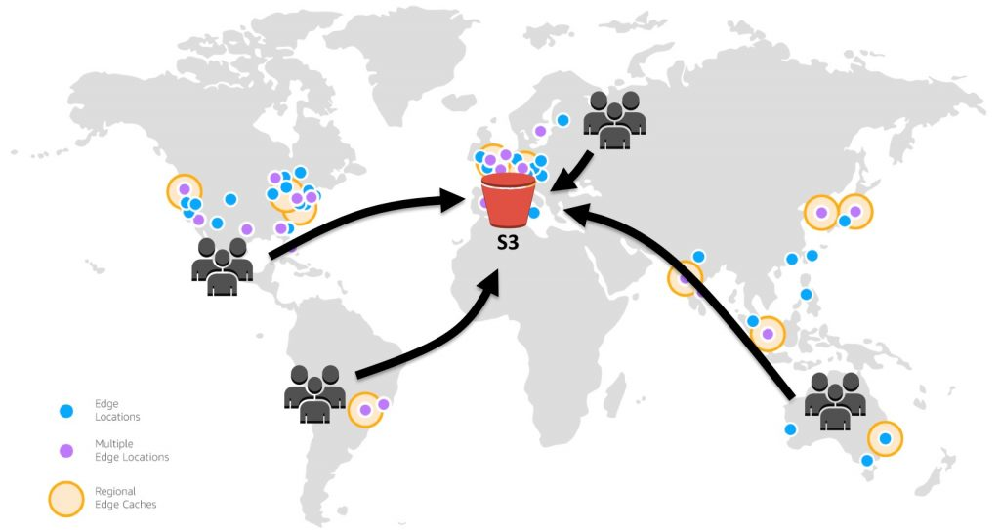

# CloudFront를 활용한 S3 성능 및 비용 개선

<figure><figcaption>
https://aws.amazon.com/ko/blogs/korea/amazon-s3-amazon-cloudfront-a-match-made-in-the-cloud/
</figcaption></figure>

## 컨텐츠 업로드 기능

* 기능을 구현하다보면 파일, 사진 등 정적인 데이터를 업로드하는 기능이 필요하다
* 클라우드 환경을 사용한다면 다양한 스토리지 서비스를 사용해볼수 있는데, 그중에서도 AWS에서 제공하는 S3를 사용하였다

## S3

* S3는 정적인 데이터를 보관하는 스토리지 서비스이다
* S3에서는 저장된 정적인 데이터는 객체로 표현되며, 객체들을 담고 있는 컨테이너는 버킷이라고 표현한다
* S3에는 수명주기를 지정하거나 잠금, 복제, 람다 함수 등에 전달할 수 있는 배치 작업 기능을 제공한다

### 그럼 정적 컨텐츠는 S3를 사용하면 해결되는가?

* 결론부터 이야기하면 실무에서 S3만 사용하기에는 한계가 있다.
* 한가지 사례만 봐도 바로 이해할 수 있다
* 만약 S3 서비스를 서울 리젼에 생성하였다.
* 미국에 있는 사용자가 S3에 등록된 이미지를 조회하려고 한다.
* 조회는 되겠지만 미국에서 서울까지 이미지를 호출하는 과정에서 네트워크에 따라서 상당한 지연이 발생할 수 있다.
* 이를 해결할 수 있는게 CDN이다

### CDN이란 무엇인가?

* 지연 시간은 웹 페이지 또는 비디오 스트리밍 콘텐츠가 디바이스에 완전히 로딩되기 전에 발생하는 시간을 의미한다
* CDN은 사용자의 디바이스를 통해 인터넷에 접속하는 곳과 가까운 곳에서 콘텐츠를 캐싱해 ‘오리진’ 서버에서 콘텐츠를 배포하는 서버 네트워크이다.
* 이 프로세스는 여러 서버에 걸쳐 지역적으로 부하를 분산시켜 오리진 서버에 대한 스트레스를 줄여준다.

### 그렇다면 AWS에는 CDN을 제공해주는 서비스가 있을까?

* AWS에도 다연히 있다. 그 상품이 바로 CloudFront이다
* 그렇기 때문에 CloudFront를 사용해서 정적 컨텐츠를 호출하면 성능적인 측면에서 효율적이라고 할 수 있다
*   이를 구현할수 있는 기능이 엣지 로케이션이다. 엣지 서버를 사용해 콘텐츠를 캐싱하고 서비스를 제공하면 최종 사용자가 위치한 곳에 더욱 가깝게 컨텐츠를 전송할 수 있기 때문에 성능이 향상된다.

    <figure><figcaption>
https://aws.amazon.com/ko/blogs/korea/amazon-s3-amazon-cloudfront-a-match-made-in-the-cloud/
</figcaption></figure>

### 그럼 기능개선 말고 다른 장점이 있나?

* 있다. 바로 비용적인 측면이다
*   S3 같은 경우에는 저장비용도 존재하지만 데이터 수신에 따른 트래픽 비용도 존재한다

    <figure><figcaption>
<a href="https://aws.amazon.com/ko/s3/pricing/">https://aws.amazon.com/ko/s3/pricing/</a>
</figcaption></figure>
* 서울 리전 기준으로 저장된 데이터 사이즈에 따라서 다르게 측정되는것을 알 수 있다
* 우선은 100TB 기준으로 트래픽 비용은 GB당 대략 0.117 USD로 책정된다.

#### CloudFront는 비용이 어떻게 될까?

<figure><figcaption>
<a href="https://aws.amazon.com/ko/cloudfront/pricing/">https://aws.amazon.com/ko/cloudfront/pricing/</a>
</figcaption></figure>

* 100TB 기준으로 GB당 0.095USD 정도로 금액적으로는 유사하지만 저장공간 사이즈가 커지면 커질수록 금액은 훨씬 감소하는 추세를 띄고 있다.
*   그리고 S3에서 CloudFront로 호출하는 트래픽 비용은 0원으로 측정되니 정적 컨텐츠 사이즈가 많다면 비용적으로도 절약할수 있는 부분이 있다\
    \

    <figure><figcaption>
<a href="https://aws.amazon.com/ko/s3/pricing/">https://aws.amazon.com/ko/s3/pricing/</a>
</figcaption></figure>

## 그럼 CloudFront는 어떻게 사용할 수 있을까?

### S3 버킷 생성

*   정적인 데이터를 담을 버킷을 생성한다\

    <figure><figcaption></figcaption></figure>

### CloudFront S3 버킷 바인딩

*   CloudFront를 생성할때 사용할 S3 버킷을 선택할 수 있다\

    

    <figure><figcaption></figcaption></figure>
*   CloudFront를 생성하면 아래와 같이 도메인 이름을 확인할 수 있을 것이다\

    <figure><figcaption></figcaption></figure>
* 사용하는 방법은 간단하다. S3의 도메인 경로가 아닌 CloudFront의 도메인 경로로 변경해서 호출하기만 하면 된다.
  * S3 : [https://temp-bucket.s3.ap-northeast-2.amazonaws.com/image/image.jpeg](https://temp-bucket.s3.ap-northeast-2.amazonaws.com/image/image.jpeg)
  * CloudFront : [https://temp.cloudfront.net/image/image.jpeg](https://temp.cloudfront.net/image/image.jpeg)

### 그렇다면 사용자는 CloudFront를 어떻게 사용하면 좋을까?

* CloudFront 도메인 경로만 변경하면 바로 사용할 수 있어 적용하는 방법은 여러가지 일 것이다
  1. 백엔드에서 S3 경로만 CloudFront 도메인으로 변경해서 데이터베이스에 저장하고 조회해도 된다
  2. 백엔드에서 S3 경로로 데이터베이스에 저장하고 조회할때만 CloudFront 도메인으로 변경해서 리턴할수도 있다.
  3. 백엔드에서는 S3 경로를 그대로 내려주고 프론트에서 CloudFront 도메인으로 변경할 수도 있을것이다
* 프론트엔드에서 설정하면 도메인 경로가 수정되거나 규칙을 알아야 하므로 백엔드에서 데이터로 저장하거나 리턴할때 변경해주는 방법으로 사용하는 것을 추천한다.&#x20;

## 참고

* [https://aws.amazon.com/ko/blogs/korea/amazon-s3-amazon-cloudfront-a-match-made-in-the-cloud/](https://aws.amazon.com/ko/blogs/korea/amazon-s3-amazon-cloudfront-a-match-made-in-the-cloud/)
* [https://www.akamai.com/ko/glossary/what-is-a-cdn](https://www.akamai.com/ko/glossary/what-is-a-cdn)
