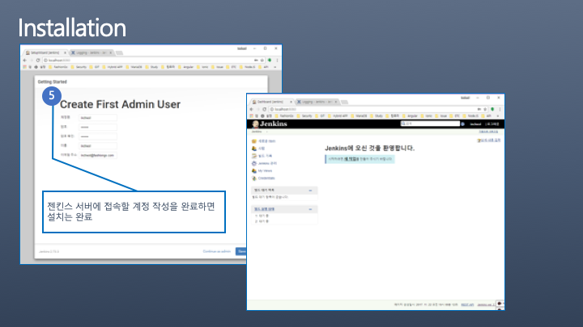
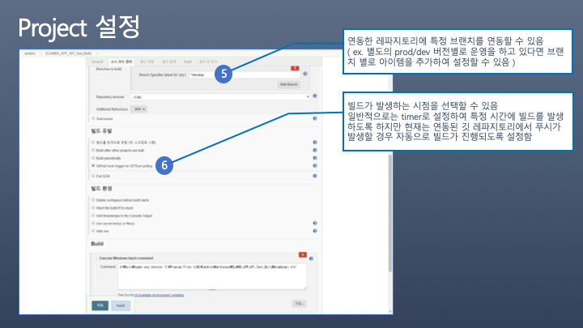
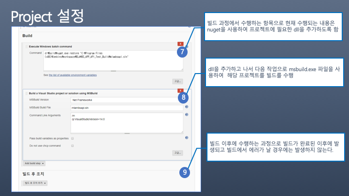

# JENKINS

## CI/CD란 무엇인가?

### CI\(Continuous Integration\)

* 지속적인 통합 : 지속적으로 코드에 대한 통합을 진행함으로써 코드 품질을 유지
* 빌드 및 테스트\(유닛테스트 및 통합 테스트\)를 통해서 병합 진행
* 통합이 완료된 최신 버전을 제공

### CD\(Continuous Delivery\)

* 지속적인 배포 : 통합과정을 통과한 버전을 사용자 설정에 따라 주기적으로 배포
* 프로덕션 환경으로 배포할 준비가 되어 있는 코드베이스를 확보하는 것이 목표

### CD\(Continuous Deployment\)

* CI/CD 파이프라인의 마지막 단계
* 배포될 서버나 배포 전략을 코드로 관리하여 형상관리 가능
* 분산 환경에 배포할 경우 더욱 중요하다

## Jenkins

* 소프트웨어 개발 시 지속적으로 통합 서비스를 제공하는 툴 – CI \(Continuous Integration\)
* 젠킨스와 같은 CI 툴이 등장하기 전에는 일정시간 마다 빌드를 실행하는 방식으로 진행 \( 보통 모든 커밋이 끝난 심야 시간대에 이러한 빌드가 집중적으로 진행 – nightly-build \)

### Jenkins를 왜 사용할까?

* 프로젝트 표준 컴파일 환경에서의 컴파일 오류 검출
* 자동화 테스트 수행
* 다양한 플러그인 제공 \(TFS, GITHUB, GITLAB\)
* 간편한 설정 및 사용법

### Jenkins 설치\(Windos 기반\)

#### 공식 사이트에서 다운받는다.

#### 설치 시 비밀번호를 확인한다.

#### 젠킨스에 기본으로 들어갈 플러그인을 설정한다.

#### 관리자 계정을 추가한다.

#### 젠킨스 설치 이후에 추가로 설치하고 싶은 플러그인이 있다면?

### Repository 연동

#### 연동할 Repository에 Jenkins 설정 추가

#### Jenkins에 연동할 Repository의 새로운 프로젝트를 생성한다.

#### 연동할 Git Repository 정보와 인증 정보를 입력한다.

#### 빌드 설정을 한다. \(브랜치 전략, 알림 설정, 빌드 전략, 빌드 후 처리 등\)

## 참고

* [https://devuna.tistory.com/56](https://devuna.tistory.com/56)
* [https://onlywis.tistory.com/9](https://onlywis.tistory.com/9)
* [https://velog.io/@ash3767/CICD](https://velog.io/@ash3767/CICD)

