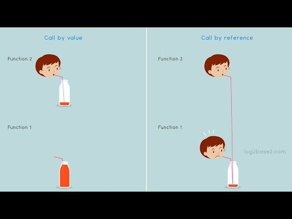

# Call by Value & Call by Reference



## Call by Value

call by value는 함수를 호출할 때 인자값으로 실제 값을 넘기는 것을 뜻한다. 단순히 텍스트로만 설명하면 이해하기 힘들 수 있다.

```text
Class CallByValue {
    public static void swap(int x, int y) {
        int temp = x;
        x = y;
        y = temp;

    }

    public static void main(String[] args) {
        int a = 10;
        int b = 20;

        System.out.println("swap() 호출 전 : a = " + a + ", b = " + b);
        swap(a, b);
        System.out.println("swap() 호출 후 : a = " + a + ", b = " + b);
    }
}

// 결과값
// swap() 호출 전 : a = 10, b = 20
// swap() 호출 후 : a = 10, b = 20
```

