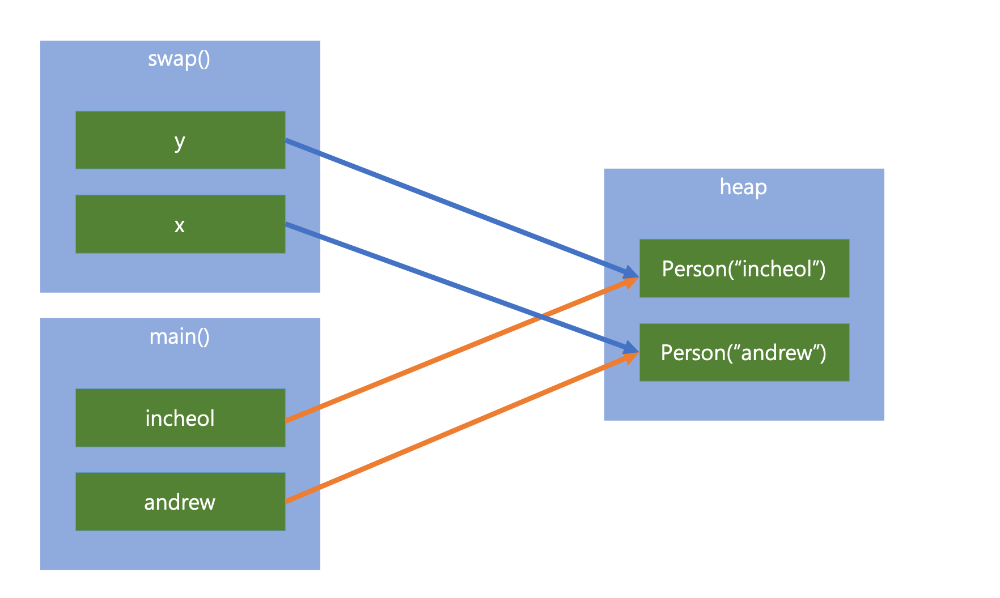

# Call by Value & Call by Reference


## Call by Value

call by value는 함수를 호출할 때 인자값으로 실제 값을 넘기는 것을 뜻한다. 단순히 텍스트로만 설명하면 이해하기 힘들 수 있다.

call by value의 대표적인 예제인 swap 코드를 작성해보자

```java
Class CallByValue {
    public static void swap(int x, int y) {
        int temp = x;
        x = y;
        y = temp;

    }

    public static void main(String[] args) {
        int a = 10;
        int b = 20;

        System.out.println("swap() 호출 전 : a = " + a + ", b = " + b);
        swap(a, b);
        System.out.println("swap() 호출 후 : a = " + a + ", b = " + b);
    }
}

// 결과값
// swap() 호출 전 : a = 10, b = 20
// swap() 호출 후 : a = 10, b = 20
```

* main 함수에서는 int a,b를 생성하였다.
* swap 함수를 호출하면서 a,b 값을 파라미터로 넘기게 된다.
* swap 함수 내에서 int x,y 의 값을 변경한다.
* swap 함수가 종료하고 나서 a,b 값을 출력한다.

> 결과는... 값은 변하지 않았다.

### 왜 값은 변하지 않았을까?

swap 함수에 전달한 건 변수의 메모리 주소가 아닌 값 이기 때문이다. 결국 메모리에는 a, b, x, y 변수가 생성되고 값만 복사 되었다는 것이다.

#### 그림을 보면 바로 이해할 수 있을 것이다.


* int a , b 가 스택 메모리에 생성되었다.
* int a, b의 값은 원시 타입 이므로 스택 메모리에 할당될 것이다.
* swap 함수를 호출하게 되면 int x, y 변수가 생성되었다.
* temp의 값엔 10을 할당 되었다.
* x 값에는 y의 값이 할당되었다. \(원시 타입은 주소가 아닌 값 자체를 할당한다\)
* y 값에는 temp의 값이 할당되었다.

## Call by Reference

우선 자바 코드를 작성 하기 이전에 C로 작성된 대표적인 call by reference 를 살펴보자

```java
void swap(int *a, int *b)
{
    int temp = *a;
    *a = *b;
    *b = temp;
}

int a1 = 10;
int a2 = 20;
swap(&a1, &a2);
cout << "a1: " << a1 << ", a2: " << a2 << endl;

// 결과값
// a1: 20, a2: 10
```

이렇듯 메모리 주소를 넘기면 변수들의 메모리 주소 자체가 변경되어 실제 메모리 주소가 변경된 것을 확인할 수 있다.

### 그렇다면 이번엔 자바로 동일한 로직을 구현해보자

Person 이라는 내부 클래스를 생성하여 Person 객체를 교환 해보았다. 출력값을 확인하기 위해 Person 클래스의 toString 메소드를 오버라이드 하였다.

```java
public class CallByReference {
    private class Person{
        String name;

        public Person(String name) {
            this.name = name;
        }

        @Override
        public String toString() {
            return "Person{" + "name='" + name + '\\'' + '}';
        }
    }

    public static void swap(Person x, Person y) {
        Person temp = x;
        x = y;
        y = temp;
    }

    public static void main(String[] args) {
        CallByReference example = new CallByReference();
        example.test();
    }

    private void test() {
        Person incheol = new Person("incheol");
        Person andrew = new Person("andrew");

        System.out.println("swap() 호출 전 : incheol = " + incheol + ", andrew = " + andrew);
        swap(incheol, andrew);
        System.out.println("swap() 호출 후 : incheol = " + incheol + ", andrew = " + andrew);
    }
}

// 결과값
// swap() 호출 전 : incheol = Person{name='incheol'}, andrew = Person{name='andrew'}
// swap() 호출 후 : incheol = Person{name='incheol'}, andrew = Person{name='andrew'}
```

> 이번에도 값은 변하지 않았다.

그 이유는 자바는 call by reference를 지원하지 않기 때문이다.



#### 과정을 살펴보자

* incheol, andrew 라는 Person 인스턴스를 각각 생성하였다.
* swap 함수를 실행하여 incheol, andrew를 넘겨주었다.
* Person x, y이라는 변수가 생성되고 값은 Heap 메모리에 있는 new Person\("incheol"\), new Person\("andrew"\)가 할당되었다.
* x,y를 변환하였다.
* 결론은 새로운 변수인 x,y값을 변환하였기 때문에 test 함수의 incheol, andrew 에는 영향이 없는 것이다.

비 원시 타입\(Wrapper class type\)의 변수를 메소드에 넘겨주어도 결국 객체의 값을 복사하기 때문에 call by Value라고 볼 수 있다.

### 그렇다면 멤버 변수를 수정하면 어떻게 될까?

Person의 멤버 변수인 name을 swap 해보자

```java
public class CallByReference {
    private class Person{
        String name;

        public Person(String name) {
            this.name = name;
        }

        @Override
        public String toString() {
            return "Person{" + "name='" + name + '\\'' + '}';
        }
    }

    public static void swap(Person x, Person y) {
        String temp = x.name;
        x.name = y.name;
        y.name = temp;
    }

    public static void main(String[] args) {
        CallByReference example = new CallByReference();
        example.test();
    }

    private void test() {
        Person incheol = new Person("incheol");
        Person andrew = new Person("andrew");

        System.out.println("swap() 호출 전 : incheol = " + incheol + ", andrew = " + andrew);
        swap(incheol, andrew);
        System.out.println("swap() 호출 후 : incheol = " + incheol + ", andrew = " + andrew);
    }
}

// 결과값
// swap() 호출 전 : incheol = Person{name='incheol'}, andrew = Person{name='andrew'}
// swap() 호출 후 : incheol = Person{name='andrew'}, andrew = Person{name='incheol'}
```

> 이번에는 우리가 의도한 결과대로 값이 변경되었다.

어떤 이는 위와 같은 결과를 근거로 call by reference라고 주장하시는 분들도 있다. 하지만 이것은 어디 까지나 warapper class가 가지는 특징으로 볼수 있으며 새로운 변수에 heap 메모리의 주소값을 넘겨주기 때문에이다. 주소값의 멤버 변수는 멤버 변수의 주소를 가르키기 때문에 힙 메모리의 주소에 새로운 값을 할당 하였다. 이것은 단지 call by value이지만 wapper 클래스라 주소값을 넘겨주어서 가능한 로직이라고 보는게 더 맞다.

## 참고

* [https://www.youtube.com/watch?v=kCiNYzHuIX8&ab\_channel=Log2Base2](https://www.youtube.com/watch?v=kCiNYzHuIX8&ab_channel=Log2Base2)
* [http://wonwoo.ml/index.php/post/1679](http://wonwoo.ml/index.php/post/1679)

