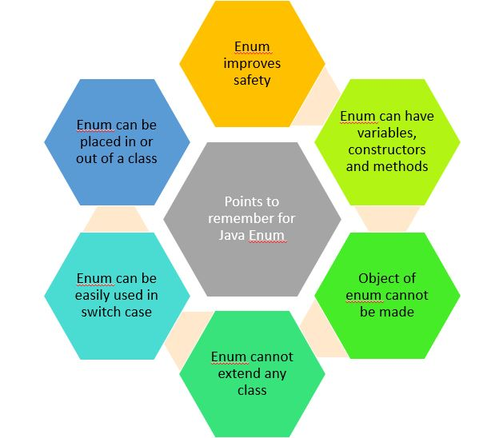

# ENUM



## Enum 클래스란?

Enum 클래스를 간략하게 열거형 클래스로 정의할 수 있다. Enum 클래스 내의 정의된 엘리먼트들은 public static final 형태로 사용된다. 그래서 같은 의미로 '연관된 상수들의 집합'으로 정의하기도 한다. Enum 클래스는 자바 1.5부터 등장하기 시작하였으며 각 엘리먼트는 대부분 대문자 형태로 정의하며 중복되지 않아야 한다.

## Enum을 사용하는 이유

Enum 클래스가 등장 하기 이전 또는 Enum 클래스가 익숙하지 않은 개발자는 특정 클래스에 상수형 필드를 정의하여 사용하였다. 하지만 이런 상수형 필드는 여러가지 단점이 있었다. \(아래 내용은 이펙티브 자바 아이템 34의 내용에서 제기된 문제점들이다.\)

* `타입 안전`을 보장할 방법이 없으며 `표현력`도 좋지 않다. 오렌지를 건네야 할 메서드에 사과를 보내고 `동등 연산자`로 비교하더라도 컴파일러는 아무런 경고 메시지를 출력하지 않는다.
* 상수의 값이 바뀌면 클라이언트도 반드시 다시 `컴파일`해야 한다. 다시 컴파일하지 않은 클라이언트는 실행이 되더라도 엉뚱하게 동작할 것이다.
* 정수 상수는 `문자열`로 출력하기가 다소 까다롭다. 심지어 그 안에 상수가 몇 개 인지도 알 수 없다.
* 정수 대신 문자열 상수를 사용하는 변형하는 패턴도 있지만, 상수의 의미를 출력할 수 있다는 점은 좋지만 `문자열 상수`의 이름 대신 `문자열` 값을 그대로 사용하면 오타가 있어도 컴파일러는 확인할 길이 없으니 자연스럽게 `런타임 버그`가 생긴다.

이와 같은 문제점들은 열거 타입을 사용하게 되면 보완할 수 있었기에 단순 상수형 데이터보다는 열거 타입으로 관리하는것을 권장하였다.

## 언제 사용하는게 좋을까?

### 상수로 표현된 그룹

과일을 표현한다고 해보자.

#### 단순 상수형으로 표현한다면 어떻게 표현할 수 있을까?

```java
public class Fruits {
    public static final String APPLE = "apple";
    public static final String BANANA = "banana";
    public static final String ORANGE = "orange";
    public static final String PINEAPPLE = "pineapple";
    public static final String MANGGO = "manggo";
}

public static void main(String[] args) {
		String myFruit = "apple";

		switch(myFruit){
		    case APPLE:
		        System.out.println("this is apple");
		        break;
		    case BANANA:
		        System.out.println("this is banana");
		        break;
		    default:
		        throw new IllegalStateException("Unexpected value: " + myFruit);
		}
}
```

언뜻 보면 문제가 없어 보인다. 하지만 누군가 ORANGE 상수를 사용하는데 실수로 "orang2"로 사용했다고 하면 어떻게 될까? 또는 ORANGE에 "apple"값을 중복해서 사용했다면 어떻게 될까? 컴파일 타임에는 오류없이 정상적으로 동작할 것이다. 만약 모든 Fruits에 대한 enum값 체크를 하는 테스트 코드를 작성했다면 중복되었거나 오타가 있는 값에 대한 테스트 코드는 실패를 도출할 것이다. 하지만 우리가 TDD를 하지 않는 이상 모든 엘리먼트에 대한 테스트 코드를 작성하는 습관은 쉽게 들이지 못했을 것이다.

#### 그렇다면 enum으로 표현하면 어떻게 될까?

```java
enum Fruits {
    APPLE("apple"),
    BANANA("banana"),
    ORANGE("orange"),
    PINEAPPLE("pineapple"),
    MANGGO("manggo");

    private String value;

    Fruits(String value) {
        this.value = value;
    }
}

public static void main(String[] args) {
		Fruits myFruit = Fruits.APPLE;

		switch(myFruit){
		    case APPLE :
		        System.out.println("this is apple!!");
		        break;
		    case BANANA :
		        System.out.println("this is banana!!");
		        break;
		    default:
		        throw new IllegalStateException("Unexpected value: " + myFruit);
		}
}
```

우선은 그냥 보기에도 명확하다. 그리고 enum 클래스 내에서 엘리먼트에 대한 고유 문자열을 가지기 때문에 열거형에서 가지는 문자열의 의미가 명확해졌고 사용자의 실수를 방지할 수 있을 것이다. 외부에는 enum type이 노출되기 때문에 중복되거나 오타에 대한 염려를 하지 않아도 된다. 모든 엘리먼트에 대한 테스트 코드가 있으면 좋겠지만 enum class 를 사용하는 것만으로 어느정도 런타임에서 발생할 수 있는 오류를 해결해주므로 더 높은 안전성을 가진다.

### 타입별 다른 연산식

이펙티브 자바에도 나오는 내용이고 우리가 연산식을 사용할 때 나오는 대표적인 예이다.

```java
public enum BasicOperation implements Operation {
    PLUS("+") {
        public double apply(double x, double y) { return x + y; }
    },
    MINUS("-") {
        public double apply(double x, double y) { return x - y; }
    },
    TIMES("*") {
        public double apply(double x, double y) { return x * y; }
    },
    DIVIDE("/") {
        public double apply(double x, double y) { return x / y; }
    };
    private final String symbol;
    BasicOperation(String symbol) {
        this.symbol = symbol;
    }
    @Override public String toString() {
        return symbol;
    }
}
```

이처럼 열거 타입을 사용하여 구현 로직을 제공할 수도 있다. 열거 타입으로 로직을 제공하게 되면 사용자는 간결하게 사용할 수 있으며 기능을 확장하기에도 용이하다.

### @Enumurated

개인적으로 열거 타입을 사용하면서 가장 유용하게 사용하는 기능이다. 간혹 데이터베이스에 저장되는 데이터도 열거 타입으로 관리할 필요가 있는 경우가 있다. 그러면서 열거 타입 데이터를 데이터베이스에서 읽어 와서 사용하거나 또는 반대로 외부에서 요청받은 열거타입 데이터를 저장하는 경우를 살펴보자

#### 데이터베이스에는 열거 타입을 지정할 수 없다.

이럴 때 사용할 수 있는게 @Enumurated 애노테이션이다. 테이블에 바인딩 되는 엔티티에 열거 타입으로 관리되는 필드 위에 해당 애노테이션만 붙여주면 그 필드는 열거 타입으로 관리되면서 데이터베이스에는 필요한 코드값으로 관리할 수 있게 된다. 다음의 Category 열거 타입을 사용하는 Product 엔티티를 살펴보자.

```java
public enum Category {
    CLOTHES("CA0001"),
    SHOES("CA0002"),
    JACKET("CA0003"),
    DRESS("CA0004");

    private String code;

    Category(String code) {
        this.code = code;
    }

    public String getCode() {
        return code;
    }
}

@Entity
@Getter
@Setter
public class Product {
    @Id
    @GeneratedValue(strategy = GenerationType.IDENTITY)
    private int id;

    private String name;

    @Enumerated(EnumType.STRING)
    private Category category;
}
```

@Enumerated 애노테이션을 사용하였고 EnnumType을 STRING으로 지정하였다. EnumType에는 ORDINAL과 STRING 두개의 속성을 선택할 수 있다. ORDINAL은 단순히 열거 타입의 해당 엘리먼트의 순번을 저장하는 용도이고 STRING은 열거타입의 이름 자체를 저장한다고 볼 수 있다. 그러면 실제 데이터베이스에 저장되는 데이터를 확인해보자.


이렇듯 열거 타입에 저장된 이름 자체를 저장할 수도 있다. 그런데 열거 타입의 이름은 단순히 애플리케이션 구현에 사용하는 용도이고 데이터베이스에 저장되는 데이터는 열거 타입의 코드값으로 대체하고 싶을 경우가 있다. 이럴 경우에는 @Converter를 사용해야 한다 .

```java
@Converter
public class EnumConverter implements AttributeConverter<Category, String> {
    private static Logger log = LoggerFactory.getLogger(EnumConverter.class);

    @Override
    public String convertToDatabaseColumn(Category category) {
        return category.getCode();
    }

    @Override
    public Category convertToEntityAttribute(String code) {
        if (code == null) {
            return null;
        }

        try {
            return Category.valueOf(code);
        } catch (IllegalArgumentException e) {
            log.error("failure to convert cause unexpected code [{}]", code, e);
            throw e;
        }
    }
}
```

위의 코드를 살펴보면 데이터 베이스에 저장할 때\(convertToDatabaseColumn\)는 Code 값을 리턴하고 반대로 데이터베이스에 저장된 데이터를 추출할 경우\(convertToEntityAttribute\)에는 코드 값을 사용하여 코드에 해당하는 열거 타입을 리턴하는 것을 확인할 수 있다. converter를 생성하였으니 엔티티에 적용해보자

```java
@Entity
@Getter
@Setter
public class Product {
    @Id
    @GeneratedValue(strategy = GenerationType.IDENTITY)
    private int id;

    private String name;

    @Convert(converter = EnumConverter.class)
    private Category category;
}
```

이제 실제 저장되는 데이터를 확인해보면 열거 타입에 해당하는 코드 값이 저장되는것을 확인할 수 있다.


## Enum에서 제공하는 메소드

### values\(\)

열거된 모든 원소를 배열에 담아 순서대로 반환한다.

### ordinal\(\)

원소에 열거된 순서를 정수 값으로 반환한다.

### valueOf\(\)

매개변수로 주어진 String과 열거형에서 일치하는 이름을 갖는 원소를 반환한다.

### name\(\)

해당 원소의 이름을 반환한다.

### compareTo\(\)

기준이 되는 원소 기준으로 순서를 비교하여 리턴한다.

## Enum 조회는 어떻게 하는게 좋을까?

### Arrays.stream

원시 타입일 경우 원시타입에 해당하는 Stream 타입을 반환\(ex. IntStream\)

```java
public Category findWithArraysStream(String code) {
    return Arrays.stream(values())
                 .filter(accountStatus -> accountStatus.getCode().equals(code))
                 .findAny()
                 .orElse(UNKNOWN);

}
```

### Steams.of

원시 타입일 경우 Stream 내부에 원시 타입 배열로 반환\(ex. Stream&lt;int\[\]&gt;\)

```java
public Category findWithStreamOf(String code) {
    return Stream.of(values())
                 .filter(accountStatus -> accountStatus.getCode().equals(code))
                 .findAny()
                 .orElse(UNKNOWN);

}
```

### HashMap

성능상 가장 우수하다고 함

```java
private static final Map<String, Category> descriptions = 
			Collections.unmodifiableMap(Stream.of(values())
        .collect(Collectors.toMap(
            Category::getCode,
            Function.identity())));

public static Category findWithHashMap(String code) {
    return Optional.ofNullable(descriptions.get(code)).orElse(UNKNOWN);
}
```

## 참고

* [https://coding-factory.tistory.com/522](https://coding-factory.tistory.com/522)
* [https://www.opentutorials.org/module/1226/8025](https://www.opentutorials.org/module/1226/8025)
* [https://pjh3749.tistory.com/279](https://pjh3749.tistory.com/279)

