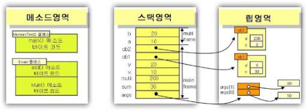

# Garbage Collecter

## Garbage Collection 이란?

자바 언어의 애플리케이션의 힙 메모리 상에서 더 이상 사용되지 않는\(unReachable\) 오브젝트들은 가비지 컬렉션을 담당하는 프로세스가 자동으로 메모리에서 제거하도록 하는 것이 가비지 컬렉션의 기본 개념이다.

그렇다면 가바지 컬렉션은 어떤 기준으로 사용하지 않는다고 판단할까?

### 가비지 컬렉션 규칙

객체를 생성할 경우 객체의 메모리 주소는 Stack 영역에 할당 되고 객체의 실제 값은 Heap 영역에 할당된다. Stack 영역은 메소드가 종료되면 할당된 메모리 주소는 삭제되게 된다. 또는 할당된 메모리 주소에 다른 인스턴스를 할당하게 되면 이전에 생성한 인스턴스의 주소는 스택 영역에 존재하지 않게 됩니다.

그러면 Heap에 있던 데이터는 unreachable 상태가 됩니다.

### 가비지 컬렉터는 무엇인가?

가비지 컬렉터란 가비지 컬렉션을 실행하는 프로그램이라고 볼 수 있다. JVM은 메모리를 부여받고 프로그램을 실행하다가 메모리가 부족해지는 순간이 오면 추가적으로 메모리를 더 요청한다. 요청하는 바로 이때 가비지 컬렉터가 실행된다.

#### 그 외 가비지 컬렉터가 실행하는 시점이 있을까?

* 관리하고 있는 힙에서 사용되는 메모리가 허용된 임계값을 초과하는 경우
* 프로그래머가 직접 GC를 실행하는 경우\(JAVA에서는 System.gc\(\)라는 메소드가 있지만 가급적 안 쓰는 것이 좋다.\)

### GC 대상이 되는 객체

* 모든 객체 참조가 null 인 경우
* 객체가 블럭 안에서 생성되고 블럭이 종료된 경우
* 부모 객체가 null이 된 경우, 자식 객체는 자동적으로 GC 대상이 된다.
* 객체가 weak 참조만 가지고 있을 경우
* 객체가 Soft 참조이지만 메모리 부족이 발생한 경우

### STW\(Stop the World\)란 무엇인가?

STW는 GC를 실행하는 쓰레드를 제외한 나머지 쓰레드는 모두 작업을 멈추는 현상을 말한다. 그래서 대부분의 경우 이야기하는 GC 튜닝이란 이 stop-the-world의 시간을 줄이는 것을 말한다.

## Garbage Collecter 종류

### Serial GC \(-XX:+UseSerialGC\)

* Young 영역과 Old 영역이 직렬로 처리 되며 단일 쓰레드를 사용한다.
* mark-sweep-compact 알고리즘을 사용한다


**Mark-Sweep-Compaction 방식이란?  
  
-** 사용되지 않는 객체를 식별하는 작업\(Mark\)  
- 사용되지 않는 객체를 제거하는 작업\(Sweep\)  
- 파편화된 메모리 영역을 앞에서부터 채워나가는 작업\(Compaction\)


### Parallel GC \(-XX:+UseParallelGC\)

* Parallel GC는 Serial GC와 기본적인 알고리즘은 같다.
* Serial GC는 GC를 처리하는 스레드가 하나인 것에 비해, Parallel GC는 GC를 처리하는 쓰레드가 여러 개이다. 그렇기 때문에 Serial GC보다 빠른게 객체를 처리할 수 있다.
* Parallel GC는 메모리가 충분하고 코어의 개수가 많을 때 유리하다.
* JAVA 9 이전에는 기본 설정된 GC로 사용 되었다.

### Parallel Old GC\(-XX:+UseParallelOldGC\)

* Parallel Old GC는 JDK 5 update 6부터 제공한 GC 방식이다.
* 앞서 설명한 Parallel GC와 비교하여 Old 영역의 GC 알고리즘만 다르다.
* 이 방식은 Mark-Summary-Compaction 단계를 거친다. Summary 단계는 앞서 GC를 수행한 영역에 대해서 별도로 살아 있는 객체를 식별한다는 점에서 Mark-Sweep-Compaction 알고리즘의 Sweep 단계와 다르며, 약간 더 복잡한 단계를 거친다.

### CMS GC \(-XX:+UseConcMarkSweepGC\)

* 가비지 컬렉션 작업을 애플리케이션 스레드와 동시 수행한다.
* stop-the-world 시간이 짧다
* 다른 GC 방식보다 메모리와 CPU를 더 많이 사용한다.
* Compaction 단계가 기본적으로 제공되지 않는다.
* 조각난 메모리가 많아 Compaction 작업을 실행하면 다른 GC 방식의 stop-the-world 시간보다 stop-the-world 시간이 더 길기 때문에 Compaction 작업이 얼마나 자주, 오랫동안 수행되는지 확인해야 한다.

### G1 GC

* Young 영역과 Old 영역이 물리적으로 나뉘어 있지 않고, 각 구역의 크기는 모두 동일하다.
* G1 GC는 바둑판 모양의 레이아웃으로 Heap 영역 전체를 N개로 쪼개어 각각의 영역에서 GC를 진행한다.
* Java 7 부터 사용은 가능하지만 디폴트는 아니다. JAVA 9 부터는 디폴트로 설정되어 있다.
* Heap 메모리가 많이 필요한 경우 G1 를 사용하는 것이 유리하다.

## 참고

* [https://www.youtube.com/watch?v=UnaNQgzw4zY](https://www.youtube.com/watch?v=UnaNQgzw4zY)
* [https://velog.io/@litien/가비지-컬렉터GC](https://velog.io/@litien/%EA%B0%80%EB%B9%84%EC%A7%80-%EC%BB%AC%EB%A0%89%ED%84%B0GC)
* [https://blog.wanzargen.me/15](https://blog.wanzargen.me/15)
* [https://yckwon2nd.blogspot.com/2014/04/garbage-collection.html](https://yckwon2nd.blogspot.com/2014/04/garbage-collection.html)
* [https://blog.voidmainvoid.net/190](https://blog.voidmainvoid.net/190)
* [http://www.ministory.net/xe/?mid=it\_story&category=2359&page=1&document\_srl=2920](http://www.ministory.net/xe/?mid=it_story&category=2359&page=1&document_srl=2920)
* [https://blog.metafor.kr/163](https://blog.metafor.kr/163)
* [https://reference-m1.tistory.com/113](https://reference-m1.tistory.com/113)
* [https://b.luavis.kr/server/g1-gc](https://b.luavis.kr/server/g1-gc)
* [https://lazymankook.tistory.com/83](https://lazymankook.tistory.com/83)
* [https://kkwonsy.tistory.com/11](https://kkwonsy.tistory.com/11)

