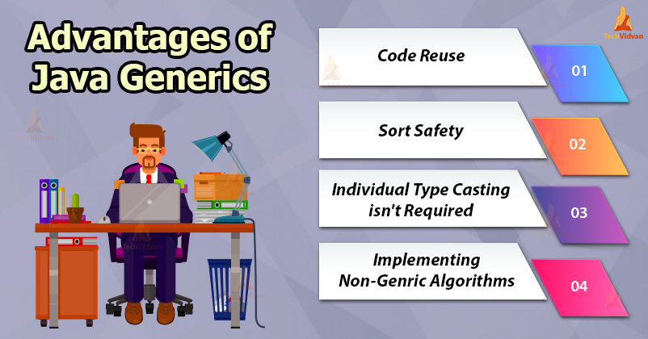

# 제네릭\(Generic\)



## 제네릭이란?

* JDK 5 부터 추가되었다.
* 클래스에서 사용할 타입을 클래스 외부에서 결정할 수 있다.
* 컴파일 시 타입 안전성을 제공한다.
* 타입 변환을 하지 않아도 된다.
* 코드 재사용이 높아진다.
* Collection에서 많이 사용된다.

## 제네릭 구현 방법

### 클래스

GenericClass의 t라는 변수는 별도의 타입을 가지지 않고 제네릭으로 선언되었다. 그러므로 GenericClass의 멤버 변수는 다양한 타입을 가질 수 있게 된다.

```java
public class GenericClass<T> {
    private T t;

    public GenericClass(T t) {
        this.t = t;
    }

    public GenericClass() {

    }

    public T getT() {
        return t;
    }

    public void setT(T t) {
        this.t = t;
    }
}
```

외부에서 GenericClass의 타입을 지정하여 생성할 수 있으므로, 코드를 재사용할 수 있으며 여러 타입에 대한 구현을 확장할 수 있다. 그리고 타입이 다를 경우, 컴파일 타임에 오류를 확인할 수 있어 안전성도 확보할 수 있다.

```java
public static void main(String[] args) {
    GenericClass<String> stringGenericClass = new GenericClass<>();
    stringGenericClass.setT("incheol");
    System.out.println(stringGenericClass.getT());

    GenericClass<Integer> integerGenericClass = new GenericClass<>();
    integerGenericClass.setT("20"); // 컴파일 오류
}
```

### 인터페이스

인터페이스도 위와 같이 클래스처럼 제네릭으로 설정해두고 활용할 수 있다.

```java
public interface GenericInterface<T> {
    public T get();
}

class StringGeneric implements GenericInterface<String> {

    @Override
    public String get() {
        return "incheol";
    }
}

class IntegerGeneric implements GenericInterface<Integer> {

    @Override
    public Integer get() {
        return 20;
    }
}

public static void main(String[] args) {
    StringGeneric stringGeneric = new StringGeneric();
    System.out.println(stringGeneric.get());
}
```

### 메서드

클래스의 메서드에서도 제네릭 메서드를 정의할 수 있으며 타입 매개변수의 사용은 메소드 내부로 제한된다.

```java
public class GenericMethodClass {
    public <T> T showGenericData(T data){
        return data;
    }

    public <T> T showGenericData2(T data){
        return data;
    }
}
```

메소드 별로 제네릭의 타입을 선언할 수 있으므로 더 유연하게 활용이 가능하다.

```java
public static void main(String[] args) {
    GenericMethodClass genericMethodClass = new GenericMethodClass();
    System.out.println(genericMethodClass.<String>showGenericData("incheol"));
    System.out.println(genericMethodClass.<Integer>showGenericData2(1000));
}
```

### 멀티 타입

제네릭은 용도에 따라 두 개 이상 멀티 파라미터로 정의할 수 있다.

```java
public class GenericEntry<K,V>{

    private K key;
    private V value;

    public K getKey() {
        return key;
    }

    public void setKey(K key){
        this.key = key;
    }

    public V getValue() {
        return value;
    }

    public void setValue(V value) {
        this.value = value;
    }

}

public static void main(String[] args) {
    GenericEntry<String, Integer> genericEntry = new GenericEntry<>();
    genericEntry.setKey("incheol");
    genericEntry.setValue(1000);
}
```

### 제한된 타입 파라미터

제네릭 타입에 대해 제한된 영역을 정의할 수 있다.

```java
public class GenericLimitClass<T extends Number> {
    private T t;

    public double getDouble(){
        return t.doubleValue();
    }

    public void setT(T t){
        this.t = t;
    }
}

public static void main(String[] args) {
    GenericLimitClass<Double> genericLimitClass = new GenericLimitClass<>();
    genericLimitClass.setT((double)100);
}
```

## 타입인자

제네릭을 표현하는 형태는 다양하다. 하지만 우리가 제네릭이 어느 용도로 사용되는지 알 수 있게 제시해주는 가이드 라인이 있다.

| 타입인자 | 설명 |
| :--- | :--- |
| E | Element \(used extensively by the Java Collections Framework\) |
| K | Key |
| N | Number |
| T | Value |
| V | Value |
| R | Result |
| S ,U, V etc | 2nd, 3rd, 4th types |

## 와일드 카드

제네릭은 코드를 재사용할 수 있게 범용적으로 구현하였지만, 컴파일 시점에 특정 타입으로 귀속된다는 단점이 있다.

#### 만약 다양한 타입을 하나의 인스턴스에서 사용하고 싶다면 어떻게 해야 할까?

여러 타입을 허용하고 싶을 때 사용할 수 있는게 와일드 카드이다. 와일드 카드를 사용하면 다양한 타입을 허용해주어 컴파일 타임에도 오류없이 수행할 수 있다. 와일드 카드 또한 extends나 super를 사용하여 범위를 제한할 수 있다.

```java
public class WildCardClass {
    public static void print(List<?> items){
        for(Object item : items){
            System.out.println(item);
        }
    }

    public static void main(String[] args) {
        ArrayList items = new ArrayList();
        items.add("incheol");
        items.add(10);

        WildCardClass.print(items);
    }
}

// result
// incheol
// 10
```

## 주의할 점

* 제네릭은 원시타입은 사용할 수 없다.
* 제네릭 타입을 명시적으로 지정해주지 않는다면\(로 타입사용\) 오류를 범할 수 있다.

## 참고

* [https://offbyone.tistory.com/327](https://offbyone.tistory.com/327)
* [https://yaboong.github.io/java/2019/01/19/java-generics-1/](https://yaboong.github.io/java/2019/01/19/java-generics-1/)
* [https://cornswrold.tistory.com/180](https://cornswrold.tistory.com/180)
* [https://coding-factory.tistory.com/573](https://coding-factory.tistory.com/573)
* [https://lktprogrammer.tistory.com/177](https://lktprogrammer.tistory.com/177)

