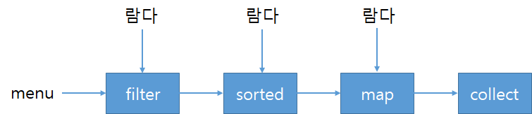

# JDK 8 특징


## **Lambda expressions**

### 람다란 무엇인가?

람다 표현식은 메서드로 전달할 수 있는 익명 함수를 단순화한 것이다.

* 익명 : 보통의 메서드와 달리 이름이 없으므로 익명이라 표현한다.
* 함수 : 람다는 메서드처럼 특정 클래스에 종속되지 않으므로 함수라고 부른다.
* 전달 : 람다 표현식을 메서드 인수로 전달하거나 변수로 저장할 수 있다.
* 간경성 : 익명 클래스처럼 많은 자질구레한 코드를 구현할 필요가 없다.

### 람다의 구성 요소

* 파라미터 리스트
* 화살표 : 파라미터 리스트와 바디를 구분한다.
* 바디 : 람다의 반환값에 해당하는 표현식

### 형식 검사, 형식 추론, 제약

람다 표현식 자체에는 람다가 어떤 함수형 인터페이스를 구현하는지의 정보가 포함되어 있지 않다. 따라서 람다 표현식을 더 제대로 이해하려면 람다의 실제 형식을 파악해야 한다.

람다 표현식의 형식 검사 과정의 재구성

#### 형식 검사

```java
List<Apple> heavierThan150g = filter(inventory, (Apple a) -> a.getWeight() > 150);
```

1. 람다가 사용된 콘텍스트는 무엇인가? 우선 filter의 정의를 확인하다.
2. 대상 형식은 Predicate\<Apple>이다.
3. Predicate\<Apple>인터페이스의 추상 메서드는 무엇인가?
4. Apple을 인수로 받아 boolean을 반환하는 test 메서드다
5. 함수 디스크립터는 Apple → boolean이므로 람다의 시그니처와 일치한다. 람다도 Apple을 인수로 받아 boolean을 반환하므로 코드 형식 검사가 성공적으로 완료된다.

#### 형식 추론

자바 컴파일러는 람다 표현식이 사용된 콘텍스트를 이용해서 람다 표현식과 관련된 함수형 인터페이스를 추론한다. 결과적으로 컴파일러는 람다 표현식의 파라미터 형식에 접긍할 수 있으므로 람다 문법에서 이를 생략할 수 있다.

## **Method Reference**

메서드 레퍼런스는 특정 메서드만을 호출하는 람다의 축약형이다.

메서드 레퍼런스를 새로운 기능이 아니라 하나의 메서드를 참조하는 람다를 편히라게 표현할 수 있는 문법으로 간주 할 수 있다.

#### 람다와 메서드 레퍼런스 단축 표현 예

| **람다**                                   | **메서드 레퍼런스**                      |
| ---------------------------------------- | --------------------------------- |
| (Apple a) -> a.getWeight()               | Apple::getWeight                  |
| () -> Thread.currentThread().dumpStack() | Thread.currentThread()::dumpStack |
| (str, i) -> str.substring(i)             | String::substring                 |
| (String s) -> System.out.println(s)      | System.out::println               |

****

## **Stream**

### 스트림이란 무엇인가?

스트림이란 '데이터 처리 연산을 지원하도록 소스에서 추출된 연속된 요소'로 정의할 수 있다. 또한 스트림을 이용하면 멀티 스레드 직접 코드를 구현하지 않아도 데이터를 투명하게 병렬로 처리할 수 있다.

*   연속된 요소

    컬렉션과 마찬가지로 스트림은 특정 요소 형식으로 이루어진 연속된 값 집합의 인터페이스를 제공한다. 컬렉션의 주제는 데이터이고 스트림의 주제는 계산이다. 추후 이 차이에 대해 더 살펴보겠다.
* 소스 스트림은 컬렉션, 배열, I/O 자원 등의 데이터 제공 소스로부터 데이터를 소비(consume)한다.
* 데이터 처리 연산 스트림 연산은 순차적으로 또는 병렬로 실행할 수 있다.

### 스트림 핵심 요소

* 파이프라이닝 연산 파이프라인은 데이터 소스에 적용하는 데이터베이스 질의와 비슷하다.
* 내부 반복 반복자를 이용해서 명시적으로 반복하는 컬렉션과 달리 스트림은 내부 반복을 지원한다.

### 스트림을 사용하여 얻는 이점은 무엇이 있을까?

* 선언형으로 코드를 구현할 수 있다. 즉, 루프와 if 조건문 등의 제어 블록을 사용해서 어떻게 동작을 구현할지 지정할 필요 없이 ' 저칼로리의 요리만 선택하라' 같은 동작의 수행을 지정할 수 있다.
* 위의 코드에서와 같이 filter, sorted, map, collect 같은 여러 빌딩 블록 연산을 연결해서 복잡한 데이터 처리 파이프라인을 만들 수 있다.



자바 8의 스트림 API의 특징을 다음처럼 요약할 수 있다.

* 선언형 : 더 간결하고 가독성이 좋아진다.
* 조립할 수 있음 : 유연성이 좋아진다.
* 병렬화 : 성능이 좋아진다.

## **Default Method**

자바 8에서는 호환성을 유지하면서 API를 바꿀 수 있도록 새로운 기능인 디폴트 메서드를 제공한다.

자바 8 API 에서는 디폴트 메서드가 상당히 많이 활용 되었을 것 임을 추측할 수 있다. Collection 인터페이스의 stream 메서드처럼 부지불식간에 많은 디폴트 메서드를 사용했다. List 인터페이스의 sort 메서드도 디폴트 메서드다. 이전에 살펴본 Predicate, Function, Comparator 등 많은 함수형 인터페이스도 Predicate.and 또는 Function.andThen 같은 다양한 디폴트 메서드를 포함한다.

### 디폴트 메서드 활용 패턴

디폴트 메서드를 생성하는 두 가지 방식에 대해서 살펴보자.

#### 선택형 메서드

Iterator는 hasNext와 next뿐 아니라 remove 메서드도 정의한다. 사용자들이 remove 기능은 잘 사용하지 않으므로 자바 8 이전에는 remove 기능을 무시했다. 결과적으로 Iterator를 구현하는 많은 클래스에서는 remove에 빈 구현을 제공했다.

```java
interface Iterator<T> {
	boolean hasNext();
	T next();
	default void remove() {
		throw new UnsupportedOperationException();
	}
}
```

default 메서드를 활용하여 Iterator 인터페이스를 구현하는 클래스는 빈 remove 메서드를 구현할 필요가 없어졌고, 불필요한 코드를 줄일 수 있다.

#### 동작 다중 상속

디폴트 메서드를 이용하면 기존에는 불가능했던 동작 다중 상속 기능도 구현할 수 있다. 자바 8에서는 인터페이스가 구현을 포함할 수 있으므로 클래스는 여러 인터페이스에서 동작(구현 코드)을 상속받을 수 있다.

인터페이스에 디폴트 구현을 포함시키면 또 다른 장점이 있다. 인터페이스를 구현한 클래스들의 공통 구현을 변경해야 할 경우 디폴트 메서드만 수정하면 일괄적으로 변경이 가능하다는 점이다. (물론 구현 클래스에서 메서드를 정의하지 않은 상황에 한해서다.)

옮지 못한 상속 상속으로 코드 재사용 문제를 모두 해결할 수 있는 것은 아니다. 예를 들어 한 개의 메서드를 재사용하려고 100개의 메서드와 필드가 정의되어 있는 클래스를 상속받는 것은 좋은 생각이 아니다. 이럴 때는 delegation, 즉 멤버 변수를 이용해서 클래스에서 필요한 메서드를 직접 호출하는 메서드를 작성하는 것이 좋다. 종종 'final'로 선언된 클래스를 볼 수 있다. 이는 다른 클래스를 상속받지 못하게 함으로써 원래 동작이 바뀌지 않길 원하기 때문이다. (ex. String)

우리의 디폴트 메서드에도 이 규칙을 적용할 수 있다. 필요한 기능만 포함하도록 인터페이스를 최소한으로 유지한다면 필요한 기능만 선택할 수 있으므로 쉽게 기능을 조립할 수 있다.

## **Optional**

### NPE(NullPointerException)

**NullPointerException**은 초급자, 중급자, 남녀노소를 불문하고 모든 자바 개발자를 괴롭히는 예외이다.

토니 호어라는 영국 컴퓨터과학자가 처음 null 레퍼런스를 도입하였다. 그 당시에는 null 레퍼런스 및 예외로 값이 없는 상황을 가장 단순하게 구현할 수 있다고 판단했고 결과적으로 null 및 관련 예외가 탄생했다. 호어는 억만 달러짜리 실수라고 했지만 50년이라는 null 레퍼런스의 역사에 비추어볼 때 null로 인한 실질적인 피해비용은 이보다 클 수 있다.

### null 때문에 발생하는 문제

자바에서 null 레퍼런스를 사용하면서 발생할 수 있는 **이론적, 실용적 문제**를 확인하자.

* 에러의 근원이다 : NullPointerException은 자바에서 가장 흔히 발생하는 에러다
* 코드를 어지럽힌다 : null 확인 코드를 추가해야 하므로 **과도한 체크 로직**으로 가독성이 떨어진다.
* 아무 의미가 없다 : 정적 형식 언어에서 값이 없음을 표현하는 방법으로는 적절하지 않다.
* 자바 철학에 위배된다
* 형식 시스템에 구멍을 만든다

### Optional이란?

Optional은 **선택형값을 캡슐화하는 클래스다.** 값이 있으면 Optional 클래스는 값을 감싼다. 반면 값이 없으면 Optional.empty 메서드로 Optional을 반환한다. 의미상으론 둘이 비슷하지만 실제로는 차이점이 많다. null을 참조하려 하면 NullPointerException이 발생하지만 **Optional.empty()는 Optional 객체이므로 이를 다양한 방식으로 활용할 수 있다.**

## **CompletaleFuture**

* Future의 기능을 확장시켜준다
* 두 개의 비동기 계산 결과를 하나로 합친다
  * 각 계산 결과는 독립적이거나 종속적일 수 있다
* Future 집합이 실행하는 모든 태스크의 완료를 기다린다
* Future 집합에서 가장 빨리 완료되는 태스크를 기다렸다가 결과를 얻는다
* Future가 완료되면 추가 작업을 수행 할 수 있다

## **New date / time APIs**

### Date 이슈

자바 1.0에서는 [**java.util.Date**](http://java.util.date) 클래스 하나로 날짜와 시간 관련 기능을 제공했다. 날짜를 의미하는 Date라는 클래스의 이름과 달리 Date 클래스는 특정 시점을 날짜가 아닌 밀리초 단위로 표현한다. 게다가 1900년을 기준으로 하는 오프셋, 0에서 시작하는 달 인덱스 등 모호한 설계로 유용성이 떨어졌다. 그리고 Date는 JVM 기본시간대인 CET, 즉 **중앙 유럽 시간대**를 사용하였다.

자바 1.0의 Date 클래스에 문제가 있다는 의문이 있었지만 **과거 버전과 호환성**을 깨뜨리지 않으면서 이를 해결할 수 있는 방법이 없었다. DateFormat에도 문제가 있었다. 예를 들어 **DateFormat은 스레드에 안전하지 않다.** 즉, 두 스레드가 동시에 하나의 포매터로 날짜를 파싱할 때 예기치 못한 결과가 일어날 수 있었다.

### LocalDate와 LocalTime 사용

LocalDateTime은 LocalDate와 LocalTime을 쌍으로 갖는 복합 클래스다.

```java
LocalDate date = LocalDate.of(2014, 3, 18); // 2014-03-18
int year = date.getYear // 2014
DayOfWeek dow = date.getDayOfWeek(); // TUESDAY

LocalTime time = LocalTime.of(13, 45, 20);
int hour = time.getHour(); // 13
int minute = time.getMinute(); // 45

LocalDateTime dt1 = LocalDateTime.of(2014, Month.MARCH, 18, 13, 45, 20);
LocalDateTime dt2 = LocalDateTime.of(date, time);
```

### Instant : 기계의 날짜와 시간

사람은 보통 주, 날짜, 시간, 분으로 날짜와 시간을 계산한다. 하지만 기계에서는 이와 같은 단위로 시간을 표현하기 어렵다. 기계의 관점에서는 연속된 시간에서 특정 지점을 하나의 큰 수로 표현하는 것이 가장 자연스러운 시간 표현 방법이다.

```java
Instant.ofEpochSecond(3);
Instant.ofEpochSecond(2, 1_000_000); // 2초 이후의 1억 나노초
```

### Duration과 Period 정의

Duration 클래스의 정적 팩토리 메서드 between으로 두 시간 객체 사이의 지속시간을 만들 수 있다.

```java
Duration d1 = Duration.between(time1, time2);
Duration d1 = Duration.between(dateTime1, dateTime2);

Period tenDays = Period.ofDays(10);
Period threeWeeks = Period.ofWeeks(3);
```

### TemporalAdjusters 사용하기

지금까지 살펴본 날짜 조정 기능은 비교적 간단한 편에 속한다. 때로는 다음 주 일요일, 돌아오는 평일, 어떤 달의 마지막 날 등 좀 더 복잡한 날짜 조정 기능이 필요할 것이다.

```java
import static java.time.temporal.TemporalAdjusters.*;
LocalDate date1 = LocalDate.of(2014, 3, 18); // 2014-03-18
LocalDate date2 = date1.with(nextOrSame(DayOfWeek.SUNDAY)); // 2014-03-23
LocalDate date3 = date2.with(lastDatOfMonth()); // 2014-03-31
```

## 참고

* 자바 8 인 액션 책 참고
* [http://tcpschool.com/java/java\_intro\_java8](http://tcpschool.com/java/java\_intro\_java8)
* [https://sabarada.tistory.com/39](https://sabarada.tistory.com/39)
* [http://pigbrain.github.io/java/2016/04/04/Java8\_on\_Java](http://pigbrain.github.io/java/2016/04/04/Java8\_on\_Java)
