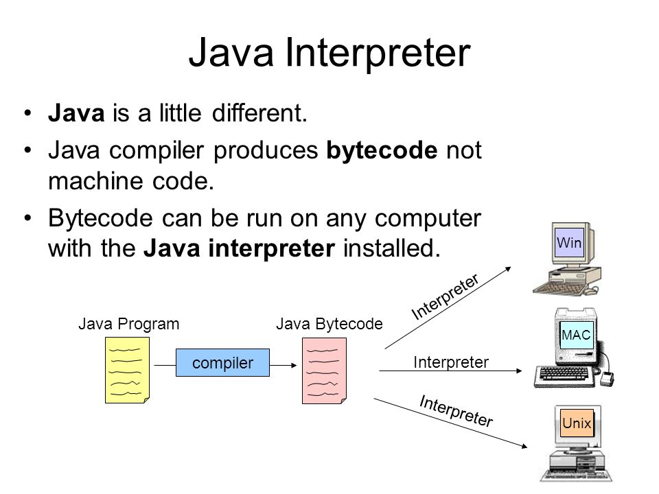

# JIT COMPILER

<figure><figcaption></figcaption></figure>

## jit compiler는 무엇인가?

<figure><figcaption>
<a href="https://www.scientecheasy.com/wp-content/uploads/2021/03/java-jvm-architecture.png">https://www.scientecheasy.com/wp-content/uploads/2021/03/java-jvm-architecture.png</a>
</figcaption></figure>

* JVM 내에 구성된 execution engine을 통해서 바이트 코드를 기계어로 변환하여 애플리케이션을 실행시킨다
* 바이트 코드를 기계어로 실행시키는 과정을 인터프리터 라고 한다
* jit compiler는 인터프리터 과정에서 Java 프로그램의 성능을 향상시키는 데 도움을 준다


💡 **그럼 바이트 코드는 어디서 생성되지?**

\
사전에 구현한 소스 코드(.java)를 javac로 컴파일하여 소스 코드(.class)로 변환한다 컴파일된 결과물은 보통 jar, war 형식의 압축 파일로 생성된다


## 컴파일은 왜 필요하지?

* 컴파일이 필요한 이유는 자바가 만든 표어를 보면 바로 이해할 수 있다
* 자바가 추구하는 키워드는 ‘WORA’이다(WORA = Write Once Run Anywhere)
* `‘컴파일 한번으로 어느곳에서든 운영을 할수 있다’`는 것이다
* 그래서 OS와 상관없이 JVM만 설치되어 있으면 어느곳에서도 애플리케이션을 동작시킬수 있다
* 대표적인 컴파일 언어는 ‘C’, ‘C++’ 이다

## 그렇다면 자바는 왜 인터프리터 과정이 필요한가?

<figure><figcaption>
<a href="https://slideplayer.com/slide/219427/1/images/5/Java+Interpreter+Java+is+a+little+different..jpg">https://slideplayer.com/slide/219427/1/images/5/Java+Interpreter+Java+is+a+little+different..jpg</a>
</figcaption></figure>

* 컴파일 과정을 통해서 OS에 종속 받지 않고 애플리케이션을 운영할 순 있지만 한 가지 단점이 있다
* 컴파일된 소스 코드를 런타임에 실행시 한번에 많은 소스 코드를 실행시키는 과정이 느리다는 것이다
* 이는 파일이 많고 코드 라인이 많으면 많을수록 더 느리게 동작하게 된다
* 실행시간을 개선하기 위해 인터프리터 과정이 필요한 것이다
* 그래서 자바는 컴파일과 인터프리터를 혼합하여 프로그램을 실행시킨다고 할 수 있다


💡 **인터프리터는 구체적으로 어떻게 동작하지?**

인터프리터 과정은 실시간으로 바이트 코드를 라인별로 읽어서 수행되므로, 컴파일로 수행하는 것보단 빠를수 있겠지만 런타임시 코드 라인을 읽어서 수행하다보니 속도가 많이 빠르지는 않다. \
대표적인 인터프리터 언어는 Python, javascript 등이 있다


## 자바에서 인터프리터 과정은 어떻게 동작하나?

<figure><figcaption>
<a href="https://devtechfactory.com/blogs/CodeCache.png">https://devtechfactory.com/blogs/CodeCache.png</a>
</figcaption></figure>

* JVM 내에 execution engine이 존재하는데 내부에는 jit compiler라는 구성요소가 있다
* jit compiler를 통해서 바이트 코드를 기계어로 변환하여 동작하는 것이다
* jit compiler 내부에는 C1 컴파일러와 C2 컴파일러가 존재한다
* C1 컴파일러는 기계어로 컴파일만 수행하고, C2 컴파일러는 컴파일 + 캐시 과정을 수행하게 된다
* C2 컴파일러 덕분에 인터프리터의 실행시간을 단축 할 수 있다
* 하지만 모든 코드를 C2 단계에서 캐싱하지는 않는다
* 그리고 캐싱되는 크기는 제한되어 있기 때문에, 캐싱되어 저장되었더라도 몇몇 코드는 다시 제거되기도 한다

## 참고

* [https://www.ibm.com/docs/ko/sdk-java-technology/8?topic=reference-jit-compiler](https://www.ibm.com/docs/ko/sdk-java-technology/8?topic=reference-jit-compiler)
* [https://kotlinworld.com/307](https://kotlinworld.com/307)
* [https://inspirit941.tistory.com/352](https://inspirit941.tistory.com/352)
* [https://velog.io/@mooh2jj/JIT-컴파일러란](https://velog.io/@mooh2jj/JIT-%EC%BB%B4%ED%8C%8C%EC%9D%BC%EB%9F%AC%EB%9E%80)
* [https://dailyheumsi.tistory.com/196](https://dailyheumsi.tistory.com/196)

