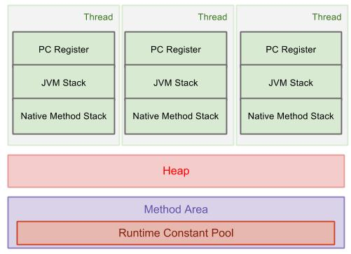

# JVM

## JVM, JDK, JRE

* JRE : 자바 실행 환경의 줄임말로 JVM에 자바 라이브러리와 기타 파일들이 결합된 자바를 실행하기 위한 프로그램
* JDK : 자바 개발 키트의 줄임말로 JRE에 컴파일러, 디버거 등 개발도구를 포함하는 프로그램
* JVM : 자바 가상 머신으로 애플리케이션을 클래스 로더를 통해 읽어 들여 API와 함께 실행시켜 

## JVM 구성

### class loader

* .java 소스를 자바 컴파일러가 컴파일하면 .class 파일인 바이트코드가 생성된다.
* 클래스 파일들을 엮어서 JVM이 운영체제로부터 할당받은 메모리 영역인 Runtime Data Area로 적재하는 역할을 한다.

### execution engine

* 클래스 로더에 의해 메모리에 적재된 클래스\(바이트 코드\)들을 기계어로 변경해 명령어 단위로 실행하는 역할을 한다.

### garbage collector

* Heap 메모리 영역에 생성된 객체들 중에 참조되지 않는 객체들을 탐색 후 제거하는 역할을 한다.
* GC가 수행되는 동안 GC를 수행하는 쓰레드가 아닌 다른 모든 쓰레드가 일시정지된다.
* 특히 Fulll GC가 일어나서 수 초간 모든 쓰레드가 정지\(STW\)한다면 장애로 이어지는 치명적인 문제가 생길 수 있다.

### runtime data area

* **각각의 스레드에서 동작**하는 **PC Register, JVM Stack, Native Method Stack**으로 구성되어 있다.
* **공유 스레드에서 동작**하는 **Heap과 Method Area**가 있다.

## JVM 역할

### OS에 독립적인 자바 애플리케이션을 실행

#### JVM 실행 과정

1. 프로그램이 실행되면 JVM은 OS로부터 이 프로그램이 필요로 하는 메모리를 할당 받는다. JVM은 이 메모리를 용도에 따라 여러 영역으로 나누어 관리한다.
2. 자바 컴파일러\(javac\)가 자바소스\(.java\)코드를 읽어 들여 자바 바이트코드\(.class\)로 변환시킨다.
3. 이 변경된 Class 파일들을 Class Loader를 통해 JVM 메모리영역\(Runtime Data Areas\) 영역으로 로딩한다.
4. 로딩된 class파일들은 Execution engine을 통해 해석된다.
5. 해석된 바이트코드는 Runtime Data Areas에 배치되어 실질적인 수행이 이루어지게된다.이러한 실행과정속에서 JVM은 필요에 따라 Thread Synchronization과 GC같은 관리 작업을 수행한다.

### GC를 이용한 메모리 관리

#### 가비지 컬렉터는 힙 메모리에서 더 이상 참조되지 않은 객체를 확인하여 자동으로 제거하여 메모리를 관리 해준다


**자바 메모리 영역**

* 메소드 영역 : 클래스 메타 데이터\(Field 이름, Field 타입, Class 이름 등등\)
* 스택 영역 : 기본형 데이터, 로컬 변수\(참조형일 경우 주소값만 저장됨\)가 저장되는 영역
* 힙 영역 : 참조형 데이터가 저장되는 영역



**static 데이터는 어느 메모리 영역에 존재하는가?**

Java 8 이전에는 Method Area를 Pergen\(permanant Generation Space\)에 할당하였다. Static data는 애플리케이션이 생성되면 영구적으로 메모리에 올라가기 때문에 String Constant Pool이나 Static 배열 오용으로 인한 OutOfMemory 이슈가 발생하였다. \(Perm 영역은 JVM에 의해 크기가 강제되던 영역이다\)

Java 8 이후부터는 PermGen 영역이 Metaspace 영역으로 변경되면서 기존에 관리되던 Static 데이터나 String Constant Pool은 Heap 메모리로 이동하게 되었고 클래스의 메타 데이터만 Metaspace로 이동하게 되었다. Metaspace 영역은 네이티브 메모리에서 관리하므로 -XX:MaxPermSize를 통해서 관리되는 데이터 양에 따라 유동적으로 관리할 수 있게 되었다. 


#### GC 동작 원리 \(Pararrel GC 기준\)

1. 힙 메모리 영역은 young generation\(eden, survivor1, survivor2\) , old generation, permanent generation 으로 나누어 진다.
2. 데이터는 young generation\(eden → survivor1 → survivor2\) → old generation 순으로 데이터가 참조되는 기준으로 옮겨진다.
3. young generation에서 발생하는 gc를 minor gc 라고 하고, old generation에서 발생하는 gc를 major gc로 부른다.
4. minor gc는 메모리를 많이 차지하지 않고, major gc에서 메모리를 많이 차지하게 된다. 대부분의 gc를 튜닝하는 경우는 major gc에서 발생한다.

## 참고 

* [https://velog.io/@litien/JVM-구조](https://velog.io/@litien/JVM-%EA%B5%AC%EC%A1%B0)
* [https://12bme.tistory.com/57](https://12bme.tistory.com/57)
* [https://asfirstalways.tistory.com/158](https://asfirstalways.tistory.com/158)
* [https://medium.com/@js230023/자바-jvm과-바이트-코드-4e754ee02490](https://medium.com/@js230023/%EC%9E%90%EB%B0%94-jvm%EA%B3%BC-%EB%B0%94%EC%9D%B4%ED%8A%B8-%EC%BD%94%EB%93%9C-4e754ee02490)
* [https://yongyi1587.tistory.com/12](https://yongyi1587.tistory.com/12)
* [https://mia-dahae.tistory.com/101](https://mia-dahae.tistory.com/101)
* [https://johngrib.github.io/wiki/java8-why-permgen-removed/](https://johngrib.github.io/wiki/java8-why-permgen-removed/)
* [https://javainterviewgoal.blogspot.com/2019/07/what-is-jdk-jre-and-jvm.html](https://javainterviewgoal.blogspot.com/2019/07/what-is-jdk-jre-and-jvm.html)
* [https://www.programcreek.com/2013/04/jvm-run-time-data-areas/](https://www.programcreek.com/2013/04/jvm-run-time-data-areas/)

