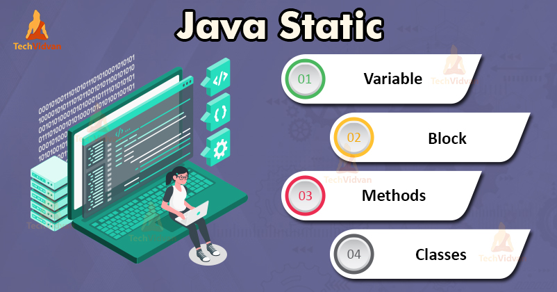

# STATIC



## static 키워드란?

* 애플리케이션 생성 시 최초에 한번만 메모리에 올려 재사용이 가능하다.
* 이미 메모리에 적재 되었으므로 인스턴스 생성 없이 사용 가능하다.
* 동기화 이슈가 있을 수 있으므로 가변적인 상태 보단 불변적인 상태를 유지 하는게 좋다.
* 공통적인 특성이나 기능을 사용하는 용도로 유틸성으로 많이 사용된다.

## static 적용 범위

### 클래스\(Class\)

클래스에 static을 붙일 경우에는 내부 클래스에 붙이는 경우가 많다. 내부 클래스에 static을 붙이는 이유는 외부 클래스의 인스턴스 생성없이 내부 클래스를 접근하기 위한 용도이다. 그러므로 내부 클래스를 외부에 노출시키려는 용도로 사용하고 싶을 경우에는 내부 클래스에 static을 붙이는게 외부 클래스의 인스턴스 생성 없이 사용가능하므로 사용하기에 유용하다.

```java
public class StaticCar {
    static String _where="I am a Car from Germany!";
    Country _country;            // object of inner class country
    StaticCar(){
        _country=new Country();    // instantiate the inner class
    }
    static class Country {       // static member inner class
        String showCountry() {
            return _where;
        }
    }

    public static void main(String[] args) {

        StaticCar myCar = new StaticCar() ;  // instantiated object of class StaticCar
        System.out.print("Access through an Country reference");
        System.out.println(" created in an object of a StaticCar:");
        System.out.println(myCar._country.showCountry());

        // instantiated object of class StaticCar.Country
        StaticCar.Country country = new StaticCar.Country();
        System.out.println("Access through an Country reference that is local:");
        System.out.println(country.showCountry());
    }
}
```

#### 그렇다면 내부 클래스를 여러 개 생성할 경우 두개의 인스턴스는 동일한가?

```java
public static void main(String[] args) {
    // instantiated object of class StaticCar.Country
    StaticCar.Country country = new StaticCar.Country();
    StaticCar.Country country2 = new StaticCar.Country();
    System.out.println(country == country2);
}
```

**정답은 false이다.**

내부 클래스에 static을 붙였다는 의미는 단순히 외부 클래스의 인스턴스 생성 여부에 따라 내부 클래스의 인스턴스를 생성할 수 있는지에 초점을 맞추는 것이다. class에는 static을 붙인다고 해서 인스턴스도 하나만 생성된다고 생각하면 안된다. class에는 외부든 내부든 어디든지 붙일 수 있다. 단지 외부 클래스에는 static을 붙이면 IDE에서 오류가 발생할 것이다. 그것은 단순히 static을 붙인것과 안 붙인거에 큰 의미가 없기 때문이다.

### 변수\(Variable\)

클래스 내부 변수에 static을 붙이는 것은 일반적으로 많이 사용되는 사례이다. 보통 static 멤버와 static 함수를 혼합하여 사용하지만 현재는 변수 영역에서 static을 붙이는 사례만 보기로 하자.

아래와 같이 과일이라는 클래스에 씨앗이 2개로 fix되어 있을 경우엔 static을 선언하여 인스턴스 생성없이 해당 변수를 사용할 수 있다. static을 붙일 경우엔 보통 final 키워드를 혼합하여 불변을 보장하도록 사용하는 것을 권장한다. static만 붙였을 경우엔 생성자에서 초기화가 가능하지만 final을 혼합할 경우엔 생성자에서 초기화 할 수 없고 초기값을 지정해야 한다.

```java
public class StaticFruit {
    private static int seeds; // 초기값이 0으로 설정됨

    public StaticFruit(int seeds) {
				this.seeds = seeds;
		}

}

public class StaticFruit {
    private final int seeds; // 인스턴스 변수라 인스턴스 생성시 결정됨

    public StaticFruit(int seeds) {
				this.seeds = seeds;
		}

}

public class StaticFruit {
    private static final int seeds = 2; // 불변이며 static 변수라 초기값을 지정해 주어야 한다. 

    public StaticFruit() {}

}
```

### 함수\(Method\)

특정 메서드를 유틸성으로 제공하거나 static으로 선언된 변수를 제공하는 함수에는 static을 선언할 수 있다.

```java
public class StaticUtil {
    private static final int MAX_COUNT = 10;

    public static int getApply(int count){
        return MAX_COUNT * count;
    }
}
```

### 영역\(Block\)

클래스 내의 특정 영역에 static으로 지정할 수 있다. 해당 영역은 클래스가 메모리에 올라갈 시점에 호출되는것을 알 수 있다.

#### 호출 순서

1. static
2. 일반 block
3. 생성자

```java
public class StaticTest {
    private int count = 0;
    private static String name = "";

    static{
        name = "incheol";
        System.out.println("static block!!!!");
    }

    {
        name = "test";
        System.out.println(count);
        System.out.println("non static block!!!");
    }

    public StaticTest(int count) {
        this.count = count;
				name = "test22";
        System.out.println("construct block");
    }

    public static void main(String[] args) {
        System.out.println(StaticTest.name);
    }
}

// 결과값
// static block!!!!
// non static block!!!
// construct block
// test22
```

## static 메소드 적용 기준

1. 유틸리티 클래스로 작성되고 불변으로 제공된다.
2. 메소드내에서 인스턴스 변수를 사용하지 않는다.
3. 인스턴스 생성에 의존하지 않는다.
4. 메소드가 공유되고 있다면, 정적 메소드로 추출해낼 수 있다.
5. 메소드가 변화되지 않고, 오버라이딩 되지 않는다.

## static 데이터가 적재되는 Method Area란?

Method Area는 Class의 데이터를 저장 한다. Class 의 Method같은 경우 Method Area에 저장 된다. Method은 클래스의 데이터이기 때문이다. 또한 Class 의 Meta 정보를 저장한다.\(Field 이름, Field타입, Class 이름 등등\) 아래의 Method Area에 저장되는 정보를 자세하게 나타낸 그림이다.

Java 8 이전에 Method Area를 \*\*PermGen\(Permanat Generation Space\)\*\*에 할당 했다. Java 8 이후에는 PermGen이 완전히 제거 되어 Method Area는 Native Heap에 할당 된다. 과거의 PermGen은 현재 **Metaspace** 로 불리우는데 Method Area는 Meta 정보를 저장 하기 때문이다. PermGen에서는 Default로 Maximum size를 할당 하였는데 만약 해당 사이즈에 도달 하면 **OutOfMemoryErr** 가 생성 되었다.

**Metaspace**에서는 Maximum size가 따로 설정 되 어있지 않고 시스템의 메모리 사이즈가 Maximum size이다. 또한 Garbage Collector 퍼포먼스의 성능을 향상시켰다.

## static 제약 조건

### static 영역 내에선 static 변수만 사용가능하다.

static 영역 내에서는 인스턴스 변수는 사용할 수 없다. 인스턴스 변수는 인스턴스 생성시 초기화 되므로 사용하는 시점과 초기화 시점이 다르므로 혼용해서 사용할 수 없고 실제로 compile 단계에서 에러를 확인할 수 있다.

### static 영역 내에선 this 키워드를 사용할 수 없다.

상단의 제약 조건과 비슷한 조건으로 this 또한 사용할 수 없다.


## 참고

* [https://siyoon210.tistory.com/141](https://siyoon210.tistory.com/141)
* [https://mygumi.tistory.com/253](https://mygumi.tistory.com/253)
* [https://gmlwjd9405.github.io/2018/08/04/java-static.html](https://gmlwjd9405.github.io/2018/08/04/java-static.html)
* [https://vaert.tistory.com/101](https://vaert.tistory.com/101)

