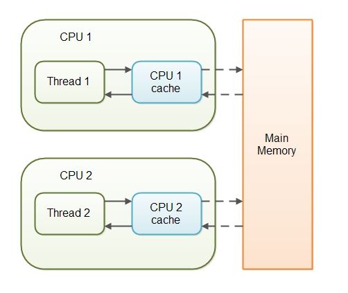
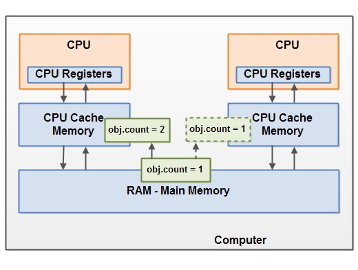

# Thread(쓰레드)

## 프로세스와 스레드

### 프로세스


* 운영체제로부터 자원을 할당받는 작업 단위
* 동적인 개념으로는 실행된 프로그램을 의미

#### 멀티 프로세스

* 컴퓨터 한대에 CPU를 추가하여 프로세스를 동시에 실행되도록 한다.
* 프로세스는 독립된 메모리 영역을 사용하기 때문에 멀티 스레드 방식처럼 공유하는 메모리가 없어 Conext Switching이 발생하면 캐시에 있는 모든 데이터를 리셋하고 캐시 정보를 다시 불러와야 하므로 오버헤드가 발생할 수 있다.

### 스레드


* 프로세스가 할당받은 자원을 이용하는 실행 단위
* 프로세스의 Data 영역과 Code 영역, Heap 영역은 스레드 간에 공유 한다.

#### 멀티 스레드

* 단일 프로세스내에서 여러 스레드가 동시에 실행되도록 한다.
* 스레드 사이의 작업량이 작아 Context Switching이 빠르다 (Stack 영역만 변경하면 된다)
* 디버깅이 까다롭다.
* 멀티 스레드의 경우 자원을 공유하면서 동기화 문제가 발생한다.

## 스레드 구현 방법

### 1. Runnable 인터페이스 구현

Runnable은 run( ) 이라는 단 하나의 메소드를 제공한다 Runnable 인터페이스로 구현한 클래스를 쓰레드로 바로 시작할 수는 없다. Thread 클래스의 생성자에 해당 객체를 추가하여 시작해주어야만 한다.

```java
public static class ThreadTest implements Runnable {
        public void run() {
            System.out.println(Thread.currentThread().getName());
        }
    }

// 메인 메서드에서 인스턴스 생성 방법
Thread t1 = new Thread(new ThreadTest()); // new Thread(Runnable target) 생성자 이용
```

### 2. Thread 클래스 상속

Thread 클래스는 많은 메소드를 포함하고 있다. Thread 클래스를 상속하여 만든 클래스는 start()메소드를 바로 호출할 수 있다. 쓰레드를 시작하는 메소드는 start()이며, 쓰레드가 시작하면 수행되는 메소드는 run()이다.

```java
public static class ThreadTest2 extends Thread {
        public void run() {
            System.out.println(getName());
        }
    }

// 메인 메서드에서 인스턴스 생성 방법
Thread t1 = new ThreadTest2();
```

## 스레드 동기화

### synchronized

메소드나 특정 블럭에 동기화 영역을 지정할 수 있다. 동기화 블록 내에서는 먼저 점유한 쓰레드만 실행 가능하고 다른 쓰레드들은 블록 안의 쓰레드가 실행을 마치고 블록을 벗어날 때까지 블록 상태가 된다.

단, synchronized 블록은 다른 쓰레드를 블록 시키기 때문에 성능에 치명적인 영향을 줄 수 있다. 사용 빈도가 높거나 동기화 블록을 크게 잡을 경우 서비스에 영향이 없는지 고려해볼 필요가 있다.

#### 적용 가능한 블록

*   인스턴스 메소드

    ```
    public synchronized void add(int value){
        this.count += value;
    }
    ```
*   스태틱 메소드

    ```
    public static synchronized void add(int value){
        count += value;
    }
    ```
*   인스턴스 메소드 내 코드 블록

    ```
    public void add(int value){

      synchronized(this){
         this.count += value;   
      }
    }
    ```
*   스태틱 메소드 내 코드 블록

    ```
    public static void log2(String msg1, String msg2){
       synchronized(MyClass.class){
          log.writeln(msg1);
          log.writeln(msg2);  
       }
    }
    ```
*   Key를 이용한 코드 블록

    ```
    public int add(int n1, int n2){
         synchronized(this){      
              count++;
         }
         return n1+n2;
    };
    ```

### volatile

멀티 쓰레드간에 가시성을 동기화 시켜 준다. non-volatile 변수는 성능 이슈로 메인 메모리로 부터 CPU 캐시에 값을 복사하여 작업을 수행한다. 만약 다수의 쓰레드가 non-volatile 값을 읽게 되면 각각의 CPU Cache에 저장된 값이 다르기 때문에 값이 불일치 할 수 있는 경우가 발생하게 된다.



하지만 volatile 키워드를 추가하게 되면 메인 메모리에 저장하고 읽어오기 때문에 불일치 문제를 해결할 수 있게 된다.

 (1).png>)

#### 언제 사용하면 좋을까?

volatile은 멀티 쓰레드 환경에서 특정 쓰레드만 write할 경우에만 유용하다. 만약 두 개 이상의 쓰레드가 write할 경우 불일치는 그대로 발생하게 된다. 이 경우에는 synchronized를 사용해야 한다.

### concurrent package

java.util.concurrent.atomic 하위에 동기화를 보장해주는 타입을 제공해준다. 그러므로 특정 변수를 동기화할 경우에는 동기화 타입을 사용하는 것도 하나의 해결 방안이 될 수 있다.

#### Atomic 타입은 어떻게 동기화가 구현되어 있을까?

```java
public class AtomicInteger extends Number implements java.io.Serializable { 
    private volatile int value; 

		public final int incrementAndGet() { 
        int current; 
        int next; 
        do { 
            current = get(); next = current + 1; 
        } 
        while (!compareAndSet(current, next)); 
        
        return next; 
    } 
        
    public final boolean compareAndSet(int expect, int update) { 
        return unsafe.compareAndSwapInt(this, valueOffset, expect, update); 
    } 
}
```

내부를 확인해보면 실제 변수는 volatile로 되어있는 걸 확인할 수 있다.

#### 동기화를 보장하지 못하는 게 아닐까?

volatile 타입만 사용했다면 두 개 이상의 쓰레드에서 write할 경우 동기화를 보장하지 못할 것이다. 그러나 위의 코드는 단순히 volatile 타입만 사용하는게 아니라 잘 보면 동기화 해주는 로직이 들어가 있다.

#### CAS(Compare and Swap)

CAS란 특정 메모리 위치의 값이 주어진 값을 비교하여 같으면 새로운 값으로 대체한다. 만약 현재 쓰레드가 가지고 있는 값과 메인 메모리의 값이 다를 경우 메인 메모리의 값으로 대체 하고 다시 비교한다. 일치 할때 까지 메인 메모리의 값으로 재할당 되어 동기화를 한 이후에 값을 대체해주기 때문에 두개 이상의 쓰레드가 write를 하더라도 동기화 할 수 있게 된다.



Atomic 타입도 메인 메모리의 데이터로 동기화 해주는 로직이 최신화 될때까지 동작하기 때문에 synchronized 와 동일하게 성능에 영향을 줄 수 있는 단점이 있다. 그러므로 서비스에 부하가 걸릴 수 도 있으니 유의해서 사용해야 한다.

## 동기화 회피

동기화 하는 기능은 생각만큼 쉽지 않다. 그리고 위와 같이 동기화를 해결 한다고 해도 동기화 에 들어가는 비용(코드 + 성능)은 무시할 수 없다. 그렇다면 우리는 매번 이런 고민을 안고 가야 할까? 동기화를 해결할 수 있는 다른 대안이 있다. 바로 동기화를 하지 않고 회피하는 방법이다.

공유 데이터에 대한 동기화를 회피하고 공유 되지 않도록 불변으로 제공하는 방법이다.

### 데이터 불변성 확보

공유 데이터를 final로 선언하여 불변성을 제공한다고 하면 멀티 쓰레드 환경에서 공유 데이터를 각각의 쓰레드가 변경할 수 없게 되므로 동기화를 시킬 부분도 제공하지 않아도 된다.

```java
class Test {
	static final int MAX = 100;
}
```

### 데이터 사본 활용

공유 데이터를 각각의 쓰레드에선 복사하여 사용함으로써 해당 쓰레드에서 수정했다고 하더라도 해당 쓰레드에서만 유지되므로 공유 데이터는 동기화 해주지 않아도 된다.

```java
// Java 9 - unmodifiableList
List<String> fruits = new ArrayList<>();

fruits.add("Apple");
fruits.add("Banana");
fruits.add("Cherry");
fruits = Collections.unmodifiableList(fruits);

// Java 9 - of
List<String> fruits = List.of("Apple", "Banana", "Cherry"); // [Apple, Banana, Cherry]
fruits.add("Lemon"); // UnsupportedOperationException

Map<Integer, String> fruits = Map.of(1, "Apple", 2, "Banana", 3, "Cherry"); // {1=Apple, 2=Banana, 3=Cherry}
fruits.put(4, "Lemon"); // UnsupportedOperationException

Set<String> fruits = Set.of("Apple", "Banana", "Cherry", "Apple"); // IllegalArgumentException

// Java 8 - Array
List<String> fruits = Arrays.asList("Apple", "Banana", "Cherry");

// Java 8 - unmodifiableList
List<String> fruits = Stream
    .of("Apple", "Banana", "Cherry")
    .collect(collectingAndThen(toList(), Collections::unmodifiableList));

// Guaba 라이브러리
import com.google.common.collect.ImmutableList;

List<String> fruits = ImmutableList.of("Apple", "Banana", "Cherry");
fruits.add("Lemon"); // UnsupportedOperationException

```

## 참고

* [https://juyoung-1008.tistory.com/47](https://juyoung-1008.tistory.com/47)
* [https://velog.io/@naljajm/프로세스Process와-스레드Thread-btk169s36j](https://velog.io/@naljajm/%ED%94%84%EB%A1%9C%EC%84%B8%EC%8A%A4Process%EC%99%80-%EC%8A%A4%EB%A0%88%EB%93%9CThread-btk169s36j)
* [https://magi82.github.io/process-thread/](https://magi82.github.io/process-thread/)
* [https://gmlwjd9405.github.io/2018/09/14/process-vs-thread.html](https://gmlwjd9405.github.io/2018/09/14/process-vs-thread.html)
* [https://mygumi.tistory.com/112](https://mygumi.tistory.com/112)
* [https://www.daleseo.com/java9-immutable-collections/](https://www.daleseo.com/java9-immutable-collections/)
