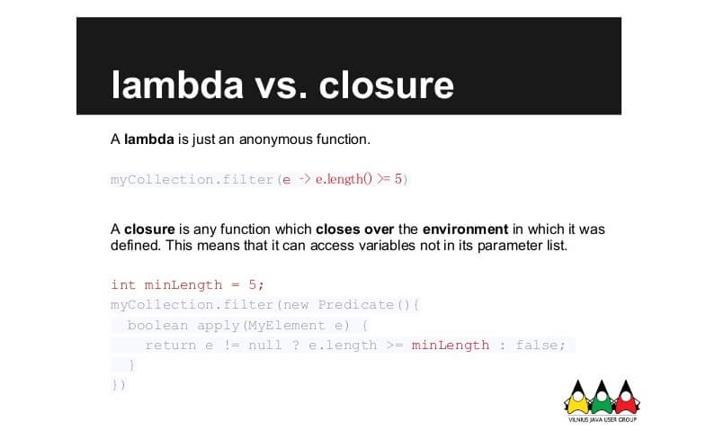

# 람다와 클로저



## 람다란 무엇인가?

### 람다 표현식은 메서드로 전달할 수 있는 익명 함수를 단순화한 것이다.

* 익명 : 보통의 메서드와 달리 이름이 없으므로 익명이라 표현한다.
* 함수 : 람다는 메서드처럼 특정 클래스에 종속되지 않으므로 함수라고 부른다.
* 전달 : 람다 표현식을 메서드 인수로 전달하거나 변수로 저장할 수 있다.
* 간경성 : 익명 클래스처럼 많은 자질구레한 코드를 구현할 필요가 없다.

### 람다의 구성 요소

```java
(Apple a) -> a.getWeight() > 150
```

* 파라미터 리스트
* 화살표 : 파라미터 리스트와 바디를 구분한다.
* 바디 : 람다의 반환값에 해당하는 표현식

### 어디에, 어떻게 람다를 사용할까?

람다 표현식으로 함수형 인터페이스의 추상 메서드 구현을 직접 전달할 수 있으므로 전체 표현식을 함수형 인터페이스의 인스턴스로 취급\(기술적으로 함수형 인터페이스를 concreate 구현한 클래스의 인스턴스\) 할 수 있다.

함수형 인터페이스에 대한 설명

* 하나의 추상 메서드를 지정하는 인터페이스이다.
* default 메소드는 추상 메소드 범주에 제외되므로 여러개 정의해도 상관없다.
* 함수형 인터페이스로 명확하게 사용하기 위해서는 @FunctionalInterface를 사용하여 두 개 이상의 추상 메서드를 만들지 못하도록 제한을 둘 수 있다.

### 람다 표현식 장점

* 코드를 간결하게 작성할 수 있다.
* 보일러 플레이트를 제거하여 로직만 작성하면 되므로 가독성이 향상되었다.
* 병렬 프로그래밍이 용이하다.

### 람다 표현식 단점

* 디버깅하기 까다롭다.
* 지나치게 남발하면 코드가 이해하기 어렵고 지저분해질 수 있다.

## 클로저란?

클로저는 클래스 내에 정의한 변수를 람다가 직접 사용하는 것을 의미한다. 더 일반적으로 표현하자면, 자신을 둘러싼 context내의 변수 등에 접근 하는 것을 의미한다. 그래서 간단한 원칙은 람다가 자신의 범위 밖에 있는 변수를 사용하면 그것은 동시에 클로저라는 것이다.

```java
public class Store {
    private String storeNo = "9000";

    public void lambdaClosure() {
        Function<String,Integer> lambdaFunction = i -> {
						// lambda 내에서 Store 클래스 멤버 변수인 storeNo를 사용!!
            System.out.println(this.storeNo); 
            return null;
        };
    }
}
```

#### 람다가 항상 클로저는 아니지만 클로저는 항상 람다다

클로저를 사용하기 위해서는 외부 변수는 가변적이면 안된다. java 8 이전에서는 불변을 보장하기 위해 final 키워드를 컴파일 단계에서 체크하였지만 java 8 이후부터는 final이 없어도 사용할 수 는 있다. 그러나 람다 내에서 수정한다고 하면 오류 메시지를 확인할 수 있다.


### 클로저는 Java 8 에서부터 적용된 기능인가?

그렇지 않다. 클로저는 람다 문법이 존재하지 않았을 때부터 제공하던 기능이었다. 다음의 익명 클래스에서 그 예를 살펴보자.

```java
@since Java 1.1!
void anonymousClassClosure() {
    Server server = new HttpServer();
    waitFor(new Condition() {
        @Override
        public Boolean isSatisfied() {
            return !server.isRunning();
        }
    });
}
```

server 변수는 Condition 인터페이스를 구현한 익명 인스턴스에서 사용되고 있다. 이는 익명 클래스 인스턴스인 동시에 클로저다.

### 익명 클래스와 람다의 클로저는 같은 개념일까?

범위에 따라 다르다. 그러나 일반적으로 클래스 내의 멤버 변수에 대한 접근은 람다에서만 사용 가능하다. 람다의 경우에는 호출한 클래스에 접근이 가능하지만 익명 클래스는 익명 클래스내에서만 접근이 가능하다. 이게 익명 클래스와 람다의 차이점이라고 할 수 있겠다. 그러나 클래스를 직접 사용하면 익명 클래스 내에서도 클래스의 변수를 직접 접근할 수 있다.

```java
public class Store {
    private String storeNo = "9000";
    
    public void anonymousClosure() {
        String anonymousNo = "1000";
        Function<String, Integer> anonymousFunction = new Function<String, Integer>() {
            @Override
            public Integer apply(String s) {
								// Store class의 storeNo를 직접 접근할 수 있다. 
                System.out.println(Store.this.storeNo);
                return Integer.parseInt(anonymousNo);
            }
        };
    }
}
```

## 클로저는 주의해서 사용하자

클로저를 사용하게 되면 외부의 영향에 따라 동일한 input에 대해서도 다른 output을 제공하기 때문에 멱등성을 위반하게 된다. 그렇게 되면 진정한 함수형 프로그래밍의 조건을 만족하지 못하게 된다. 함수형 프로그래밍은 일차 함수이면서 멱등성을 유지해야 하고 고차 함수로 이루어질 수 있어야 하기 때문이다.

## 참고

* [https://futurecreator.github.io/2018/08/09/java-lambda-and-closure/](https://futurecreator.github.io/2018/08/09/java-lambda-and-closure/)
* [https://12bme.tistory.com/361](https://12bme.tistory.com/361)
* [http://egloos.zum.com/ryukato/v/1160506](http://egloos.zum.com/ryukato/v/1160506)
* [http://wonwoo.ml/index.php/post/1135](http://wonwoo.ml/index.php/post/1135)

