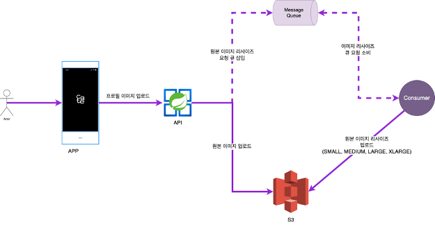

# 병렬처리를 이용한 이미지 리사이즈 개선

## 병렬처리를 이용한 이미지 리사이즈 개선


<figure><figcaption></figcaption></figure>


### 원본 이미지 사용

* 현재는 사용자의 원본 이미지를 그대로 S3에 업로드해서 사용해왔다
* 그렇다보니 네트워크 / 디바이스 성능에 따라 페이지 렌더링 되면서 이미지가 늦게 로드 되는 경우가 많았다
* 그리고 아이폰의 사진은 고화질이라 3MB 이상인 경우가 많았다
* 원본 이미지를 그대로 사용하기엔 컨텐츠가 늦게 로드 되다 보니 앱에 대한 퀄리티로 이어졌다
* 이미지 로드 개선은 다른 방법으로 개선할 수도 있다
* 스켈레톤 이미지나 프론트에서 자체 캐시를 사용할수도 있었지만 지금 당장 프론트쪽에 업무를 추가할순 없었다..

### 이미지 업로드 개선이 필요하다!

* 현실적으로 지금 당장 빠르게 해결할 방법은 백엔드쪽에서 원본 이미지를 경량화하는 하는수 밖에 없다..
* 단, 페이지마다 사용하는 이미지 사이즈가 다르기 때문에 4가지 유형으로 리사이즈해서 프론트에서 적절한 유형의 리사이즈 이미지를 사용하도록 한다 (SMALL, MEDIUM, LARGE, XLARGE)
* 추가적으로 이미지 업로드 기능이 원본 이미지 경량화 로직으로 인해 서비스 사용성에 영향이 있으면 안된다

### 이미지 리사이즈 플로우


<figure><figcaption></figcaption></figure>


* 기존에 사용하던 이미지 업로드 API는 그대로 유지하되 이미지가 업로드 되면 메시지큐에 리사이즈 요청 메시지를 전송한다
* 컨슈머는 업로드된 원본 이미지를 확인하고 4가지 유형으로 리사이즈를 수행한다
* 프론트에서는 규칙에 따라 리사이즈된 이미지를 사용하게 된다

### 이미지 리사이즈 컨슈머 구현 로직

<figure><figcaption></figcaption></figure>

#### 1. 사이즈별 이미지 업로드

* 4 가지 유형으로 리사이즈 하여 S3에 업로드 한다
* 각각의 리사이즈된 이미지는 HashMap에 저장하여 추후에 데이터베이스에 저장할 때 사용된다

#### 2. 리사이즈 이미지 업로드 내역 저장

* 이미지 업로드가 완료되면 S3에 저장한 이미지 경로를 사이즈별로 취합하여 한번에 데이터베이스에 저장한다

## 🤨 성능을 좀 더 개선할 수 없을까?

* 기존 로직은 사이즈 별로 루프문을 순회하면서 순차적으로 원본 이미지를 리사이즈하며 업로드했다
* 사이즈 별로 업로드 하는 로직은 개별 쓰레드로 독립적으로 수행해도 된다
* 사이즈 별로 업로드 하는 로직은 병렬로 수행하고 추후 데이터베이스에 저장할 데이터만 취합하여 저장하면 되겠다

### 그럼 수행시간을 측정해보자


<figure><figcaption></figcaption></figure>

> 객관적인 데이터를 측정하기 위해 이미지 업로드 로직을 2초 정도 시간을 소요하도록 로직을 수정하였다

#### stream 사용시 (Total 소요시간 : 8초)

```jsx
Image Resize upload start!!! time : 2022-12-18T20:55:21
Image Resize upload end!!! time : 2022-12-18T20:55:29
```

#### parallelStream 사용시 (Total 소요시간 : 2초)

```jsx
Image Resize upload start!!! time : 2022-12-18T21:31:54
Image Resize upload end!!! time : 2022-12-18T21:31:56
```

##

## 🤯 병렬처리시 주의해야 할 부분은?

###

### 병렬처리가 항상 정답은 아니다!!

* 병렬처리는 목록을 멀티 쓰레드로 병렬처리 하므로 성능적으로 무조건 유용하다고 생각할 수 있다
* 하지만 이는 잘못된 생각이다
* 병렬처리는 잘못 사용할 경우 오히려 독이 될수 있다
* 예를 들어, 병렬처리 하는 로직에서 공유 데이터를 가공하는 경우가 있으면 이는 오히려 성능상 더 느려지는 효과가 나타날 수 있다.
* 쓰레드간 작업한 데이터를 공유 데이터에 병합하면서 동기화해주는 작업이 생각보다 많은 부하를 발생하게 된다
* 그리고 또한 단순하게 parallelStream을 사용하게 되면 애플리케이션의 전체적인 성능을 떨어뜨릴수 있게 된다
* 왜냐하면 자바 애플리케이션은 멀티 쓰레드로 동작하기 때문에 일정량의 쓰레드를 할당하며 사용자 요청을 병렬로 처리한다.
* 그래서 parallelStream을 사용하게 되면 애플리케이션에서 할당해 놓은 쓰레드를 임의로 끌어쓰기 때문에 실제로 사용자 요청에 대한 처리를 수행할 쓰레드가 부족할 수 있다

### parallelStream 을 사용할때는 쓰레드 그룹을 지정하라!


<figure><figcaption></figcaption></figure>

* parallelStream을 사용하게 되면 가용 가능한 쓰레드를 임의로 사용하기 때문에 병렬처리에 사용할 쓰레드 갯수는 지정해서 수행하는게 효율적이다
* ForkJoinPool을 사용하여 가용할 쓰레드 갯수를 제한할 수 있다.
* 현재는 이미지 리사이즈 유형만큼만 병렬처리하기 때문에 리사이즈 컬렉션 갯수만큼 쓰레드풀을 지정하였다

<figure><figcaption></figcaption></figure>



💡 모든 기술은 양면성을 가지고 있다. \
새로운 기술을 도입하기 전에 항상 공식문서를 확인하거나 다양한 사용 사례를 살펴보고 우리 서비스에 적합한지 확인을 해야 한다

