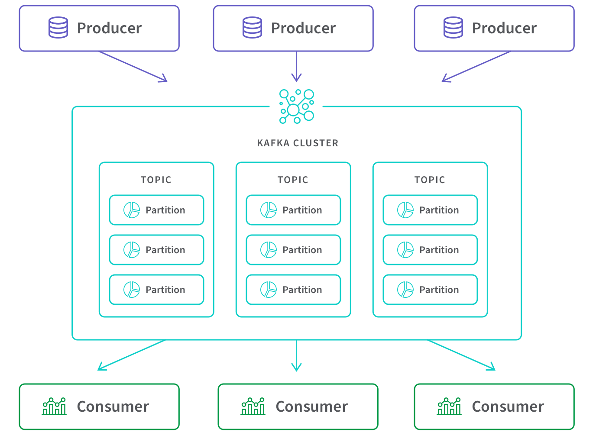
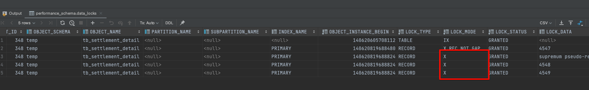

# \[102호] (레거시 시스템) 개편의 기술 - 배달 플랫폼에서 겪은 N번의 개편 경험기


💡 By 권용근 우아한형제들

개발자라면 피할 수 없는 시스템 개편. 배달의민족 결제 시스템, 주문 시스템, 프런트 시스템, 회원 시스템을 개편하면서 터득한 성공적인 개편 리딩 경험과 기술을 소개합니다. ‘왜 우리는 계속 개편을 하고 있는 것일까?’, ‘개편을 어떻게 해야 할까?’ 등 평소 개편에 대한 궁금증이 있었던 분들께 도움이 될 것입니다.


### Q. 레거시로 정의하는 기준은 무엇인고 개선할수는 없을까?

*   현재는 비주류인 기술들

    → 개발자들에게 시간을 더 많이 주어 유지보수 및 기능 확장을 할 수 있다
*   현재는 성능이 부족한 시스템

    → 비용을 더 지불하여 부족한 성능만큼 보충한다
*   새로운 요구사항을 대응할 수 없는(어려운) 시스템

    → 새로운 시스템을 만든다

### Q. 그럼 개편은 어떻게 결정되는가?

<figure><figcaption></figcaption></figure>

* 투자자본수익률(ROI)
* 노력 대비 이익을 따져봐야 한다
* 적당한 시기에 개편을 하게되면 큰 효율을 얻게된다

<figure><figcaption></figcaption></figure>

* 개편의 목적은 서비스를 지속, 설정 시키기 위해 일어난다

### Q. 경험한 개편은 어떤게 있는가?

*   💰 결제시스템 개편

    → 폭발적인 성장으로 인한 데이터베이스 파티셔닝 도입
*   🛍 주문시스템 개편

    → 데이터 모델링 구조가 더 많은 트래픽을 처리하기에는 부족하여 모델 구조 변경
*   🏪 가게노출시스템 개편

    → 새로운 비즈니스 프로젝트를 수용하기 위해서 기존 레거시 시스템을 개편
*   👩‍🔧 회원시스템 개편

    → 인프라 성능에 한계치, 스케일 아웃.업을 할수 없는 상황이라 개선하기 위함, 도메인을 분리하기 위함(회원, 인증)

### Q. 개편하면서 적용했던 기술은?

#### 1. 의존성을 한 방향으로 정리

<figure><figcaption></figcaption></figure>

* 상호 의존하다보면 스파게티 같은 의존성이 발생한다
  * 처음엔 잘 설계될지 몰라도 새로운 기능 개발하면서 재사용성을 높이기위해 의존성을 추가하다 보면 어느새 상호 의존된 모듈이 많이 발생하게 된다
* 스파게티 코드를 풀수 있는 방법은?
  * 의존성을 한방향으로 설정하라
  * 의존성의 깊이로 층을 형성하라
  * 같은 층을 의존하는 것도 지양하라
* 스파게티 코드를 풀게되면 사이드 이펙트를 줄일 수 있다

#### 2. 변경 대상에 대한 경계를 나누자(책임과 역할이 명확한 계층과 객체를 정의)

<figure><figcaption></figcaption></figure>

* 책임과 역할이 제각각인것을 정리하자
* 각 계층별 변경된 내용을 별도 계층으로 우선 나누어본다(ex. 패키지 또는 레포지토리)
* 독립된 계층을 어떤 성격인지 파악한 후 정의하여 관리한다
* 만약 변경에 대한 코드가 레파지토리에 집중되어 있다면 디비를 개편해야 한다
* 책임을 분리하여 변경에 대한 가시성을 확보하면 유지보수에 용이하다

#### 3. 테스트를 확보한다

<figure><figcaption></figcaption></figure>

* 개편하면서 변경되는 부분에 대한 테스트 케이스는 무조건 있어야 한다
* 될수 있으면 상위 레이어까지 테스트 커버리지를 충족하는게 안전하다
* 테스트의 중요성…당연한거다.. 하지만.. 현실은 어렵다.. 그렇기에 개편은 정말 어렵다.. 일정도 지키기 어렵다..ㅜ
* ngrinder를 도입해서 데이터 풀을 맥시멈으로 사용하도록 하여 개편에 대한 안정성을 높일수 있었다

<figure><figcaption>
https://blog.naver.com/wideeyed/222173944239
</figcaption></figure>

#### 4. 프로젝트 가시성 확보

<figure><figcaption></figcaption></figure>

* 라면을 제조하는걸 하나의 프로젝트라고 생각해보자
* 라면 제조 프로젝트는 대략 몇분 정도 소요될것 같은가?
* 5분? 7분?(물 끓이기 → 면 넣기 → 스프 넣기 → 계란도 넣기 → 끓이기)
* 실제로는 6분 35초가 걸린다고 한다..
* 이렇듯 어느 프로젝트를 전체 범위로 일정을 산정하다 보면 추상적인 경우가 있다
* 그러니 좀더 큰 문제를 작은 문제로 풀어나가면서 일정을 좀더 가시화 할 필요가 있다
* 일정에 대해서 예측을 한다는건 리스크를 잘 관리할 수 있다는 뜻이다
* 가장 최근에는 엑셀 시트에서 WBS로 간트차트를 작성하였다
* 가시성이 확보되면 이해 관계자한테 설듯하기도 쉽고 진행상황 공유도 수월해 진다

#### 5. 도메인 이해 공유

<figure><figcaption></figcaption></figure>

#### Q. 도메인에 대한 이해가 차이나면 어떤 상황이 발생하는가?

* 의사결정 과정에 참여하기 어렵다
* 큰 부담을 갖게 된다
* 똑같은 요구사항에 대해서도 다르게 이해한다
* 같이 일하는 과정에서 굉장히 많은 커뮤니케이션 비용이 든다

#### Q. 그럼 어떻게 도메인에 대한 이해 차이를 좁혀갈 수 있을까?

* 이벤트 스토밍을 통해서 도메인에 대해 같이 이해하는 자리를 갖자(발표자는 이 과정에서 굉장히 많은 도움을 받았다고 한다)
* KCD 도메인 지식 탐구를 위한 이벤트 스토밍 강의 들어볼것

#### 6. 변화를 측정한다

<figure><figcaption></figcaption></figure>

* 개편을 하면서 변화된 수치를 측정하여 트레이드 오프를 해본다
* 이 측정을 통해서 불확실성을 좀 더 낮출수 있는 기대심리가 있다
