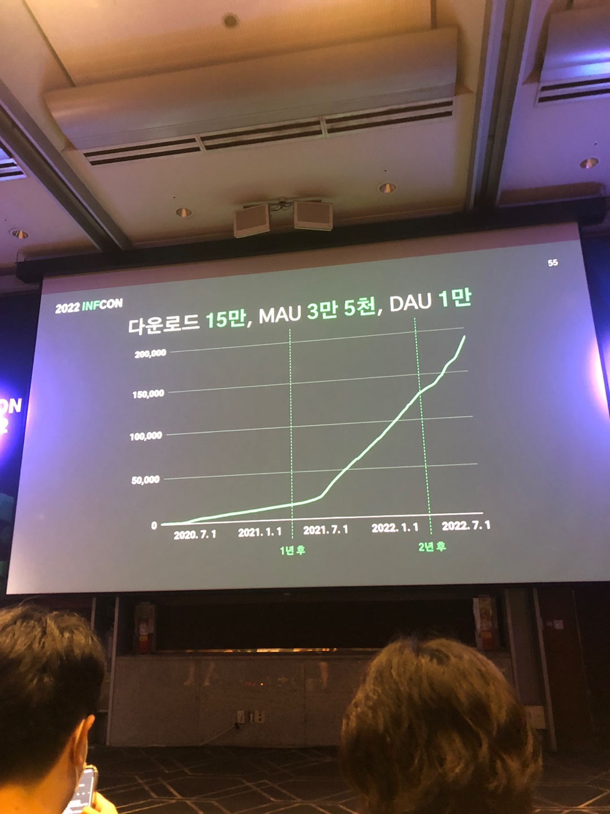

# \[103호] 코드 리뷰의 또 다른 접근 방법: Pull Requests vs. Stacked Changes


💡 By **서지연** 컨택스츠아이오

뉴스, 커머스, AI 여러 도메인을 탐험하며 세상을 더 즐겁게 할 제품 만들기를 좋아하는 백엔드 개발자입니다. 최근에는 얼굴 인식 기술과 건물 부대시설을 연동하여 보다 스마트한 오피스 생활을 만드는 일을 했습니다. 코드 리뷰, 그리고 함께 성장하는 개발 문화에 관심이 많습니다. ‘나는프로그래머다’ 팟캐스트를 진행했고, 개발자 수다가 있는 곳이라면 ‘치즈’라는 이름으로 어디든 나타납니다.

개발 문화 하면 코드 리뷰! 코드 리뷰 하면 GitHub 풀리퀘스트! 풀리퀘스트를 잘하기 위해서는 branch 전략, Rebase, Merge 등 공부해야할 것들이 참 많습니다. 주위를 둘러보면 다들 당연하게 사용하고 있는 것 같긴 한데, 왜 나에겐 복잡하게 느껴지는 걸까요? GitHub 풀리퀘스트 말고 다른 코드 리뷰 방식은 없을까요?

구글은 ‘Critique’, 메타는 ‘Phabricator’라는 조금 다른 방식의 코드 리뷰 도구를 사용하고 있습니다. 우리가 자주 사용하고 있는 풀리퀘스트 방법과는 어떤 점이 다른지, 어떠한 장점들이 있는지, 또 우리는 어떻게 차용해 볼 수 있을지 함께 알아봅시다.


### Q. 코드 리뷰를 잘한다는건 무엇일까?

*   만약 주니어 개발자가 물어본다면 당신은 어떻게 대답할것인가?

    <figure><figcaption></figcaption></figure>
* 생각보다 구체적인 답을 내려주기는 어렵다..

#### 하지만 좋은 코드 리뷰 문화를 만들어갈 수 있는 조건은 몇가지 존재 한다

* 적당한 크기의 코드 변경
* 코드 작업의 명확성
* 빠른 속도(?)

### Q. 그렇다면 왜 좋은 코드 리뷰를 하지 못할까?

<figure><figcaption></figcaption></figure>

* Pull request를 생성하다보면 반영하고 싶은 다양한 태스크 들이 눈에 들어온다
* 그러다 보면 여러가지 태스크를 하나의 Pull request에 담기는 경우가 많다
* 그러다보면 어느새 Pull request의 file change 수는 많이지고 변경 코드도 커지게 된다

### Q. 좋은 코드 리뷰 상태가 되지 않으면 어떻게 될까?

<figure><figcaption></figcaption></figure>

* 리뷰어 들은 많은 변경 내역에 대해 부담을 느끼게 된다
* 리뷰가 길어지면 다양한 변경 내역이 타겟 브랜치에 쌓이기 때문에 충돌 때문에 머지를 진행하기 어려워진다(심적 부담감..ㅜ)

### Q. 다양한 변경 내역을 한눈에 알아볼수 없을까?

* 코드의 변경 흐름을 좌우가 아닌 위에서 아래로 스택을 쌓듯이 보여주면 된다.

<figure><figcaption></figcaption></figure>

* 스택을 쌓듯이 변경내역을 쌓게 되면 스택당 쌓이는 변경 내역 크기를 명확하게 볼수 있다
* 스택당 변경 내역을 확인하니 변경된 코드 목적도 더 분명해진다
* 리뷰어도 변경 내역과 변경 사유가 명확해지니 좀더 리뷰에 집중할수 있게 된다

### Q. Stack changed는 어떻게 할 수 있을까?

* 구글과 메타에서 제공해주는 형상관리 서비스가 있다

<figure><figcaption></figcaption></figure>

* 하지만 stack별로 변경 내역을 쌓는걸 보기 위해 형상관리 툴을 변경하는건 쉽지 않다..
* 변경에 대한 부담감 뿐만 아니라 메타에서 제공해주는 phabricator는 더이상 서비스를 유지보수 하고 있지 않는다고 한다

#### 기존에 사용하던 형상관리(git)툴을 유지하면서 스택별로 변경내역을 볼수 있을순 없을까?

* Git에서 사용할 수 있는 별도 플러그인을 사용할 수 있다(graphite)

<figure><figcaption></figcaption></figure>

### Q. Graphite를 사용해보자

* 변경 내역별로 스택을 쌓아보자

<figure><figcaption></figcaption></figure>

* 변경된 내역을 푸시해보자

<figure><figcaption></figcaption></figure>

* 변경된 내역을 대시보드를 통해 확인해보자

<figure><figcaption></figcaption></figure>

* Github에서 보여주는 UI와 graphite에서 제공하는 UI를 비교해보자

<figure><figcaption></figcaption></figure>

* 그런데 왜 github에서는 해당 기능을 제공하지 않을까?

<figure><figcaption></figcaption></figure>

### Q. 그럼 Graphite를 무조건 도입하는게 좋을까?

| Github               | Graphite          |
| -------------------- | ----------------- |
| 기능 단위 변경             | 코드 변화의 단위 변경      |
| 작업 전체 변경분 비교         | Stack 별로 비교       |
| 변경 내역을 타겟 브랜치와 전체 비교 | 변경 내역을 차곡차곡 쌓임    |
| 여러 팀이 함께 작업하는 경우 유용  | 작은 변경이 많은 경우 유용   |
| 잦은 리뷰 처리를 하지 않을 경우   | 팀이 빠르게 운영되고 하는 경우 |
