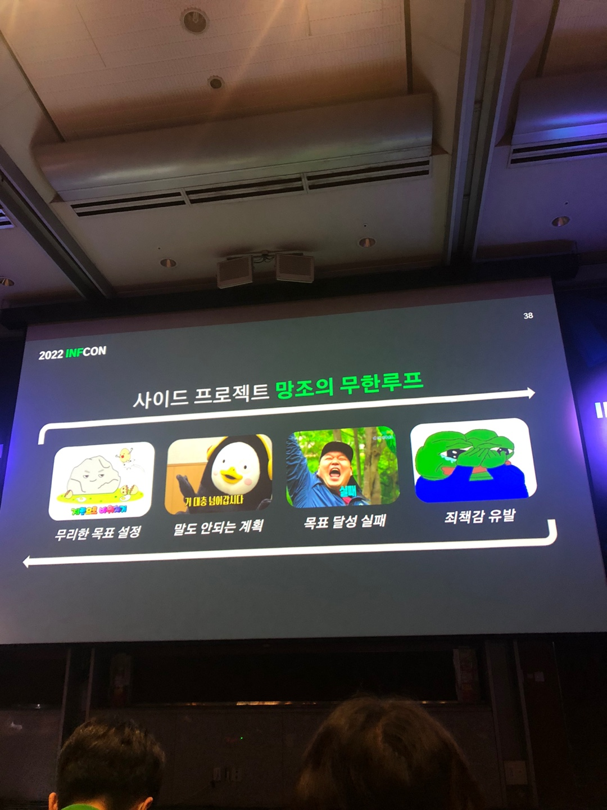
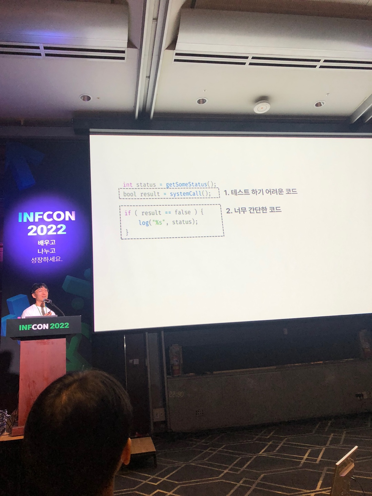

# \[104호] 사이드 프로젝트 만세! - 기술만큼 중요했던 제품과 팀 성장기


💡 By **방진호** Chromium 오픈소스 개발자

한때 10억 다운로드 모바일 브라우저 개발자로 일했던 오픈소스 개발자입니다. 개인적인 관심으로 Chromium/Blink를 비롯해 W3C, Node.js 다양한 웹 플랫폼 관련 프로젝트에 지속해서 기여하고 있습니다.

우연한 계기로 수천 명이 참여하는 오픈소스 프로젝트에 참여하면서 개발자로서 다양한 경험과 배움을 얻어 성장할 수 있었습니다. 그러나 한편으로는 제 기여가 제품에 미치는 영향력이 프로젝트 전체로 봤을 땐 작은 것 같아 늘 아쉬움이 있었습니다. 이러한 아쉬움을 극복하고 더 나은 제품을 만들어보자는 열정으로 2년 전 ‘바나나 브라우저’라는 사이드 프로젝트를 시작하였습니다.

지난 2년 동안 우리는 14번의 메이저 버전을 세상 밖으로 내보냈고, 시장에서 꽤 좋은 평가를 받고 있습니다(15만 다운로드, 평점 4.8/5.0). 이 과정에서 우리는 좋은 제품을 만들기 위해선 기술적 성장뿐만 아니라 다양한 부분의 복합적인 이해와 성장이 필요하다는 것을 배웠습니다. 이 세션에서는 제품과 팀이 어떻게 성장하게 되었는지 그 과정에 대한 경험담을 공유하고자 합니다. 개발 동기, 첫 출시까지의 전략과 과정, 위기 극복 등의 내용 등을 담았습니다.


### Q. 발표의 주제는 무엇이었나?

<figure><figcaption></figcaption></figure>

* 사이드 프로젝트를 진행하면서 겪어왔던 경험들을 공유하고자 나왔다

### Q. 왜 사이드 프로젝트를 하게 되었나?

* 제품의 전반적으로 참여하기 어려웠다..(삼성전자 다니고 계심..)
* 오픈소스 커미터 활동도 하였지만 영향력을 발휘하긴 어려웠다…

### Q. 왜 하필 브라우저였나?

* 내가 가장 좋아하고 즐거운 것
* 상대적으로 사용자 확보가 쉬운 것(?)
* 눈에 밟히는 메이저 브라우저들의 아쉬운 점을 개선하고자..

### Q. 사이드 프로젝트를 하면서 실패하는 이유는 무엇일까?

<figure><figcaption></figcaption></figure>

* 본업과 사이드 프로젝트 사이에서 시간 관리의 어려움
* 세상에는 사이드 프로젝트보다 재밌는 일들이 너무 많음
* 프로젝트에 참여하는 모두가 같은 마음일 수 없음..ㅜㅜ
* 리스크를 관리하는 매니저 역할의 부재
* 무리한 목표 설정으로 인한 낮은 성취감과 죄책감의 반복..ㅜ

### Q. 그렇다면 난관을 어떻게 해결하였나?

* 주도적일 것이라는 환상에서 벗어나기
  * 발표자 역할은 팀원들이 주도성과 무관하게 평균 이상의 성과를 낼 수 있는 환경을 만들어 가는 것
* 적절한 커뮤니케이션 동기화
  * 스크럼 보드 적극 활용
  * Slack으로 자주 진행상황 공유
  * 일주일에 최소 한 번 미팅하기
* 팀원들에게 작은 성공 제공
  * 태스크 잘게 쪼개기
  * 패치 사이즈 줄이기
  * 패딩 일정 도입(기대하는 일정과 달리 지연되는 것을 방지하기 위해 패딩 일정 도입)
* 회고 횟수 줄여 죄책감 유발 상황 개선
* 아키텍처 개선하여 작업 의존성 제거

#### 아키텍처 개선하여 작업 의존성 제거

<figure><figcaption></figcaption></figure>

* 의존성이 낮아지기 때문에 효과적인 협업 가능
* 적절하게 기술 부채를 활용할 수 있음
* 실패하더라도 죄책감도 낮아짐
* 코드리뷰 및 테스트 완화
* 1:1 면담을 통해 우쭈쭈하기

### Q. 이 과정을 통해 배운것은 무엇인가?

<figure><figcaption></figcaption></figure>

* 서로가 신뢰할 수 있는 환경을 만드는게 매우 중요하다
* 모두가 좋다고 말하는 기술이나 방법론도 주어진 상황과 팀에 맞지 않으면 독이 될수 있다
* 적어도 사이드 프로젝트에서는 제품보다도 팀이 더 중요하다
