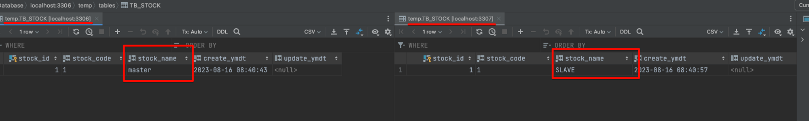

# DB 트래픽 분산시키기(feat. Routing Datasource)

## DB 트래픽을 왜 분산시켜야 하지?

* 데이터베이스 트래픽을 분산시키는 이유는 간단하다. 데이터베이스의 더 많은 가용성을 확보하기 위함이다
* 데이터베이스에서 가용성을 확보한다는 것은 더 많은 I/O 작업을 수행할 수 있다는 것을 의미한다
* 데이터베이스 I/O 작업량에 따라서 처리할 수 있는 요청은 한계가 있다.
* 메모리가 가득 찰수도 있고, 커넥션 풀이 부족할 수도 있고, 물리적인 디스크 용량이 가득찰 수 있다


### 그럼 트래픽을 분산시키는 거 말고 다른 방법은 없나?

* 물론 트래픽을 분산시키지 않고도 가용성을 확보하는 방법은 다양하다\


**간단하게는 데이터베이스 서버 스펙을 향상시킬 수 있다**

* 그러나 데이터베이스 서버 스펙을 향상 시키는건 실제로 많은 비용이 발생할 수 있다\


**그래도 부하가 발생한다면 샤딩으로 데이터를 분산처리할 수 있을 것이다**

* 그런데 샤딩으로 데이터를 분산처리하고 사용하는 과정은 그리 간단하지는 않다\


**그럼 다음에 시도해볼 수 있는건 서비스에 따라 데이터베이스를 독립적으로 분리하는것이다**

* MSA를 하게된다면 자연스럽게 데이터베이스도 분리되겠지만 모놀리스에서 도메인별로 다중 데이터베이스를 사용하는건 조금 어색한 구조라고 생각한다\


**그럼 다음으로 시도해볼수 있는건 CQRS 패턴을 적용해서 Query용 데이터베이스와 Command용 데이터베이스를 분리시킬수 있을것이다**

* Command 용으로는 성능을 최대한 올리는 있는 NoSQL을 사용할 것이고, Query용으로는 연관관계를 좀 더 효율적으로 표현할 수 있도록 RDMS를 사용할 수 있다
* 그리고 서로 다른 두 데이터베이스는 메시지 큐를 통해서 동기화 작업을 이뤄지게 된다. 설명은 간단히 했지만 실제 동기화 구현 작업은 더 많은 비용(시간 + 인력)이 필요할 것이다
* 방법은 다양하지만 그 중에서도 트래픽을 분산시키는 방법은 주어진 환경에서 가장 적은 비용으로 데이터베이스의 가용성을 확보할 수 있는 방법이라고 볼 수 있다


## 데이터베이스는 어떻게 분리하지?

* 단일 데이터베이스를 사용하더라도 백업용 또는 장애 복구용도로 SLAVE 데이터베이스를 두어 replication 과정을 거쳐 데이터가 SLAVE에 복제하게 된다
* replication 방법은 다양하지만 일반적으로는 MASTER 데이터베이스에 수행되는 쿼리 기반으로 SLAVE에 동일하게 수행하여 데이터를 동기화 하는 방법이 있다
* 대부분 데이터베이스는 MASTER, SLAVE 구조로 운영되고 서비스 범위에 따라서 SLAVE를 여러개 두는 경우도 있다


## 그럼 읽기와 쓰기는 어떤 디비를 사용해야지?

* SLAVE 데이터베이스는 replication되어 단방향으로 데이터가 복제되기 때문에 직접 WRITE를 하게되면 MASTER 데이터베이스와 데이터 정합성이 깨지게 된다
* 그래서 보통은 SLAVE 데이터베이스에는 직접 WRITE하지 못하도록 제한한다
* 그러므로 쓰기는 MASTER 데이터베이스를 사용하고, 읽기는 SLAVE 데이터베이스를 사용하면 된다


## 분기처리는 어떻게 하지?

* ORM에 따라 조금씩 다르겠지만 우선은 MyBatis 기준으로 이야기해보겠다

### 일반적인 DataSource를 통해서 쿼리를 수행하는 과정

<figure><figcaption></figcaption></figure>

* sqlSessionTemplate은 PlatformTransactionManager를 사용한다
* PlatformTransactionManager는 인터페이스로 실제로 사용하는 구현 객체는DataSourceTransactionManager를 사용한다
* 별도로 재정의하지 않는다면 기본적인 DataSourceTransactionManager를 사용하게 되고 DataSourceTransactionManager는 DataSource Bean을 사용하게 된다

### 그럼 동적으로 DataSource를 변경하려면 어떻게 해야할까?

<figure><figcaption></figcaption></figure>

*   트랜잭션 수행시 동적으로 Datasource를 정의하기 위해서는 PlatformTransactionManager를 재정의해야 한다

    ```java
    @Bean(name = "transactionManager")
    public PlatformTransactionManager transactionManager(@Qualifier("routingLazyDataSource") DataSource dataSource) {
    	DataSourceTransactionManager transactionManager = new DataSourceTransactionManager();
    	transactionManager.setDataSource(dataSource);
    	return transactionManager;
    }
    ```
*   재정의된 PlatformTransactionManager는 동적으로 DataSource를 할당할 수 있도록 LazyConnectionDataSourceProxy 객체를 사용한다

    ```java
    @Bean("routingLazyDataSource")
    public DataSource routingLazyDataSource(DataSource dataSource) {
    	return new LazyConnectionDataSourceProxy(dataSource);
    }
    ```
*   LazyConnectionDataSourceProxy에 정의된 dataSource는 AbstractRoutingDataSource를 상속받은 객체로 determineCurrentLookupKey를 오버라이드하게 되면 동적으로 할당된 dataSource 시점을 지정할 수 있다

    ```java
    public DataSource getMasterDataSource() {
    	DataSourceProperties dataSourceProperties = new DataSourceProperties();
    	dataSourceProperties.setDriverClassName("com.mysql.cj.jdbc.Driver");
    	dataSourceProperties.setUrl("jdbc:mysql://127.0.0.1:3306/temp");
    	dataSourceProperties.setUsername("root");
    	dataSourceProperties.setPassword("password");

    	return dataSourceProperties.initializeDataSourceBuilder().type(HikariDataSource.class).build();
    }

    private DataSource getSlaveDataSource() {
    	DataSourceProperties dataSourceProperties = new DataSourceProperties();
    	dataSourceProperties.setDriverClassName("com.mysql.cj.jdbc.Driver");
    	dataSourceProperties.setUrl("jdbc:mysql://127.0.0.1:3307/temp");
    	dataSourceProperties.setUsername("root");
    	dataSourceProperties.setPassword("password");

    	return dataSourceProperties.initializeDataSourceBuilder().type(HikariDataSource.class).build();
    }

    @Bean
    public DataSource dataSource() {
    	Map<Object, Object> targetDataSources = new HashMap<>();
    	targetDataSources.put("master", getMasterDataSource());
    	targetDataSources.put("slave", getSlaveDataSource());

    	CustomRoutingDataSource dataSource = new CustomRoutingDataSource();
    	dataSource.setTargetDataSources(targetDataSources);
    	dataSource.setDefaultTargetDataSource(getMasterDataSource());

    	return dataSource;
    }
    ```
* AbstractRoutingDataSource는 targetDataSource를 결정할 수 있는 객체이다
*   구체적으로는 AbstractRoutingDataSource 객체에서 connection을 가져올때 어느 데이터소스를 가져올지 determineCurrentLookupKey() 메서드를 호출해서 결정한다

    ```java
    // AbstractRoutingDataSource.class

    // 데이터 커넥션을 호출하는 메서드
    @Override
    public Connection getConnection() throws SQLException {
    	return determineTargetDataSource().getConnection();
    }

    // 데이터 커넥션을 호출하는 메서드
    @Override
    public Connection getConnection(String username, String password) throws SQLException {
    	return determineTargetDataSource().getConnection(username, password);
    }

    // 데이터 커넥션 호출하는 과정에서 DataSource 정보를 가져오는 로직
    protected DataSource determineTargetDataSource() {
    	Assert.notNull(this.resolvedDataSources, "DataSource router not initialized");
    	
    	// determineCurrentLookupKey() 메서드를 호출해서 동적으로 분기처리할 DataSource를 구분해준다
    	Object lookupKey = determineCurrentLookupKey();
    	
    	DataSource dataSource = this.resolvedDataSources.get(lookupKey);
    	if (dataSource == null && (this.lenientFallback || lookupKey == null)) {
    		dataSource = this.resolvedDefaultDataSource;
    	}
    	if (dataSource == null) {
    		throw new IllegalStateException("Cannot determine target DataSource for lookup key [" + lookupKey + "]");
    	}
    	return dataSource;
    }
    ```
*   커스텀 데이터 소스 determineCurrentLookupKey

    * 트랜잭션이 readOnly = true일 경우, “slave”키를 통해서 slave 전용 DataSource를 선택하게 한다

    ```java
    // CustomRoutingDataSource.java

    public class CustomRoutingDataSource extends AbstractRoutingDataSource {
    	@Override
    	protected Object determineCurrentLookupKey() {
    		boolean currentTransactionReadOnly = TransactionSynchronizationManager.isCurrentTransactionReadOnly();
    		return currentTransactionReadOnly ? "slave" : "master";
    	}
    }
    ```


## 그럼 이제 확인해보자

*   두개의 쿼리를 호출해 볼 예정이다

    ```java
    @GetMapping("master")
    public String testMasterDataSource() {
    	return stockApplicationService.testMasterDataSource();
    }

    @GetMapping("slave")
    public String testSlaveDataSource() {
    	return stockApplicationService.testSlaveDataSource();
    }
    ```
*   하나는 `readonly = true`를 사용하고, 하나는 `readonly = false`를 사용한다

    ```java
    // StockApplicationService.java
    @Transactional(readOnly = false)
    public String testMasterDataSource() {
    	return stockService.test("1");
    }

    @Transactional(readOnly = true)
    public String testSlaveDataSource() {
    	return stockService.test("1");
    }

    // StockService.java
    public String test(String stockCodeName) {
    	StockDetail stockDetail = stockRepository.getDetailByStockCode(stockCodeName);
    	return stockDetail.getStockName();
    }
    ```
* 데이터베이스는 두개를 준비하였다
* 동일한 스키마의 테이블에 stock\_name 값에 디비에 따라서 다른 값을 저장해두었다
* master DB ⇒ stock\_name = “master”, slave DB ⇒ stock\_name = “SLAVE”

<figure><figcaption></figcaption></figure>

* 우리가 기대하는 값은 트랜잭션이 read only가 false일 경우에는 MASTER DB를 바라보게 되고, true일 경우에는 SLAVE DB를 바라보게 된다
*   그럼 API를 호출해보자

    * 마스터

    <figure><figcaption></figcaption></figure>


    *   슬레이브


        <figure><figcaption></figcaption></figure>


## 참고

* [https://chagokx2.tistory.com/103](https://chagokx2.tistory.com/103)
* [https://insanelysimple.tistory.com/317](https://insanelysimple.tistory.com/317)
