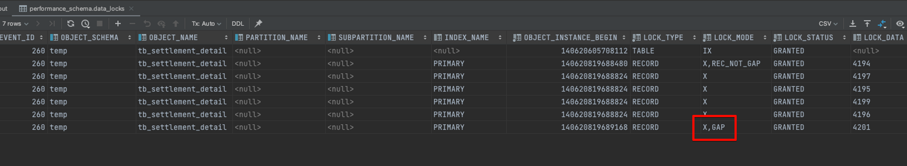
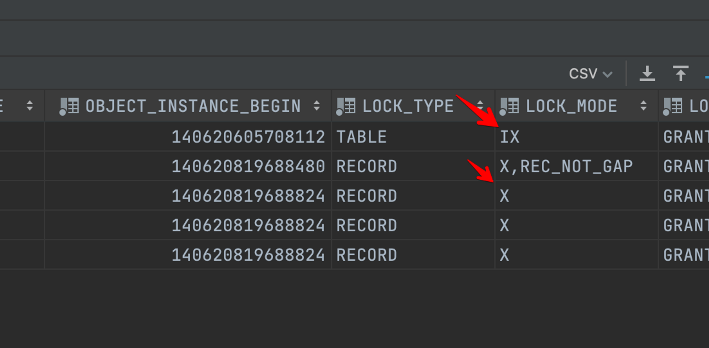
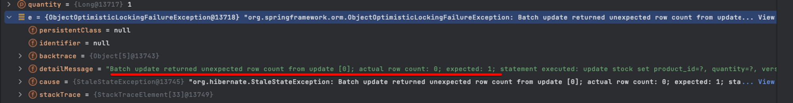

# 동시성 해결하기(feat. TMI 주의)

* 동시성 해결하기에 앞서 `트랜잭션`의 특징을 간단히 살펴보자.
* 자세한 내용은 다음 링크를 통해서 알수 있다 ([데이터베이스 격리수준](https://incheol-jung.gitbook.io/docs/q-and-a/db/isolation-level))

### 트랜잭션 특성(ACID)

* 원자성(`Atomicity`) : 트랜잭션은 모두 실행되거나 아예 실행되어서는 안된다
* 일관성(`Consistency`) : 데이터베이스 속성은 항상 일관되게 유지되어야 한다
* 격리성/독립성(`Isolation`) : 각각의 트랜잭션은 서로 독립적으로 동작하고 영향을 주지 않아야 한다.
* 지속성(`Durability`) : 트랜잭션이 완료된 이후에는 영구적으로 반영되어야 한다

## 트랜잭션 격리수준

* 트랜잭션의 `독립성`을 보장할 수 있는 `격리수준`은 다양하다
* 격리수준을 높일수록 `동시성`은 보장되지만 `성능`은 하락할 수 있다
* 서비스 성격에 맞게 격리수준을 적절히 적용할 필요가 있다
* 격리수준의 상세한 설명은 다음 링크를 통해서 알수 있다 ([데이터베이스 격리수준](https://incheol-jung.gitbook.io/docs/q-and-a/db/isolation-level))
* 동시성을 해결하기 위해서는 수행되는 락을 확인하기 위한 방법을 살펴보자

## 테이블 락 조회 방법

### 테이블 락

* 테이블에 `LOCK`을 걸어 테이블의 데이터의 접근을 제한할 수 있다
* 테이블의 데이터 읽기/쓰기 제한(CRUD 쿼리 제한)

```jsx
// format
LOCK TABLES {tableName} WRITE;

// example(TB_PRODUCT 테이블에 WRITE LOCK을 건다)
LOCK TABLERS TB_PRODUCT WRITE;
```

* 테이블의 데이터 읽기 제한(CUD 쿼리 제한)

```jsx
// format
LOCK TABLES {tableName} READ;

// example(TB_PRODUCT 테이블에 READ LOCK을 건다)
LOCK TABLERS TB_PRODUCT READ;
```

### 테이블 락 해제

* 락이 걸린 테이블을 해제할 수 있다
* `UNLOCK` 명령어를 사용하면 테이블 락을 해제할 수 있다.(단, `LOCK`을 수행한 콘솔 내에서만 가능하다)

```jsx
UNLOCK TABLES;
```

### 락 테이블 조회

* 락이 걸려 있는 테이블을 조회할 수 있다

```jsx
SELECT * FROM performance_schema.metadata_locks;
```

* 사전에 테이블에 READ LOCK을 수행하였다

```jsx
LOCK TABLES TB_SETTLEMENT_DETAIL READ;
```

#### 결과 화면

<figure><figcaption></figcaption></figure>

### 대기중인 락 조회

* 현재 대기중인 락을 조회할 수 있다

```jsx
SELECT * FROM performance_schema.data_locks;
```

* 사전에 특정 데이터를 `LOCK`으로 홀드한다

```jsx
SELECT COUNT(*) 
FROM TB_SETTLEMENT_DETAIL 
WHERE 4201 <= settlement_detail_id AND settlement_detail_id <= 4203 FOR UPDATE;
```

#### 결과화면

<figure><figcaption></figcaption></figure>



💡 **LOCK\_MODE 데이터 확인**

\
X : 넥스트 키 락

X,REC\_NOT\_GAP : 레코드 락&#x20;

X,GAP : 갭 락&#x20;

IX : 테이블 락(인텐트 락, X LOCK 생성시)&#x20;

IS : 테이블 락(인텐트 락, S LOCK 생성시)


### 실행중인 트랜잭션 조회

* 실행 되고 있는 트랜잭션을 확인할 수 있다

```jsx
SELECT * FROM information_schema.INNODB_TRX;
```

* 사전에 테이블을 LOCK 하였다

```jsx
LOCK TABLES TB_SETTLEMENT_DETAIL READ;
```

#### 결과화면

<figure><figcaption></figcaption></figure>

### 프로세스 조회

* 실행중인 쿼리 목록을 보여준다

```jsx
SHOW FULL PROCESSLIST;
```

* 사전에 테이블을 LOCK 하고, INSERT 하는 쿼리를 수행하였다

```jsx
LOCK TABLES TB_SETTLEMENT_DETAIL READ;
insert into TB_SETTLEMENT_DETAIL (settlement_id, settlement_detail_amount, receiver_id,
                                  settlement_detail_complete_yn, settlement_detail_complete_ymdt)
values (1, 1000, 1,false,now());
```

#### 결과화면

<figure><figcaption></figcaption></figure>

### 락으로 인해 대기중인 쿼리 중지

* 데드락 또는 테이블에 락이 발생할때 대기 중인 쿼리를 임의로 중지할 수 있다 (사전에 `SHOW PROCESSLIST;` 를 수행해서 ID를 확인해야 한다)

```jsx
// format
KILL {PID};

// ID가 '10'인 쿼리 수행을 종료한다
KILL 10;
```

## 데이터베이스 락 범위

* 데이터베이스에 직접 LOCK을 걸 수 있는 방법은 다양하다
* 수행하는 LOCK에 따라서 적용되는 범위도 다양하다

### table lock(테이블 락)

* 테이블 단위로 LOCK을 생성할 수 있다
* READ는 데이터를 읽을순 있지만, CUD는 할수 없다
* WRITE는 데이터에 대한 CRUD 작업이 불가능하다

```jsx
// format
LOCK TABLES {table-name} READ || WRITE

// example
LOCK TABLES TB_PRODUCT READ;
LOCK TABLES TB_PRODUCT WRITE;
```

### row level lock(로우 레벨 락)

* 테이블의 데이터 로우 단위로 LOCK을 생성할 수 있다
* 로우 레벨 락은 상태값으로는 확인할 수 없다 `(내부 엔진에서만 수행되어 LOCK이 걸릴 경우, 수정이 안되면 로우 레벨 락이 수행되었다고 가정한다)`
* 로우 레벨 LOCK은 S LOCK, X LOCK을 통해서 설정할 수 있다

```jsx
// example
SELECT * FROM TB_PRODUCT WHERE product_id = 1 FOR SHARE // S LOCK
SELECT * FROM TB_PRODUCT WHERE product_id = 1 FOR UPDATE // X LOCK
```

### record lock(레코드 락)

* 인덱스가 존재할 경우, 데이터 테이블이 아닌 인덱스 테이블에 LOCK이 생성된다

```jsx
// example
SELECT * FROM TB_PRODUCT WHERE product_id = 1 FOR SHARE // S LOCK
SELECT * FROM TB_PRODUCT WHERE product_id = 1 FOR UPDATE // X LOCK
```

#### 결과화면

<figure><figcaption></figcaption></figure>

### gap lock(갭 락)

* 갭락의 범위는 조건에 해당하는 범위 내에서 비어있는 영역을 LOCK 할 경우에 생성된다

```jsx
SELECT COUNT(*)
FROM TB_SETTLEMENT_DETAIL 
WHERE settlement_detail_id BETWEEN 4194 AND 4200 FOR UPDATE;
```

* 예시로 수행한 쿼리에서 4196, 4195, 4196, 4197, 4199 데이터가 존재한다

#### 결과화면

<figure><figcaption></figcaption></figure>

### next key lock(넥스트 키 락)

* 레코드 락과 갭 락을 조합한 것이다
* 범위에 존재하는 데이터는 `레코드 락`이 발생하고 존재하지 않는 범위에는 `갭락`이 생성된다
* mysql innoDB에서는 넥스트 키 락으로 인해 격리 수준이 repeatable read 단계에서도 phantom read가 발생하지 않는다.
* 왜냐하면 넥스트 키 락으로 인해 트랜잭션 범위 이외에도 인덱스 앞뒤로 락이 생성되어 데이터 생성/삭제를 제한할 수 있다

```jsx
SELECT *
FROM TB_SETTLEMENT_DETAIL
WHERE settlement_detail_id BETWEEN 4547 AND 4549 FOR UPDATE;
```

#### 결과화면

<figure><figcaption></figcaption></figure>

## MYSQL은 repeatable read 단계에서도 Phantom read가 발생하지 않는다??


**Phantom read란??**

\
한 트랜잭션 내에서 데이터 조회시, 추가/삭제하는 데이터에 대해서는 일관성을 보장하지 않는다 일반적인 데이터베이스 격리수준은 repeatable read 단계에서도 발생한다. 그리고 이를 해결하기 위해서는 격리수준을 serializable 단계로 전환해야 해결할 수 있다


* 우선 mysql의 Phantom read 이슈를 알아보기 전에 mysql의 매커니즘을 살펴볼 필요가 있다
* 대부분의 데이터베이스는 동시성 문제를 해결하기 위해 MVCC 매커니즘을 활용한다

### MVCC(Multi-Version Concurrenty)

* `MVCC`는 다중 버전 동시성 제어를 뜻한다
* `MVCC`의 목적은 잠금을 사용하지 않는 일관된 읽기를 제공하는데 있다
* `Multi version` 이라는 것은 스냅샷을 통해 하나의 레코드에 대해 여러 버전이 관리된다는 것을 의미한다
* `MVCC`의 가장 큰 장점은 `LOCK`을 사용하지 않기 때문에 동시성 제어에 성능을 보장할 수 있다
* 스냅샷은 보통은 `undo` 로그 파일을 사용한다


**undo 로그는 크게 두 가지 용도로 사용된다**


* 트랜잭션의 롤백 대비
* 트랜잭션의 격리 수준을 유지하면서 높은 동시성을 제공



### 그럼 MVCC로 Phantom read를 해결할 수 있는가?

* 부분적으로는 맞다고 할수 있다. `MVCC`로는 `Phantom read`를 어느 정도는 해결할 수 있다
* 트랜잭션내에서 `스냅샷`을 생성하여 그 이후 트랜잭션의 내용은 확인하지 않고 스냅샷을 통해서 확인하기 때문에 새로 생성되거나 삭제된 데이터는 확인할 수 없다
* 하지만 부분적으로 맞다고 한 이유는 트랜잭션 내에서 명시적으로 `LOCK`을 생성 했을 경우에도 다른 트랜잭션 내에서는 생성이나 삭제 `커밋`이 가능하다는것이다
* 그러나 `mysql`의 `innoDB`는 트랜잭션 내에서 `LOCK`을 생성하였다면, `next-key lock`을 통해서 조회 범위 다음 영역까지 `GAP LOCK`을 생성하여 생성/삭제 되는 커밋을 제한 할 수 있다


## 그럼 우리는 격리수준만 설정하면 동시성 제어를 고려하지 않아도 될까?

* 아니다. 이전까지 살펴본건 데이터베이스 내에서 격리수준에 따라 독립성을 보장하는 과정을 살펴봤다
* 서비스를 구현하다보면 서비스 가용성을 확보하면서 동시성 제어를 직접 구현해야하는 경우가 있다 `(ex. 재고차감, 선착순 모집, 파격세일 주문)`

#### 직접 제어할 수 있는 방법은 크게 두 가지로 나뉠수 있다

* 하나는 쿼리를 작성하여 직접 `LOCK`을 제어할 수 있다
* 다른 하나는 애플리케이션 내에서 동시성을 제어할 수 있다


## 쿼리 레벨에서 동시성 제어

### 공유 락(shared lock)

* 서로 다른 트랜잭션에 대해서 동일한 자원에 대해 `READ`는 허용하지만, `WRITE`는 제한한다
* 보통 `S LOCK`으로 표현한다

#### 그럼 쿼리로는 어떻게 작성할 수 있을까?

```jsx
SELECT * FROM TB_INVENTORY WHERE inventory_id = 101 LOCK IN SHARE MODE; // mysql 5.7 이하
SELECT * FROM TB_INVENTORY WHERE inventory_id = 101 FOR SHARE; // mysql 8.0 이상
```

### 베타 락(exclusive lock)

* 서로 다른 트랜잭션에 대해서 선점한 트랜잭션이 `COMMIT`할때까지 나머지 트랜잭션은 `BLOCK` 된다
* 보통 `X LOCK`으로 표현한다

#### 그럼 쿼리로는 어떻게 작성할 수 있을까?

```jsx
SELECT * FROM TB_INVENTORY WHERE inventory_id = 101 FOR UPDATE // mysql 5.7 , 8.0 모두 동일
```

### 인텐트 락(intent lock)

* 인텐트 락은 직접 쿼리로 작성 하기보다는 공유 락이나 베타 락을 수행하면 테이블에 추가적으로 생성되는 락이라고 보면 된다
* 생성되는 락에 따라서 인텐트 락에 대한 값은 다르지만 기능은 동일하다
* 트랜잭션 내에서 테이블의 스키마를 수정하지 못하게 하여 일관성을 유지하기 위함이다
* is : `S LOCK` 생성시, 테이블에 생성되는 락
* ix : `X LOCK` 생성시, 테이블에 생성되는 락

<figure><figcaption></figcaption></figure>

## 애플리케이션 레벨에서 동시성 제어

* 프레임워크를 사용하고 있다면 라이브러리 내에서 동시성을 제어해주는 다양한 방법이 있다

### 낙관적 락

#### ORM - JPA

* `ORM`에서 `JPA`를 사용하고 있다면, `LockMode.OPTIMISTIC`으로 처리할 수 있다
* `@Entity` 객체에는 낙관적 락에 필요한 `@Version` 필드가 필요하다


**OptimisticLockException은 어떻게 발생할까?**


EntityManager가 update할 경우, row count가 0일 경우 버전 정보가 잘못되었다고 판단하여 exception이 발생한다


* 디버깅을 해보면 row count가 기대한 1이 아니라는 문구를 확인할 수 있다

<figure><figcaption></figcaption></figure>

* JPA에서는 `OptimisticLockException` 리턴하게 되고
* hibernate에서 `StaleStateException`을 리턴한다
* spring은 `ObjectOptimisticLockingFailureException` 을 리턴한다

```jsx
// entity 클래스
@Entity
class Student {

	...
	@Version
	private long version;
}

// 조회시 LockModeType을 OPTIMISTIC 으로 설정
entityManager.find(Student.class, studentId, LockModeType.OPTIMISTIC);
```

#### ORM - MYBATIS

* `ORM`을 `mybatis`를 사용한다면 직접 구현해야 한다
* `version` 필드를 추가하여 데이터를 조회하고 수정시 version 정보가 동일한지 확인한다
*   업데이트 이후에 반영된 column 갯수가 0개인지 확인하고 서비스에 필요한 예외처리를 구현한다

    ```jsx
    while (true) {
    	// 상품 데이터를 조회한다
    	Product product = productRepository.findByProductId(productId);

    	// 상품 데이터가 업데이트 되었는지 확인한다
    	int count = productRepository.update(UpdateProductParameter.builder()
    		.productId(parameter.getProductId())
    		.version(settlement.getVersion())
    		.build());

    	// 업데이트 되었다면 루프문을 나온다
    	if(count > 0) {
    		return;
    	}

    	// 루프문을 시도하는 횟수를 초과했다면 exception을 리턴한다
    	if (retryCount > MAX_RETRY_COUNT) {
    		throw new RuntimeException("상품 수정에 실패하였습니다.");
    	}

    	// 재시도 횟수를 증가시킨다
    	retryCount++;
    }
    ```

#### 낙관적 락으로 동시성 제어를 모두 해결할 수 있을까?

* 그렇지 않다. 낙관적 락으로는 한계가 있다
* 우선 낙관적 락은 충돌시 예외 처리를 직접 구현해주어야 한다
* 만약 충돌시 재시도가 필요하다면, 재시도 횟수에 따라 데이터베이스 I/O가 발생하여 부하가 증가한다
* 그리고 재시도하는 횟수에 따라 애플리케이션의 가용성도 저하된다
* 만약 동시성 제어 로직 내에서 FK가 존재하는 테이블을 수정하는 경우에는 데드락이 발생시킬 수 있다 (참고 : [참조키 제약 조건 낙관적락 이슈](https://velog.io/@znftm97/%EB%8F%99%EC%8B%9C%EC%84%B1-%EB%AC%B8%EC%A0%9C-%ED%95%B4%EA%B2%B0%ED%95%98%EA%B8%B0-V1-%EB%82%99%EA%B4%80%EC%A0%81-%EB%9D%BDOptimisitc-Lock-feat.%EB%8D%B0%EB%93%9C%EB%9D%BD-%EC%B2%AB-%EB%A7%8C%EB%82%A8))
* 이런 문제를 보완할 수 있는 방법은 비관적 락을 사용하는 것이다

### 비관적 락

* 비관적 락을 설정하면 다른 트랜잭션은 `BLOCKING`되어 커밋될 때까지 대기하게 된다
* 비관적 락을 설정할 때는 `TIMEOUT` 설정을 꼭 해야 한다. 설정하지 않으면 데이터베이스에 따라서 설정된 `lock timeout` 시간 동안 대기하게 된다(단, `JPA`에서 지원해주는 기능이라 다른 `ORM`은 바로 `exception`이 발생할 수 있다. 그러니 명시적으로 `TIMEOUT`을 설정하는게 확실하다)


**lock timeout 확인하기**

기본 설정된 timeout 시간을 확인하려면 MYSQL에서는 innodb\_lock\_wait\_timeout 값을 확인하면 된다

\
`select @@innodb_lock_wait_timeout;`



#### ORM - JPA

*   `ORM`이 `JPA`에서 `LockMode.PESSIMSTIC`으로 처리할 수 있다

    ```jsx
    @Lock(LockModeType.PESSIMISTIC_WRITE)
    @QueryHints({@QueryHint(name = "javax.persistence.lock.timeout", value ="5000")})
    Stock findById(String id)
    ```

#### ORM - MYBATIS

* MYBATIS를 사용하게 되면 `SELECT FOR UPDATE` 쿼리를 직접 호출하면 해결할 수 있다
* `timeout` 설정은 수행 쿼리 단위로 독립적으로 설정할 수 있다

```jsx
<select id="getSettlementById" parameterType="int" resultType="com.example.settlement.domain.settlement.model.Settlement" timeout="5000">
    /*SettlementMapper.getSettlementById*/
    SELECT
        settlement_id as settlementId,
        version as version,
        total_settlement_amount as totalSettlementAmount,
        requester_id as requesterId,
        settlement_complete_yn as settlementCompleteYn,
        settlement_complete_ymdt as settlementCompleteYmdt,
        requested_ymdt as requestedYmdt
    FROM TB_SETTLEMENT
    WHERE settlement_id = #{settlementId}
    FOR UPDATE
</select>
```

#### 그럼 비관적 락을 사용하면 만능일까?

* 그렇지 않다. 동시성은 확실히 보장할 순 있지만 요청이 `BLOCKING` 되어 서비스 성능이 저하될수 있고, 남용하게 되면 다양한 테이블에 `BLOCKING` 되어 데드락이 발생할 수 있다
* 다음과 같은 상황이 있을 수 있다
  * 트랜잭션 A가 테이블1의 1번 데이터에 lock을 획득
  * 트랜잭션 B가 테이블2의 1번 데이터에 lock을 획득
  * 트랜잭션 A가 테이블2의 1번 데이터에 lock 획득 시도(실패 - 대기)
  * 트랜잭션 B가 테이블1의 1번 데이터에 lock 획득 시도(실패 - 대기)
* 그래서 비관적 락은 주의해서 사용해야 한다
* 이를 해결하려면 `네임드 락`이나 `분산락`을 사용해야 한다

## 분산락

* 분산락이란 경쟁 상황(Race Condition)이 발생할때, 하나의 공유자원을 충돌이 발생하지 않도록 보유하는 기법이다
* 분산락은 낙관적 락이나 비관적 락으로 발생하는 문제점을 보완하고, 애플리케이션 규모가 점차 커지면서 다중 서버/데이터베이스를 운영하는 과정에서 동시성을 보장하려고 할때 사용할 수 있다
* 분산락을 구현하는 방법은 다양하다.
* `MySQL`에서 네임드 락을 사용해 구현할 수 있고, 레디스 캐시를 사용해 구현할 수 있다
* 그럼 다음 내용은 분산락을 구현하는 방법에 대해서 살펴보자

### Named lock(네임드 락)

* 네임드 락은 데이터베이스에 `LOCK`을 획득하여 다른 트랜잭션은 `LOCK`이 해제된 이후에 획득할 수 있다
* 주의할 점은 락을 획득하기 위해 `Connection`을 유지해야 하므로 애플리케이션에서 데이터베이스에 `Connection Pool`이 부족할 수 있다
* 그렇기 때문에 네임드 락은 실무에서는 별도 데이터베이스를 구축해서 사용해야 서비스 운영이 필요하다
* 그리고 커넥션을 생성한 세션에서만 `Connection`을 닫을수 있으므로 주의해서 사용해야 한다

#### 락 획득하기

* 락을 획득하기 위해서는 획득 하려는 락의 이름과 획득을 시도하려는 `TIMEOUT` 시간을 정의하면 획득할 수 있다

```jsx
@Query(value = "select get_lock(:key, 3000)", nativeQuery = true)
void getLock(String key);
```

#### 락 해제하기

* 획득한 락을 해제하기 위한 방법으로 락의 이름으로 해제할 수 있다

```jsx
@Query(value = "select release_lock(:key)", nativeQuery = true)
void releaseLock(@Param("key") String key);
```

### lettuce

* 네임드 락은 실무에서 사용하기엔 `Connection Pool` 이슈도 있고, 세션 관리도 해주어야 하므로 여러가지 신경써야 하는 부분이 있다
* 레디스를 사용해서 분산락을 구현하면 어느정도 이러한 문제를 해소할 수 있다. `Lettuce`를 사용하고 있다면 `SETNX`를 활용해서 반복적으로 락 획득을 시도하여 락을 점유할 수 있다. 이는 스핀락(`spinlock`) 개념이라 할 수 있다

#### 락 획득하기

* 락을 획득하기 위해 레디스에 `Key`와 `TTL` 값을 설정한다

```jsx
public Boolean lock(Long key) {
    return redisTemplate
            .opsForValue()
            .setIfAbsent(generateKey(key), "lock", Duration.ofMillis(3_000));
}
```

#### 락 해제하기

* 락을 해제하기 위해 해당 `Key`값을 기준으로 해제한다

```jsx
public Boolean unlock(Long key) {
    return redisTemplate.delete(generateKey(key));
}
```

#### 락 획득시도하기

* 락 획득하기 위해 반복문을 사용하여 주기적으로 시도해본다
* 레디스는 싱글 쓰레드로 동작하기 때문에 너무 반복적으로 시도하면 레디스에 부하만 가중되니 어느정도 `interval`을 두는게 좋다
* 또한, 재시도 횟수를 설정하여 무한정 재시도하지 않도록 제한을 걸어두어야 한다
* `interval`이나 재시도 횟수 제한으로 레디스에 발생하는 부하를 줄일 수 있지만 이는 실무에 여러가지 상황을 고려해서 설정해야 한다

```jsx
public void decrease(Long id, Long quantity) throws InterruptedException {
    while (true) {
        try {
            optimisticLockStockService.decrease(id, quantity);

            break;
        } catch (Exception e) {
            System.out.println(e);
            Thread.sleep(50); // interval을 둔다
        }
    }
}
```

### Redisson

* `redisson`은 실제로는 자바 언어에 국한된 레디스 분산락 클라이언트이다
* 레디스 분산락 라이브러리는 클라이언트 언어에 따라 다양한 라이브러리를 제공한다
* 자세한 내용은 다음의 글을 참조하면 도움이 될 것이다 ([redisson trylock 내부로직 살펴보기](https://incheol-jung.gitbook.io/docs/q-and-a/spring/redisson-trylock))
* `redisson`을 사용하려면 우선 라이브러리를 `import` 해야 한다

```jsx
// build.gradle
implementation 'org.redisson:redisson-spring-boot-starter:3.17.4'
```

#### 획득할 락 정의하기

* 이름으로 락을 획득 할 수 있다

```jsx
RLock lock = redissonClient.getLock(key);
```

#### 락 획득하기

* 락 획득을 시도할 시간, 획득시 점유할 시간과 시간에 대한 단위를 명시하면 된다

```jsx
boolean available = lock.tryLock(10, 1, TimeUnit.SECONDS);
```

#### 락 해제하기

* 점유한 락을 지정한 점유시간 보다 더 일찍 완료 되었다면, 임의로 해제시켜야 한다
* 단, 여기서 주의할 점은 점유한 락을 해제할 경우에는 lock이 현재 점유된 상태인지 그리고 해제 하려는 세션에서 생성한 lock인지 꼭 확인하고 해제해야 한다
* 보통 점유한 lock을 명시적으로 해제시키기 위해 finally 블럭 내에서 수행하는데, exception이 발생하는 경우에도 lock이 해제될수도 있으니 위와 같은 검증 이후에 lock을 해제하는게 중요하다!!

```jsx
if (lock.isLocked() && lock.isHeldByCurrentThread()) {
	lock.unlock();
}
```

#### 전체 소스 코드

```jsx
public void decrease(String key, Long quantity) {
	RLock lock = redissonClient.getLock(key);

	try {
		boolean available = lock.tryLock(10, 1, TimeUnit.SECONDS);

		if (!available) {
			System.out.println("lock 획득 실패하였습니다");
			return;
		}

		stockService.decrease(key, quantity);
	} catch (InterruptedException e) {
		throw new RuntimeException(e);
	} finally {
		if (lock.isLocked() && lock.isHeldByCurrentThread()) {
			lock.unlock();
		}
	}
}
```

## 정리를 해보자면!!

* 애플리케이션이 규모가 적은 단일 애플리케이션/데이터베이스를 사용하는 상황에서 동시성을 보장해야 한다면 데이터베이스만으로 낙관적 락이나 비관적 락으로 해결할 것이다

#### 만약 낙관적 락을 사용한다고 하면?

* 공유 데이터에 대한 read 비율이 높고, 충돌 빈도가 적다면 낙관적 락을 사용할 것이다
* 또는, 충돌에 대해서 재시도가 없이 실패로 처리한다면 낙관적 락이 서비스 가용성 측면에서도 유일할 것이다
* 그러나 처음엔 충돌 빈도가 적었지만, 서비스가 점차 확장되면서 충돌 빈도가 증가한다면 비관적 락으로 전환할 것이다

#### 만약 비관적 락을 사용한다면?

* 충돌 빈도가 높다면 비관적 락을 사용할 것이다
* 또는 낙관적 락을 사용하다 데드락이 발생하는 케이스에 대해서도 비관적 락으로 해결할 것이다

#### 그럼 분산락은 언제 사용하면 좋을까?

* 비관적 락을 사용하다 데드락이 발생하거나 애플리케이션의 규모가 커지면서 트래픽이 증가하여 충돌에 빈도수가 증가한다면 분산락으로 전환할 것이다

#### 그렇다면 분산락은 데이터베이스로 구현할지 레디스 캐시로 구현할지?

* 실무에선 네임드락을 사용하는건 어렵다고 생각한다. 커넥션 풀 이슈도 있어서 별도 데이터베이스를 구축해야 하고, 세션에 따라서 락을 조정해야 하기 때문이다
* 그리고 무엇보다 데이터베이스 보다는 레디스가 I/O 성능상 가볍기 때문에 레디스로 분산락을 구현하여 사용할 것이다

#### 레디스를 사용한다면 lettuce을 사용할까? redisson을 사용할것인가?

* lettuce을 사용한다면 스핀 락으로 인해 레디스에 부하가 많이 발생해서 다소 제한적인 범위에서 사용할 것이다. 또는 충돌에 대한 재시도 없이 실패로 간주한다면 lettuce만으로 충분할것이다
* 그렇지만 충돌이 많이 발생하고 어느정도 재시도가 필요하다면 redisson을 사용할 것이다

## 참고

* [https://effectivesquid.tistory.com/entry/Optimistic-Lock과-Pessimistic-Lock](https://effectivesquid.tistory.com/entry/Optimistic-Lock%EA%B3%BC-Pessimistic-Lock)
* [https://developerhjg.tistory.com/216](https://developerhjg.tistory.com/216)
* [https://velog.io/@hyojhand/상품-주문-동시성-문제-해결하기-DeadLock-낙관적-락-비관적-락](https://velog.io/@hyojhand/%EC%83%81%ED%92%88-%EC%A3%BC%EB%AC%B8-%EB%8F%99%EC%8B%9C%EC%84%B1-%EB%AC%B8%EC%A0%9C-%ED%95%B4%EA%B2%B0%ED%95%98%EA%B8%B0-DeadLock-%EB%82%99%EA%B4%80%EC%A0%81-%EB%9D%BD-%EB%B9%84%EA%B4%80%EC%A0%81-%EB%9D%BD)
* [https://jeong-pro.tistory.com/241](https://jeong-pro.tistory.com/241)
* [https://leejincha.tistory.com/361](https://leejincha.tistory.com/361)
* [https://velog.io/@soyeon207/DB-Lock-총정리-1-InnoDB-의-Lock](https://velog.io/@soyeon207/DB-Lock-%EC%B4%9D%EC%A0%95%EB%A6%AC-1-InnoDB-%EC%9D%98-Lock)
* [https://jaeseongdev.github.io/development/2021/06/16/Lock의-종류-(Shared-Lock,-Exclusive-Lock,-Record-Lock,-Gap-Lock,-Next-key-Lock)/](https://jaeseongdev.github.io/development/2021/06/16/Lock%EC%9D%98-%EC%A2%85%EB%A5%98-\(Shared-Lock,-Exclusive-Lock,-Record-Lock,-Gap-Lock,-Next-key-Lock\)/)
* [https://jeong-pro.tistory.com/241](https://jeong-pro.tistory.com/241)
* [https://creampuffy.tistory.com/175](https://creampuffy.tistory.com/175)
* [https://dev.mysql.com/doc/refman/8.0/en/innodb-next-key-locking.html](https://dev.mysql.com/doc/refman/8.0/en/innodb-next-key-locking.html)
