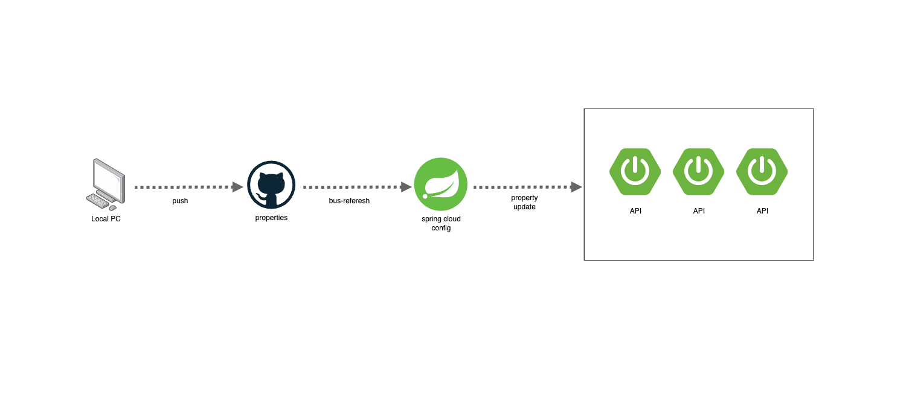

# 스프링 클라우드 컨피그 갱신 되지 않는 이슈(feat. 서비스 디스커버리)

<figure><figcaption></figcaption></figure>

## 스프링 클라우드 컨피그가 갱신되지 않는다?

* 스프링 클라우드 컨피그 서버를 구축했다면 프로퍼티를 어떻게 갱신할지 고민할 것이다
* 우선 스프링 클라우드 컨피그를 갱신하는 방법에 대해서 살펴보자

### 스프링 클라우드 컨피그 갱신하는 방법

1. 애플리케이션을 재시작 한다
2. actuator의 refersh를 사용하여 변경된 프로퍼티를 사용하는 애플리케이션만 업데이트 해준다
3. bus-refresh를 사용하여 스프링 클라우드 컨피그를 사용하는 모든 클라이언트를 업데이트 해준다

### bus-referesh를 사용하여 모두 갱신하기

* 애플리케이션을 매번 재시작하는건 스프링 클라우드 컨피그를 사용하는 메리트가 없다
* refresh를 사용하여 특정 애플리케이션에만 업데이트해주는 것도 매번 프로퍼티를 갱신할 때마다 사용되고 있는 클라이언트를 알아야 하므로 번거로울 수 있다
* 결국 bus-refresh를 사용하는게 관리하기도 편하고 심플할것 같다
* bus-refresh를 사용하는 방법은 간단하다
* 프로퍼티가 변경되는 시점에 스프링 클라우드 서버에 bus-refresh를 호출해주면 된다
* 스프링 클라우드 서버는 바라보고 있는 클라이언트 모두에게 프로퍼티를 갱신해줄 것이다

#### github webhook 사용하기

* bus-refresh API를 호출하는 시점을 github에서 푸시 이벤트가 발생할때 호출하도록 웹훅을 설정하였다

<figure><figcaption></figcaption></figure>

## 그럼 왜 갱신이 되지 않나?

* github 웹훅 내역을 보면 response status code는 200으로 정상적으로 호출되었다고 기록되어 있다
* 그 이유는 서비스 디스커버리 때문이었다
* 하나의 프로퍼티를 사용하는 애플리케이션이 여러개 일 수도 있는데 각각의 클라이언트 정보가 고유하지 않아서 스프링 클라우드 컨피그 서버에서 클라이언트에게 갱신할 수 있는 정보를 전달하지 못하는 이슈가 있었다
* 그래서 스프링 클라우드 컨피그를 사용하는 클라이언트들은 본인의 고유값 정보를 서버에 전달해주어야 한다

```jsx
spring:
  cloud:
    bus:
      id: ${vcap.application.name:${spring.application.name:application}}:${vcap.application.instance_index:${spring.profiles.active:${local.server.port:${server.port:0}}}}:${vcap.application.instance_id:${random.value}}
```



출처\


* [https://github.com/spring-cloud/spring-cloud-bus/issues/124#issuecomment-423960553](https://github.com/spring-cloud/spring-cloud-bus/issues/124#issuecomment-423960553)
* [https://freedeveloper.tistory.com/473](https://freedeveloper.tistory.com/473)

