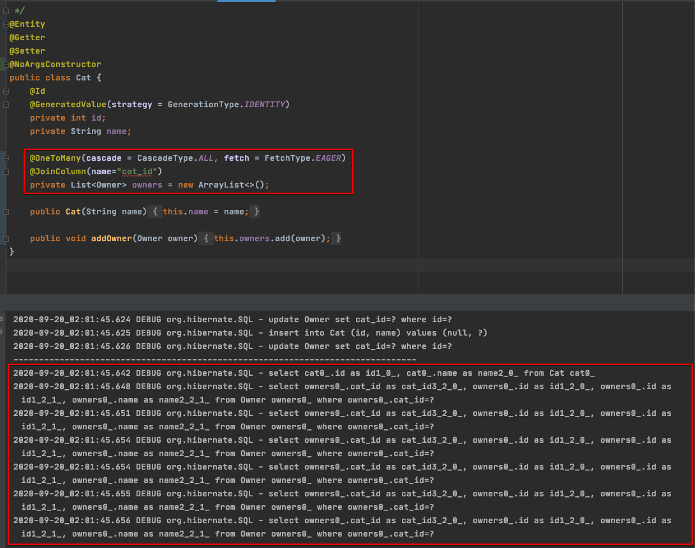
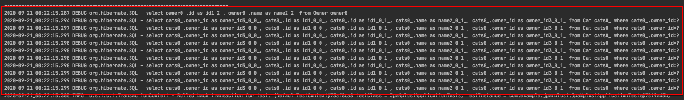
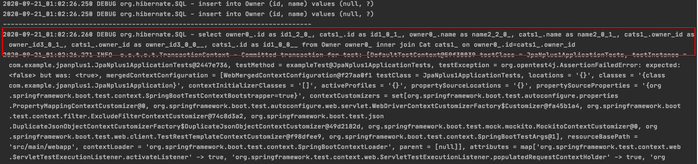
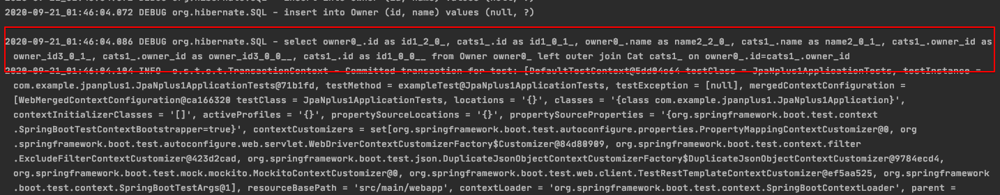
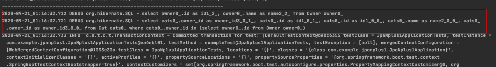
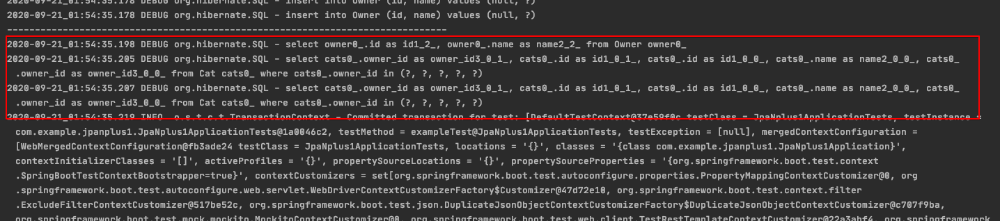

# N+1 문제



## N+1 문제란?

연관 관계에서 발생하는 이슈로 연관 관계가 설정된 엔티티를 조회할 경우에 조회된 데이터 갯수\(n\) 만큼 연관관계의 조회 쿼리가 추가로 발생하여 데이터를 읽어오게 된다. 이를 N+1 문제라고 한다. 그러면 실제로 어느 경우에 발생하는지 사례를 통해서 알아보자.

### 엔티티 설정

코드는 단순하다. 고양이와 고양이 집사의 관계를 표현해보겠다.

* 고양이 집사는 여러 마리의 고양이를 키우고 있다.
* 고양이는 한 명의 집사에 종속되어 있다.

```java
/**
 * @author Incheol Jung
 */
@Entity
@Getter
@Setter
@NoArgsConstructor
public class Owner {
    @Id
    @GeneratedValue(strategy = GenerationType.IDENTITY)
    private int id;
    private String name;

    @OneToMany(mappedBy = "owner", fetch = FetchType.EAGER)
    private Set<Cat> cats = new LinkedHashSet<>();
		
		...
}

@Entity
@Getter
@Setter
@NoArgsConstructor
public class Cat {
    @Id
    @GeneratedValue(strategy = GenerationType.IDENTITY)
    private int id;
    private String name;

    @ManyToOne
    private Owner owner;

    public Cat(String name) {
        this.name = name;
    }
}
```

### 고양이 집사를 조회해보자

테스트 케이스를 작성하여 Mock 데이터를 넣은 후에 조회를 하였다. 테스트 시나리오는 이렇다.

* 고양이를 10마리 생성하였다.
* 고양이 집사를 10명 생성하였다.
* 고양이 집사는 10마리씩 고양이를 키우고 있다.
* 고양이 집사를 조회해보자.\(확실한 결과를 도출하기 위해 entityManager를 한번 초기화하였다.\)

```java
@Test
void exampleTest() {
    Set<Cat> cats = new LinkedHashSet<>();
    for(int i = 0; i < 10; i++){
        cats.add(new Cat("cat" + i));
    }
    catRepository.saveAll(cats);

    List<Owner> owners = new ArrayList<>();
    for(int i = 0; i < 10; i++){
        Owner owner = new Owner("owner" + i);
        owner.setCats(cats);
        owners.add(owner);
    }
    ownerRepository.saveAll(owners);

    entityManager.clear();

    System.out.println("-------------------------------------------------------------------------------");
    List<Owner> everyOwners = ownerRepository.findAll();
    assertFalse(everyOwners.isEmpty());
}
```

### 결과는 어떻게 되었을까?

Hibernate SQL log를 활성화하여 실제로 호출된 쿼리를 확인해 보았다. 확인된 쿼리는 아래와 같다.

* 고양이 집사 조회하는 쿼리를 호출하였다.
* 고양이를 조회하는 쿼리가 고양이 집사를 조회한 row 만큼 쿼리가 호출한 것을 확인할 수 있다.


### 그렇다면 FetchType.EAGER라서 발생하는 것일까?

아니다. 간혹 FetchType 설정으로 인하여 발생한다고 오해하는 사람들이 있다. 하지만 이는 잘못된 생각이다. FetchType을 LAZY로 변경해 확인해보자.

```java
public class Owner {
    @OneToMany(mappedBy = "owner", fetch = FetchType.LAZY)
    private Set<Cat> cats = new LinkedHashSet<>();
		...
}
```

FetchType만 변경하고 다음의 테스트 코드를 그대로 실행해보겠다.


#### 흠..? 쿼리가 하나밖에 호출되지 않았다... 그렇다면 해결된것일까..??

그렇지 않다. FetchType을 LAZY로 설정했다는것은 연관관계 데이터를 프록시 객체로 바인딩한다는 것이다. 하지만 실제로 우리는 연관관계 엔티티를 프록시만으로는 사용하지 않는다. 실제로는 연관관계 엔티티의 멤버 변수를 사용하거나 가공하는 일은 코드를 구현하는 경우가 훨씬 흔하기 때문에 테스트 코드에서 연관관계 엔티티를 사용하는 로직을 추가해보자.

고양이 집사가 보유하고 있는 고양이의 이름을 추출해보자.

```java
List<Owner> everyOwners = ownerRepository.findAll();
List<String> catNames = everyOwners.stream().flatMap(it -> it.getCats().stream().map(cat -> cat.getName())).collect(Collectors.toList());
assertFalse(catNames.isEmpty());
```

#### SQL 로그를 확인해보자.

로그를 확인해보면 결국 동일하게 발생한다는 것을 알 수 있다. FetchType을 변경하는 것은 단지 N+1 발생 시점을 연관관계 데이터를 사용하는 시점으로 미룰지, 아니면 초기 데이터 로드 시점에 가져오느냐에 차이만 있는 것이다.



## 그렇다면 N+1은 왜 발생하는 것일까?

jpaRepository에 정의한 인터페이스 메서드를 실행하면 JPA는 메서드 이름을 분석해서 JPQL을 생성하여 실행하게 된다. JPQL은 SQL을 추상화한 객체지향 쿼리 언어로서 특정 SQL에 종속되지 않고 엔티티 객체와 필드 이름을 가지고 쿼리를 한다. 그렇기 때문에 JPQL은 findAll\(\)이란 메소드를 수행하였을 때 해당 엔티티를 조회하는 `select * from Owner` 쿼리만 실행하게 되는것이다. JPQL 입장에서는 연관관계 데이터를 무시하고 해당 엔티티 기준으로 쿼리를 조회하기 때문이다. 그렇기 때문에 연관된 엔티티 데이터가 필요한 경우, FetchType으로 지정한 시점에 조회를 별도로 호출하게 된다.

## 해결방안은 무엇이 있을까?

### Fetch join

사실 우리가 원하는 코드는 `select * from owner left join cat on cat.owner_id = owner.id` 일 것이다. 최적화된 쿼리를 우리가 직접 사용할 수 있다. Fetch join을 사용하는 것이다. 하지만 이는 jpaRepository에서 제공해주는 것은 아니고 JPQL로 작성해야 한다.

```java
@Query("select o from Owner o join fetch o.cats")
List<Owner> findAllJoinFetch();
```

#### 실제 로그는 어떻게 발생하였는가?

로그를 확인해보면 실제로는 INNER JOIN으로 호출되는 것을 확인할 수 있다.



이는 연관관계의 연관관계가 있을 경우에도 하나의 쿼리 문으로 표현할 수 있으므로 매우 유리하다.

#### 단점은 없을까?

Fetch Join도 언뜻보면 유용해보이지만 단점은 있다. 우선은 우리가 연관관계 설정해놓은 FetchType을 사용할 수 없다는 것이다. Fetch Join을 사용하게 되면 데이터 호출 시점에 모든 연관 관계의 데이터를 가져오기 때문에 FetchType을 Lazy로 해놓는것이 무의미하다.

또한, 페이징 쿼리를 사용할 수 없다. 하나의 쿼리문으로 가져오다 보니 페이징 단위로 데이터를 가져오는것이 불가능하다.

### EntityGraph

@EntityGraph 의 attributePaths에 쿼리 수행시 바로 가져올 필드명을 지정하면 Lazy가 아닌 Eager 조회로 가져오게 된다. Fetch join과 동일하게 JPQL을 사용하여 query 문을 작성하고 필요한 연관관계를 EntityGraph에 설정하면 된다. 그리고 Fetch join과는 다르게 join 문이 outer join으로 실행되는 것을 확인할 수 있다.

```java
@EntityGraph(attributePaths = "cats")
@Query("select o from Owner o")
List<Owner> findAllEntityGraph();
```

해당 메소드를 호출하면 아래와 같이 실행된다.



### Fetch Join과 EntityGraph 주의할 점

Fetch Join과 EntityGraph는 JPQL을 사용하여 JOIN문을 호출한다는 공통점이 있다. 또한, 공통적으로 카테시안 곱\(Cartesian Product\)이 발생하여 Owner의 수만큼 Cat이 중복 데이터가 존재할 수 있다. 그러므로 중복된 데이터가 컬렉션에 존재하지 않도록 주의해야 한다.

#### 그렇다면 어떻게 중복된 데이터를 제거할 수 있을까?

* 컬렉션을 Set을 사용하게 되면 중복을 허용하지 않는 자료구조이기 때문에 중복된 데이터를 제거할 수 있다.
* JPQL을 사용하기 때문에 distinct를 사용하여 중복된 데이터를 조회하지 않을 수 있다.

### FetchMode.SUBSELECT

다음 해결방법은 쿼리 한번으로 해결하는 것은 아니고 두번의 쿼리로 해결하는 방법이다. 해당 엔티티를 조회하는 쿼리는 그대로 발생하고 연관관계의 데이터를 조회할 때 서브 쿼리로 함께 조회하는 방법이다.

```java
@Entity
@Getter
@Setter
@NoArgsConstructor
public class Owner {
    @Id
    @GeneratedValue(strategy = GenerationType.IDENTITY)
    private int id;
    private String name;

    @Fetch(FetchMode.SUBSELECT)
    @OneToMany(mappedBy = "owner", fetch = FetchType.EAGER)
    private Set<Cat> cats = new LinkedHashSet<>();

}
```

아래와 같이 실행된다.



즉시로딩으로 설정하면 조회시점에, 지연로딩으로 설정하면 지연로딩된 엔티티를 사용하는 시점에 위의 쿼리가 실행된다. 모두 지연로딩으로 설정하고 성능 최적화가 필요한 곳에는 JPQL 페치 조인을 사용하는 것이 추천되는 전략이다.

### BatchSize

하이버네이트가 제공하는 `org.hibernate.annotations.BatchSize` 어노테이션을 이용하면 연관된 엔티티를 조회할 때 지정된 size 만큼 SQL의 IN절을 사용해서 조회한다.

```java
@Entity
@Getter
@Setter
@NoArgsConstructor
public class Owner {
    @Id
    @GeneratedValue(strategy = GenerationType.IDENTITY)
    private int id;
    private String name;

    @BatchSize(size=5)
    @OneToMany(mappedBy = "owner", fetch = FetchType.EAGER)
    private Set<Cat> cats = new LinkedHashSet<>();
}
```

즉시로딩이므로 Owner를 조회하는 시점에 Cat를 같이 조회한다.`@BatchSize`가 있으므로 Cat의 row 갯수만큼 추가 SQL을 날리지 않고, 조회한 Owner 의 id들을 모아서 SQL IN 절을 날린다.



`size`는 IN절에 올수있는 최대 인자 개수를 말한다. 만약 Cat의 개수가 10개라면 위의 IN절이 2번 실행될것이다.

그리고 만약 지연 로딩이라면 지연 로딩된 엔티티 최초 사용시점에 5건을 미리 로딩해두고, 6번째 엔티티 사용 시점에 다음 SQL을 추가로 실행한다.

> hibernate.default\_batch\_fetch\_size 속성을 사용하면 애플리케이션 전체에 기본으로 @BatchSize를 적용할 수 있다.

```java
<property name="hibernate.default_batch_fetch_size" value="5" />
```

### QueryBuilder를 사용해보자

Query를 실행하도록 지원해주는 다양한 플러그인이 있다. 대표적으로 Mybatis, QueryDSL, JOOQ, JDBC Template 등이 있을 것이다. 이를 사용하면 로직에 최적화된 쿼리를 구현할 수 있다.

```java
// QueryDSL로 구현한 예제
return from(owner).leftJoin(owner.cats, cat)
                   .fetchJoin()
```

## 결론을 내보자

* N+1은 JPA를 사용하면서 연관관계를 맺는 엔티티를 사용한다면 한번 쯤은 부딪힐 수 있는 문제이다.
* Fetch Join이나 EntityGraph를 사용한다면 Join문을 이용하여 하나의 쿼리로 해결할 수 있지만 중복 데이터 관리가 필요하고 FetchType을 어떻게 사용할지에 따라 달라질 수 있다.
* SUBSELECT는 두번의 쿼리로 실행되지만 FethType을 EAGER로 설정해두어야 한다는 단점이 있다.
* BatchSize는 연관관계의 데이터 사이즈를 정확하게 알 수 있다면 최적화할 수 있는 size를 구할 수 있겠지만 사실상 연관 관계 데이터의 최적화 데이터 사이즈를 알기는 쉽지 않다.
* JPA 만으로는 실제 비즈니스 로직을 모두 구현하기 부족할 수 있다. JPA는 만능이 아니다. 간단한 구현은 JPA를 사용하여 프로젝트의 퍼포먼스를 향상 시킬수 있겠지만 다양한 비즈니스 로직을 복잡한 쿼리를 통해서 구현하다보면 다양한 난관에 부딪힐 수 있다. 그리고 불필요한 쿼리도 항상 조심해야 한다. 그러므로 QueryBuilder를 함께 사용하는 것을 추천한다. 그러면 생각보다 다양한 이슈를 큰 고민없이 바로 해결할 수 있다.

## Github Repository \(Example\)

#### [https://github.com/Incheol-Jung/jpa-nplus1.git](https://github.com/Incheol-Jung/jpa-nplus1.git)

## 참고

* [https://www.popit.kr/jpa-n1-발생원인과-해결-방법/](https://www.popit.kr/jpa-n1-%EB%B0%9C%EC%83%9D%EC%9B%90%EC%9D%B8%EA%B3%BC-%ED%95%B4%EA%B2%B0-%EB%B0%A9%EB%B2%95/)
* [https://jojoldu.tistory.com/165](https://jojoldu.tistory.com/165)
* [https://tech.wheejuni.com/2018/06/16/jpa-cartesian/](https://tech.wheejuni.com/2018/06/16/jpa-cartesian/)
* [https://joont92.github.io/jpa/JPA-성능-최적화/](https://joont92.github.io/jpa/JPA-%EC%84%B1%EB%8A%A5-%EC%B5%9C%EC%A0%81%ED%99%94/)
* [https://www.icatpark.com/entry/N-1-문제-원인](https://www.icatpark.com/entry/N-1-%EB%AC%B8%EC%A0%9C-%EC%9B%90%EC%9D%B8)

