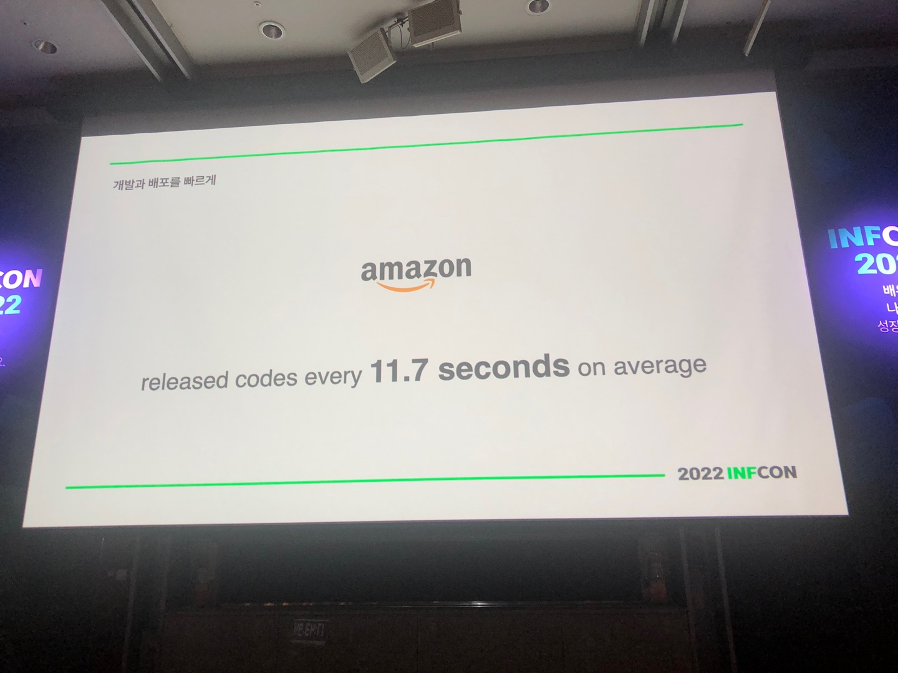
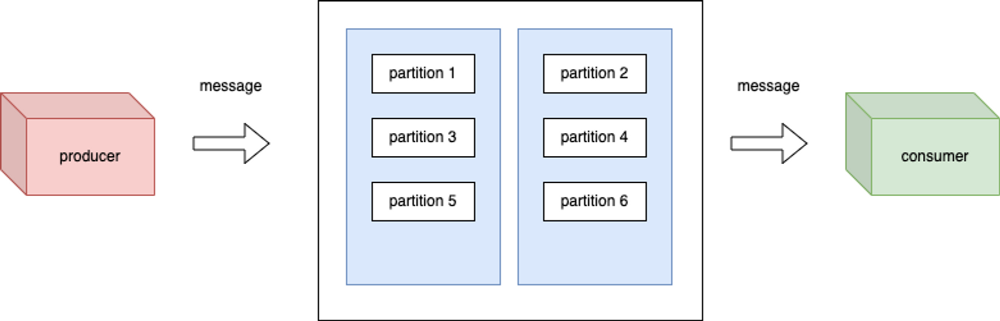

# RestTemplate 사용시 주의사항

## RestTemplate 사용시 주의사항


<figure><figcaption><p>https://pds.joongang.co.kr/news/component/htmlphoto_mmdata/202212/10/90c914f7-13ea-4051-9e6c-43343bb1f86a.jpg</p></figcaption></figure>


## RestTemplate이란?

* RestTemplate은 스프링 프레임워크에서 제공하는 HTTP 클라이언트 라이브러리이다. 주로 HTTP 프로토콜 기반으로 데이터를 전송하는 웹 서비스를 통신하기 위해 사용된다
* 그런데 RestTemplate을 별다른 설정하지 않고 사용하다 보면 다양한 이슈를 발견할 수 있을것이다.
* RestTemplate을 사용할때 유의 해야할 부분을 확인해보자

### Timeout 설정이 필요하다

* 만약 RestTemplate을 통해서 타 서비스를 호출한다. 그런데 해당 서비스는 실행시간이 10초가 걸린다고 하자
* 그럼 RestTemplate은 타서비스의 response를 받을 때까지 커넥션을 유지하게 된다
* 여기까지는 크게 이슈는 없다고 볼수 있다

#### 그런데 만약 동시에 10000개의 요청이 들어온다면 어떻게 될까?

* 자바는 기본적으로 멀티 쓰레드 기반으로 병렬처리가 가능하다. 애플리케이션에서 허용 가능한 쓰레드 갯수만큼 동시에 수행된다
* 그러면 요청을 수행하는 쓰레드 마다 10초 동안 사용중 상태로 유지할 것이다
* 애플리케이션의 가용할 수 있는 모든 쓰레드는 RestTemplate 요청으로 인해 더 이상 가용할 쓰레드가 없게 되어 다른 기능들이 동작하지 않을 수도 있다

### 그럼 애플리케이션의 가용성을 보장하기 위해선 어떻게 해야 할까?

* 우선 애플리케이션의 가용할 수 있는 쓰레드를 확보해야 한다
* RestTemplate에서 사용할 쓰레드풀을 별도로 설정해서 운영해야 한다
* RestTemplate에 사용할 쓰레드풀을 제한하여 애플리케이션의 전반적인 가용성을 보장할 수 있다

#### 그럼 쓰레드풀 설정은 어떻게 할 수 있지?

* RestTemplate 내부에는 ClientHttpRequestFactory 인터페이스 유형의 구현체를 사용하여 요청을 처리한다
* ClientHttpRequestFactory은 함수형 인터페이스로 제공하고 있으며 createRequest() 메서드를 호출하여 통신에 사용될 request 객체를 생성한다

```jsx
/**
 * Factory for {@link ClientHttpRequest} objects.
 * Requests are created by the {@link #createRequest(URI, HttpMethod)} method.
 *
 * @author Arjen Poutsma
 * @since 3.0
 */
@FunctionalInterface
public interface ClientHttpRequestFactory {

	/**
	 * Create a new {@link ClientHttpRequest} for the specified URI and HTTP method.
	 * <p>The returned request can be written to, and then executed by calling
	 * {@link ClientHttpRequest#execute()}.
	 * @param uri the URI to create a request for
	 * @param httpMethod the HTTP method to execute
	 * @return the created request
	 * @throws IOException in case of I/O errors
	 */
	ClientHttpRequest createRequest(URI uri, HttpMethod httpMethod) throws IOException;

}
```

* createRequest(url, method)를 통해서 request 객체를 생성하고, request.execute() 메서드를 호출하여 서버와 통신이 이루어진다

```jsx
// RestTemplate.java
@Nullable
protected <T> T doExecute(URI url, @Nullable HttpMethod method, @Nullable RequestCallback requestCallback,
		@Nullable ResponseExtractor<T> responseExtractor) throws RestClientException {

	Assert.notNull(url, "URI is required");
	Assert.notNull(method, "HttpMethod is required");
	ClientHttpResponse response = null;
	try {
		ClientHttpRequest request = createRequest(url, method);
		if (requestCallback != null) {
			requestCallback.doWithRequest(request);
		}
		response = request.execute();
		handleResponse(url, method, response);
		return (responseExtractor != null ? responseExtractor.extractData(response) : null);
	}

	...
}
```

### ClientHttpRequestFactory 구현체 중 어느걸 사용해야 하지?

<figure><figcaption></figcaption></figure>

* 구현체 종류는 상당히 다양하다 그중에서 우리는 커넥션 풀을 설정해야 하기 때문에 HttpComponentsClientHttpRequestFactory 클래스를 사용할 예정이다.
* HttpComponentsClientHttpRequestFactory 객체를 생성하고 httpClient에 필요한 쓰레드 갯수를 설정할 수 있다
* maxConnTotal : 최대로 연결할 수 있는 커넥션 쓰레드 최대 갯수를 설정한다
* maxConnPerRoute : IP + PORT당 연결할 커넥션 쓰레드 최대 갯수를 설정한다

```jsx
HttpClient httpClient = HttpClientBuilder.create()
			.setMaxConnTotal(100) // 최대로 연결할 수 있는 커넥션 쓰레드 수
			.setMaxConnPerRoute(60) // (IP + PORT) 당 커넥션 쓰레드 수
			.build();

HttpComponentsClientHttpRequestFactory factory = new HttpComponentsClientHttpRequestFactory();
factory.setHttpClient(httpClient);

return new RestTemplate(factory);
```

### 별도로 사용할 쓰레드풀만 지정하면 괜찮은걸까?

* 쓰레드풀을 설정하여 애플리케이션에 가용할 수 있는 쓰레드 그룹은 확보하였다
* 애플리케이션에서 가용할 수 있는 쓰레드를 확보했다는 것이지 아직은 애플리케이션의 가용성을 100% 보장하지는 못했다

#### 왜 애플리케이션은 쓰레드를 100% 가용하지 못하는가?

* 그 이유는 HTTP 통신 과정에서 수행되는 유효 시간을 지정하지 않았기 때문이다
* 만약 통신 과정에서 20\~30초가 소요되면 대기하는 시간동안 쓰레드는 사용중인 상태로 대기해야 한다
* 별도로 지정한 쓰레드풀 내에서도 가용할 수 있는 쓰레드가 부족하게 된다
* 가용성을 향상시키기 위해서는 timeout 시간을 지정하여 통신이 길어져 무기한 대기하는 시간을 제한하여 일정시간 이후에는 가용할 쓰레드를 확보하는게 중요하다

#### 그럼 제한시간 설정은 어떻게 해야 하나?

* **connectTimeout :** 클라이언트가 서버에 접속하기 위해 기다리는 최대 시간이다. 이는 네트워크 자체가 느릴 경우 제한할 수 있는 설정이다
* **socketTimeout :** 클라이언트와 서버가 연결되었지만 서버가 응답이 느려 기다릴 수 있는 최대 시간을 지정하는 것이다
* **connectionRequestTimeout :** 만약 지정한 커넥션 풀이 모두 사용중일 경우에, 다른 가용할 수 있는 쓰레드를 대기 하기 위한 최대 시간이다

```jsx
HttpComponentsClientHttpRequestFactory factory = new HttpComponentsClientHttpRequestFactory();
factory.setConnectionRequestTimeout(5000 * 1000); // 커넥션풀에서 사용 가능한 연결을 가져오기 위해 대기하는 최대 시간
factory.setConnectTimeout(5000); // 커넥션 최대 시간
factory.setReadTimeout(5000); // 읽기 최대 시간
...

return new RestTemplate(factory);
```

### 클라이언트와 서버가 통신이 이루어진 이후에는 주의해야할 점은 없을까?

* 이번에는 가용성 측면보다는 오류 발생 가능성을 줄이기 위한 설정이 필요하다
* 클라이언트와 서버가 커넥션을 맺고 나서 서버에서는 keep-alive 값을 내려준다
* keep-alive를 설정하면 클라이언트와 서버와 통신할때 매번 커넥션을 맺기 위한 작업 없이 바로 데이터를 요청할 수 있다
* 불필요한 작업을 최소화하여 성능을 향상시킬 수 있다

#### 그러면 Keep-Alive를 믿어도 되는가?

* 아니다. 실제로 서버측에서 keep-Alive를 지원하지 않을 수도 있다


왜 keep-alive를 지원하지 않지?


* 이유는 다양하다
* 이전의 사례는 긍정적인 효과만 설명하였는데 그보다 부정적인 효과도 많다
* 우선은 연결을 계속 유지하는 것은 서버와 클라이언트의 리소스를 계속 사용하게 된다. 이는 대량의 클라이언트가 접속하는 경우 서버 리소스를 과도하게 사용할 수 있다.
* 서버가 지원하는 동시 연결 수에 제한이 있는 경우, keep-alie를 사용하면 더 많은 연결이 동시에 점유되므로 다른 클라이언트의 연결 요청을 처리하는데 제약이 생길 수 있다.
* 그리고 연결 유지를 위해 일정 시간 동안 연결을 열어두어야 하기 때문에, 이로 인해 일부 패킷 전송이 지연될 수 있다.
* 그러므로 keep-alive를 사용할 때는 이러한 단점들을 고려하여 적절하게 설정하고, 서비스의 특성과 요구사항에 맞게 적용하는 것이 중요하다



* 서버측에선 커넥션을 종료했는데 클라이언트에서 해당 커넥션을 종료하지 않은 상황에 해당 커넥션을 다시 이용하려고 시도하는 경우 문제가 될 수 있다. 이를 half-closed connection이라 일컫는다
* 그래서 클라이언트도 커넥션을 맺었더라도 일정시간 이후엔 서버에서 내려주는 keep-alive 값에 의존하지 않고 자체적으로 유효한 커넥션을 해제할 수 있어야 한다

<figure><figcaption></figcaption></figure>

#### 클라이언트에서는 어떻게 자체적으로 유효시간을 해제할 수 있을까?

* evictIdleConnections : 클라이언트와 서버가 커넥션을 맺었을때, 최대 유효한 시간을 지정할 수 있다
* evictExpiredConnections : 설정한 유효 시간이 지났을 경우엔 자체적으로 커넥션을 해제할 수 있도록 설정 한다
* connTimeToLive : 유효시간 이외에도 클라이언트와 서버가 연결을 맺은 상태에서 얼마나 오랫동안 유지할지 최대 시간을 지정한다


**connTimeToLive**와 **connectTimeout**은 같지 않나?

→ 엄연히 다르다. connectTimeout은 통신하는 과정에서 이루어지는 최대 시간을 의미하고 connTimeToLive은 통신이 이루어진 이후에 연결할 수 있는 최대 시간을 지정하기 때문에 두개다 설정을 해주어야 한다


* 서버측에선 커넥션을 종료했는데 클라이언트에서 해당 커넥션을 제거하지 않은 상황에 해당 커넥션을 다시 이용하려고 시도하는 경우 문제가 될 수 있습니다.
* 이것을 half-closed connection이라 부릅니다.

```jsx
// 최종 설정

HttpClient httpClient = HttpClientBuilder.create()
	.setMaxConnTotal(100) // 최대로 연결할 수 있는 커넥션 쓰레드 수
	.setMaxConnPerRoute(60) // (IP + PORT) 당 커넥션 쓰레드 수
	.evictIdleConnections(60L, TimeUnit.SECONDS) // 최대 연결 유효시간을 지정한다
	.evictExpiredConnections() // 설정한 최대 연결 유효시간이 만료되면 커넥션을 해제한다
	.setConnectionTimeToLive(5, TimeUnit.SECONDS) // 커넥션 만료시간을 설정한다
	.build();

HttpComponentsClientHttpRequestFactory factory = new HttpComponentsClientHttpRequestFactory();
factory.setConnectionRequestTimeout(5000 * 1000); //  HttpClient가 커넥션 풀에서 사용 가능한 연결을 가져오기 위해 대기하는 최대 시간을 지정하는 옵션입니다. 커넥션 풀에서 사용 가능한 연결이 없을 때, 요청은 커넥션 풀에 새로운 연결이 생성될 때까지 해당 시간만큼 대기합니다.
factory.setConnectTimeout(5000); // 커넥션 최대 시간
factory.setReadTimeout(5000); // 읽기 최대 시간
factory.setHttpClient(httpClient);

return new RestTemplate(factory);
```

#### 서버가 keep-alive를 제공하지 않으면 유효시간 설정을 제거하자

* 사실 앞에서 설명한 설정들은 half-closed connection 문제를 100% 해결해주지는 못한다
* 단지 방어하기 위한 몇 가지 설정일 뿐이다
* 가장 확실한 방법은 클라이언트에서도 keep-alive에 대한 장점을 포기하는 것이다
* HeepHeader에 “Connection” 필드의 값을 “close”로 설정하면 명시적으로 keep-alive 기능을 사용하지 않는다
* 만약, 호출하는 서버에서 keep-alive를 제공하지 않는다면 keep-alive를 사용하지 않도록 설정하는게 명확한 해결 방법일 것이다

```jsx
HttpHeaders headers = new HttpHeaders();
headers.set("Connection", "close");

HttpEntity<String> requestEntity = new HttpEntity<>(headers);

ResponseEntity<String> response = restTemplate.exchange("<http://example.com/api/resource>", HttpMethod.GET, requestEntity, String.class);
```

## 그럼 성능적으로도 차이가 있을까?

* 기본 설정과 모든 설정을 다 했을 경우 JMeter를 통해서 execute time을 측정해보겠다
* 1000개의 요청을 1초단위로 5번 수행하여 총 5000개의 요청을 수행하도록 하였다

<figure><figcaption></figcaption></figure>

* 그리고 통신하는 과정에서 4초라는 지연시간을 주어 조금 더 극적인 효과를 볼수 있도록 하였다
* 아무설정 하지 않았을 경우엔 평균 49.8/sec의 속도를 보여주었고 다행히 에러는 발생하지는 않았다


<figure><figcaption></figcaption></figure>

* 두번째는 14.7/sec의 속도로 대략 1/3정도 속도가 개선된것을 확인할 수 있다

<figure><figcaption></figcaption></figure>

## 결론

* JAVA를 사용하다보면 정말 유용한 라이브러리가 많이 있다
* 이는 비용이나 시간적인 측면에서 매우 매력적인 부분이다
* 하지만 그만큼 책임이 따르는 것도 사실이다
* 그러므로 라이브러리를 사용할때는 관련 이슈나 공식문서 등을 참고하여 우리 서비스에 적합한지 확인할 수 있는 과정이 필요하다


## 참고

* [https://medium.com/@cizek.jy/spring-resttemplate-why-the-set-timeout-does-not-work-b75aaee076a3](https://medium.com/@cizek.jy/spring-resttemplate-why-the-set-timeout-does-not-work-b75aaee076a3)
* [https://sjh836.tistory.com/141](https://sjh836.tistory.com/141)
* [https://renuevo.github.io/spring/resttemplate-thread-safe/](https://renuevo.github.io/spring/resttemplate-thread-safe/)
* [https://blog.eomsh.com/41](https://blog.eomsh.com/41)
* [https://zepinos.tistory.com/34](https://zepinos.tistory.com/34)
