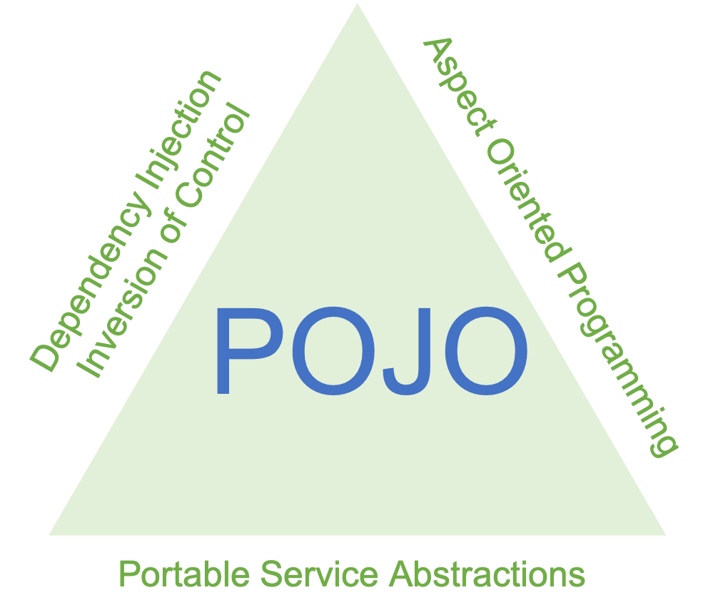

# Spring 특징

## 스프링 프레임워크란?

스프링 프레임워크를 간단하게 정의하기는 쉽지 않다. 사용하는 개발자마다 스프링 프레임워크에서 중요시 생각하는 부분들이 다르고 사용하는 목적도 다르기 때문이다.

#### 각자가 생각하는 스프링 프레임워크란?

* IOC/DI, AOP, PSA를 제공해주는 프레임워크
* IOC Container를 기반으로 객체지향 설계를 도와주는 프레임워크
* 빈의 생명주기와 주입 등을 제공해주는 프레임워크
* POJO를 도와주는 툴

이런 다양한 의견이 있었고 실제로도 위와 같은 답변을 들은 적 도 있었다.

### 내가 생각하는 스프링 프레임워크 정의는?

> 객체지향적으로 설계한 POJO를 유지하며 애플리케이션을 쉽고 효과적으로 개발할 수 있도록 지원하는 프레임워크라고 생각한다.

위의 답변과 그렇게 다르지 않다. 단, 특정 기술을 지칭한 표현은 내가 생각하는 스프링 프레임워크와는 다른 한정적인 느낌이 표현으로 와 닿게 되어 조금 다르게 풀어보았다.

부가적인 설명은 스프링 프레임워크의 목적을 통해서 설명할 수 있다.

### 스프링 프레임워크 목적

#### 실패한 해결책 : EJB

자바 엔터프라이즈 시스템 개발이 어려웠던 가장 큰 이유는 근본적인 비즈니스 로직과 엔터프라이즈 기술이라는 두 가지 복잡합이 한데 얽혀 있기 때문이다.

EJB의 기본 전략도 이 두가지 종류의 복잡함을 분리하는 것이었다. EJB는 기술적인 복잡함을 애플리케이션의 핵심 로직에서 일부분 분리하는 데 성공하긴 했다. 그러나 EJB라는 환경과 스펙에 종속되는 코드로 만들어져야 하는 더 큰 부담을 안게 되었다. EJB라는 틀 안에서 자바 코드를 만들게 강제함으로써 자바 언어가 원래 갖고 있던 장점마저 잃어버렸다는 사실이다.

### 비즈니스와 애플리케이션 로직의 복잡함을 상대하는 전략

스프링의 모토는 "기본으로 돌아가자"이다. 자바의 기본인 객체 지향에 충실한 설계가 가능하도록 단순한 오브젝트로 개발할 수 있고, 객체 지향의 설계 기법을 잘 적용할 수 있는 구조를 만들기 위해 DI 같은 유용한 기술을 편하게 적용하도록 도와주는 것이 스프링의 기본 전략이다.

서비스 추상화, 템플릿/콜백, AOP와 같은 스프링의 기술은 DI 없이는 존재할 수 없는 것들이다.

스프링을 사용하면 순수한 비즈니스 로직만을 담고 있는 코드에는 객체지향 분석과 설계에서 나온 도메인 모델을 쉽게 적용할 수 있기 때문이다. 객체 지향적인 특정을 잘 살린 설계는 상속과 다형성, 위임을 포함해서 많은 객체 지향 디자인 패턴과 설계 기법이 잘 녹아들어 갈 수 있었다.

## 스프링 프레임워크 특징

분리됐지만 반드시 필요한 엔터프라이즈 서비스 기술을 POJO 방식으로 개발된 애플리케이션 핵심 로직을 담은 코드에 제공한다'는 것이 스프링의 가장 강력한 특징과 목표다.

다음은 스프링 프레임워크의 대표적인 기술에 대해서 살펴보자

### IOC / DI

* 두 개의 오브젝트를 분리해서 만들고, 인터페이스를 두어 느슨하게 연결한 뒤 실제 사용할 대상은 DI를 통해 외부에서 주입한다.
* 활용 방법
  * 의존 대상의 구현을 변경\(전략패턴\)
  * 핵심기능의 동적인 변경
  * 부가기능 추가\(데코레이터 패턴\)
  * 프록시 : 필요한 시점에서 실제 사용할 오브젝트를 초기화하고 리소스를 준비하게 해주는 지연 로딩을 적용하려고 할때
  * 템플릿/콜백 : 콜백을 얼마든지 만들어서 사용할 수 있다는 건 개발을 통한 유연한 확장성을 보여주는 것이며, 템플릿은 한 번 만들어두면 계속 재사용할 수 있다는 건 기능의 확장에도 변하지 않는다.
  * 싱글톤과 오브젝트 : DI를 프레임워크로 이용한다는 건 DI 대상 오브젝트를 컨테이너가 관리한다는 의미이다. 스프링에서는 싱글톤 외에도 다양한 스코프를 갖는 오브젝트를 만들어 DI에 사용할 수도 있다. HTTP 요청당 하나의 오브젝트가 만들어지거나, HTTP 세션당 하나씩 오브젝트가 만들어지게 할 수 있다.

### AOP

* 공통 관심 사항을 구현한 코드를 비즈니스 로직에 영향 없이 삽입해 주는 기술이라고 할 수 있다.

#### AOP 위빙 방법

* 컴파일 시에 위빙 : Compile 시에 AspectJ에서 필요한 객체 weaving을 통해 클래스를 생성하는 방식이다. 위의 Load-time에 대한 절차가 없어서 퍼포먼스 하락 없이 구성이 가능하다.
* 클래스 로딩 시에 위빙 : 객체를 Load 할때, AspectJ에 의해서 weaving된 객체를 넘겨주는 방식이다.
* 런타임 시에 위빙 : Spring AOP에서 사용하는 weaving 방식. 스프링에서는 Run-time weaving을 통해 CGLIB Proxy 혹은 JDK Dynamic Proxy를 생성한다.

### PSA

* PSA는 환경과 세부 기술의 변화에 관계없이 일관된 방식으로 기술에 접근할 수 있게 해준다.
* 서비스 추상화의 좋은예는 JDBC이다.
  * JDBC라는 표준스펙이 존재하기 때문에 DBMS를 오라클을 사용하던, MYSQL을 사용하던 공통된 방식으로 코드를 작성할 수 있다. 데이터베이스 종류에 관계없이 같은 방식으로 제어 할수 있는 디자인패턴\(어댑터 패턴\)을 적용해 다수의 기술을 공통 인터페이스로 제어할 수 있도록 한것을 서비스 추상화라고 한다.
* 다른 예로는 스프링 캐시가 있다.

## IOC Container

IoC Container를 스프링 프레임워크라고 보는 사람도 있다. 그 말이 틀린 말도 100% 틀린 말이 아니라고 할 수 있다. 스프링은 스테레오 타입의 객체들을 싱글톤으로 관리하고 다른 객체에 주입이 필요하다면 IoC Container가 직접 주입도 시켜준다. 여기서 제어의 역전이 발생한다. 객체는 특정 객체가 아닌 타입에 의존하면서 실제 구현체에 대해서는 모르는 상태를 유지하는 것이다.

## 참고

* [https://12bme.tistory.com/157?category=682904](https://12bme.tistory.com/157?category=682904)
* [https://frontierdev.tistory.com/76](https://frontierdev.tistory.com/76)
* [https://smujihoon.tistory.com/174](https://smujihoon.tistory.com/174)
* [https://hyojun123.github.io/2019/04/25/springDiIoc/](https://hyojun123.github.io/2019/04/25/springDiIoc/)
* [https://jongmin92.github.io/2018/02/11/Spring/spring-ioc-di/](https://jongmin92.github.io/2018/02/11/Spring/spring-ioc-di/)
* [https://tech.wheejuni.com/page/3/](https://tech.wheejuni.com/page/3/)
* [https://tram-devlog.tistory.com/entry/Spring-AOP-weaving-proxy](https://tram-devlog.tistory.com/entry/Spring-AOP-weaving-proxy)

