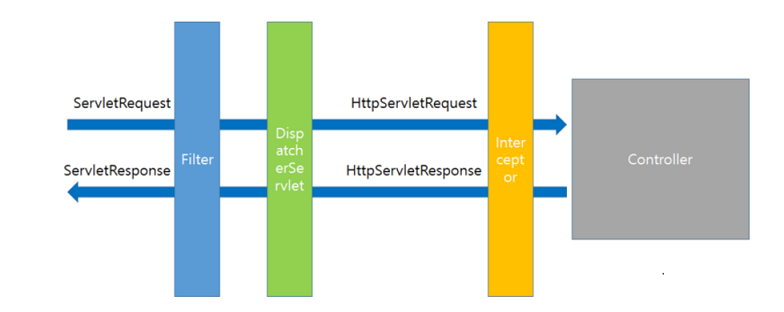

# Dispatcher Servlet



### Dispatcher Servlet이란 무엇인가

Dispatcher Servlet이란 외부의 요청을 특정 컨트롤러로 매핑하기 위해 Front Controller 패턴을 적용한 Servlet이다.


#### Q1. 그렇다면 Front Controller 패턴이란 무엇인가?

Front Controller는 주로 서블릿 컨테이너의 제일 앞에서 서버로 들어오는 클라이언트의 모든 요청을 받아서 처리해주는 컨트롤러인데, MVC 구조에서 함께 사용되는 패턴이다. 이전에는 서블릿을 컨트롤러 당 하나씩 두고 있어서 컨트롤러가 추가될 때마다 서블릿 설정도 추가해주어야 했다. 그러나 dispatcher servlet을 두면서 컨트롤러 추가시 별도의 servlet 설정을 할 필요가 없었다. 그리고 dispatcher servlet을 통해서 Tracking이나 Security를 적용할 때 편하게 구현이 가능하고, URL 구성이 간편해졌다.


### Dispatcher Servlet 동작 순서

* 클라이언트가 해당 어플리케이션에 접근하면 DispatcherServlet이 가로챈다.


**Q2. 어떻게 dispatcherServlet이 외부의 요청을 가로채는가?**

web.xml에 등록된 dispatcherServlet의 &lt;url-pattern&gt;이 '/'와 같이 해당 어플을 통과하는 모든 URL로 등록했기 때문이다. 특정 URL만 적용하고 싶다면 &lt;url-pattern&gt;의 내용을 변경해주면 된다.


스프링은 web.xml 파일에 아래와 같이 dispatcher servlet적용 url pattern을 적용할 수 있다.

```java
<servlet>
  <servlet-name>salesServlet</servlet-name>
  <servlet-class>org.springframework.web.servlet.DispatcherServlet</servlet-class>
  <!-- contextLoader가 해당 위치의 설정 파일을 읽어, 해당 파일을 dispatcher servlet으로 만든다. -->
  <init-param>
    <param-name>contextConfigLocation</param-name>
    <param-value>/WEB-INF/salesServlet-servlet.xml</param-value>
  </init-param>
  <load-on-startup>1</load-on-startup>
</servlet>

<!-- /sales로 시작하는 url 요청을 받아 salesServlet에서 처리한다. -->
<servlet-mapping>
  <servlet-name>salesServlet</servlet-name>
  <url-pattern>/sales</url-pattern>
</servlet-mapping>
```


**스프링 부트는 url pattern을 어떻게 설정할 수 있을까?**  
  
appliation.yml , application.properties파일에 server.servlet.context-path 옵션으로 지정할 수 있다.


* DispatcherServlet은 가로챈 정보를 HandlerMapping 에게 보내 해당 요청을 처리할 수 있는 Controller를 찾아낸다. HandlerMapping이 컨트롤러를 찾아내는 전략은 BeanNamUrlHandlerMapping과 DefaultAnnotationHandlerMapping이 기본 전략이다.


**Q3. HandlerMapping이 컨트롤러를 찾는 다른 전략은 무엇이 있는가?**

1. DefaultAnnotationHandlerMapping : @RequestMapping 이라는 애노테이션을 컨트롤러 클래스나 메소드에 직접 부여하고 이를 이용해 매핑하는 전략이다.
2. BeanNameUrlHandlerMapping : 빈정의 태그에서 name attribute에 선언된 URL과 class attribute에 정의된 Controller를 매핑하는 방식으로 동작한다.
3. ControllerClassNameHandlerMapping : Controller의 클래스 이름중 suffix인 Controller를 제거한 나머지 이름의 소문자로 url mapping한다.
4. SimpleUrlHandlerMapping : Ant-Style 패턴 매칭을 지원하며, 하나의 Controller에 여러 URL을 mapping 할 수 있다.


* 컨트롤러 작업 수행
* 컨트롤러는 요청을 응답받을 View의 이름을 리턴하게 된다. 그때 View 이름을 ViewResolver가 먼저 받아 해당하는 View가 존재하는지 검색한다.
* 컨트롤러에서 보내온 View 이름을 토대로 처리 View를 검색한다.
* 이 결과를 다시 DispatcherServlet 에게 보낸다.
* DispatcherServlet은 최종 결과를 클라이언트에 전송한다.

### **filter와 interceptor, aop의 수행 시점을 dispatcherServlet를 기준으로 알아보**


* filter : dispatcherServlet 이전과 이후에 동작
* interceptor : dispatcherServlet과 컨트롤러 사이에 동작
* aop : interceptor와 컨트롤러 사이에 동작

## 참고

* [https://galid1.tistory.com/525](https://galid1.tistory.com/525)
* [https://qkrrudtjr954.github.io/spring/2018/03/12/spring-mvc-structure.html](https://qkrrudtjr954.github.io/spring/2018/03/12/spring-mvc-structure.html)
* [https://mangkyu.tistory.com/18](https://mangkyu.tistory.com/18)
* [https://gompangs.tistory.com/entry/Dispatcher-Servlet](https://gompangs.tistory.com/entry/Dispatcher-Servlet)

