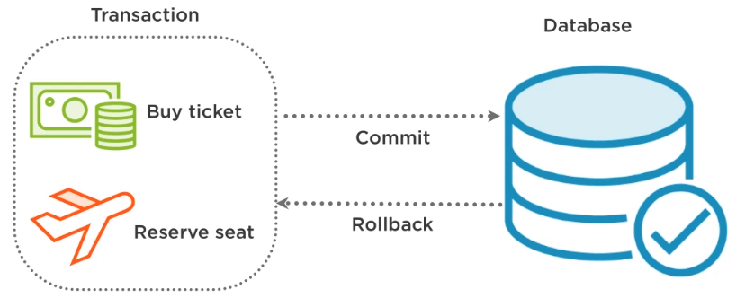

# @Transactional



## @Transactional

스프링에서 트랜잭션 처리는 보통 @Transactional 어노테이션을 많이 사용하게 된다. @Transactional은 클래스 또는 메소드에 사용할 수 있으며 @Transactional이 포함된 메소드가 호출될 경우, 프록시 객체가 생성된다.

프록시 객체는 해당 메소드 실행 이전에 PlatformTransactionManager를 사용하여 트랜잭션을 시작하고 결과에 따라 Commit 또는 Rollback 한다.

### Commit과 Rollback은 어느 경우에 발생하는가?

* CheckedException or 예외가 없을 때는 Commit
* UncheckedException이 발생하면 Rollback

### @Transactional 우선순위는 어떻게 되는가?

@Transactional은 우선 순위를 가진다.

1. 클래스 메소드
2. 클래스
3. 인터페이스 메소드
4. 인터페이스

#### 단 주의해야 할 부분이 있다.

@Transactional 어노테이션 같은 경우 Spring AOP를 이용하게 되는데 이 AOP는 기본적으로 Dynamic Proxy를 이용한다.Dynamic Proxy는 인터페이스 기반으로 동작하기 때문에 인터페이스가 없을경우 트랜잭션이 동작하지 않는다.

인터페이스 없이 트랜잭션 동작하게 하려면 CGLib(Code Generation Library) Proxy를 이용하면 된다.CGLib Proxy는 클래스에 대한 Proxy가 가능하기 때문에 인터페이스가 없어도 된다.

## @Transactional 설정 정보

**@Transactional 설정**

| 속성                     | 타입                                | 설명                                  |
| ---------------------- | --------------------------------- | ----------------------------------- |
| value                  |  String                           | 사용할 트랜잭션 관리자                        |
| propagation            | enum: Propagation                 | 선택적 전파 설정                           |
| isolation              | enum: Isolation                   | 선택적 격리 수준                           |
| readOnly               | boolean                           | 읽기/쓰기 vs 읽기 전용 트랜잭션                 |
| <p> timeout<br></p>    | int (초)                           | 트랜잭션 타임 아웃                          |
| rollbackFor            | Throwable 로부터 얻을 수 있는 Class 객체 배열 | 롤백이 수행되어야 하는, 선택적인 예외 클래스의 배열       |
| rollbackForClassName   | Throwable 로부터 얻을 수 있는 클래스 이름 배열   | 롤백이 수행되어야 하는, 선택적인 예외 클래스 이름의 배열    |
| noRollbackFor          | Throwable 로부터 얻을 수 있는 Class 객체 배열 | 롤백이 수행되지 않아야 하는, 선택적인 예외 클래스의 배열    |
| noRollbackForClassName | Throwable 로부터 얻을 수 있는 클래스 이름 배열   | 롤백이 수행되지 않아야 하는, 선택적인 예외 클래스 이름의 배열 |

## 주의할 점

### @Transactional은 public method에만 적용된다.

@Transactional은 프록시 기반으로 동작하기 때문에 public method가 아니면 동작하지 않는다.

만약 private 에 @Transactional을 적용한다고 하면 IDE에서 컴파일 오류를 확인할 수 있다.

.png>)

### 동일한 클래스 내의 메소드 호출은 @Transactional이 동작하지 않는다.

외와 같은 원인으로 프록시 기반으로 동작하기 때문에 외부에서 접근할 때 AOP를 통해서 프록시 객체를 접근할 수 있다. 그러나 클래스내에서 다른 메소드를 호출하게 되면 프록시로 접근하지 않고 직접 접근하기 때문에 메소드에 선언해 놓은 @Transactional 이 정상적으로 동작하지 않을 것이다.

#### 클래스 내 메소드를 호출하여 @Transactional을 동작하고 싶다면?

* 가장 간단한 방법은 새로운 클래스를 생성하여 메소드를 위임하는 것이다.
*   클래스 생성이 어렵다면 aspectj를 사용하면 된다.

    ```java
    @SpringBootApplication
    @EnableTransactionManagement(proxyTargetClass = true, mode = AdviceMode.ASPECTJ)
    @EnableLoadTimeWeaving(aspectjWeaving = EnableLoadTimeWeaving.AspectJWeaving.ENABLED)
    public class AspectjApplication {
        public static void main(String[] args) {
            SpringApplication.run(AspectjApplication.class, args);
        }
    }
    ```

## 참고

* [https://ducmanhphan.github.io/2020-04-10-Introduction-to-transactions-in-Spring-data-jpa/](https://ducmanhphan.github.io/2020-04-10-Introduction-to-transactions-in-Spring-data-jpa/)
* [https://imiyoungman.tistory.com/9](https://imiyoungman.tistory.com/9)
* [https://goddaehee.tistory.com/167](https://goddaehee.tistory.com/167)
* [https://madnix.tistory.com/entry/Transactional-사용시-rollback이-안될-경우](https://madnix.tistory.com/entry/Transactional-%EC%82%AC%EC%9A%A9%EC%8B%9C-rollback%EC%9D%B4-%EC%95%88%EB%90%A0-%EA%B2%BD%EC%9A%B0)
* [https://medium.com/chequer/spring-transactional-caching-그리고-aspectj-1편-transactional-17eca8c33bf](https://medium.com/chequer/spring-transactional-caching-%EA%B7%B8%EB%A6%AC%EA%B3%A0-aspectj-1%ED%8E%B8-transactional-17eca8c33bf)
