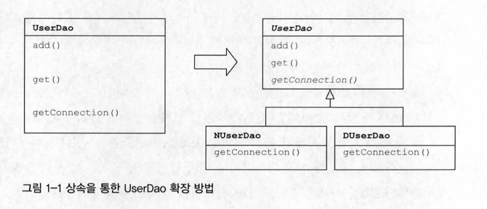
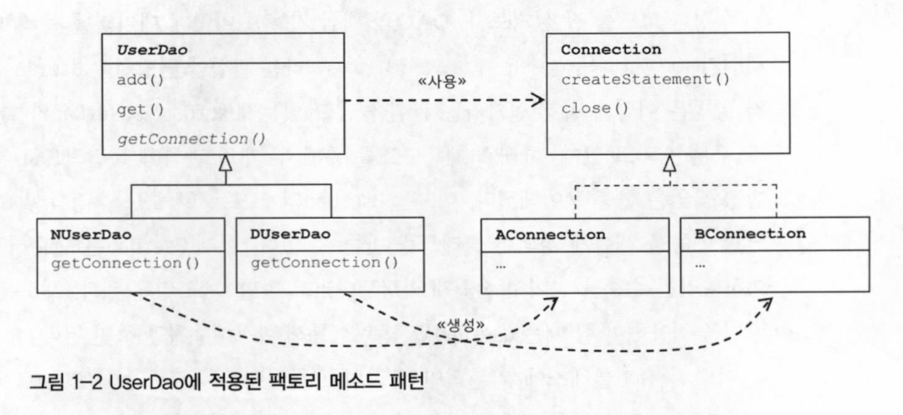
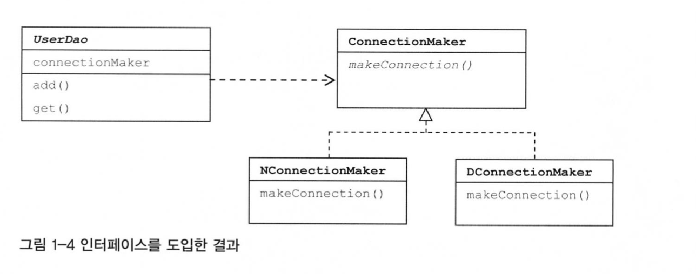
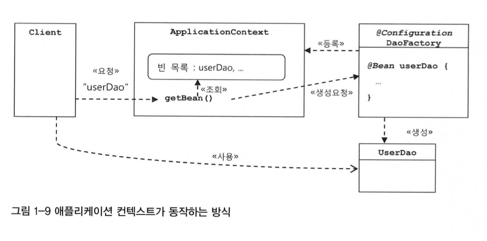

# 1장 오브젝트와 의존관계

## 초난감 DAO

사용자 정보를 DB에 넣고 관리할 수 있는 DAO 클래스를 만들어보자.

JDBC를 이용하는 작업의 일반적인 순서는 다음과 같다.

* DB 연결을 위한 Connection을 가져온다.
* SQL을 담은 Statement\(또는 PreparedStatement\)를 만든다.
* 만들어진 Statement를 실행한다.
* 조회의 경우 SQL 쿼리의 실행 결과를 ResultSet으로 받아서 정보를 저장할 오브젝트에 옮겨준다.
* 작업 중에 생성된 Connection, Statement, ResultSet 같은 리소스는 작업을 마친 후 반드시 닫아준다.
* JDBC API가 만들어내는 예외를 잡아서 직접 처리하거나, 메소드에 throws를 선언해서 예외가 발생하면 메소드 밖으로 던지게 한다.

```java
package springbook.user.domain;

public class User { 
    String id;
    String name; 
    String password;
    
    public String getld() { 
        return id;
    }

    public void setId(String id) {
        this.id = id;
    }
    public String getName() {
        return name; 
    }
    
    public void setName(String name) { 
        this.name = name;
    }

    public String getPassword() {
        return password; 
    }

    public void setPassword(String password) { 
        this.password = password;
    } 
}
```

### main\(\)을 이용한 DAO 테스트 코드

이제 main 메소드를 만들고 그 안에서 UserDao의 오브젝트를 생성해서 add\(\)와 get\(\) 메소드를 검증해보자.

```java
public static void main(String[] args) throws ClassNotFoundException, SQLException { 
    UserDao dao = new UserDaoO;

    User user = new User(); 
    user.setld("whiteship");
    user. setName ("백기 선"); 
    user.setPassword("married");

    dao.add(user);

    System.out.println(user.getld() + 등록 성공");
    User user2 = dao.get(user.getId()) ; 
    System.out.println(user2.getName());

    System.out.printin(user2.getPassword()); 
		System.out.println(user2.getld() + " 조회 성공”);
}
```

이제부터 이 문제 많은 초난감 DAO 코드를 객체지향 기술의 원리에 충실한 멋진 스프링 스타일의 코드로 개선해보는 작업을 할 것이다.

## DAO의 분리

### 관심사의 분리

객체지향의 세계에서는 모든 것이 변한다. 여기서 변한다는 것은 변수나 오브젝트 필드의 값이 변한다는 게 아니다. 오브젝트에 대한 설계와 이를 구현한 코드가 변한다는 뜻이다. 그래서 개발자가 객체를 설계할 떄 가장 엄두에 둬야 할 사항은 바로 미래의 변화를 어떻게 대비할 것인가이다. 변화는 먼 미래에만 일어나는 게 아니다. 며칭 내에, 때론 몇 시간 후에 변화에 대한 요구가 갑자기 발생할 수 있다.

그러면 어떻게 변경이 일어날 때 필요한 작업을 최소화하고, 그 변경이 다른 곳에 문제를 일으키지 않게 할 수 있었을까? 그것은 분리와 확장을 고려한 설계가 있었기 때문이다.

변화는 대체로 집중된 한 가지 관심에 대해 일어나지만 그에 따른 작업은 한곳에 집중되지 않는 경우가 많다. 변화가 한 번에 한 가지 관심에 집중돼서 일어난다면, 우리가 준비해야 할 일은 한가지 관심이 한 군데에 집중되게 하는 것이다. 이를 프로그래밍의 기초 개념 중에 관심사의 분리이다.

관심사가 같은 것끼리 모으고 다른 것은 분리해줌으로써 같은 관심에 효과적으로 집중할 수 있게 만들어주는 것이다.

### 커넥션 만들기의 추출

UserDao의 구현된 메소드를 다시 살펴보자. 자세히 들여다보면 add\(\) 메소드 하나에서만 적어도 세 가지 관심사항을 발견할 수 있다.

#### UserDao의 관심사항

* 첫째는 DB와 연결을 위한 커넥션을 어떻게 가져올까라는 관심이다.
* 둘째는 사용자 등록을 위해 DB에 보낼 SQL 문장을 담을 Statement를 만들고 실행하는것이다.
* 셋째는 작업이 끝나면 사용한 리소스인 Statement와 Connection 오브젝트를 닫아줘서 소중한 공유 리소스를 시스템에 돌려주는 것이다.

### 중복 코드의 메소드 추출

가장 먼저 할 일은 커넥셩을 가져오는 중복된 코드를 분리하는 것이다.

```java
public void add(User user) throws ClassNotFoundException, SQLException {
    Connection c = getConnection(); 
    ...
}
public User get(String id) throws ClassNotFoundException, SQLException { 
    Connection c = getConnection();
    ...
}

private Connection getConnectionO throws ClassNotFoundException, SQLException { 
    Class.forName("com.mysql.jdbc.Driver");
    Connection c = DriverManager.getConnection(
    "jdbc:mysql://localhost/springbook", "spring", "book");
}
```

관심이 다른 코드가 있는 메소드에는 영향을 주지도 않을뿐더러, 관심 내용이 독립적으로 존재하므로 수정도 간단해졌다.

### DB 커넥션 만들기의 독립

메소드 추출만으로도 변화에 좀 더 유연하게 대처할 수 있는 코드를 만들었다. 이번엔 좀 더 나아가서 변화에 대응하는 수준이 아니라, 아예 변화를 반기는 DAO를 만들어보자. 문제는 N사와 D사가 각기 다른 종류의 DB를 사용하고 있고, DB 커넥션을 가져오는 데 있어 독자적으로 만든 방법을 적용하고 싶어한다는 점이다. 이럴 경우엔 어떻게 대응할 수 있을까?



기존에는 같은 클래스에 다른 메소드로 분리됐던 DB 커넥션 연결이라는 관심을 이번에는 상속을 통해 서브클래스로 분리해버리는 것이다.

```java
public abstract class UserDao {
    public void add(User user) throws ClassNotFoundException, SQLException {
    Connection c = getConnectionO; 
}
public User get(String id) throws ClassNotFoundException, SQLException { 
    Connection c = getConnection();
) 
// 구현 코드는 제거되고 추상 메소드로 바뀌었다. 메소드의 구현은 서브클래스가 담당한다.
public abstract Connection getConnectionO throws ClassNotFoundException, SQLException;
public class NUserDao extends UserDao {
    public Connection getConnection() throws ClassNotFoundException, SQLException {
        // N 사 DB connection 생성코드 }
}
public class DUserDao extends UserDao {
    public Connection getConnectionO throws ClassNotFoundException,
        SQLException {
            // D 사 DB connection 생성코드
        } 
    )
}
```

UserDao는 Connection 오브젝트가 만들어지는 방법과 내부 동작 방식에는 상관없이 자신이 필요한 기능을 Connection 인터페이스를 통해 사용하기만 할 뿐이다.



서브 클래스의 getConnection\(\)을 통해 만들어진 Connection 오브젝트의 종류가 달라질 수 있게 하는 것을 목적으로 하는 디자인 패턴인 팩토리 메소드 패턴을 나타내는 그림이다. NUserDao와 DUserDao가 모두 같은 종류의 Connection 구현 클래스의 오브젝트를 생성하는 방식이 다르다면, 이는 팩토리 메소드 패턴으로 이해할 수 있다.

하지만 이 방법을 상속을 사용했다는 단점이 있다. 상속 자체는 간단해 보이고 사용하기도 편리하게 느껴지지만 사실 많은 한계점이 있다. 만약 이미 UserDao가 다른 목적을 위해 상속을 사용하고 있다면 어떻게 될까? 자바는 클래스의 다중상속을 허용하지 않는다. 또 다른 문제는 상속을 총한 상하위 클래스의 관계는 생각보다 밀접하는 점이다. 상속 관계는 두 가지 다른 관심사에 대해 긴밀한 결합을 허용한다. 서브클래스는 슈퍼클래스의 기능을 직접 사용할 수 있다. 그래서 슈퍼 클래스 내부의 변경이 있을 때 모든 서브클래스를 함께 수정하거나 다시 개발해야 할 수도 있다. 반대로 그런 변화에 따른 불편을 주지 않기 위해 슈퍼클래스가 더 이상 변화하지 않도록 제약을 가해야 할지도 모른다.

## DAO의 확장

지금까지는 데이터 엑세스 로직과 DB 연결을 두 개의 관심사를 상하위 클래스로 분리시켰다.

### 인터페이스의 도입

관심사를 분리하면서 상속의 문제를 해결하기 위한 방법으로는 인터페이스로 해결할 수 있다. 인터페이스는 자신을 구현한 클래스에 대한 구체적인 정보는 모두 감춰버린다.



```java
public class UserDaoTest {
    public static void main(String[] args) throws ClassNotFoundException,
        SQLException {
    ConnectionMaker connectionMaker = new DConnectionMaker();
    UserDao dao = new UserDao(connectionMaker); // 구현 클래스를 결정하고 오브젝트를 만든다.
    }
}
```

## 원칙과 패턴

### 개방 폐쇄 원칙

개방 폐괘 원칙을 이용하면 지금까지 해온 리팩토링 작업의 특징과 최종적으로 개선된 설계와 코드의 장점이 무엇인지 효과적으로 설명할 수 있다.

### 높은 응집도와 낮은 결합도

개방 폐쇄 원칙은 높은 응집도와 낮은 결합도라는 소프트웨어개발의 고전적인 원리로도 설명이 가능하다.

#### 높은 응집도

응집도가 높다는 것은 변화가 일어날 때 해당 모듈에서 변하는 부분이 크다는 것으로 설명할 수 있다. 즉 변경이 일어날 때 모듈의 많은 부분이 함께 바뀐다면 응집도가 높다고 말할 수 있다.

#### 낮은 결합도

낮은 결합도는 높은 응집도보다 더 민감한 원칙이다. 결합도란 '하나의 오브젝트가 변경이 일어날 떄에 관계를 맺고 있는 다른 오브젝트에게 변화를 요구하는 정도'라고 설명할 수 있다.

### 전략 패턴

전략 패턴은 자신의 기능 맥락에서 필요에 따라 변경이 필요한 알고리즘을 인터페이스를 통해 통째로 외부로 분리시키고, 이를 구현한 구체적인 알고리즘 클래스를 필요에 따라 바꿔서 사용할 수 있게 하는 디자인 패턴이다.

스프링이란 바로 지금까지 설명한 객체지향적 설계 원칙과 디자인 패턴에 나타난 장점을 자연스럽게 개발자들이 활용할 수 있게 해주는 프레임워크이다.

## 제어의 역전\(IOC\)

### 오브젝트 팩토리

이전까지 초난감 DAO를 깔끔한 구조로 리팩토링하는 작업을 수행하였다. 그러나 인터페이스를 구현한 클래스를 생성하는 로직은 자연스럽게 넘어갔었다. 이를 담당할 클래스를 하나 생성해보자.

```java
package springbook.user.dao;
... 
public class DaoFactory { 
    public UserDao userDao() {
        // 팩토리의 메소드는 UserDao 타입의 오브젝트를 어떻게 만들고. 어떻게 준비시킬지를 결정한다.
        ConnectionMaker connectionMaker = new DConnectionMakerO; UserDao userDao = new UserDao(connectionMaker);
        return userDao; 
    } 
}
```

DaoFactory에 UserDao가 아닌 다른 DAO의 생성 기능을 넣으면 어떻게 될까? AccountDao, MesssageDao 등을 만들었다고 해보자.

```java
public class DaoFactory { 
    public UserDao userDao() {
        return new UserDao(new DConnectionMaker());
    }
    public AccountDao accountDaoO {
        return new AccountDao(new DConnectionMaker());
    }
    public MessageDao messageDaoO {
        return new MessageDao(new DConnectionMaker());
    }
}
```

이렇게 오브젝트 생성 코드가 중복되는 건 좋지 않은 현상이다. DAO가 더 많아지면 ConnectionMaker의 구현 클래스를 바꿀 때마다 모든 메소드를 일일이 수정해야 하기 때문이다. 중복 문제를 해결하려면 역시 분리해내는 게 가장 좋은 방법이다. ConnectionMaker의 구현 클래스를 결정하고 오브젝트를 만드는 코드를 별도의 메소드로 뽑아내자.

### 제어권의 이전을 통한 제어관계 역전

제어의 역전에서는 오브젝트가 자신이 사용할 오브젝트를 스스로 선택하지 않는다. 모든 제어권한을 자신이 아닌 다른 대상에게 위임하기 떄문이다. 제어의 역전 개념은 사실 이미 폭 넓게 적용되어 있다. 서블릿에 대한 제어 권한을 가진 컨테이너가 적절한 시점에 서블릿 클래스의 오브젝트를 만들고 그 안의 메소드를 호출한다. 이렇게 서블릿이나 JSP, EJB처럼 컨테이너 안에서 동작하는 구조는 간단한 방식이긴 하지만 제어의 역전 개념이 적용되어 있다고 볼 수 있다.

프레임워크도 제어의 역전 개념이 적용된 대표적인 기술이다. 라이브러리를 사용하는 애플리케이션 코드는 애플리케이션 흐름을 직접 제어한다. 단지 동작하는 중에 필요한 기능이 있을 떄 능동적으로 라이브러리를 사용할 뿐이다. 반면에 프레임워크는 거꾸로 애플리케이션 코드가 프레임워크에 의해 사용된다. 보통 프레임워크 위에 개발한 클래스를 등록해두고, 프레임워크가 흐름을 주도하는 중에 개발자가 만든 애플리케이션 코드를 사용하도록 만드는 방식이다.

단순한 적용이라면 DaoFactory와 같이 IoC 제어권을 가진 오브젝트를 분리해서 만드는 방법이면 충분하겠지만, IoC를 애플리케이션 전반에 걸쳐 본격적으로 적용하려면 스프링과 같은 IoC 프레임워크의 도움을 받는 편이 훨씬 유리하다. 스프링은 IoC를 모든 기능의 기초가 되는 기반기술로 삼고 있으며, IoC를 극한까지 적용하고 있는 프레임워크이다.

## 스프링의 IoC

### 오브젝트 팩토리를 이용한 스프링 IoC

스프링에서는 스프링이 제어권을 가지고 직접 만들고 관계를 부여하는 오브젝트를 빈\(bean\)이라고 부른다. 스프링에서는 빈의 생성과 관계설정 같은 제어를 담당하는 IoC 오브젝트를 빈 팩토리라고 부른다. 보통 빈 팩토리보다는 이를 좀 더 확장한 애플리케이션 컨텍스트를 주로 사용한다. 애플리케이션 컨텍스트는 별도의 정보를 참고해서 빈\(오브젝트\)의 생성, 관계설정 등의 제어 작업을 총괄한다.

### 애플리케이션 컨텍스트의 동작방식

애플리케이션 컨텍스트는 애플리케이션에서 IoC를 적용해서 관리할 모든 오브젝트에 대한 생성과 관계설정을 담당한다.



애플리케이션 컨텍스트는 DaoFactory 클래스를 설정정보로 등록해두고 @Bean이 붙은 메소드의 이름을 가져와 빈 목록을 만들어둔다. 애플리케이션 컨텍스트를 사용했을 때 얻을 수 있는 장점은 다음과 같다.

* 클라이언트는 구체적인 팩토리 클래스를 알 필요가 없다.

  애플리케이션 컨텍스트를 사용하면 오브젝트 팩토리가 아무리 많아져도 이를 알아야 하거나 직접 사용할 필요가 없다. 애플리케이션 컨텍스트를 이용하면 일관된 방식으로 원하는 오브젝트를 가져올 수 있다.

* 애플리케이션 컨텍스트는 종합 IoC 서비스를 제공해준다.
* 애플리케이션 컨텍스트는 빈을 검색하는 다양한 방법을 제공한다.

## 스프링 IoC의 용어 정리

* 빈 : 빈 또는 빈 오브젝트는 스프링이 IoC 방식으로 관리하는 오브젝트라는 뜻이다.
* 빈 팩토리 : 스프링이 IoC를 담당하는 핵심 컨테이너를 가리킨다.
* 애플리케이션 컨텍스트 : 빈 팩토리를 확장한 IoC 컨테이너이다. 빈 팩토리라고 부를 때는 주로 빈의 생성과 제어의 관점에서 이야기하는 것이고, 애플리케이션 컨텍스츠라고 할 때는 스프링이 제공하는 애플리케이션 지원 기능을 모두 포함해서 이야기하는 것이라고 보면 된다.
* 설정정보/설정 메타정보 : 스프링의 설정정보란 애플리케이션 컨텍스트 또는 빈 팩토리가 IoC를 적용하기 위해 사용하는 메타정보를 말한다. 영어로 'configuration'이라고 하는데, 이는 구성정보 내지는 형상정보라는 의미다.
* 컨테이너 또는 IoC 컨테이너 : IoC 방식으로 빈을 관리한다는 의미에서 애플리케이션 컨텍스트나 빈 팩토리를 컨테이너 또는 IoC 컨테이너라고도 한다. 컨테이너라는 말 자체가 IoC의 개념을 담고 있기 때문에 이름이 긴 애플리케이션 컨텍스트 대신에 스프링 컨테이너라고 부르는걸 선호하는 사람들도 있다.

## 싱글톤 레지스트리와 오브젝트 스코프

### 싱글톤 레지스트리로서의 애플리케이션 컨텍스트

스프링이 처음 설계됐던 대규모의 엔터프라이즈 서버환경은 서버 하나당 최대로 초당 수십에서 수백 번씩 브라우저나 여타 시스템으로부터의 요청을 받아 처리할 수 있는 높은 성능이 요구되는 환경이었다. 그러므로 매번 클라이언트에서 요청이 올 때마다 각 로직을 담당하는 오브젝트를 새로 만들어서 사용하는데 부담이 있어 서블릿 클래스당 하나의 오브젝트만 만들어두고, 사용자의 요청을 담당하는 여러 스레드에서 하나의 오브젝트를 공유해 동시에 사용한다.

### 싱글톤 패턴의 한계

* private 생성자를 갖고 있기 때문에 상속할 수 없다.

  스프링에서는 평범한 자바 클래스라도 IoC 방식의 컨테이너를 사용해서 생성과 관계설정, 사용 등에 대한 제어권을 컨테이너에게 넘기면 손쉽게 싱글톤으로 활용하게 해준다. 덕분에 싱글톤이더라도 public 생성자를 가질 수 있다.

* 싱글톤은 테스트하기가 어렵다.

  스프링에서는 public 생성자를 가질 수 있으므로 테스트를 위한 목 오브젝트를 사용하도록 관계를 설정해줄 수 있다.

* 서버환경에서는 싱글톤이 하나만 만들어지는 것을 보장하지 못한다.
* 싱글톤의 사용은 전역 상태를 만들 수 있기 때문에 바람직하지 못하다.

### 스프링 빈의 스코프

빈은 경우에 따라서는 싱글톤 외의 스코프를 가질 수 있다. 프로토타입은 싱글톤과 달리 컨테이너에 빈을 요청할 때마다 매번 새로운 오브젝트를 만들어준다. 그외에 HTTP 요청이 생길때마다 생성되는 요청\(request\) 스코프가 있고, 웹의 세션과 스코프가 유사한 세션\(Session\) 스코프도 있다.

## 의존관계 주입

### 제어의 역전\(IoC\)과 의존관계 주입

IoC는 소프트웨어에서 자주 발견할 수 있는 일반적인 개념이다. 객체지향적인 설계나, 디자인 패턴, 컨테이너에서 동작하는 서버 기술을 사용한다면 자연스럽게 IoC를 적용하거나 그 원리로 동작하는 기술을 사용하게 될 것이다.

### 의존관계 검색과 주입

스프링이 제공하는 IoC 방법에는 의존관계 주입만 있는 것이 아니다. 의존관계를 맺는 방법이 외부로부터의 주입이 아니라 스스로 검색을 이용하기 때문에 의존관계 검색\(dependency Lookup\)이라고 불리는 것도 있다. 의존관계 검색은 런타임 시 의존관계를 맺을 오브젝트를 결정하는 것과 오브젝트의 생성 작업은 외부 컨테이너에게 IoC로 맡기지만, 이를 가져올 때는 메소드나 생성자를 통한 주입 대신 스스로 컨테이너에게 요청하는 방법을 사용한다.

```java
public UserDao() {
	AnnotationConfigApplicationContext context = 
		new AnnotationConfigApplicationContext(DaoFactory.class);
	this.connectionMaker = context.getBean("connectionMaker", ConnectionMaker.class);
}
```

그렇다면 의존관계 검색과 앞에서 살펴봤던 의존관계 주입 방법 중 어떤것이 더 나을까? 코드를 보면 느낄 수 있겠지만 의존관계 주입 쪽이 훨씬 단순하고 깔끔하다. 따라서 대개는 의존관계 주입 방식을 사용하는 편이 낫다. 그런데 의존관계 검색 방식을 사용해야 할 때가 있다. UserDaoTest와 같이 스태틱 메소드인 main\(\)에서는 DI를 이용해 오브젝트를 주입받을 방법이 없기 때문이다.

의존관계 검색과 의존관계 주입을 적용할 때 발견할 수 있는 중요한 차이점이 하나 있다. 의존관계 검색 방식에는 검색하는 자신이 스프링의 빈일 필요가 없다는 점이다. 반면에 의존관계 주입에서는 UserDao와 ConnectionMaker 사이에 DI가 적용되려면 UserDao도 반드시 컨테이너가 만드는 빈 오브젝트여야 한다.

### 의존관계 주입의 응용

* 기능 구현의 교환

  다양한 환경에서 해당 빈을 사용하는 내부 구현체만 교체하면 다양한 구현방식을 제공할 수 있다.

* 부가기능 추가

  DI의 장점은 관심사의 분리\(SOC\)를 통해 얻어지는 높은 응집도에서 나온다.

### 메소드를 이요한 의존관계 주입

* 수정자 메소드를 이용한 주입

  수정자\(Setter\) 메소드는 외부에서 오브젝트 내부의 애트리뷰트 값을 변경하려는 용도로 주로 사용한다.

* 일반 메소드를 이용한 주입

  수정자 메소드처럼 set으로 시작해야 하고 한 번에 한 개의 파라미터만 가질 수 있다는 제약이 싫다면 여러 개의 파라미터를 받을 수 있다는 점이다,

### 정리

스프링이란 '어떻게 오브젝트가 설계되고, 만들어지고, 어떻게 관계를 맺고 사용되는지에 관심을 갖는 프레임워크'라는 사실을 꼭 기억해두자. 하지만 오브젝트를 어떻게 설계하고, 분리하고, 개선하고, 어떤 의존관계를 가질지 결정하는 일은 스프링이 아니라 개발자의 역할이며 책임이다. 스프링은 단지 원칙을 잘 따르는 설계를 적용하려고 할 때 필연적으로 등장하는 번거로운 작업을 편하게 할 수 있도록 도와주는 도구일 뿐임을 잊지 말자.

스프링을 사용한다고 좋은 객체지향 설계와 깔끔하고 유연한 코드가 저절로 만들어지는건 절대 아니라는 것을 명심해야 한다.

