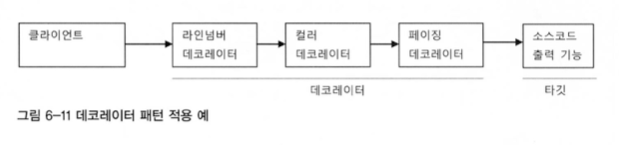
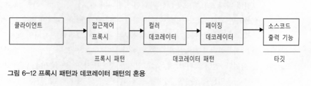
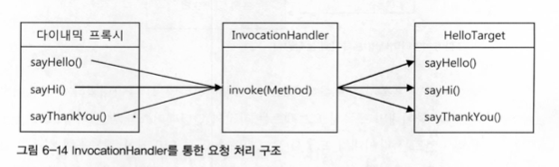
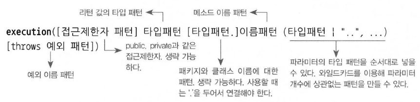

# 6장 AOP

AOP를 바르게 이용하려면 OOP를 대체하려고 하는 것처럼 보이는 AOP라는 이름 뒤에 감춰진, 그 필연적인 등장배경과 스프링이 그것을 도입한 이유, 그 적용을 통해 얻을 수 있는 장점이 무엇인지에 대한 충분한 이해가 필요하다.

서비스 추상화를 통해 많은 근본적인 문제를 해결했던 트랜잭션 경계설정 기능을 AOP를 이용해 더욱 세련되고 깔끔한 방식으로 바꿔보자

## 트랜잭션 코드의 분리

```java
public void upgradeLevels() throws Exception { 
    Transactionstatus status = this.transactionManager.getTransaction(new DefaultTransactionDefinition());
    try {
				// 비지니스 로직 구간
        List<User> users = userDao.getAll(); 
				for (User user : users) {
            if (canUpgradeLevel(user)) { upgradeLevel(user); } 
        }
        this.transactionManager.commit(status); 
				// 비지니스 로직 구간
    } catch (Exception e) {
        this.transactionManager.rollback(status) ;
        throw e; 
    }
}
```

이 두 가지 코드는 성격이 다를 뿐 아니라 서로 주고받는 것도 없는, 완벽하게 독립적인 코드다. 다만 이 비즈니스 로직을 담당하는 코드가 트랜잭션의 시작과 종료 작업 사이에서 수행돼야 한다는 상항만 지켜지면 된다.

두 가지 기능을 분리해서 메소드로 제공하는 방법도 있다.

```java
private void upgradeLevelsInternal() { 
    List<User> users = userDao.getAll(); 
    for (User user : users) {
        if (canUpgradeLevel(user)) { 
            upgradeLevel(user);
        } 
    }
}
```

비즈니스 로직 코드만 독립적인 메소드에 담겨 있으니 이해하기도 편하고, 수정하기에도 부담이 없다.

### DI를 이용한 클래스의 분리

리팩토링 했지만 트랜잭션 로직이 UserService 안에 자리 잡고 있다. 어차피 서로 직접적으로 정보를 주고받는 것이 없다면, 아예 트랜잭션 코드가 존재하지 않는 것처럼 사라지게 할 수는 없을까?

### DI 적용을 위한 트랜잭션 분리

DI의 기본 아이디어는 실제 사용할 오브젝트의 클래스 정체는 감춘 채 인터페이스를 통해 간적으로 접근하는 것이다. 그 덕분에 구현 클래스는 얼마든지 외부에서 변경할 수 있다.


그런데 보통 이렇게 인터페이스를 이용해 구현 클래스를 클라이언트에 노출하지 않고 런타임 시에 DI를 통해 적용하는 방법을 쓰는 이유는, 일반적으로 구현 클래스를 바꿔가면서 사용하기 위해서다.

#### 하지만 꼭 그래야 한다는 제약은 없다.

한 번에 두 개의 UserService 인터페이스 구현 클래스를 동시에 이용한다면 어떨까?


UserService를 구현한 또 다른 구현 클래스를 만든다. 이 클래스는 단지 트랜잭션의 경계설정이라는 책임을 맡고 있을 뿐이다. 스스로는 비즈니스 로직을 담고 있지 않기 때문에 또 다른 비즈니스 로직을 담고 있는 UserService의 구현 클래스에 실제적인 로직 처리 작업은 위임하는 것이다. 그 위임을 위한 호출 작업 이전과 이후에 적절한 트랜잭션 경계를 설정해주면, 클라이언트 입장에서 볼 때는 결국 트랜잭션이 적용된 비즈니스 로직의 구현이라는 기대하는 동작이 일어날 것이다.

### UserService 인터페이스 도입

```java
public interface UserService { 
    void add(User user); 
    void upgradeLevels();
}
```

```java
public class UserServicelmpl implements UserService { 
    UserDao userDao;
    MailSender mailSender;
    public void upgradeLevels() {

        List<User> users = userDao.getAll(); 
        for (User user : users) {
            if (canUpgradeLevel(user)) { 
                upgradeLevel(user);
            } 
        }
    }
}
```

UserServiceTx는 사용자 관리라는 비즈니스 로직을 전혀 갖지 않고 고스란히 다른 UserService 구현 오브젝트에 기능을 위임한다.

```java
public class UserServiceTx implements UserService { 
    UserService userService; PlatformTransactionManager transactionManager;
    public void setTransactionManager(PlatformTransactionManager transactionManager) {
        this.transactionManager = transactionManager; 
    }

    public void setUserService(UserService userService) { 
        this.userService = userService;
    }

    public void add(User user) { 
        this.userService.add(user);
    }

    public void upgradeLevels() {
        Transactionstatus status = this.transactionManager.getTransaction(new DefaultTransactionDefinitionO);
        try {
            userService.upgradeLevels();
            this.transactionManager.commit(status); 
        } catch (RuntimeException e) {
            this.transactionManager.rollback(status);
            throw e; 
        }
    }
}
```

### 트랜잭션 적용을 위한 DI 설정

클라이언트가 UserService라는 인터페이스를 통해 사용자 관리 로직을 이용하려고 할 때 먼저 트랜잭션을 담당하는 오브젝트가 사용돼서 트랜잭션에 관련된 작업을 진행해주고, 실제 사용자 관리 로직을 담은 오브젝트가 이후에 호출돼서 비즈니스 로직에 관련된 작업을 수행하도록 만든다.


## 고립된 단위 테스트

UserService의 구현 클래스들이 동작하려면 세 가지 타입의 의존 오브젝트가 필요하다. UserDao 타입의 오브젝트를 통해 DB와 데이터를 주고받아야 하고, MailSender를 구현한 오브젝트를 이용해 메일을 발송해야 한다. 마지막으로 트랜잭션 처리를 위해 PlatformTransactionManager와 커뮤니케이션이 필요하다.


이제 UserServiceImple에 대한 테스트가 진행될 때 사전에 테스트를 위해 준비된 동작만 하도록 만든 두 개의 목 오브젝트에만 의존하는, 완벽하게 고립된 테스트 대상으로 만들 수 있다.


### 단위 테스트와 통합 테스트

단위 테스트의 단위는 정하기 나름이다. 테스트 대역을 이용해 의존 오브젝트나 외부의 리소스를 사용하지 않도록 고립시켜서 테스트하는 것을 단위 테스트라고 부르겠다. 반면에 두 개 이상의, 성격이나 계층이 다른 오브젝트가 연동하도록 만들어 테스트하거나, 또는 외부의 DB나 파일, 서비스 등의 리소스가 참여하는 테스트는 통합 테스트라고 부른다.

### 목 프레임워크

단위 테스트가 많은 장점이 있고 가장 우선시해야 할 테스트 방법인 건 사실이지만 작성이 번거롭다는 점이 문제다. 특히 목 오브젝트를 만드는 일이 가장 큰 짐이다. 그래서 이를 도와주는 다양한 목 오브젝트 지원 프레임워크가 있다.

#### Mockito 프레임워크

Mockito라는 프레임워크는 사용하기도 편리하고, 코드도 직관적이라 퇴근 많은 인기를 끌고 있다.

* mock\(\) : 목 오브젝트를 생성하기 위한 메소드로 스태틱 임포트를 사용해 로컬 메소드 처럼 호출하게 하면 편리하다.

  ```text
  UserDao mockUserDao = mock(UserDao.class);
  ```

* when\(\) : mock으로 생성된 인스턴스는 아직 아무런 동작도 하지 않는다. mock 객체의 메소드에 필요한 mock을 주입하기 위해서는 when 메소드로 설정해주어야 한다.

  ```text
  when(mockUserDao.getAll()).thenReturn(this.users);
  ```

* verify\(\) : 목 객체의 메소드가 호출되었는지 확인할 수 있다.

  ```text
  verify(mockUserDao, tiems(2)).update(any(User.class));
  ```

## 다이내믹 프록시와 팩토리 빈

### 프록시와 프록시 패턴, 데코레이터 패턴

트랜잭션 경계설정 코드를 비즈니스 로직 코드에서 분리해낼 때 적용했던 기법을 다시 검토해보자.


트랜잭션이라는 기능은 사용자 관리 비즈니스 로직과는 성격이 다르기 때문에 아예 그 적용 사실 자체를 밖으로 분리할 수 있다. 이 방법을 이용해 UserServiceTx를 만들었고, UserServiceImpl에는 트랜잭션 관련 코드가 하나도 남지 않게 됐다.


부가기능 외의 나머지 모든 기능은 원래 핵심기능을 가진 클래스로 위임해줘야 한다. 핵심기능은 부가기능을 가진 클래스의 존재 자체를 모른다. 문제는 이렇게 구성했더라도 클라이언트가 핵심기능을 가진 클래스를 직접 사용해버리면 부가기능이 적용될 기회가 없다는 점이다. 그래서 부가기능은 마치 자신이 핵심 기능을 가진 클래스인 것처럼 꾸며서, 클라이언트가 자신을 거쳐서 핵심기능을 사용하도록 만들어야 한다.

클라이언트는 인터페이스를 통해서만 핵심기능을 사용하게 하고, 부가기능 자신도 같은 인터페이스를 구현한 뒤에 자신이 그 사이에 끼어들어야 한다.


이렇게 마치 자신이 클라이언트가 사용하려고 하는 실제 대상인 것처럼 위장해서 클라이언트의 요청을 받아주는 것을 대리자, 대리인과 같은 역할을 한다고 해서 프록시\(rpoxy\)라고 부른다. 프록시를 통해 최종적으로 요청을 위임받아 처리하는 실제 오브젝트를 타깃 또는 실체라고 부른다.

#### 프록시 사용 목적

* 클라이언트가 타깃에 접근하는 방법을 제어하기 위한 목적이 있다.
* 타깃에 부가적인 기능을 부여해주기 위한 목적이 있다.

두 가지 모두 대리 오브젝트라는 개념의 프록시를 두고 사용한다는 점은 동일하지만, 목적에 따라서 디자인 패턴에서는 다른 패턴으로 구분한다.

### 데코레이터 패턴

데코레이터 패턴은 타깃에 부가적인 기능을 런타임 시 다이내믹하게 부여해주기 위해 프록시를 사용하는 패턴을 말한다. 코드상에서는 어떤 방법과 순서로 프록시와 타깃이 연결되어 사용되는지 정해져 있지 않다는 뜻이다.



자바 IO 패키지의 InputStream과 OutputStream 구현 클래스는 데코레이터 패턴이 사용된 대표적인 예다.

```java
InputStream is = new BufferedInputStream(new FileInputStream("a.txt"));
```

### 프록시 패턴

일반적으로 사용하는 프록시라는 용어와 디자인 패턴에서 말하는 프록시 패턴은 구분할 필요가 있다. 전자는 클라이언트와 사용 대상 사이에 대리 역할을 맡은 오브젝트를 두는 방법을 총칭한다면, 후자는 프록시를 사용하는 방법 중에서 타깃에 대한 접근 방법을 제어하려는 목적을 가진 경우를 가리킨다.

타깃 오브젝트를 생성하기가 복잡하거나 당장 필요하지 않은 경우에는 꼭 필요한 시점까지 오브젝트를 생성하지 않는 편이 좋다. 그런데 타깃 오브젝트에 대한 레퍼런스가 미리 필요할 수 있다. 이럴 때 프록시 패턴을 적용하면 된다.

또는 특별한 상황에서 타깃에 대한 접근권한을 제어하기 위해 프록시 패턴을 사용할 수 있다. 프록시의 특정 메소드를 사용하려고 하면 접근이 불가능하다고 예외를 발생시키면 된다.

이렇게 프록시 패턴은 타깃의 기능 자체에는 관여하지 않으면서 접근하는 방법을 제어해주는 프록시를 이용하는 것이다.



### 다이내믹 프록시

많은 개발자는 타깃 코드를 직접 고치고 말지 번거롭게 프록시를 만들지는 않겠다고 생각한다. 왜냐하면 프록시를 만드는 일이 상당히 번거롭게 느껴지기 때문이다.

자바에는 이런 부분을 해결하기 위해 java.lang.reflect 패키지 안에 프록시를 손쉽게 만들 수 있도록 지원해주는 클래스들이 있다.

#### 프록시의 구성과 프록시 작성의 문제점

* 타깃의 인터페이스를 구현하고 위임하는 코드를 작성하기가 번거롭다는 점이다. 부가기능이 필요 없는 메소드도 구현해서 타깃으로 위임하는 코드를 일일이 만들어줘야 한다.
* 부가기능 코드가 중복될 가능성이 만다는 점이다. 트랜잭션은 DB를 사용하는 대부분의 로직에 적용될 필요가 있다. 메소드가 많아지고 트랜잭션 적용의 비율이 높아지면 트랜잭션 기능을 제공하는 유사한 코드가 여러 메소드에 중복돼서 나타날 것이다.

두 번째 문제는 중복된 코드를 분리해서 어떻게든 해결해보면 될 것 같지만, 첫 번째 문제인 인터페이스 메소드의 구현과 위임 기능 문제는 간단해 보이지 않는다. 바로 이런 문제를 해결하는 데 유용한 것이 바로 JDK의 다이내믹 프록시다.

### 리플렉션

다이내믹 프록시는 리플렉션 기능을 이용해서 프록시를 만들어준다. 자바의 모든 클래스는 그 클래스 자체의 구성정보를 담은 Class 타입의 오브젝트를 하나씩 갖고 있다. 클래스 오브젝트를 이용하면 클래스 코드에 대한 메타정보를 가져오거나 오브젝트를 조작할 수 있다.

```java
Method lengthMethod = String.class.getMethod("length");
int length = lengthMethod.invoke(name); // int length = name.length();
```

invoke\(\) 메소드는 메소드를 실행시킬 대상 오브젝트와 파라미터 목록을 받아서 메소드를 호출한 뒤에 그 결과를 Object 타입으로 돌려준다.

### 다이나믹 프록시 적용

다이나믹 프록시는 프록시 팩토리에 의해 런타임 시 다이내믹하게 만들어지는 오브젝트다. 다이내믹 프록시 오브젝트는 타깃의 인터페이스와 같은 타입으로 만들어진다. 프록시 팩토리에게 인터페이스 정보만 제공해주면 해당 인터페이스를 구현한 클래스의 오브젝트를 자동으로 만들어주기 때문이다.

리플렉션으로 메소드와 파라미터 정보를 모두 갖고 있으므로 타깃 오브젝트의 메소드를 호출하게 할 수도 있다.



다이내믹 프록시를 통해 요청이 전달되면 리플렉션 API를 이용해 타깃 오브젝트의 메소드를 호출한다.

```java
public class UppercaseHandler implements InvocationHandler {
    Hello target;

    public UppercaseHandler(Hello target) { 
        this.target = target;
    }

    public Object invoke(Object proxy, Method method, Object!] args) throws Throwable {
        String ret = (String)method.invoke(target, args);
        return ret.toUpperCase();
    }
}
```

다음은 다이내믹 프록시를 생성하는 코드다.

```java
Hello proxiedHello = (Hello)Proxy.newProxyInstance( 
    getClass().getClassLoader(), // 동적으로 생성되는 다이내믹 프록시 클래스의 로딩에 사용할 클래스 로더
    new Class[] {Hello.class}, // 구현할 인터페이스
    new UppercaseHandler (new HelloTarget()));
```

### 프록시 팩토리 빈 방식의 장점과 한계

이전까지는 하나의 클래스 안에 존재하는 여러 개의 메소드에 부가기능을 한 번에 제공하는 건 어렵지 않게 가능했다. 하지만 한 번에 여러 개의 클래스에 공통적인 부가기능을 제공하는 일은 지금까지 살펴본 방법으로는 불가능하다.

트랜잭션, 보안, 로그 등 다양한 프록시 기능을 추가하고 싶을 경우에는 인터페이스만 다른 거의 비슷한 설정이 반복될것이다. 또한 TransactionHandler 오브젝트가 프록시 팩토리 빈 개수만큼 만들어진다는 점이다.

**TransactionHandler의 중복을 없애고 모든 타깃에 적용 가능한 싱글톤 빈으로 만들어서 적용할 수는 없을까?**

## 스프링의 프록시 팩토리 빈

`ProxyFactoryBean`이 생성하는 프록시에서 사용할 부가기능은 `MethodInterceptor` 인터페이스를 구현해서 만든다.`MethodInterceptor`는 `InvocationHandler`와 비슷하지만 한 가지 다른 점이 있다.

* InvocationHandler의 `invoke`\(\) 메소드 : 타깃 오브젝트에 대한 정보를 제공하지 않는다. 따라서 타깃은 `InvocationHandler`를 구현한 클래스가 직접 알고 있어야 한다.
* `MethodInterceptor`의 invoke\(\) 메소드 : `ProxyFactoryBean`으로 부터 타깃 오브젝트에 대한 정보까지 함께 제공받는다.

이 차이 덕분에 `MethodInterceptor`는 타깃 오브젝트에 상관없이 독립적으로 만들어질 수 있다. 따라서 `MethodInterceptor` 오브젝트는 타깃이 다른 여러 프록시에서 함께 사용할 수 있고, 싱글톤 빈으로 등록 가능하다.

```java
public void simpleProxy() {
    Hello proxiedHello = (Hello)Proxy.newProxyInstance( //  JDK 다아내믹 프록시 생성
        getClass().getClassLoader(),
        new Class[] {Hello.class},
        new UppercaseHandler(new HelloTarget())
    );
}

public void proxyFactoryBean() {
    ProxyFactoryBean pfBean = new ProxyFactoryBean();
    pfBean.setTarget(new HelloTarget());    //  타깃 설정
    pfBean.addAdvice(new UppercaseAdvice());    //  부가기능을 담은 어드바이스를 추가한다. 여러 개를 추가할 수도 있다.

    Hello proxiedHello = (Hello) pfBean.getObject();    //  FactoryBean이므로 getObject()로 생성된 프록시를 가져온다.
    System.out.println(proxiedHello.sayHello("JaeDoo"));
    System.out.println(proxiedHello.sayHi("JaeDoo"));
    System.out.println(proxiedHello.sayThankYou("JaeDoo"));
}

static class UppercaseAdvice implements MethodInterceptor {

    @Override
    public Object invoke(MethodInvocation invocation) throws Throwable {
        /*
            리플렉션의 Method와 달리 MethodInvocation은 
            메소드 정보와 함께 타깃 오브젝트를 알고 있기 때문에
            메소드 실행 시 타깃 오브젝트를 전달할 필요가 없다.
        */
        String ret = (String)invocation.proceed();
        return ret.toUpperCase();   //  부가기능 적용
    }
}

public interface Hello {            //  타깃과 프록시가 구현할 인터페이스
    String sayHello(String name);
    String sayHi(String name);
    String sayThankYou(String name);
}

static class HelloTarget implements Hello { //  타깃 클래스

    @Override
    public String sayHello(String name) { return "Hello " + name;}

    @Override
    public String sayHi(String name) { return "Hi " + name;}

    @Override
    public String sayThankYou(String name) {return "Thank You " + name;}
}
```

## 스프링 AOP

지금까지 해왔던 작업의 목표는 `반복적인 코드`\(ex. 트랜잭션 코드\)를 깔끔하고 효과적으로 분리해내는 것이다. 이렇게 분리된 코드는 투명한 부가기능 형태로 제공되어 다른 코드에서는 보이지 않지만, 메소드가 호출되는 과정에 `다이내믹`하게 참여해서 `부가적인 기능`을 제공해 주도록 만드는 것이다.따라서 언제든지 자유롭게 추가하거나 제거할 수 있고, 기존 코드는 항상 원래의 상태를 유지할 수 있다. `DI`의 멋진 응용 방식 중 하나다.

### **자동 프록시 생성**

앞서 말했던 프록시 팩토리 빈 방식의 접근 방법의 한계로 여겼던 두 가지 문제 중 하나인 부가기능이 타깃 오브젝트마다 새로 만들어지는 문제는 스프링 `ProxyFactoryBean`의 어드바이스를 통해 해결했다.

하지만, 남은 한가지인 부가기능의 적용이 필요한 타깃 오브젝트마다 거의 비슷한 내용의 `ProxyFactoryBean` 빈 설정 `정보`를 추가해 주는 부분이다. 새로운 타깃이 등장했다고 해서 코드를 손댈 필요는 없어졌지만, 설정은 매번 복사해서 붙이고 `target` 프로퍼티의 내용을 수정해줘야 한다.

#### **중복 문제의 접근 방법**

`타깃 오브젝트`로의 `위임 코드`와 `부가기능` 적용을 위한 코드가 프록시가 구현해야 하는 모든 인터페이스 메소드마다 반복적으로 필요했다. 이를 `다이내믹 프록시`라는 런타임 코드 자동생성 기법을 이용하여 해결한다. `런타임` 시에 만들어져 사용되기 때문에 클래스 소스가 따로 남지 않을 뿐이지 타깃 인터페이스의 모든 메소드를 구현하는 클래스가 분명히 만들어진다.

`변하지 않는 타깃`으로의 위임과 부가기능 적용 여부 판단이라는 부분은 코드 생성 기법을 이용하는 `다이내믹 프록시 기술`에 맡기고, `변하는 부가기능 코드`는 별도로 만들어서 `다이내믹 프록시 생성 팩토리`에 `DI`로 제공하는 방법을 사용한 것이다.

부가기능 로직인 트랜잭션 경계설정은 코드로 만들고, 기계적인 코드 인 타깃 `인터페이스 구현`과 위임, 부가기능 연동 부분은 자동 생성하게 한 것이다.반복적인 프록시의 메소드 구현은 코드 자동 생성 기법으로 해결했다면, **반복적인 `ProxyFactoryBean` 설정 문제는 어떻게 해결할까?**

#### **빈 후처리기를 이용한 자동 프록시 생성기**

스프링은 컨테이너로서 제공하는 기능 중에서 변하지 않는 핵심적인 부분 외에는 대부분 확장할 수 있도록 확장 포인트를 제공해준다.

그 중 `BeanPostProcessor` 인터페이스를 구현한 빈 후처리기는 이름 그대로

> 스프링 빈 오브젝트로 만들어지고 난 후에 빈 오브젝트를 다시 가공할 수 있게 해준다.

빈 후처리기 중 `DefaultAdvisorAutoProxyCreator`는 어드바이저를 이용한 자동 프록시 생성기다. 스프링은 `빈 후처리기`가 빈으로 등록되어 있으면 빈 오브젝트가 생성될 때 마다 빈 후처리기에 보내서 후처리 작업을 요청한다. 빈 후처리기는 `빈 오브젝트`의 `프로퍼티` 강제 수정이 가능하고 별도의 `초기화 작업`도 가능하기 때문에 스프링이 설정을 참고해서 만든 오브젝트 외의 다른 오브젝트를 빈으로 등록시키는 것이 가능하다.

빈 후처리기를 이용하여 스프링이 생성하는 `빈 오브젝트`의 일부를 `프록시`로 포장하고, 프록시를 빈으로 대신 등록할 수도 있다. **이것이 자동 프록시 생성 빈 후처리기다.**


1. `DefaultAdvisorAutoProxyCreator` 빈 후처리기가 등록돼있으면 스프링은 빈 오브젝트를 만들 때마다 후처리기에 빈을 보낸다.
2. `DefaultAdvisorAutoProxyCreator`는 빈으로 등록된 모든 어드바이저 내의 포인트컷을 이용해 전달받은 빈이 프록시 적용 대상인지 확인한다.
3. 프록시 적용 대상이면 내장된 프록시 생성기에게 현재 빈에 대한 프록시를 만들게 하고, 만들어진 프록시에 어드바이저를 연결해 준다.
4. 빈 후처리기는 프록시가 생성되면 원래 컨테이너가 전달해준 빈 오브젝트 대신 프록시 오브젝트를 컨테이너에게 돌려준다.
5. 컨테이너는 최종적으로 빈 후처리기가 돌려준 오브젝트를 빈으로 등록하고 사용한다.

> 적용할 빈을 선정하는 로직이 추가된 포인트컷이 담긴 어드바이저를 등록하고 빈 후처리기를 사용하면 일일이 `ProxyFactoryBean` 빈을 등록하지 않아도 타깃 오브젝트에 자동으로 프록시가 적용되게 할 수 있다. 이로써 마지막 남은 번거로운 `ProxyFactoryBean` 설정 문제를 해결할 수 있다.

### **AOP란 무엇인가?**

#### **트랜잭션 서비스 추상화**

트랜잭션 경계설정 코드를 비즈니스 로직을 담은 코드에 넣으면서 특정 트랜잭션 기술에 코드가 종속되는 문제가 발생했다. 이를 해결하기 위해 트랜잭션 적용이라는 추상적인 작업 내용은 유지한 채로 구체적인 구현 방법을 자유롭게 바꿀 수 있도록 `서비스 추상화 기법`을 적용했다. 트랜잭션 추상화란 결국 `인터페이스`와 `DI`를 통해 무엇을 하는지는 남기고, 그것을 어떻게 하는지를 분리한 것이다.

#### **프록시와 데코레이터 패턴**

`추상화`를 통해 트랜잭션을 어떻게 다룰 것인가는 코드에서 제거했지만, 여전히 `비즈니스 로직` 코드에는 트랜잭션을 적용하고 있다는 사실은 드러나 있다. 게다가 트랜잭션의 경계 설정 같은 성격의 코드는 대부분 비즈니스 로직을 담은 메소드에 필요하다. 따라서 단순한 추상화와 메소드 추출 방법으로는 더 이상 제거할 방법이 없게 된다.

#### `데코레이터 패턴` 적용

`클라이언트`가 인터페이스와 `DI`를 통해 접근하도록 설계하고, `데코레이터 패턴`을 적용해서 비즈니스 로직을 담은 클래스의 코드에는 전혀 영향을 주지 않으면서 트랜잭션이라는 `부가기능`을 자유롭게 부여할 수 있는 구조를 만들었다.트랜잭션을 처리하는 코드는 `데코레이터`에 담겨 클라이언트와 비즈니스 로직을 담은 타깃 클래스 사이에 존재함으로써 일종의 `프록시 역할`을 하게된다. 이로써 클라이언트는 프록시 역할을 하는 트랜잭션 `데코레이터`를 거쳐서 타깃에 접근한다.

결국 `비즈니스 로직` 코드는 트랜잭션과 같은 성격이 다른 코드로부터 자유로워졌고, `독립적`으로 로직을 검증하는 `고립된 단위 테스트`를 만들 수도 있게된다.

#### **다이내믹 프록시**

`프록시`를 통해 비즈니스 로직 코드에서 트랜잭션 코드는 모두 제거할 수 있었지만, 비즈니스 로직 인터페이스의 모든 메소드마다 트랜잭션 기능을 `부여햐는 코드`를 넣어 `프록시 클래스`를 만드는 작업은 오히려 큰 짐이 됐다.


그래서 프록시 클래스 없이`**JDK 다이내믹 프록시 기술**`을 적용해 프록시 오브젝트를 런타임 시에 만들어 줄 수 있게 했다. 덕분에 프록시 클래스 코드 작성의 부담이 줄고 부가기능 부여 코드가 `중복되는 문제`도 개선할 수 있었다. 일부 메소드에만 트랜잭션을 적용해야 하는 경우 메소드 선정 패턴을 이용할 수 도 있었다. 하지만, **동일한 기능의 프록시를 여러 오브젝트에 적용할 경우 오브젝트 단위로는 중복이 일어나는 문제는 해결하지 못했다.**

#### **프록시 팩토리 빈**


JDK 다이내믹 프록시와 같은 프록시 기술을 추상화한\*\*`스프링의 프록시 팩토리 빈`\*\*을 이용하여 다이내믹 프록시 생성 방법에 DI를 도입했다.

내부적으로 `템플릿/콜백 패턴`을 활용하는 스프링의 프록시 팩토리 빈 덕분에 부가기능을 담은 어드바이스와 부가기능 선정 알고리즘을 담은 포인트컷은 `프록시`에서 분리될 수 있었고, 여러 프록시에서 공유할수 있었다.

#### **자동 프록시 생성 방법과 포인트컷**

아직 `트랜잭션 적용 대상`이 되는 빈 마다 일일이 프록시 팩토리 빈을 설정해줘야 하는 부담은 남아있었다.


이를 해결하기 위해 `스프링 컨테이너`의 빈 생성 후처리 기법을 활용해 컨테이너 `초기화 시점`에서 자동으로 프록시를 만들어주는 방법을 도입했다. 프록시를 적용할 대상을 일일이 지정하지 않고 패턴을 이용해 자동으로 선정할 수 있도록, 클래스를 선정하는 기능을 담은 확장된 `포인트컷`을 사용했다.

`포인트컷 표현식`을 활용해 간단한 설정만으로 적용 대상을 손쉽게 선택할 수 있게 됐다.



#### 다이내믹 프록시

클래스를 만들지 않고도 새로운 구현 기능을 가진 오브젝트를 다이내믹하게 만들어내는 기술

#### 빈 후처리 기술

`IoC/DI` 컨테이너의 빈 생성 작업을 가로채서 빈 오브젝트를 프록시로 대체하는 기술

#### **AOP: 애스펙트 지향 프로그래밍**

이처럼 독립적인 `모듈화`가 불가능한 트랜잭션 `경계설정`과 같은 부가기능을 모듈화하는 방법은 기존의 객체지향 설계 패러다임과는 구분되는 새로운 특징이 있다고 판단하여 \*\*`애스펙트(aspect)`\*\*라는 새로운 이름으로 불리게 되었다.

`애스펙트`는 `어드바이스(부가될 기능을 정의한 코드)`와 `포인트컷(어디에 적용할 지 결정)`을 함께 갖고 있다. 어드바이저는 아주 단순한 형태의 애스펙트라고 볼 수 있다.

애스펙트는 **`애플리케이션을 구성하는 한 가지 측면`** 이라고 생각할 수 있다.


왼쪽은 `애스펙트`로 `부가기능`과 `핵심기능`의 모듈을 분리하기 전의 상태, 오른쪽은 핵심기능 코드 사이에 침투했던 부가기능을 독립적인 모듈인 애스펙트로 구분해닌 그림이다.

2차원 평면 구조에서는 어떤 설계기법으로도 해결할 수 없었던 것을, 3차원 다면체 구조로 접근하면서 각각 성격이 다른 부가기능은 다른 면에 존재하도록 한 것이다. 이렇게 됨으로써 핵심기능은 순수하게 그 기능을 담은 코드로만 존재하고, 독립적으로 살펴볼 수 있도록 구분된 면에 존재하게 된 것이다.

이렇게 애플리케이션의 핵심적인 기능에서 부가적인 기능을 분리해서 애스펙트라는 모듈로 설계하는 방법을 **`애스펙트 지향 프로그래밍(Aspect Oriented Programming)`**, 줄여서 AOP라고 한다. AOP는 OOP를 돕는 보조적인 기술이다.

AOP를 활용함으로써 다양한 관점에서 애플리케이션을 바라보며 개발할 수 있게 도와준다.

### **AOP 적용기술**

#### **프록시를 이용한 AOP**

AOP는 스프링의 다양한 기법을 조합해 지원되고 있는데 그중 핵심은 프록시를 이용했다는 것이다.프록시로 만들어서 DI로 연결된 빈 사이에 적용해 타깃의 메소드 호출 과정에 참여해서 부가기능을 제공해주도록 만들었다. 프록시 방식을 사용했기 때문에 메소드 호출 과정에 참여해서 부가기능을 제공해줄 수 있게 되어 있다.독립적으로 개발한 부가기능 모듈을 다양한 타깃 오브젝트의 메소드에 다이내믹하게 적용해주기 위해 가장 중요한 역할을 하는 것이 프록시다. 그래서 스프링 AOP는 프록시 방식의 AOP라고 할 수 있다.

#### **바이트코드 생성과 조작을 통한 AOP**

그렇다는 얘기는 프록시 방식이 아닌 AOP도 있다는 것이다.AspectJ는 스프링처럼 다이내믹 프록시 방식을 사용하지 않는다. AspectJ는 프록시처럼 간접적인 방법이 아니라, 타깃 오브젝트를 뜯어 고쳐서 부가 기능을 직접 넣어주는 방법을 사용한다.즉, `컴파일된 타깃의 클래스 파일 자체를 수정`하거나 `클래스가 JVM에 로딩되는 시점을 가로채서 바이트코드를 조작하는 복잡한 방법`을 사용한다. 트랜잭션 코드가 UserService 클래스에 비즈니스 로직과 함께 있었을 때 처럼 만들어버리는 것이다.프록시와 같은 방법이 있음에도 불구하고 왜 이런 복잡한 방법을 사용할까?

* 바이트코드를 조작해 타깃 오브젝트를 직접 수정해버림으로써 자동 프록시 생성 방식을 사용하지 않아도 AOP를 적용할 수 있다.
  * 스프링과 같은 컨테이너가 사용되지 않는 환경에서도 손쉽게 AOP의 적용이 가능해진다.
* 프록시 방식보다 훨씬 강력하고 유연한 AOP가 가능하다.
  * 프록시를 AOP의 핵심 메커니즘으로 사용하면 부가기능을 부여할 대상은 클라이언트가 호출할 때 사용하는 메소드로 제한된다. 하지만 바이트 코드를 직접 조작해서 AOP를 적용하면 오브젝트의 생성, 필드 값의 조회와 조작, 스태틱 초기화 등의 다양한 작업에 부가 기능을 부여해 줄 수 있다. 타깃 오브젝트가 생성되는 순간 부가기능을 부여해주고 싶을 때도 있는데 프록시 방식에서는 불가능한 방법이다.

