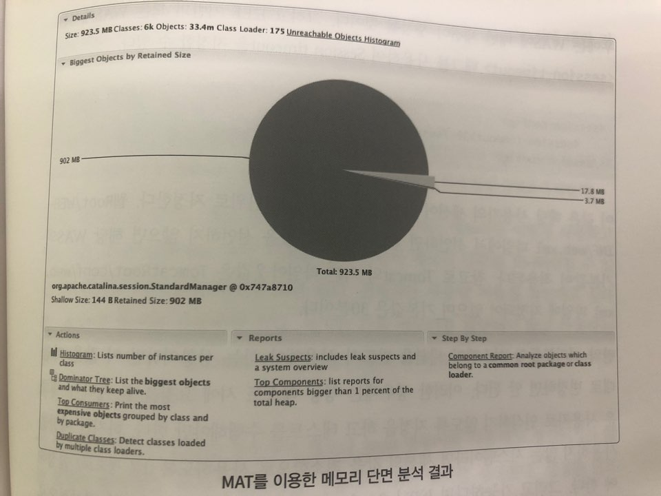

# CHAP 15. 메모리 문제\(Case Study\)

## 메모리 단면으로 어떤 문제를 확인할 수 있을까?

1장에서 알아본 문제 중 메모리 단면으로 확인할 수 있는 문제는 무엇일까?

| 구분 | 장애 | 확인 가능 여부 |
| :--- | :--- | :--- |
| 시스템이 느려요 | 전체적인 시스템이 항상 느린 경우 | O |
|  | 특정 기능\(화면\)이 느린 경우 | X |
|  | 특정 시간대\(기간\)에 전체 애플리케이션이 느린 경우 | O |
|  | 특정 시간대\(기간\)에 특정 애플리케이션이 느린 경우 | △ |
|  | 특정 기능\(화면\)이 점점 느려질 경우 | O |
|  | 특정 사용자만 애플리케이션이 느린 경우 | X |
| 시스템이 응답이 없어요 | 모든 애플리케이션이 응답하지 않는 경우 | O |
|  | 특정 기능이 응답하지 않는 경우 | △ |
| 예외가 계속 발생해요 | 모든 사용자가 특정 기능을 수행하면 예외가 발생하는 경우 | X |
|  | 특정 사용자의 특정 기능에서만 예외가 발생하는 경우 | X |
|  | 특정 시간대에만 전체 애플리케이션에 예외가 발생하는 경우 | X |
|  | 특정 시간대에 특정 애플리케이션에 예외가 발생하는 경우 | X |
| 시스템이 죽어요 | 시스템의 프로세스가 죽는 경우 | O |

예외가 계속 발생할 경우에 메모리 단면으로 문제를 해결할 수 있는 확률은 대단히 희박하다. 즉, 예외가 지속해서 발생할 경우에는 메모리로 인해서 문제가 발생하는 경우는 극히 드물다.

시스템이 죽는 경우에 11장에서 이야기한 것처럼 OnError 옵션을 추가하면 도움이 될 수 있다. 하지만 JVM이 치명적인 오류\(Fatal Error Log\)를 발생하면서 자꾸 죽는 원인 중 하나는 JVM 내부의 버그 때문일 수도 있다. 이러한 버그가 원인일 경우에는 현재 사용하고 있는 Java를 최신 버전으로 올리거나 내려야만 한다. 간혹 Java 버전이 올라가면서 버그가 발생할 수도 있고, 버전이 올라가면서 해당 버그가 사라졌을수도 있기 때문에 관련된 버그 문서를 확인하여 Java 버전을 변경하자


### 시스템이 느리다고 항상 메모리 단면을 사용하는 것은 아니다

시스템이 느릴 경우에는 스레드와 관련이 있는지 먼저 확인해 보고 그래도 원인을 찾을 수 없을 경우에만 메모리 분석 단계로 넘어가야 한다. 다시 말해서 시스템이 느린 이유가 메모리 때문일 경우는 극히 드물다는 것이다. 메모리 문제로 인하여 애플리케이션의 응답 시간이 느릴 떄에는 다음이 원인일 수 있다.

* 메모리 크기를 잡지 않거나 너무 작게 잡아 GC가 너무 자주 발생하는 경우
* 임시 메모리를 많이 사용하여 GC가 자주 발생하는 경우

이렇게 GC 때문에 문제가 발생했다면, jstat 명령을 사용하여 원인을 파악해 보면 된다. jstat 사용할 때 메모리 크기와 관련된 내용이라면 -gccapacity 옵션을 사용하면 되고, 메모리 사용량과 관련된 내용이라면 -gcutil 옵션을 사용하면 된다.

### 애플리케이션이 응답하지 않을 때도 메모리가 원인일 수 있다

애플리케이션이 응답을 하지 않을 경우에 메모리와 관련되는 원인 중 발생할 확률이 가장 높은 것은 메모리 릭이다. 메모리가 부족하면 GC 작업만 지속해서 수행되고, 애플리케이션은 응답을 못 하게 될 수가 있기 때문이다. 따라서, 애플리케이션이 응답을 하지 않을 때 메모리 릭이 원인일 경우에는 다음의 절차를 따른다.

* 현재 메모리 사용량을 확인해 본다. 만약 메모리 사용량이 지속해서 95% 이상일 경우에는 메모리 릭이 문제의 원인일 확률이 매우 높다.
* 메모리 사용량이 지속해서 높을 경우에는 메모리 단면을 생성한다.
* 도구를 이용하여 어떤 객체가 죽지 않고 계속 점유되고 있는지를 확인해 본다.

## 사례 하나. 자꾸만 시스템이 OOME를 발생시켜요

성능 테스트의 가장 근본적인 목적은 시스템을 오픈했을 때, 혹은 새로운 기능을 추가하였을 때 기능 테스트상으로는 문제가 없지만, 사용자가 많아졌을 때 시스템에 문제가 발생하는지를 살펴보기 위함이다.

### &gt; 상황

D 시스템의 신규 개편 작업을 한 후 성능 테스트를 실시하였다. 테스트를 실시할 때 3분 정도는 부하를 잘 처리하다가 그 다음부터는 제대로 부하가 가질 않는다. 다시 말해서 3분간은 초당 300건 정도 처리하던 시스템이 3분 이후부터는 10건 정도밖에 처리하질 못하는 상황이 계속 이어지고 있다. 게다가 서버를 재시작해야만 서버가 제대로 동작한다.

### &gt; 접근 방법

우선 Agent의 리소스 사용량도 정상적인 상태였다. 그러나 대상 서버의 CPU 사용량은 급격히 줄어들어쓰며, 네트워크에서 발생하는 오류도 없었다.

CPU 사용량이 높다가 급격히 줄어들었을 경우에는 대부분 스레드 단면을 생성해도 큰 도움은 안 된다. 이 경우에는 스레드 단면을 보기보단 jstat을 이용하여 메모리 사용량을 확인해 보았다. 아니나 다를까 메모리 사용량이 거의 95~100%를 왔다 갔다 하고 있었다. 메모리 단면을 생성하고 MAT를 이용하여 결과를 확인해 보았다.



메모리 단면을 열어본 결과 그림과 같이 대부분의 메모리를 하나의 객체가 점유하고 있었다. 차근차근 점유하고 있는 메모리를 따라가 보니 세션\(Session\) 관련 객체였다.

J2EE 기반의 모든 WAS에서는 &lt;session-timeout&gt; 태그를 사용하여 Session timeout을 지정할 수 있다.

```text
<session-config>
		<session-timeout>30</session-timeout>
</session-config>
```

이 값은 해당 사용자의 세션이 살아 있는 시간을 분 단위로 지정한다. 성능 테스트 시에 요청을 할 때마다 새로운 사용자로 인식하지 않도록 지정을 하고 테스트를 수행해야만 한다. 하지만 세션을 사용하지 않는 시스템이라면 세션의 값을 최소한으로 사용하도록\(1분 정도로\)설정해야 한다. 그리고 가능하다면 JSP나 Servlet에서 세션을 사용하지 않도록 명시적으로 지정하는 것이 좋다.

해당 시스템의 세션 관련 설정을 변경한 후에는 테스트할 때 세션 때문에 메모리가 부족해지는 현상은 없어졌다.

## 사례 둘. 시스템 응답이 없어요

### &gt; 상황

C 시스템의 WAS가 응답을 하지 않는다. 이 서비스를 제공하는 대부분의 서버가 이러한 상황이다. 각 서버의 CPU는 하나만 줄기차게 사용하고 있으며, 스레드 덤프와 ps -Lf 명령어를 사용하여 어떤 스레드가 CPU를 계속 사용하고 있는지에 대한 자료는 모아 두었다.

### &gt; 접근 방법

이 문제는 메모리 릭이 발생한 것이라고 앞에서 이야기했었다.\(11장 스레드 문제 참고\)

먼저, 메모리를 어떻게 사용하고 있는지를 모니터링해야만 한다. 이러한 경우 간단히 메모리 상황을 모니터링 할 수 있는 jstat으로 사용량을 확인해 보면 된다. 전체적인 사용량 비율을 확인하고 싶다면 -gcutil 옵션을 사용하면 된다. 하지만 간혹 메모리를 할당하지 않고 사용하는 경우가 있다. 따라서 -gccapacity 옵션을 사용하여 메모리가 얼마나 잡혀 있는지를 확인하는 것도 중요하다.

이 경우에는 메모리 단면을 생성해야 했으나 jmap 명령어를 사용해도 생성되지가 않는 상황이 발생했다. 따라서 gcore를 사용하여 코어 덤프를 생성했다. 생성한 덤프를 jmap을 이용하여 자바 메모리 단면으로 전환하였다.

#### 분석 결과 특정 부분에서 메모리를 50~100MB 점유하고 있는 것을 확인하였다.

해당 시스템은 여덞 개의 DB에 데이터를 분산하여 저장하고 있다. 다시 말해서 각각 여덞 개의 DB Connection Pool을 구성하여 사용하고 있었고, DB에서 제공하는 캐시 기능도 사용하고 있었다. 그런데 여기서 성능을 보다 더 좋게 하기 위한 캐시가 문제였다. 각 캐시에서 50~100MB를 점유하고 있었던 것이다. 참고로 해당 장비의 메모리 설정은 1GB였다. 그러므로 약 700~800MB를 사용하고 가용한 메모리는 200~300MB 정도밖에 되지 않는다. 따라서, DB의 캐시에서 사용하는 데이터의 양을 줄이고, 서버를 재시작한 이후에는 해당 원인으로 인한 장애는 더 이상 발생하지 않았다.

#### 이 사례를 한번 더 정리해보겠다.

* 스레드 덤프 확인
* 각 스레드별 CPU 사용 시간 확인 → GC 관련 스레드가 원인이라는 것을 파악
* jstat으로 메모리 사용량 확인
* gcore로 메모리 단면 파일 생성
* jmap으로 파일 변환
* 메모리 단면 분석

보통 이러한 분석 결과가 나오면 정리를 해두는 것이 좋다. 나중에 유용하게 쓰일 수 있다.

