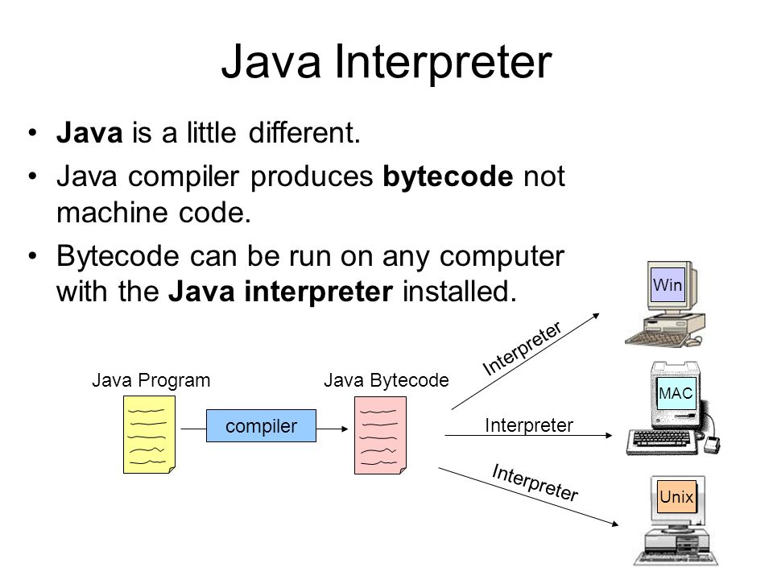

# 1장 도메인 모델 시작

## 도메인

온라인 서점 소프트웨어는 온라인으로 책을 판매하는 데 필요한 상품조회, 구매, 결제, 배송 추적 등의 기능을 제공해야 한다. 이때, '온라인 서점'은 소프트웨어로 해결하고자 하는 문제 영역, 즉 도메인에 해당된다.

한 도메인은 다시 하위 도메인으로 나눌 수 있다.

.png>)

그림 1.1 도메인은 여러 하위 도메인으로 구성된다.

도메인마다 고정된 하위 도메인이 존재하는 것은 아니다. 또한, 하위 도메인을 어떻게 구성할지 여부는 상황에 따라 달라진다.

## 도메인 모델

도메인 모델은 특정 도메인을 개념적으로 표현한 것이다. 예를 들어, 주문 도메인을 생각해보자


그림 1.3 객체 기반 주문 도메인 모델

위의 그림은 객체를 이용한 도메인 모델이다. 도메인을 이해하려면 도메인이 제공하는 기능과 도메인의 주요 데이터 구성을 파악해야 한다.

도메인 모델을 객체로만 모델링 할 수 있는 것은 아니다. 상태 다이어그램을 이용해서 주문의 상태 전이를 모델링할 수 있다.



그림 1.4 상태 다이어그램을 이용한 주문 상태 모델링

도메인을 이해하는 데 도움이 된다면 표현 방식이 무엇인지는 중요하지 않다.

도메인 모델은 도메인 자체를 이해하기 위한 개념 모델이다. 개념 모델을 이용해서 바로 코드를 작성할 수 있는 것은 아니기에 구현 기술에 맞는 구현 모델이 따로 필요하다. 그렇기에 개념 모델과 구현 모델은 서로 다른 것이지만 구현 모델이 개념 모델을 최대한 따르도록 할 수는 있다.

## 도메인 모델 패턴

일반적인 애플리케이션의 아키텍처는 다음과 같이 네 개의 계층으로 구성된다.

 (1) (1).png>)

* 표현 또는 사용자인터페이스(UI) : 사용자의 요청을 처리하고 사용자에게 정보를 보여준다.
* 응용 : 사용자가 요청한 기능을 실행한다. 업무 로직을 직접 구현하지 않으며 도메인 계층을 조합해서 기능을 실행한다.
* 도메인 : 시스템이 제공할 도메인의 규칙을 구현한다.
* 인프라스트럭처 : 데이터베이스나 메시징 시스템과 같은 외부 시스템과의 연동을 처리한다.

도메인 계층은 도메인의 핵심 규칙을 구현한다. 주문 도메인의 경우 '출고 전에 배송지를 변경할 수 있다'는 규칙과 '주문 취소는 배송 전에만 할 수 있다'는 규칙을 구현한 코드가 도메인 계층에 위치하게 된다.

예를 들어, 다음 코드를 보자

```java
public class Order {
	private OrderState state;
	private ShippingInfo shippingInfo;

	public void changeShippingInfo(ShippingInfo newShippingInfo) {
		if (!state.isShippingChangeable()) {
			throw new IllegalStateException("can't change shipping in " + state);
		}
		this.shippingInfo = newShippingInfo;
	}

	public void changeShipped() {
		// 로직 검사
		this.state = OrderState.SHIPPED;
	}
	...
}
```

```java
public enum OrderState {
	PAYMENT_WAITING {
		public boolean isShippingChangeable() {
			return true;
		}
	},
	PREPARING {
		public boolean isShippingChangeable() {
			return true;
		}
	},
	SHIPPED, DELIVERING, DELIVERY_COMPLETED;

	public boolean isShippingChangeable() {
		return false;
	}
}
```

이 코드는 주문의 상태에 따라 배송지를 변경하는 로직을 구현하였다. 이는 주문과 관련된 중요 업무 규칙을 주문 도메인 모델인 Order에 구현한다는 점이다. 핵심 규칙을 구현한 코드는 도메인 모델에만 위치하기 때문에 규칙이 바뀌거나 규칙을 확장해야 할 때 다른 코드에 영향을 덜 주고 변경 내역을 모델에 반영할 수 있게 된다.

> '도메인 모델'이란 용어는 도메인 자체를 표현하는 개념적인 모델을 의미하지만, 도메인 계층을 구현할 때 사용하는 객체 모델을 언급할 때에도 '도메인 모델'이란 용어를 사용한다.

> 개념 모델과 구현 모델 개념 모델 : 순수하게 문제를 분석한 결과물이다. 구현에 대한 고려가 되어 있지 않기 때문에 구현이 필요할 경우에 전환과정을 거쳐야 할 수 있다. 프로젝트 초기에 완벽한 도메인 모델을 만들더라도 결국 도메인에 대한 새로운 지식이 쌓이면서 모델을 보완하거나 수정하는 일이 발생한다. 구현 모델 : 구현하는 과정에서 개념 모델을 구현 모델로 점진적으로 발전시켜 나가게 되면 개념 모델과 다른 구현모델이 나오게 된다.

## 도메인 모델 도출

천재 개발자라 할지라도 도메인에 대한 이해 없이 코딩을 시작할 수는 없다. 기획서, 유스 케이스, 사용자 스토리와 같은 요구사항과 관련자와의 대화를 통해 도메인을 이해하고 이를 바탕으로 도메인 모델 초안을 만들어야 비로소 코드를 작성할 수 있다. 화이트보드, 종이와 연필, 모델링 툴 중 무엇을 선택하든지 간에 구현을 시작하려면 도메인에 대한 초기 모델이 필요하다.

도메인을 모델링할 때 기본이 되는 작업은 모델을 구성하는 핵심 구성요소, 규치그 기능을 찾는 것이다.

주문 도메인과 관련된 몇가지 요구사항을 보자.

* 최소 한 종류 이상의 상품을 주문해야 한다.
* 한 상품을 한 개 이상 주문할 수 있다.
* 총 주문 금액은 각 상품의 구매 가격 합을 모두 더한 금액이다.
* 각 상품의 구매 가격 합은 상품 가격에 구매 개수를 곱한 값이다.
* 주문할 때 배송지 정보를 반드시 지정해야 한다.
* 배송지 정보는 받는 사람 이름, 전화번호, 주소로 구성된다.
* 출고를 하면 배송지 정보를 변경할 수 없다.
* 출고 전에 주문을 취소할 수 있다.
* 고객이 결제를 완료하기 전에는 상품을 준비하지 않는다.

위 요구사항을 토대로 상세 구현 수준까지는 아니지만 Order에 관련 기능을 메서드로 추가할 수 있다.

```java
public class Order {
	public void changeShipped() { ... }
	public void changeShippingInfo(ShippingInfo newShipping) { ... }
	public void cancel() { ... }
	public void completePayment() { ... }
}
```

다음 요구사항은 주문 항목이 어떤 데이터로 구성되는지 알려준다.

* 한 상품을 한 개 이상 주문할 수 있다.
* 각 상품의 구매 가격 합은 상품 가격에 구매 개수를 곱한 값이다.

두 요구사항에 따르면 주문 항목을 표현하는 OrderLine은 적어도 주문할 상품, 상품의 가격, 구매 개수를 포함하고 있어야 한다. 이를 OrderLine으로 구현하였다.

```java
public class OrderLine {
	private Product product;
	private int price;
	private int quantity;
	private int amount;

	...
}
```

다음 요구사항은 Order와 OrderLine과의 관계를 알려준다.

* 최소 한 종류 이상의 상품을 주문해야 한다.
* 총 주문 금액은 각 상품의 구매 가격 합을 모두 더한 금액이다.

```java
public class Order {
	private List<OrderLine> orderLines;
	private int totalAmounts;

	private void setOrderLines(List<OrderLine> orderLines) { ... }
	private void verifyAtLeastOneOrMoeOrderLines(List<OrderLine> orderLines) { ... }
	private void calculateTotalAmounts() { ... }

	...
}
```

배송지 정보는 이름, 전화번호, 주소 데이터를 가지므로 ShippingInfo 클래스를 다음과 같이 정의하였다.

```java
public class ShipingInfo {
	private String receiverName;
	private String receiverPhoneNumber;
	private String shipingAddress1;
	private String shipingAddress2;
	private String shipingZipcode;

	...
}
```

앞서 요구사항 중에 '주문할 때 배송지 정보를 반드시 지정해야 한다'는 내용이 있다.

```java
public class Order {
	private List<OrderLine> orderLines;
	private int totalAmounts;
	private ShipingInfo shippingInfo;

	private void setOrderLines(List<OrderLine> orderLines) { ... }
	private void verifyAtLeastOneOrMoeOrderLines(List<OrderLine> orderLines) { ... }
	private void calculateTotalAmounts() { ... }
	private void setShippingIngo(ShippingInfo shippingInfo) { ... }
	...
}
```

도메인을 구현하다 보면 특정 조건이나 상태에 따라 제약이나 규칙이 달리 적용되는 경우가 많다.

* 출고를 하면 배송지 정보를 변경할 수 없다.
* 출고 전에 주문을 취소할 수 있다.
* 고객이 결제를 완료하기 전에는 상품을 준비하지 않는다.

이는 요구사항이 추가로 존재할 수 있는 상태를 분석한 뒤, 다음과 같이 열거 타입을 이용해서 상태 정보를 표현할 수 있다.

```java
public enum OrderState {
	PAYMENT_WAITING, 
	PREPARING, 
	SHIPPED, 
	DELIVERING, 
	DELIVERY_COMPLETED, 
	CANCELED 
}
```

```java
public class Order {
	private OrderState state;

	public void cancel() { ... }
	public void verifyNotYetShipped() { ... }
}
```

지금까지 주문과 관련된 요구사항에서 도메인 모델을 점진적으로 만들어 나갔다. 요구사항 정련을 위해 도메인 전문가나 다른 개발자와 논의하는 과정에서 공유하기도 한다. 모델을 공유할 때는 화이트보드나 위키와 같은 도구를 사용해서 누구나 쉽게 접근할 수 있도록 하면 좋다.

문서화 문서화를 하는 주된 이유는 지식을 공유하기 위함이다. 전반적인 기능 목록이나 모듈 구조, 빌드 과정은 코드를 보고 직접 이해하는 것보다 상위 수준에서 정리한 문서를 참조하는 것이 소프트웨어 전반을 빠르게 이해하는 데 도움이 된다. 코드를 보면서 도메인을 깊게 이해하게 되므로 코드 자체도 문서화의 대상이 된다. 단순히 코드를 보기 좋게 작성하는 것뿐만 아니라 도메인 관점에서 코드가 도메인을 잘 표현해야 비로소 코드의 가독성이 높아지며 문서로서 코드가 의미를 갖는다.

## 엔티티와 벨류

도출한 모델은 크게 엔티티(Entity)와 벨류(Value)로 구분할 수 있다.

엔티티와 벨류를 제대로 구분해야 도메인을 올바르게 설계하고 구현할 수 있다.

### 엔티티

엔티티의 가장 큰 특징은 식별자를 갖는다는 것이다. 식별자는 인테테 객체마다 고유해서 각 엔티티는 서로 다른 식별자를 갖는다. 엔티티를 생성하고 엔티티의 속성을 바꾸고 엔티티를 삭제할 때까지 식별자는 유지된다. 엔티티의 식별자는 바뀌지 않고 고유하기 때문에 두 엔티티 객체의 식별자가 같으면 두 엔티티는 같다고 판단할 수 있다.

### 엔티티의 식별자 생성

흔히 식별자는 다음 중 한 가지 방식으로 생성한다.

* 특정 규칙에 따라 생성
* UUID 사용
* 값을 직접 입력
* 일련번호 사용(시퀀스나 DB의 자동 증가 칼럼 사용)

### 밸류 타입

ShippingInfo 클래스는 받는 사람과 주소에 대한 데이터를 갖고 있다. 밸류 타입은 개념적으로 완전한 하나를 표현할 때 사용한다. 밸류 타입을 사용할 때의 또 다른 장점은 밸류 타입을 위한 기능을 추가할 수 있다. 밸류 객체의 데이터를 변경할 때는 기존 데이터를 변경하기보다는 변경한 데이터를 갖는 새로운 밸류 객체를 생성하는 방식을 선호한다. 불변으로 구현하는 이유는 불변 타입을 사용하면 보다 안전한 코드를 작성할 수 있다.

### 도메인 모델에 set 메서드 넣지 않기

get/set 메서드는 습관적으로 추가하는 메서드이다. 그 이유는 여러 가지가 있겠지만 가장 큰 이유라면 프로그래밍에 입문할 때 읽은 책의 예제 코드 때문이라 생각한다.

```java
public class UserInfo {
	private String id;
	private String name;

	public String getId() {
		return id;
	}

	public void setId(String id) {
		this.id = id;
	}

	public String getName() {
		return name;
	}

	public void setName(String name) { 
		this.name = name;
	}
}
```

앞서 changeShippingInfo()가 배송지 정보를 새로 변경하다는 의미를 가졌다면 setShippingInfo() 메서드는 단순히 배송지 값을 설정한다는 것을 뜻한다.

set 메서드의 또 다른 문제는 도메인 객체를 생성할 때 완전한 상태가 아닐 수도 있다는 것이다.

```java
// set 메서드로 데이터를 전달하도록 구현하면
// 처음 Order를 생성하는 시점에 order는 완전하지 않다.
Order order = new  Order();

// set 메서드로 필요한 모든 값을 전달해야 한다. 
order.setOrderLine(lines);
order.setShippingInfo(shipingInfo);

// 주문자(Orderer)를 설정하지 않은 상태에서 주문 완료 처리
order.setState(OrderState.PREPARING);
```

도메인 객체가 불완전한 상태로 사용되는 것을 막으려면 생성 시점에 필요한 것을 전달해 주어야 한다.

```java
Order order = new Order(orderer, lines, shippingInfo, OrderState.PREPARING);
```

DTO의 get/set 메서드

DTO가 도메인 로직을 담고 있지는 않기에 get/set 메서드를 제공해도 도메인 객체의 데이터 일관성에 영향을 줄 가능성이 높지 않다.

### 도메인 용어

코드를 작성할 때 도메인에서 사용하는 용어는 매우 중요하다. 도메인에서 사용하는 용어를 코드에 반영하지 않으면 그 코드는 개발자에게 코드의 의미를 해석해야 하는 부담을 준다.

```java
public OrderState {
	STEP1, STEP2, STEP3, STEP4, STEP5, STEP6
}
```

```java
public class Order {
	public void changeShippingInfo(ShippingInfo shippingInfo) {
		verifySetp1OrStep2();
		...
	}
	public void verityStep1OrStep2() { ... }
}
```

기획자나 온라인 쇼핑 도메인 전문가가 개발자와의 업무 회의에서 '출고 전'이라는 단어를 사용하면 개발자는 머릿속으로 '출고 전은 STEP1과 STEP2'라고 도메인 지식을 코드로 해석해야 한다.

도메인 용어는 좋은 코드를 만드는 데 매우 중요하지만 국내 개발자에게 불리한 면이 있다. 바로 영어 때문이다. 분야의 특성상 알파벡과 숫자를 사용해서 클래스, 필드, 메서드 등의 이름을 작성하게 되는데 이는 도메인 용어를 영어로 해석하는 노력이 필요함을 뜻한다.

알맞은 영어 단어를 찾는 것은 쉽지 않은 일이지만 시간을 들여 찾는 노력을 해야 한다. 적절한 단어를 사용하려는 노력하지 않는다면 코드는 도메인과 점점 멀어지게 된다.

### 참고

[DDD 준비 서문래](https://www.slideshare.net/madvirus/ddd-71165031)
