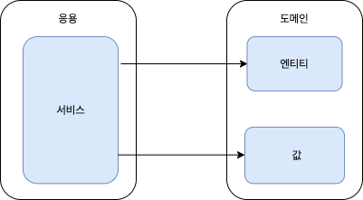
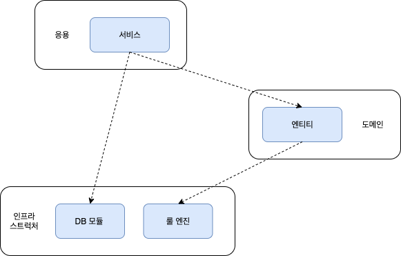
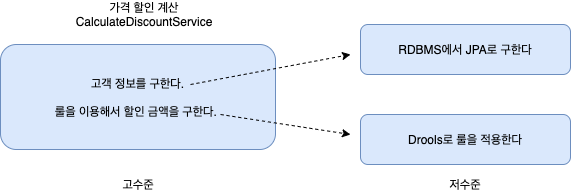
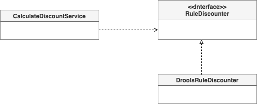
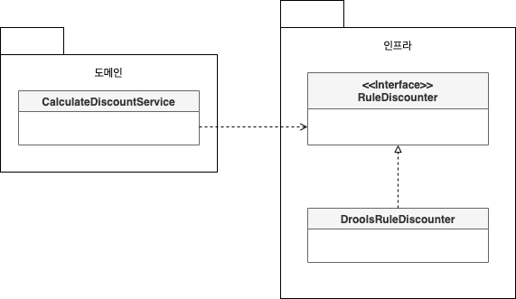
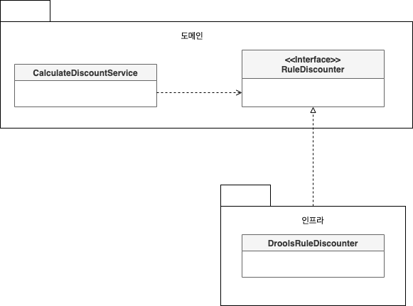
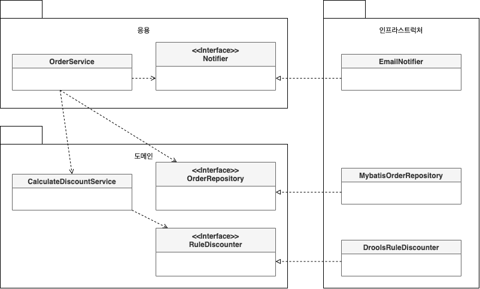
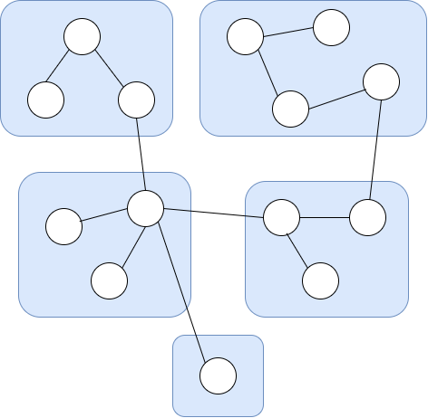
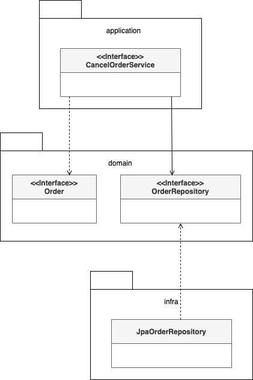
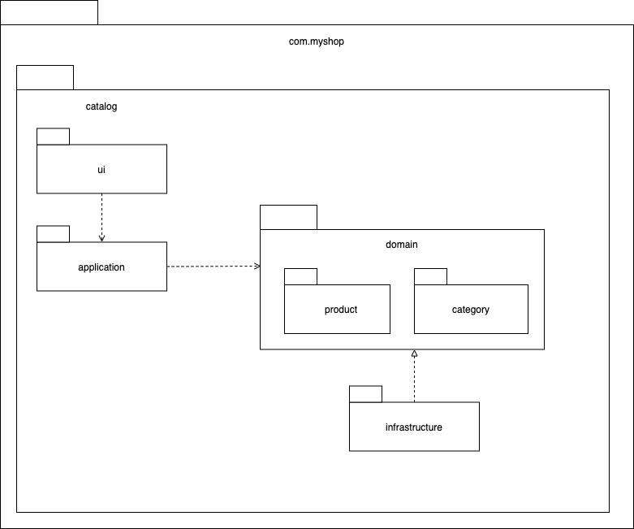

# 2장 아키텍처 개요

## 네 개의 영역

아키텍처를 설계할 때 출현하는 전형적인 영역이 '표현', '응용', '도메인', '인프라스트럭처'의 네 영역이다. 표현 영역을 통해 사용자의 요청을 전달받는 응용 영역은 시스템이 사용자에게 제공해야 할 기능을 구현한다. 응용 영역은 기능을 구현하기 위해 도메인 영역의 도메인 모델을 사용한다.

응용 서비스는 로직을 직접 수행하기보다는 도메인 모델에 로직 수행을 위임한다.



그림 2.2 응용 영역은 도메인 모델을 이용해서 사용자에게 제공할 기능을 구현한다. 실제 도메인 로직 구현은 도메인 모델에 위임한다.

도메인 영역은 도메인 모델을 구현한다. 1장에서 봤던 Order, OrderLine, ShippingInfo와 같은 도메인 모델이 이 영역에 위치한다. 도메인 모델은 도메인의 핵심 로직을 구현한다. 주문 도메인의 경우 '배송지 변경', '결제 완료', '주문 총액 계산'과 같은 핵심 로직을 도메인 모델에서 구현한다.

인프라 스트럭처 영역은 구현 기술에 대한 것을 다룬다. 이 영역은 논리적인 개념을 표현하기보다는 실제 구현을 다룬다.

* RDBMS 연동을 처리
* 메시징 큐에 메시지를 전송하거나 수신하는 기능 구현
* 몽고DB나 HBase를 사용해서 데이터베이스 연동
* SMTP를 이용한 메일 발송 기능 구현
* HTTP 클라이언트를 이용해서 REST API 호출

도메인 영역, 응용 영역, 표현 영역은 구현 기술을 사용한 코드를 직접 만들지 않는다. 대신 인프라스트럭처 영역에서 제공하는 기능을 사용해서 필요한 기능을 개발한다.

## 계층 구조 아키텍처

계층 구조는 그 특성상 상위 계층에서 하위 계층으로서의 의존만 존재하고 하위 계층은 상위 계층에 의존하지 않는다. \(인프라스트럭처 계층이 도메인에 의존하거나 도메인이 응용 계층에 의존하지는 않는다.\)

계층 구조를 엄격하게 적용하면 상위 계층은 바로 아래의 계층에만 의존을 가져야하지만 구현의 편리함을 위해 계층 구조를 유연하게 적용한다. \(응용 계층은 바로 아래 계층인 도메인 계층에 의존하지만 외부 시스템과의 연동을 위해 더 아래 계층인 인프라스트럭처 계층에 의존하기도 한다\)



그림 2.5 전형적인 계층 구조상의 의존 관계

응용 영역과 도메인 영역은 DB나 외부 시스템 연동을 위해 인프라스트럭처의 기능을 사용하므로 이런 계층 구조를 사용하는 것은 직관적으로 이해하기 쉽다. 하지만, 표현/응용 계층이 상세한 구현 기술을 다루는 인프라스트럭처 계층에 종속될수 있는 위험이 있다.

도메인의 가격 계산 규칙을 예로 들어보자. 할인 금액 계산 로직이 복잡하여 외부 Drools라는 룰 엔진을 사용해서 로직을 수행하는 인프라스트럭처 영역에서 구현하였다.

```text
public class DroolsRuleEngine {
	private KieContainer kContainer;

	public void evalute(String sessionName, List<?> facts) {
		...
	}
}
```

응용 영역은 가격 계산을 위해 인프라스트럭처 영역의 DroolsRuleEngine을 사용한다.

```text
public class CalculateDiscountService {
	private DroolsRuleEngine ruleEngine;

	public Money calculateDiscount(OrderLine orderLines, String customerId) {
		Customer customer = findCusotmer(customerId);
		MutableMoney money = new MutableMoney(0);
		facts.addAll(orderLines);
		ruleEngine.evalute("discountCalculation", facts);
		return money.toImmutableMoney();
	}
}
```

이는 두 가지 문제를 안고 있다.

* CalculateDiscountService만 테스트하기 어렵다. 이 클래스를 테스트하려면 RuleEngine이 완벽하게 동작해야 한다. RuleEngine 클래스와 관련 설정 파일을 모두 만등 이후에 비로소 테스트가 가능할 것이다.
* 구현 방식을 변경하기 어렵다. calculateDiscount 메소드 내에서 사용하는 'discountCalculation'문자열은 Drools의 세션 이름을 의미한다. 따라서, Drools의 세션 이름을 변경하면 CalculateDiscountService의 코드도 함께 변경해야 한다.

인프라스트럭처에 의존하면 '테스트 어려움'과 '기능 확장의 어려움'이라는 두 가지 문제가 발생하는 것을 알았다.

## DIP



CalculateDiscountService는 고수준 모듈이다. 고수준 모듈의 기능을 구현하려면 여러 하위 기능이 필요하다. \(고객정보 구하기, 할인 금액 계산하기\) 저수준 모듈은 하위 기능을 실제로 구현한 것이다.

고수준 모듈이 제대로 동작하려면 저수준 모듈을 사용해야 한다. 그런데 고수준 모듈이 저수준 모듈을 사용하면 앞서 계층 구조 아키텍처에서 언급했던 두 가지 문제가 발생한다.

DIP는 이를 해결하기 위해 저수준 모듈이 고수준 모듈에 의존하도록 바꾼다. 원리는 추상화한 인터페이스에 있다.

```text
public interface RuleDiscounter {
	public Money applyRules(Customer customer, List<OrderLine> orderLines);
}
```

CalculateDiscountService가 RuleDiscounter를 이용하도록 변경해보자.

```text
public class CalculateDiscountService {
	private CustomerRepository customerRepository;
	private RuleDiscounter ruleDiscounter;

	public Money calculateDiscount(OrderLine orderLines, String customerId) {
		Customer customer = customerRepository.findCusotmer(customerId);
		return ruleDiscounter.applyRules(customer, orderLines);
	}
}
```

DroolsRuleEngine 클래스를 RuleDiscounter 인터페이스로 구현체로 변경해보자.

```text
public class DroolsRuleDiscounter implements RuleDiscounter{
	private KieContainer kContainer;

	@Override
	public void applyRules(Customer customer, List<OrderLine> orderLines) {
		...
	}
}
```



그림 2.8 DIP를 적용한 구조

CalculateDiscountService는 '룰을 이용한 할인 금액 계산'을 추상화한 RuleDiscounter 인터페이스에 의존할 뿐이다. DroolsRuleDiscounter는 고수준의 하위 기능인 RuleDiscounter를 구현한 것이므로 저수준 모듈에 속한다.

CalculateDiscountService가 제대로 동작하는지 테스트하려면 CustomerRepository와 RuleDiscounter를 구현한 객체가 필요하다. 만약 CalculateDiscountService가 저수준 모듈에 직접 의존했다면 저수준 모듈이 만들어지기 전까지 테스트를 할 수가 없었겠지만 CustomerRepository와 RuleDiscounter는 인터페이스이므로 대용 객체를 사용해서 테스트를 진행할 수 있다. 다음은 이를 활용한 테스트 코드이다.

```text
public class CalculateDiscountServiceTest {
	@Test(expect = NoCustomerException.class);
	public void noCusotmer_thenExceptionShouldBeThrown() {
		// 테스트 목적의 대용 객체
		CustomerRepository stubRepo = mock(CustomerRepository.class);
		when(stubRepo.findById("noCustId")).thenReturn(null);

		RuleDiscounter stubRule = (cust, lines) -> null;

		// 대용 객체를 주입받아 테스트 진행
		CalculateDiscountService calDisSvc = 
				new CalculateDiscountService(stubRepo, stubRule);
		calDisSvc.calculateDiscount(someLines, "noCustId");
	}
}
```

실제 구현 대신 스텁이나 Mock과 같은 테스트 목적의 대용 객체를 사용해서 거의 모든 상황을 테스트할 수 있다.

이렇게 실제 구현 없이 테스트를 할 수 있는 이유는 DIP를 적용해서 고수준 모듈이 저수준 모듈에 의존하지 않도록 했기 때문이다.

## DIP 주의사항

DIP를 잘못 생각하면 단순히 인터페이스와 구현 클래스를 분리하는 정도로 받아들일 수 있다. DIP의 핵심은 고수준 모듈이 저수준 모듈에 의존하지 않도록 하기 위함인데 DIP를 적용한 결과 구조만 보고 아래 그림과 같이 저수준 모듈에서 인터페이스를 추출하는 경우가 있다.



그림 2.10 잘못된 DIP 적용 예

이 구조는 잘못된 구조다. 이 구조에서 도메인 영역은 구현 기술을 다루는 인프라스트럭처 영역에 의존하고 있다. 즉, 여전히 고수준 모듈이 저수준 모듈에 의존하고 있는 것이다. DIP를 적용할 때 하위 기능을 추상화한 인터페이스는 고수준 모듈 관점에서 도출한다. 즉, '할인 금액 계산'을 추상화한 인터페이스는 저수준 모듈이 아닌 고수준 모듈에 위치한다.



그림 2.11 하위 기능을 추상화한 인터페이스는 고수준 모듈에 위치한다.

## DIP와 아키텍처

인프라스트럭처 영역은 구현 기술을 다루는 저수준 모듈이고 응용 역영과 도메인 영역은 고수준 모듈이다. 인프라스트럭처 계층의 가장 하단에 위치하는 계층형 구조와 달리 아키텍처에 DIP를 적용하면 아래 그림과 같이 인프라스트럭처 영역이 응용 영역과 도메인 영역에 의존\(상속\)하는 구조가 된다.



그림 2.14 DIP를 적용하면 응용 영역과 도메인 영역에 영향을 최소화하면서 구현체를 변경하거나 추가할 수 있다.

## 도메인 영역의 주요 구성요소

### 엔티티

고유의 식별자를 갖는 객체로 자신의 라이프사이클을 갖는다. 도메인의 고유한 개념을 표현하며 해당 데이터와 관련된 기능을 함께 제공한다.

### 밸류

고유의 식별자를 갖지 않는 객체로 주로 개념적으로 하나인 도메인 객체의 속성을 표현할 때 사용된다.

### 애그리거트

애그리거트는 관련된 엔티티와 밸류 객체를 개념적으로 하나로 묶은 것이다. 예를 들어 주문과 관련된 Order 엔티티, OrderLine 밸류, Orderer 밸류 객체를 '주문' 애그리거트로 묶을 수 있다.

### 리포지터리

도메인 모델의 영속성을 처리한다.

### 도메인 서비스

특정 엔티티에 속하지 않은 도메인 로직을 제공한다. '할인 금액 계산'은 상품, 쿠폰, 회원 등급, 구매 금액 등 다양한 조건을 이용해서 구현하게 되는데, 이렇게 도메인 로직이 여러 엔티티와 밸류를 필요로 할 경우 도메인 서비스에서 로직을 구혀한다.

### 엔티티와 밸류

도메인 모델의 엔티티는 단순히 데이터를 담고 있는 데이터 구조라기보다는 데이터와 함께 기능을 제공하는 객체이다. 도메인 관점에서 기능을 구현하고 기능 구현을 캡슐화해서 데이터가 임의로 변경되는 것을 막는다. 또 다른 차이점은 도메인 모델의 엔티티는 두 개 이상의 데이터가 개념적으로 하나인 경우 밸류 타입을 이용해서 표현할 수 있다.

밸류는 불변으로 구현하는 것을 권장하는데, 이는 엔티티의 밸루 타입 데이터를 변경할 때 객체 자체를 완전히 교체한다는 것을 의미한다.

### 애그리거트

도메인이 커질수록 개발할 도메인 모델도 커지면서 많은 엔티티와 밸류가 출현한다. 엔티티와 밸류 개수가 많아지면 많아질수록 모델은 점점 더 복잡해진다. 도메인 모델이 복잡해지면 개발자가 전체 구조가 아닌 한 개 엔티티와 밸류에만 집중하게 되는 경우가 발생한다. 그러게 되면 큰 수준에서 모델을 이해하지 못해 전체적으로 모델을 관리할 수 없는 상황에 빠질 수 있다. 그래서 이를 해결하기 위해 도움이되는 것이 바로 애그리거트이다.

애그리거트는 관련 객체를 하나로 묶은 군집이다.



그림 2.17 관련된 객체를 애그리거트로 묶으면 복잡한 도메인 모델을 관리하는 데 도움이 된다.

애그리거트를 사용하면 개별 객체가 아닌 관련 객체를 묶어서 객체 군집 단위로 모델을 바라볼 수 있게 된다. 개별 객체 간의 관계가 아닌 애그리거트 간의 관계로 도메인 모델을 이해하고 구현할 수 있게 되며, 이를 통해 큰 틀에서 도메인 모델을 관리할 수 있게 된다.

애그리거트는 군집에 속한 객체들을 관리하는 루트 엔티티를 갖는다. 루트 엔티티는 애그러거트에 속해 있는 엔티티와 밸류 객체를 이용해서 애그리거트가 구현해야 할 기능을 제공한다. 애그리거트를 사용하는 코드는 애그리거트 루트가 제공하는 기능을 실행하고 애그리거트 루트를 통해서 간접적으로 애그리거트 내의 다른 엔티티나 밸루 객체에 접근하게 된다. 이는 애그리거트의 내부 구현을 숨겨서 애그리거트 단위로 구현을 캡슐화할 수 있도록 돕는다.

```text
public class Order {
	...
	public void changeShippingInfo(ShippingInfo shippinginfo) {
		checkShippingInfoChangeable(); // 배송지 변경 가능 여부 확인
	}

	private Boolean checkShippingInfoChangeable() {
		...
	}
}
```

주문 애그리거트는 Order를 통하지 않고 ShippingInfo를 변경할 수 있는 방법을 제공하지 않는다.

애그리거트를 구현할 때는 고려할 것이 많다. 애그리거트를 어떻게 구성했느냐에 따라 구현이 복잡해지기도 하고 트랜잭션 범위가 달라지기도 한다. 또한 선택한 구현 기술에 따라 애그리거트 구현에 제약이 생기기도 한다.

### 리포지터리

엔티티나 밸류가 요구사항에서 도출되는 도메인 모듈이라면 리포지터리는 구현을 위한 도메인 모델이다. 리포지터리는 애그리거트 단위로 도메인 객체를 저장하고 조회하는 기능을 정의한다.

도메인 모델 관점에서 리포지터리는 도메인 객체를 영속화하는 데 필요한 기능을 추상화한 것으로 고수준 모듈로 인프라스트럭처 영역에 속한다.



그림 2.19 리포지터리 인터페이스는 도메인 모델 영역에 속하며, 실제 구현 클래스는 인프라스트럭처 영역에 속한다.

응용 서비스와 리포지터리는 밀접한 연관이 있다.

* 응용 서비스는 필요한 도메인 객체를 구하거나 저장할 때 리포지터리를 사용한다.
* 응용 서비스는 트랜잭션을 관리하는데, 트랜잭션 처리는 리포지터리 구현 기술에 영향을 받는다.

## 인프라스트럭처 개요

인프라스트럭처는 표현 영역, 응용 영역, 도메인 영역을 지원한다. DIP에서 언급한 것처럼 도메인 영역과 응용 영역에서 인프라스트럭처의 기능을 직접 사용하는 것보다 이 두영역에 정의한 인터페이스를 인프라스트럭처 영역에서 구현하는 것이 시스템을 더 유연하고 테스트하기 쉽게 만들어준다.

그러나 응용 영역과 도메인 영역이 이프라스트럭처에 대한 의존을 완전히 갖지 않도록 시도하는 것은 자칫 구현을 복잡하고 어렵게 만들 수 있다. 좋은 예가 스프링의 @Transactional 애노테이션이다. @Transactional을 사용하면 한줄로 트래잭션을 처리할 수 있는데 코드에서 스프링에 대한 의존을 없애려면 복잡한 스프링 설정을 사용해야 한다. 이처럼 의존은 없앴지만 특별히 테스트를 더 쉽게 할 수 있다거나 유연함을 증가시켜주지 못한다.

## 모듈 구성

패키지 구성 규칙에 한 개의 정답만 존재하는 것은 아니지만 영역별로 모듈이 위치할 패키지를 구성할 수 있을 것이다. 여기서 com.myshop은 예시로 든 패키지이다. domain 모듈은 도메인에 속한 애그리거트를 기준으로 다시 패키지를 구성한다. 예를 들어, 카탈로그 하위 도메인을 위한 도메인은 상품 애그리거트와 카테고리 애그리거트로 구성된다고 할 경우 아래와 같이 domain을 두 개의 하위 패키지로 구성할 수 있다.


그림 2.22 도메인 크면 하위 도메인별로 모듈을 나눈다.

도메인이 복잡하면 도메인 모델과 도메인 서비스를 다음과 같이 별도 패키지에 위치시킬 수도 있다.

* com.myshop.order.domain.order : 애그리거트 위치
* com.myshop.order.doamin.service : 도메인 서비스 위치



그림 2.23 하위 도메인을 하위 패키지로 구성한 모듈 구조

응용 서비스도 다음과 같이 도메인 별로 패키지를 구분할 수 있다.

* com.myshop.catalog.application.product
* com.myshop.catalog.application.category

모듈 구조를 얼마나 세분화해야 하는지에 대해 정해진 규칙은 없다. 단지, 한 패키지에 너무 많은 타입이 몰려서 코드를 찾을 때 불편한 정도만 아니면 된다. \(필자는 개인적으로 한 패키지에 가능하면 10개 미만으로 타입 개수를 유지하려고 노력한다. 이를 넘어가면 모듈을 분리하는 시도를 해본다\)

