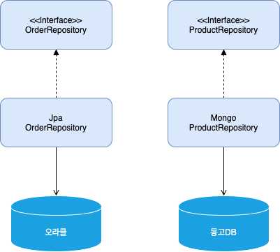

# 3장 애그리거트

도메인 개념 간의 관계를 파악하기 어렵다는 것은 곧 코드를 변경하고 확장하는 것이 어려워진다는 것을 의미한다. 상위 수준에서 모델이 어떻게 엮여 있는지 알아야 전체 모델을 망가뜨리지 않으면서 추가 요구사항을 모델에 반영할 수 있는데 세부적인 모델만 이해한 상태로는 코드를 수정하기가 두렵기 때문에 코드 변경을 최대한 회피하는 쪽으로 요구사항을 협의하게 된다.


그림 3.2 개별 객체 수준에서 모델을 바라보면 상위 수준에서 관계를 파악하기 어렵다

복잡한 도메인을 이해하고 관리하기 쉬운 단위로 만들려면 상위 수준에서 모델을 조율할 수 있는 방법이 필요한데, 그 방법이 바로 애그리거트이다. 수많은 객체를 애그리거트로 묶어서 바라보면 좀 더 상위 수준에서 도메인 모델 간의 관계를 파악할 수 있다.


그림 3.3 애그리거트는 복잡한 모델을 관리하는 기준을 제공한다.

애그리거트는 복잡한 도메인을 단순한 구조로 만들어준다. 복잡도가 낮아지는 만큼 도메인 기능을 확장하고 변경하는 데 필요한 노력\(개발 시간\)도 줄어든다. 애그리거트는 관련된 모델을 하나로 모은 것이기 때문에 한 애그리거트에 속한 객체는 유사하거나 동일한 라이프사이클을 갖는다.

한 애그리거트에 속한 객체는 다른 애그리거트에 속하지 않는다. 애그리거트는 독립된 객체 군이며, 각 애그리거트는 자기 자신을 관리할 뿐 다른 애그리거트를 관리하지 않는다.

경계를 설정할 때 기본이 되는 것은 도메인 규칙과 요구사항이다. 도메인 규칙에 따라 함께 생성되는 구성요소는 한 애그리거트에 속할 가능성이 높다. 또는 사용자 요구사항에 따라 주문 상품 개수와 배송지를 함께 변경하기도 한다. 이렇게 함께 변경되는 빈도가 높은 객체는 한 애그리거트에 속할 가능성이 높다.

조심해야할 것은 'A가 B를 갖는다'로 해석할 수 있는 요구사항이 있다고 하더라도 이것은 반드시 A와 B가 한 애그리거트에 속한다는 것을 의미하는 것은 아니다. 좋은 예가 상품과 리뷰다. 상품 상세 페이지에 들어가면 상품 상세 정보와 함께 리뷰 내용을 보여줘야 한다는 요구사항이 있다면 Product 엔티티와 Review 엔티티가 한 애그리거트에 속한다고 생각할 수 있다. 하지만 Product와 Review는 함께 생성되지 않고 함께 변경되지도 않는다. 게다가 Product를 변경하는 주체가 상품 담당자라면 Review를 생성하고 변경하는 주체는 고객이다.


그림 3.4 Product가 Review를 갖는 것으로 생각할 수 있다. 하지만, 상품과 리뷰는 함께 생성되거나 변경되지 않고 변경 주체도 다르기 때문에 서로 다른 애그리거트에 속한다.

처음 도메인 모델을 만들기 시작하면 큰 애그리거트로 보이는 것들이 많지만 도메인에 대한 경험이 생기고 도메인 규칙을 제대로 이해할수록 실제 애그리거트의 크기는 줄어들게 된다. \(필자는 다수의 경험을 빗대어 보아 대부분의 애그리거트가 한 개의 엔티티 객체만 갖는 경우가 많으며 두 개 이상의 엔티티로 구성되는건 드물었다고 한다\)

### 애그리거트 루트

애그리거트는 여러 객체로 구성되기 때문에 한 객체만 상태가 정상이어서는 안된다. 도메인 규칙을 지키려면 애그리거트에 속한 모든 객체가 정상 상태를 가져야 한다.

애그리거트에 속한 모든 객체가 일관된 상태를 유지하려면 애그리거트 전체를 관리할 주체가 필요한데 이 책임을 지는 것이 바로 애그리거트의 루트 엔티티이다.


그림 3.5 주문 애그리거트의 루트는 Order이다

### 도메인 규칙과 일관성

애그리거트 루트의 핵심 역할은 애그리거트의 일관성이 깨지지 않도록 하는 것이다. 이를 위해 애그리거트 루트는 애그리거트가 제공해야 할 도메인 기능을 구현한다. 애그리거트 루트가 제공하는 메서드는 도메인 규칙에 따라 애그리거트에 속한 객체의 일관성이 깨지지 않도록 구현해야 한다.

애그리거트 루트가 아닌 다른 객체가 애그리거트에 속한 객체를 직접 변경하면 안된다. 이는 애그리거트 루트가 강제하는 규칙을 적용할 수 없어 모델의 일관성을 깨는 원인이 된다.

```text
ShippingInfo si = order.getShippingInfo();
si.setAddress(newAddress);
```

이는 주문 상태에 상관없이 배송지 주소를 변경할 수 있는데 이는 업무 규칙을 무시하고 DB 테이블에서 직접 데이터를 수정하는 것과 같은 결과를 만든다. 즉, 논리적인 데이터 일관성이 깨지게 되는 것이다.

불필요한 중복을 피하고 애그리거트 루트를 통해서만 도메인 로직을 구현하게 만들려면 도메인 모델에 대해 다음의 두 가지를 습관적으로 적용해야 한다.

* 단순히 필드를 변경하는 set 메서드를 공개\(public\) 범위로 만들지 않는다.
* 밸류 타입은 불변으로 구현한다.

공개 set 메서드는 중요 도메인의 의미나 의도를 표현하지 못하고 도메인 로직이 도메인 객체가 아닌 응용 영역이나 표현 영역으로 분산되게 만드는 원인이 된다.

밸류 객체의 값을 변경할 수 없으면 애그리거트 루트에서 밸류 객체를 구해도 값을 변경할 수 없기 때문에 애그리거트 외부에서 밸류 객체의 상태를 변경할 수 없게 된다.

```text
ShippingInfo si = order.getShippingInfo();
si.setAddress(newAddress); // ShippingInfo 밸류 객체가 불변이면, 이 코드는 컴파일 에러가 날것이다.
```

밸류 객체가 불변이면 밸류 객체의 값을 변경하는 방법은 새로운 밸류 객체를 할당하는 것뿐이다. 즉, 다음과 같이 애그리거트 루트가 제공하는 메서드에 새로운 밸류 객체를 전달해서 값을 변경하는 방법밖에 없다.

### 트랜잭션 범위

트랜잭션 범위는 작을수록 좋다. 세 개의 테이블을 수정하면 잠금 대상이 더 많아진다는 의미다. 잠금 대상이 많아진다는 것은 그만큼 동시에 처리할 수 있는 트랜잭션 개수가 줄어든다는 것을 뜻하고 이는 전체적인 성능을 떨어뜨린다.

동일하게 한 트랜잭션에서는 한 개의 애그리거트만 수정해야 한다. 한 트랜잭션에서 두 개 이상의 애그리거트를 수정하면 트랜잭션 충돌이 발생할 가능성이 더 높아지기 때문에 한번에 수정하는 애그리거트 개수가 많아질수록 전체 처리량이 떨어지게 된다.

만약 부득이하게 한 트랜잭션으로 두 개 이상의 애그리거트를 수정해야 한다면 응용 서비스에서 두 애그리거트를 수정하도록 구현해야 한다.

```text
public class ChangeOrderService {
	@Transactional
	public void changeShippingInfo(OrderId id, 
		ShippingInfo newShippingInfo, 
		boolean useNewShippingAddrAsMemberAddr) {
		
		Order order = orderRepository.findbyId(id);
		if (order == null) throw new OrderNotFoundException();
		order.shipTo(newShippingInfo);
		if (useNewshippingAddrAsMemberAddr) {
			order.getOrderer()
				.getCustomer().changeAddress(newShippingInfo.getAddress());
		}
	}
	...
}
```

도메인 이벤트를 사용하면 한 트랜잭션에서 한 개의 애그리거트를 수정하면서도 동기나 비동기로 다른 애그리거트의 상태를 변경할 수 있는데 이는 10장에서 살펴보겠다.

한 트랜잭션에서 한 개의 애그리거트를 변경하는 것을 권장하지만 다음의 경우에는 두 개 이상의 애그리거트를 변경하는 것을 고려할 수 있다.

* 팀 표준 : 조직의 표준에 따라 사용자 유스케이스와 관련된 응용 서비스의 기능을 한 트랜잭션으로 실행해야 하는 경우
* 기술 제약 : 한 트랜잭션에서 두 개 이상의 애그리거트를 수정하는 대신 도메인 이벤트와 비동기를 사용하는 방식을 사용하는데, 기술적으로 이벤트 방식을 도입할 수 없는 경우 한 트랜잭션에서 다수의 애그리거트를 수정해서 일관성을 처리해야 한다.
* UI 구현의 편리 : 운영자의 편리함을 위해 주문 목록 화면에서 여러 주문의 상태를 한 번에 변경하고 싶을 경우

### 리포지터리와 애그리거트

애그리거트는 개념적으로 하나이므로 리포지터리는 애그리거트 전체를 저장소에 영속화해야 한다. 예를 들어, Order 애그리거트를 저장할 때 애그리거트 루트와 매핑되는 테이블뿐만 아니라 애그리거트에 속한 모든 구성요소를 위한 테이블에 데이터를 저장해야 한다.

### ID를 이용한 애그리거트 참조

애그리거트 간의 참조는 필드를 통해 쉽게 구현할 수 있다. JPA를 사용하면 @ManyToOne, @OneToOne과 같은 애노테이션을 이용해서 연관된 객체를 로딩하는 기능을 제공하고 있으므로 필드를 이용해서 다른 애그리거트를 쉽게 참조할 수 있다. 하지만 필드를 이용한 애그리거트 참조는 다음의 문제를 야기할 수 있다.

* 편한 탐색 오용
* 성능에 대한 고민
* 확장 어려움

한 애그리거트 내부에서 다른 애그리거트 객체에 접근할 수 있으면 다른 애그리거트의 상태를 쉽게 변경할 수 있게 된다. 다음 코드처럼 구현의 편리함 때문에 다른 애그리거트를 수정하고자 하는 유혹에 빠지기 쉽다.

```text
public class Order {
	private Orderer orderer;

	public void changeShippingInfo( ... ) {
		...
		// Member의 Address를 변경한다. 
		orderer.getCusotmer().changeAddress(newShippingInfo.getAddress());
	}
}
```

위와 같이 한 애그리거트에서 다른 애그리거트의 상태를 변경하는 것은 애그리거트 간의 의존 결합도를 높여서 결과적으로 애그리거트의 변경을 어렵게 만든다.

두 번째 문제는 애그리거트를 직접 참조하면 성능과 관련된 여러 가지 고민을 해야 한다. JPA를 사용할 경우 참조한 객체를 지연로딩과 즉시로딩의 두 가지 방식으로 로딩할 수 있다.

세 번째 문제는 확장이다. 초기에는 단일 서버에 단일 DBMS로 서비스를 제공하는것이 가능하다. 문제는 사용자가 몰리기 시작하면서 도메인별로 시스템을 분리하기 시작한다. 이 과정에서 하위 도메인마다 서로 다른 DBMS를 사용할 가능성이 높아진다. 이는 더 이상 다른 애그리거츠 루트를 참조하기 위해 JPA와 같은 단일 기술을 사용할 수 없음을 의미한다.

이를 해결할 수 있는 방법이 ID를 이용해서 다른 애그리거트를 참조하는 것이다. 이는 애그리거트의 경계를 명확히 하고 애그리거트 간 물리적인 연결을 제거하기 때문에 모델의 복작도를 낮춰준다. 또한, 애그리거트 간의 의존을 제거하므로 응집도를 높여주는 효과도 있다. 이는 한 애그리거트에서 다른 애그리거트를 수정하는 문제를 원척적으로 방지할 수 있다.

```text
public class Order {
	private Orderer orderer;

	public void changeShippingInfo( ... ) {
		...
		// Member의 Address를 변경한다. 
		Customer customer = customerRepository.findById(order.getOrderer().getCustomerid());
		customer.changeAddress(newShippingInfo.getAddress());
	}
}
```

또한 애그리거트별로 다른 구현 기술을 사용하는 것도 가능해진다. 또한, 각 도메인을 별도 프로세스로 서비스하도록 구현할 수도 있다.



그림 3.8 아이디로 애그리거트를 참조하면 리포지터리마다 다른 저장소를 사용하도록 구현할 때 확장이 용이하다.

### ID를 이용한 참조와 조회 성능

다른 애그리거트를 ID로 참조하면 참조하는 여러 애그리거트를 읽어야 할 때 조회속도가 문제될 수 있다. 애그리거트마다 서로 다른 저장소를 사용하는 경우에는 한 번의 쿼리로 관련 애그리거트를 조회할 수 없다. 이런 경우 조회 성능을 높이기 위해 캐시를 적용하거나 조회 전용 저장소를 따로 구성한다. 이 방법은 코드가 복잡해지는 단점이 있지만 시스템의 처리량을 높일 수 있다는 장점이 있다.

### 애그리거트 간 집합 연관

애그리거트 간 1:N과 M:N 연관에 대해 살펴보자 개념적으로 존재하는 애그리거트 간의 1:N 연관을 실제 구현에 반영하는것이 요구사항을 충족하는 것과 상관없는 경우가 종종 있다. 특정 카테고리에 있는 상품 목록을 보여주는 요구사항을 생각해보자.

```text
public class Category {
	private Set<Product> products;

	public List<Product> getProducts(int page, int size) {
		List<Product> sortedProducts = sortById(Products);
		return sortedProducts.subList((page - 1) * size, page * size);
	}
}
```

이 코드를 실제 DBMS와 연동해서 구현하면 Category에 속한 모든 Product를 조회하게 된다. Product 개수가 수백에서 수만 개 정도로 많다면 이 코드를 실행할 때마다 실행 속도가 급격히 느려져 성능에 심각한 문제를 일으킬 것이다. 이는 1:N 연관이더라도 N:1로 연관지어 구하면 해결할 수 있다.

```text
public class ProductListService {
	public Page<Product> getProductOfCategory(Long categoryId, int page, int size) {
		Category category = categoryRepository.findById(categoryId);
		checkCategory(category);
		List<Product> products = productRepository.findByCategoryId(category.getId(), page, size);
		int totalCount = productRepository.countsByCategoryId(category.getId());
		return new Page(page, size, totalCount, products);
	}
}
```

M:N 연관은 개념적으로 양쪽 애그리거트에 컬렉션으로 연관을 만든다. RDBMS를 이용해서 M:N 연관을 구현하려면 조인 테이블을 사용한다.


그림 3.9 조인 테이블을 이용한 M:N 연관 매핑

```text
@Entity
@Table(name = "product")
public class Product {
	@EmbeddedId
	private ProductId id;

	@ElementCollection
	@CollectionTable(name = "product_category",
							joinColumns = @JoinColumn(name = "product_id"))
	private Set<CategoryId> categoryIds;
```

이 매핑은 카테고리 ID 목록을 보관하기 위해 밸류 타입에 대한 컬렉션 매핑을 이용했다.

### 애그리거트를 팩토리로 사용하기

온라인 쇼핑몰에서 고객이 여러 차례 신고를 해서 특정 상점이 더 이상 물건을 등록하지 못하도록 차단한 상태라고 해보자.

```text
public class RegisterProductService {
	public ProductId registerNewProduct(NewProductRequest req) {
		Store account = accountRepository.findStoreById(req.getStoreId());
		checkNull(account);
		if (!account.isBlocked()) {
			throw new StoreBlockedException();
		}
		ProductId id = productRepository.nextId();
		Product product = new Product(id, account.getId(), ...);
		productRepository.save(product);
		return id;
	}
}
```

코드가 나빠 보이지는 않지만 중요한 도메인 로직 처리가 응용 서비스에 노출되었다. Store가 Product를 생성할 수 있는지 여부를 판단하고 Product를 생성하는 것은 논리적으로 하나의 도메인 기능인데 이 도메인 기능을 응용 서비스에서 구현하고 있는 것이다. 이는 Product를 생성하는 기능을 Store 애그리거트에 옮겨보자.

```text
public class Store extends Member {
	public Product createProduct(ProductId id, ... ) {
		if (!account.isBlocked()) {
			throw new StoreBlockedException();
		}
		return new Product(id, account.getId(), ...);
	}
}
```

Store 애그리거트의 createProduct\(\)는 Product 애그리거트를 생성하는 팩토리 역할을 한다.

```text
public class RegisterProductService {
	public ProductId registerNewProduct(NewProductRequest req) {
		Store account = accountRepository.findStoreById(req.getStoreId());
		checkNull(account);
		ProductId id = productRepository.nextId();
		Product product = account.createProduct(id, account.getId(), ...); // Store에서 직접 생성
		productRepository.save(product);
		return id;
	}
}
```

이제 Product 생성 가능 여부를 확인하는 도메인 로직을 변경해도 도메인 영역의 Store만 변경하면 되고 응용 서비스는 영향을 받지 않는다. 도메인의 응집도도 높아졌다. 이게 바로 애그리거트를 팩토리로 사용할 때 얻을 수 있는 장점이다.

애그리거트가 갖고 있는 데이터를 이용해서 다른 애그리거트를 생성해야 한다면 애그리거트에 팩토리 메서드를 구현하는 것을 고려해보자.

